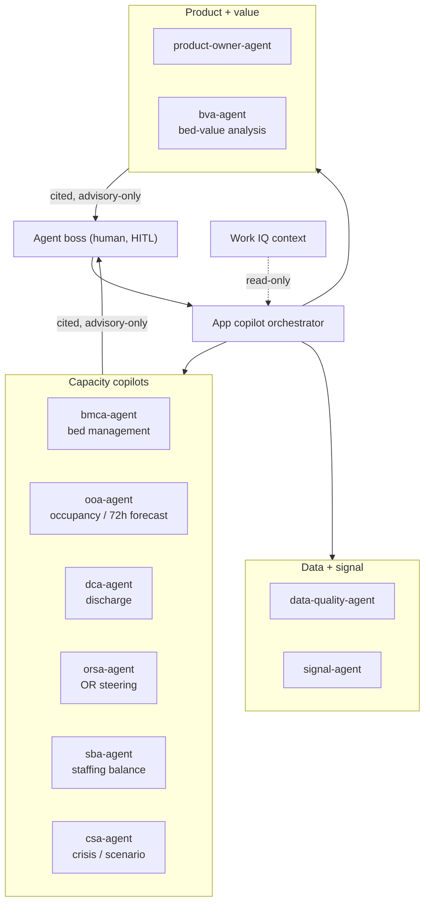

# Curavias — Agent Registry

| Field | Value |
| ------- | ------- |
| **Version** | 2.15.0 |
| **Date** | 2026-08-08 |
| **Author** | Urs Rueegg |
| **Status** | Draft |
| **Previous Version** | 2.14.0 (added the `bva-agent` registry row for the Sprint 33 Business Value Assessment Agent, issues #489, #501); this bump rebrands the doc to the Curavias customer-ready template - anchored title, product anchor, executive summary, and embedded canonical agent-topology diagram (Sprint 34 WS-4); adds the awesome-copilot-sourced agents/skills/extension intake table + updates the skill-discovery order |

> **Curavias** is the Swiss AI-powered patient-flow and hospital-capacity
> platform — a Microsoft Frontier-Firm reference implementation grounded on
> Fabric IQ, Foundry IQ, and Work IQ.
>
> **Purpose**: Top-level registry of every agent realised in this repository.
> The **GitHub Copilot coding agent** reads this file on every run to learn
> which agents exist, which MCP servers they may call, and how they refuse
> destructive actions.
>
> **Tenant migration authoritative (Sprint 00 completed 2026-07-02):** the platform now runs in Entra tenant `1337187a-4c41-4da9-8fca-731bba7a4329` (`MngEnvMCAP164444.onmicrosoft.com`) with solution short name `ihzhhpf` and subscription `66a9953a-df37-4c51-856c-9971b9bf3e03`. **Demo/proof-of-technology scope only:** deployed in `westus2` per [ADR-0013](docs/adr/0013-temporary-us-region-demo-scope.md), synthetic sample data only, no PHI — sunset back to `switzerlandnorth` when target services reach Swiss GA. Old tenant `MngEnvMCAP228255` is frozen; teardown deferred. See [ADR-0012](docs/adr/0012-tenant-migration-to-mcap164444.md).
>
> **Execution default (migration status)**: Superpowers-first execution is now
> the default operating model for new work. The per-agent registry below is
> retained as a compatibility layer during migration and remains authoritative
> for side-effect ceilings, refusal rules, and approval gates.
>
> **Runtime**: Per [ADR-0002](docs/adr/0002-runtime-is-github-copilot-coding-agent.md),
> **all agent prompt files, runtime manifests, and golden tasks live under
> `agents/<name>/` as the single source of truth.** The GitHub Copilot coding
> agent reads them for platform-control-plane work (spec parsing, landing
> zones, drift analysis, ...) and the Sprint 13 Container Apps agent-host loads
> the Sprint 11 packs (`bmca-agent`, `ooa-agent`, `dca-agent`, `orsa-agent`,
> `sba-agent`, `csa-agent`, `data-quality-agent`, `onboarding-agent`) at
> runtime. The `runtime:` field in each `manifest.yaml` disambiguates.
> Configured via [.github/copilot/mcp.json](.github/copilot/mcp.json) — no
> Python service, no Foundry-hosted agent, no platform-runtime Azure
> infrastructure. The `agents-archive/` folder was retired in the 2.0.0
> restructure; historical bodies for `bm-copilot` and the Sprint 09 `csa-agent`
> live in `git log`.

## Executive summary

This document is the authoritative registry of every AI agent in Curavias: what
each agent does, which Microsoft Cloud (MCP) tools it may call, its side-effect
ceiling, and how it refuses unsafe or destructive actions. It is written so a
reviewer can see the full agent roster and the guardrails that keep every agent
advisory-first and human-approved.

## Canonical diagram

The agent topology below is maintained in
[docs/architecture/diagram-library.md](docs/architecture/diagram-library.md) and
copied here; update both places together when it changes.



## Superpowers Skill Enforcement

This repository enforces mandatory skill execution semantics for Superpowers.

Before any task:

1. Determine if a Superpowers skill applies.
2. If a skill applies, read its `SKILL.md` before proceeding.

If a skill applies:

1. Use of that skill is mandatory.
2. Required steps in that skill must not be skipped.
3. If multiple skills apply, run them in a documented, justified sequence.

Core skills that must always be considered for applicable work:

1. `test-driven-development`
2. `systematic-debugging`
3. `writing-plans`
4. `verification-before-completion`

Compliance requirement:

1. Work that skips applicable mandatory skills is non-compliant and must be corrected before PR completion.

## Workspace-scoped skills (v1.13.0, 2026-07-08)

Seven domain skills installed under [`.github/skills/`](.github/skills/) to speed up M1..M4 execution per the [Sprint 10 completion strategy](docs/superpowers/specs/2026-07-08-sprint-10-completion-strategy.md). All are workspace-scoped (travel with the repo, git-tracked).

| Skill | Source | Trigger examples | When to use |
| ----- | ------ | ---------------- | ----------- |
| [`eventstream-authoring`](.github/skills/eventstream-authoring/SKILL.md) | [microsoft/skills-for-fabric](https://github.com/microsoft/skills-for-fabric) fabric-authoring | "create eventstream", "add source to eventstream", "eventstream destination", "wire eventstream" | Any Eventstream topology work — sources, operators, destinations, `updateDefinition` REST |
| [`spark-authoring`](.github/skills/spark-authoring/SKILL.md) | microsoft/skills-for-fabric fabric-authoring | "run notebook", "spark session", "notebook job", "lakehouse Delta table" | Fabric notebook orchestration + Spark patterns — M1-B (bronze/silver/gold runs) |
| [`fabric-semantic-model-authoring`](.github/skills/fabric-semantic-model-authoring/SKILL.md) | microsoft/skills-for-fabric fabric-authoring | "semantic model", "measure", "relationship", "TMDL", "Direct Lake" | Semantic model authoring via Fabric REST — M1-C measures + relationship contract |
| [`powerbi-report-authoring`](.github/skills/powerbi-report-authoring/SKILL.md) | microsoft/skills-for-fabric powerbi-authoring | "PBIP", "visual container", "page layout", "KPI card", "Power BI report" | Report / visual authoring — M1-D KPI tiles + M2 remaining visuals |
| [`powerbi-optimization`](.github/skills/powerbi-optimization/SKILL.md) + [specialists/](.github/skills/powerbi-optimization/specialists/) | [PBI-Guy/Power-BI-Optimization-Skill](https://github.com/PBI-Guy/Power-BI-Optimization-Skill) | "optimize DAX", "slow measure", "RLS performance", "storage mode", "BPA" | DAX + model + RLS optimization — M2-M3 measure tuning + M3 RLS re-authoring |
| [`e2e-medallion-architecture`](.github/skills/e2e-medallion-architecture/SKILL.md) *(v1.13.0)* | microsoft/skills-for-fabric fabric-authoring | "medallion architecture", "bronze silver gold", "multi-layer lakehouse", "PHI gate", "data quality enforcement" | Bronze/silver/gold design + PHI/FK/schema gate patterns — M1.5 silver-hardening + M2 gold refinement |
| [`spark-operations`](.github/skills/spark-operations/SKILL.md) *(v1.13.0)* | microsoft/skills-for-fabric fabric-operations | "Spark session", "notebook logs", "Spark statement failure", "Spark diagnostics", `System_Cancelled_Session_Statements_Failed` | Diagnose Fabric Spark session errors + notebook runtime failures — M1.5 silver debugging + future notebook failure triage |
| [`document-authoring`](.github/skills/document-authoring/SKILL.md) *(v1.0.0)* | workspace-authored (issue #242) | "create a doc", "update the PRD", "bump the doc version", "fix markdownlint", "fix mojibake", "is the status accurate" | Judgment layer for every Markdown create/update — version-bump level, FR/NFR traceability, status accuracy; mechanical encoding/lint gates are automated by `scripts/lint/*mojibake*.py` + `.githooks/pre-commit` + CI `mojibake-scan` |

The `powerbi-optimization` skill ships with 5 specialists (`dax-mastery`, `model-design`, `report-performance`, `powerquery-m`, `security-rls`) plus BPA and MCP integration guides under `.github/skills/powerbi-optimization/`. The MCP integration is optional and requires a separate Power BI Modeling MCP server install; skip it unless we need automated DAX benchmarking.

Additional skills evaluated and **NOT installed** (available in the source repos if needed later):

- `microsoft/skills-for-fabric` `fabric-consumption` — read-only query workflows (we already have those covered)
- `microsoft/skills-for-fabric` `fabric-operations/mlv-operations-cli` — Materialized Lake View ops; candidate for M2 if gold uses MLVs
- `microsoft/skills-for-fabric` `fabric-operations/sqldw-operations-cli` — not our path (we use lakehouse per ADR-0015)
- `microsoft/skills-for-fabric` `fabric-authoring/{activator,dataflows,eventhouse,fabriciq-ontology,sqldw}-authoring-cli` — not part of the M1..M4 critical path
- `microsoft/skills-for-fabric` `powerbi-authoring/{powerbi-report-design,powerbi-report-management,powerbi-report-planning,check-updates}` — mostly workflow orchestration, not needed for direct M1..M4 deliverables

Skill refresh procedure — run once per sprint or on-demand:

```powershell
$tmp = "$env:TEMP\skills-install-refresh"
Remove-Item $tmp -Recurse -Force -ErrorAction SilentlyContinue
git clone --depth 1 https://github.com/microsoft/skills-for-fabric.git $tmp\skills-for-fabric
git clone --depth 1 https://github.com/PBI-Guy/Power-BI-Optimization-Skill.git $tmp\pbi-optimization
Copy-Item "$tmp\skills-for-fabric\plugins\fabric-authoring\skills\eventstream-authoring-cli\*" ".github\skills\eventstream-authoring\" -Recurse -Force
Copy-Item "$tmp\skills-for-fabric\plugins\fabric-authoring\skills\spark-authoring-cli\*" ".github\skills\spark-authoring\" -Recurse -Force
Copy-Item "$tmp\skills-for-fabric\plugins\fabric-authoring\skills\semantic-model-authoring\*" ".github\skills\fabric-semantic-model-authoring\" -Recurse -Force
Copy-Item "$tmp\skills-for-fabric\plugins\powerbi-authoring\skills\powerbi-report-authoring\*" ".github\skills\powerbi-report-authoring\" -Recurse -Force
Copy-Item "$tmp\pbi-optimization\skills\powerbi-optimization\*" ".github\skills\powerbi-optimization\" -Recurse -Force
git diff --stat .github/skills/
```

Diff any changes and PR them like normal repo edits.

## Workspace-scoped agents, skills, and extensions (v2.15.0, 2026-08-08)

Five items intake-approved from [github/awesome-copilot](https://github.com/github/awesome-copilot) after a review triggered by user request (issue-free, direct ask). All git-tracked, workspace-scoped. See [`.github/agents/README.md`](.github/agents/README.md) for the distinction between these VS Code custom-agent personas and this file's own `agents/<name>/AGENT.md` registry.

| Item | Kind | Location | Trigger examples | When to use |
| ---- | ---- | -------- | ----------------- | ----------- |
| `research-technical-spike` | Custom agent | [`.github/agents/research-technical-spike.agent.md`](.github/agents/research-technical-spike.agent.md) | "spike this", "validate this technical unknown", "timeboxed research" | Exhaustive, documented research before a design decision — mirrors the Sprint 42/43 spike pattern already used in `docs/superpowers/specs/` |
| `playwright-tester` | Custom agent | [`.github/agents/playwright-tester.agent.md`](.github/agents/playwright-tester.agent.md) | "write a Playwright test", "explore this page and test it" | Building/maintaining the Sprint 43 WS-4 Playwright E2E suite; complements `ux-design-agent`'s existing Playwright usage |
| `azure-verified-modules-bicep` | Custom agent | [`.github/agents/azure-verified-modules-bicep.agent.md`](.github/agents/azure-verified-modules-bicep.agent.md) | "use an AVM module", "review this Bicep for AVM adoption" | Reviewing `infra/modules/**` for Azure Verified Modules opportunities |
| `create-technical-spike` | Skill | [`.github/skills/create-technical-spike/SKILL.md`](.github/skills/create-technical-spike/SKILL.md) | "create a spike doc", "document this technical unknown" | Scaffolds a timeboxed spike doc under `docs/spikes/` — pairs with `research-technical-spike` |
| `playwright-explore-website` | Skill | [`.github/skills/playwright-explore-website/SKILL.md`](.github/skills/playwright-explore-website/SKILL.md) | "explore this website", "map the user flows on this page" | Playwright-MCP-driven site exploration before generating tests — feeds WS-4 |
| `playwright-generate-test` | Skill | [`.github/skills/playwright-generate-test/SKILL.md`](.github/skills/playwright-generate-test/SKILL.md) | "generate a Playwright test for this scenario" | Turns an explored scenario into a real `@playwright/test` TypeScript file — feeds WS-4 |
| `ai-prompt-engineering-safety-review` | Skill | [`.github/skills/ai-prompt-engineering-safety-review/SKILL.md`](.github/skills/ai-prompt-engineering-safety-review/SKILL.md) | "review this prompt for safety", "audit this agent's system prompt" | Periodic safety/bias/security audit of `agents/<name>/AGENT.md` system prompts |
| `repo-actions-hub` | Copilot canvas extension | [`.github/extensions/repo-actions-hub/`](.github/extensions/repo-actions-hub/) | "show me recent workflow runs", "trigger the SIT deploy from the canvas" | Browse/inspect/trigger `workflow_dispatch` runs without manual `gh run list`/`watch` — needs `npm install` in-folder + a Copilot client with canvas-extension support (not yet verified to activate in this workspace) |

Explicitly **not** intake'd (redundant with mandatory Superpowers skills or already-installed capability, evaluated the same session):

- `tdd-red` / `tdd-green` / `tdd-refactor`, `debug`, `plan` / `planner` / `task-planner` / `implementation-plan` (awesome-copilot `testing-automation`/`project-planning` plugins) — superseded by the mandatory Superpowers `test-driven-development` and `systematic-debugging` skills; installing these would create a competing process.
- `power-bi-data-modeling-expert`, `power-bi-dax-expert`, `power-bi-performance-expert`, `power-bi-visualization-expert` (awesome-copilot `power-bi-development` plugin) — overlaps the already-installed `powerbi-optimization` (PBI-Guy) + `powerbi-report-authoring`/`fabric-semantic-model-authoring` skills.
- `azure-principal-architect`, `/azure-resource-health-diagnose` (awesome-copilot `devops-oncall`/`azure-cloud-development` plugins) — overlaps the existing `azure-diagnostics` skill and the already-available `cloud-solution-architect` agent.
- `azure-saas-architect`, `terraform-azure-planning`, `terraform-azure-implement`, `azure-verified-modules-terraform` (awesome-copilot `azure-cloud-development` plugin) — not applicable (no multi-tenant SaaS billing; this repo is Bicep-only, no Terraform).
- `project-documenter` (awesome-copilot plugin) — generates draw.io diagrams + a Word doc; this repo's convention is Mermaid-in-Markdown (see the canonical diagram above) plus the bespoke `knowledge-agent` doc-versioning system. Would introduce a second, inconsistent diagram format.

Refresh procedure:

```powershell
$base = "https://raw.githubusercontent.com/github/awesome-copilot/main"
Invoke-WebRequest -Uri "$base/agents/research-technical-spike.agent.md" -OutFile ".github/agents/research-technical-spike.agent.md"
Invoke-WebRequest -Uri "$base/agents/playwright-tester.agent.md" -OutFile ".github/agents/playwright-tester.agent.md"
Invoke-WebRequest -Uri "$base/agents/azure-verified-modules-bicep.agent.md" -OutFile ".github/agents/azure-verified-modules-bicep.agent.md"
Invoke-WebRequest -Uri "$base/skills/create-technical-spike/SKILL.md" -OutFile ".github/skills/create-technical-spike/SKILL.md"
Invoke-WebRequest -Uri "$base/skills/playwright-explore-website/SKILL.md" -OutFile ".github/skills/playwright-explore-website/SKILL.md"
Invoke-WebRequest -Uri "$base/skills/playwright-generate-test/SKILL.md" -OutFile ".github/skills/playwright-generate-test/SKILL.md"
Invoke-WebRequest -Uri "$base/skills/ai-prompt-engineering-safety-review/SKILL.md" -OutFile ".github/skills/ai-prompt-engineering-safety-review/SKILL.md"
Invoke-WebRequest -Uri "$base/extensions/repo-actions-hub/extension.mjs" -OutFile ".github/extensions/repo-actions-hub/extension.mjs"
git diff --stat .github/agents/ .github/skills/ .github/extensions/
```

Diff any changes and PR them like normal repo edits.

## Skill discovery — rule of engagement (v1.14.0, 2026-07-08)

When the agent hits a task poorly covered by the workspace skills catalog above (or by user-scoped Superpowers skills), the agent **discovers and proposes new skills** rather than reinventing patterns. New skills are never auto-installed — every install goes through a user-reviewed PR.

### Trigger conditions (any one)

1. Task requires domain expertise beyond what installed `SKILL.md` files cover (e.g. Fabric Real-Time Intelligence, Direct Lake optimisation, agent evaluation patterns)
2. A failure pattern surfaces that a specialised skill would have prevented or diagnosed faster (e.g. today's `System_Cancelled_Session_Statements_Failed` on silver notebook → `spark-operations` skill installed via [PR #134](https://github.com/urruegg/SwissHospitalCapacityPlatform/pull/134))
3. A public best-practice source (Microsoft Learn, ADR, GitHub best-practice repo) references a skill / plugin the agent doesn't have loaded
4. User explicitly asks about additional skills

### Discovery order (stop at first useful match)

1. [`microsoft/skills-for-fabric`](https://github.com/microsoft/skills-for-fabric) — Fabric + Power BI + Real-Time Intelligence + Data Engineering
2. [`PBI-Guy/Power-BI-Optimization-Skill`](https://github.com/PBI-Guy/Power-BI-Optimization-Skill) — DAX + model + report + Power Query + RLS deep dive
3. [`github/awesome-copilot`](https://github.com/github/awesome-copilot) — general-purpose custom agents, skills, and plugins (Bicep/AVM, Playwright, technical spikes, security review, CI/CD); check the *Explicitly not intake'd* list above first to avoid re-proposing redundant items
4. User global skills at `~/.agents/skills/` and Superpowers marketplace at `~/.copilot/installed-plugins/superpowers-marketplace/superpowers/skills/`
5. Microsoft's [`skills-for-*`](https://github.com/microsoft?q=skills-for) naming pattern on GitHub for additional catalogs
6. Bundled agent-rule files in target repos (`.cursorrules`, `AGENTS.md`, `CLAUDE.md`, `GEMINI.md`) that may reference skills we haven't loaded

### Evaluation checklist (before proposing install)

- [ ] Skill directly targets the trigger problem OR upcoming milestone in the active sprint
- [ ] Skill has a `SKILL.md` file with clear description + triggers + steps
- [ ] Maturity is stable (not draft / experimental) OR the trigger is severe enough to accept preview risk
- [ ] License is compatible with our MIT posture
- [ ] No meaningful overlap with already-installed skills (or the PR body documents the reason for overlap)
- [ ] Fits the current sprint scope (e.g. Sprint 10 M1..M4) — don't install skills for future sprints speculatively

### PR shape for a proposed install

- **Branch:** `sprint-XX/skill-<name>-install` (single) or `sprint-XX/skills-<theme>` (bundle)
- **Files:** `.github/skills/<name>/*` + `AGENTS.md` row in the *Workspace-scoped skills* table + optional strategy spec entry
- **Title:** `feat(skills): install <name> for <problem or milestone>`
- **Body must include:**
  - Source repo URL(s) with commit SHA / release tag pinned
  - Trigger condition that surfaced the need
  - Evaluation checklist all ticked with brief rationale per box
  - Refresh command line snippet added to the *Skill refresh procedure* block in AGENTS.md
- **Label:** `sprint-XX` plus (optional) `skills`

### User decision gate

- Every skill install requires user review + merge — the agent **does not** auto-install even when the trigger condition is clear
- User may reject with reasons; agent then documents the non-install in AGENTS.md *NOT installed* list with rationale
- **Emergency skip** allowed only when the missing skill blocks a live outage AND user pre-approves in the same thread with the phrase `approved-to-apply`

### Removal / sunset

- Skills that fall out of relevance move to the AGENTS.md *NOT installed* list at sprint retrospective
- Physical deletion of `.github/skills/<name>/` is destructive and requires `approved-to-apply` in a dedicated hygiene PR

### Precedent from this repo

- [PR #133](https://github.com/urruegg/SwissHospitalCapacityPlatform/pull/133) — 5-skill install for Sprint 10 M1..M4 (proactive at user's request)
- [PR #134](https://github.com/urruegg/SwissHospitalCapacityPlatform/pull/134) — 2-skill follow-up after failure trigger (silver `System_Cancelled_Session_Statements_Failed`) surfaced the need for `spark-operations` + `e2e-medallion-architecture`

---

## Table of Contents

1. [Registry](#1-registry)
2. [MCP Server Allow-List](#2-mcp-server-allow-list)
3. [Side-Effect Ceilings](#3-side-effect-ceilings)
4. [Confirmation Rule for Deploy / Delete](#4-confirmation-rule-for-deploy--delete)
5. [Refusal Rules (Shared)](#5-refusal-rules-shared)
6. [Adding a New Agent](#6-adding-a-new-agent)

---

## 1. Registry

| Agent | Use Case | Owner | Trigger | MCP Servers | Side-Effect Ceiling | Prompt | Golden Tasks |
| ------- | ---------- | ------- | --------- | ------------- | -------------------- | -------- | -------------- |
| `orchestrator` | Cross-cutting dispatcher | @urruegg | `@copilot` mention on any issue, or issue from [`smoke-echo.yml`](.github/ISSUE_TEMPLATE/smoke-echo.yml) | `github-mcp` | `write` | [`agents/orchestrator/AGENT.md`](agents/orchestrator/AGENT.md) | [`agents/orchestrator/golden-tasks.md`](agents/orchestrator/golden-tasks.md) |
| `spec-parser-agent` | Spec discovery and PRD drafting from `docs/specs/` | @urruegg | Issue requesting requirement extraction or PRD creation from source specs | `github-mcp` | `write` | [`agents/spec-parser-agent/AGENT.md`](agents/spec-parser-agent/AGENT.md) | [`agents/spec-parser-agent/golden-tasks.md`](agents/spec-parser-agent/golden-tasks.md) |
| `solution-design-agent` | PRD to solution architecture and MVP slicing | @urruegg | Issue requesting architecture, design, or scope decomposition from [docs/PRD.md](docs/PRD.md) | `github-mcp` | `write` | [`agents/solution-design-agent/AGENT.md`](agents/solution-design-agent/AGENT.md) | [`agents/solution-design-agent/golden-tasks.md`](agents/solution-design-agent/golden-tasks.md) |
| `landing-zone-agent` | PRD + architecture to Azure landing zone and IaC | @urruegg | Issue requesting Azure landing zone, Bicep, or deployment-plan generation | `github-mcp`, `azure-mcp` | `deploy` (plan-first, gated by `approved-to-apply`) | [`agents/landing-zone-agent/AGENT.md`](agents/landing-zone-agent/AGENT.md) | [`agents/landing-zone-agent/golden-tasks.md`](agents/landing-zone-agent/golden-tasks.md) |
| `compliance-agent` | Compliance coverage and control traceability | @urruegg | Issue requesting compliance mapping, evidence tracking, or policy gaps | `github-mcp` | `write` | [`agents/compliance-agent/AGENT.md`](agents/compliance-agent/AGENT.md) | [`agents/compliance-agent/golden-tasks.md`](agents/compliance-agent/golden-tasks.md) |
| `data-design-agent` | Data model, contracts, and platform design | @urruegg | Issue requesting data model, data platform, or interoperability design | `github-mcp` | `write` | [`agents/data-design-agent/AGENT.md`](agents/data-design-agent/AGENT.md) | [`agents/data-design-agent/golden-tasks.md`](agents/data-design-agent/golden-tasks.md) |
| `app-builder-agent` | App and integration implementation slices | @urruegg | Issue requesting app or integration implementation from approved architecture | `github-mcp` | `write` | [`agents/app-builder-agent/AGENT.md`](agents/app-builder-agent/AGENT.md) | [`agents/app-builder-agent/golden-tasks.md`](agents/app-builder-agent/golden-tasks.md) |
| `test-verifier-agent` | Artefact validation across docs, IaC, app, and integration outputs | @urruegg | Issue requesting test plan, validation, or release readiness review | `github-mcp` | `write` | [`agents/test-verifier-agent/AGENT.md`](agents/test-verifier-agent/AGENT.md) | [`agents/test-verifier-agent/golden-tasks.md`](agents/test-verifier-agent/golden-tasks.md) |
| `review-session-agent` | Review-session (transcript / Teams meeting recording) **and email-feedback thread** evaluation and outcome reporting against repository artefacts | @urruegg | Issue requesting review-session transcript, Teams **meeting-recording**, or **email / thread** intake (for example Work IQ Teams Transcript, a Work IQ meeting id, or an assigned M365 email) and evaluation report generation | `github-mcp`, `work-iq-mcp` (read-only) | `write` | [`agents/review-session-agent/AGENT.md`](agents/review-session-agent/AGENT.md) | [`agents/review-session-agent/golden-tasks.md`](agents/review-session-agent/golden-tasks.md) |
| `bmca-agent` | Bed-management copilot (S11) | @urruegg | Issue from [`agent-build.yml`](.github/ISSUE_TEMPLATE/agent-build.yml) or `@bmca-agent` mention; loaded at runtime by the Sprint 13 agent-host | `github-mcp`, `fabric-mcp` | `write` | [`agents/bmca-agent/AGENT.md`](agents/bmca-agent/AGENT.md) | [`agents/bmca-agent/golden-tasks.md`](agents/bmca-agent/golden-tasks.md) |
| `ooa-agent` | Occupancy / 72-h forecast copilot (S11) | @urruegg | Issue from [`agent-build.yml`](.github/ISSUE_TEMPLATE/agent-build.yml) or `@ooa-agent` mention; loaded at runtime by the Sprint 13 agent-host | `github-mcp`, `fabric-mcp` | `write` | [`agents/ooa-agent/AGENT.md`](agents/ooa-agent/AGENT.md) | [`agents/ooa-agent/golden-tasks.md`](agents/ooa-agent/golden-tasks.md) |
| `dca-agent` | Discharge copilot (S11) | @urruegg | Issue from [`agent-build.yml`](.github/ISSUE_TEMPLATE/agent-build.yml) or `@dca-agent` mention; loaded at runtime by the Sprint 13 agent-host | `github-mcp`, `fabric-mcp` | `write` | [`agents/dca-agent/AGENT.md`](agents/dca-agent/AGENT.md) | [`agents/dca-agent/golden-tasks.md`](agents/dca-agent/golden-tasks.md) |
| `orsa-agent` | OR-steering copilot (S11) | @urruegg | Issue from [`agent-build.yml`](.github/ISSUE_TEMPLATE/agent-build.yml) or `@orsa-agent` mention; loaded at runtime by the Sprint 13 agent-host | `github-mcp`, `fabric-mcp` | `write` | [`agents/orsa-agent/AGENT.md`](agents/orsa-agent/AGENT.md) | [`agents/orsa-agent/golden-tasks.md`](agents/orsa-agent/golden-tasks.md) |
| `sba-agent` | Staffing-balance copilot (S11) | @urruegg | Issue from [`agent-build.yml`](.github/ISSUE_TEMPLATE/agent-build.yml) or `@sba-agent` mention; loaded at runtime by the Sprint 13 agent-host | `github-mcp`, `fabric-mcp` | `write` | [`agents/sba-agent/AGENT.md`](agents/sba-agent/AGENT.md) | [`agents/sba-agent/golden-tasks.md`](agents/sba-agent/golden-tasks.md) |
| `csa-agent` | Crisis / scenario copilot — full **Prepare/Run/Evaluate/Recommend** body (S16 T4; expanded from the S11 scaffold). Supersedes the Sprint 09 v2.0.0 Foundry-hosted CSA body per the 2.0.0 restructure (git log for the old body). | @urruegg | Issue from [`agent-build.yml`](.github/ISSUE_TEMPLATE/agent-build.yml) or `@csa-agent` mention; loaded at runtime by the Sprint 13 agent-host | `github-mcp`, `fabric-mcp`, `cosmos-mcp` | `deploy` (gated by `approved-to-apply`; Run triggers the `csa-simulate` notebook) | [`agents/csa-agent/AGENT.md`](agents/csa-agent/AGENT.md) | [`agents/csa-agent/golden-tasks.md`](agents/csa-agent/golden-tasks.md) |
| `signal-triage-agent` | Trusted external-signal triage - dedup, conflict arbitration, TriggerRule match, and advisory CSA handoff for `DC-EXT-SIGNAL-v1` facts (S21 M7) | @urruegg | Activator/Reflex webhook, scheduled poller bridge, or `@signal-triage-agent` mention | `github-mcp`, `fabric-mcp` | `write` | [`agents/signal-triage-agent/AGENT.md`](agents/signal-triage-agent/AGENT.md) | [`agents/signal-triage-agent/golden-tasks.md`](agents/signal-triage-agent/golden-tasks.md) |
| `signal-agent` | Channel-intake lifecycle (discover -> classify -> adapter -> contract -> ontology-bind -> sandbox-test -> HITL-activate -> monitor) + the certification→skills onboarding worked example (S32) | @urruegg | `@signal-agent` mention or a channel-onboarding issue consuming a `DC-DQ-GAP-v1` `newSourceNeeded` gap | `github-mcp`, `fabric-mcp` | `write` | [`agents/signal-agent/AGENT.md`](agents/signal-agent/AGENT.md) | [`agents/signal-agent/golden-tasks.md`](agents/signal-agent/golden-tasks.md) |
| `data-quality-agent` | Bronze/Silver/Gold contract-check + drift alerts (S11), including the Sprint 21 `DC-EXT-SIGNAL-v1` external-signal gate for schema, dedup, quarantine, provenance, licence, provider-manifest schema-validity (`provider.yaml` against `provider.schema.json`), `provenance.activeBinding` presence, `ext_dim_source.dataMode` population, and manifest `licence` presence | @urruegg | Issue from [`agent-build.yml`](.github/ISSUE_TEMPLATE/agent-build.yml) or workflow-scheduled invocation; loaded at runtime by the Sprint 13 agent-host | `github-mcp`, `fabric-mcp` | `write` | [`agents/data-quality-agent/AGENT.md`](agents/data-quality-agent/AGENT.md) | [`agents/data-quality-agent/golden-tasks.md`](agents/data-quality-agent/golden-tasks.md) |
| `onboarding-agent` | Onboarding welcome-PR bot (S11 stretch) | @urruegg | Entra audit-log new-sign-in event via workflow; runs as a workflow-scheduled bot (not through the agent-host) | `github-mcp`, `entra-mcp` (read-only) | `write` (repo); `read` (entra-mcp) | [`agents/onboarding-agent/AGENT.md`](agents/onboarding-agent/AGENT.md) | [`agents/onboarding-agent/golden-tasks.md`](agents/onboarding-agent/golden-tasks.md) |
| `fabric-data-agent` | Read-only ontology + semantic-model query surface (Sprint 09 v2). Retained through the 2.0.0 restructure as a Fabric IQ-hosted read-only agent; runtime posture reconciliation with ADR-0008 is a separate follow-up. **Live demo artefact:** `da_hospital_capacity` (`b2e53c23-182a-452d-9321-e63f6009e80b`) published in SIT workspace `f3af9733-9503-4e92-98f9-a901d96f1c87` (`westus2`, endpoint `https://api.fabric.microsoft.com/v1/workspaces/f3af9733-.../aiskills/b2e53c23-.../aiassistant/openai`), consumed live by the Foundry `ooa-agent` per [ADR-0034](docs/adr/0034-fabric-iq-demo-scope-artefacts.md) + [evidence doc](docs/architecture/fabric-iq-ready-evidence.md). | @urruegg | Runtime-only; not invoked from repo issues | Fabric IQ (Preview per ADR-0002) | `read` | [`agents/fabric-data-agent/AGENT.md`](agents/fabric-data-agent/AGENT.md) | *(none; Sprint 11 shape not yet applied)* |
| `pr-review` | UC3 — PR Review | @urruegg | GitHub pull request or issue from [`uc3-pr-review.yml`](.github/ISSUE_TEMPLATE/uc3-pr-review.yml) | `github-mcp` | `write` (GitHub review comments only) | `agents/pr-review/AGENT.md` *(planned, S4)* | `agents/pr-review/golden-tasks.md` *(planned, S4)* |
| `drift-analyzer` | Solution and Azure drift detection | @urruegg | Issue from [`uc2-drift-scan.yml`](.github/ISSUE_TEMPLATE/uc2-drift-scan.yml) (on-demand; nightly scheduler `uc2-nightly.yml` deferred) | `github-mcp`, `azure-mcp` (read-only) | `write` (GitHub issue + branch artefacts only; `azure-mcp` ceiling downgraded to `read` per [`agents/drift-analyzer/AGENT.md` §2](agents/drift-analyzer/AGENT.md#2-scope); remediation routed through human-filed UC1 issues) | [`agents/drift-analyzer/AGENT.md`](agents/drift-analyzer/AGENT.md) | [`agents/drift-analyzer/golden-tasks.md`](agents/drift-analyzer/golden-tasks.md) |
| `knowledge-agent` | Documentation steward — encoding / lint / version / traceability / status gate for every doc create or update (S18; approved via issue #242) | @urruegg | `@knowledge-agent` mention or a doc-steward issue; also usable as the `document-authoring` skill from Copilot CLI | `github-mcp` | `write` | [`agents/knowledge-agent/AGENT.md`](agents/knowledge-agent/AGENT.md) | [`agents/knowledge-agent/golden-tasks.md`](agents/knowledge-agent/golden-tasks.md) |
| `ux-design-agent` | UX design steward — anchor for all user-experience questions (mockups, flows, brand tokens, accessibility) and refinement of the Curavias demo showcase; runs the Superpowers brainstorming + visual-companion flow (S20; approved via issue #258) | @urruegg | `@ux-design-agent` mention or any UX / design / mockup / accessibility issue | `github-mcp`, `playwright-mcp` (read; visual + a11y verification) | `write` | [`agents/ux-design-agent/AGENT.md`](agents/ux-design-agent/AGENT.md) | [`agents/ux-design-agent/golden-tasks.md`](agents/ux-design-agent/golden-tasks.md) |
| `product-marketing-agent` | Product-marketing / communications steward — stringent, brand-aligned Curavias messaging across customer-, user-, and devops-facing channels; RACI-paired with `ux-design-agent` (message vs. experience) (S24; approved via issue #262) | @urruegg | `@product-marketing-agent` mention or any product-messaging / copy / positioning issue | `github-mcp`, `playwright-mcp` (read; copy-in-context review) | `write` | [`agents/product-marketing-agent/AGENT.md`](agents/product-marketing-agent/AGENT.md) | [`agents/product-marketing-agent/golden-tasks.md`](agents/product-marketing-agent/golden-tasks.md) |
| `product-owner-agent` | Curavias Product Owner Agent — authoritative, source-grounded, **advisory-only** voice of the platform; answers product questions grounded on the four knowledge classes (A corpus / B live-proof / C cost / D ontology) over the frozen `GroundedChunk` contract; **domain #1 on the shared Foundry IQ Knowledge Layer** ([ADR-0043](docs/adr/0043-product-owner-agent-foundry-iq-domain.md)); embedded as the START + BACKSTAGE Copilot rail (S28; approved via issue #377) | @urruegg | `@product-owner-agent` mention, any product-question issue, or the in-app Copilot rail | `github-mcp` (write), `azure-mcp` (read; Class B/C), `fabric-mcp` (read; Class D) | `write` | [`agents/product-owner-agent/AGENT.md`](agents/product-owner-agent/AGENT.md) | [`agents/product-owner-agent/golden-tasks.md`](agents/product-owner-agent/golden-tasks.md) |
| `bva-agent` | Business Value Assessment Agent — **advisory-only**, deterministic ROI/TCO/payback/NPV reasoning over the `bva_*` gold measures and the typed `bva.simulate` tool (**no LLM arithmetic**); every figure a cited Class-C `GroundedChunk`; captures the Opportunity in the Cosmos system-of-record; **peer to `product-owner-agent`** under the App orchestrator (BVA owns the numbers, PO owns the go/no-go verdict) per [ADR-0056](docs/adr/0056-bva-agent-deterministic-computation.md); loaded at runtime by the Sprint 13 agent-host (S33; approved via issues #489, #501) | @urruegg | Issue from [`agent-build.yml`](.github/ISSUE_TEMPLATE/agent-build.yml) or `@bva-agent` mention; loaded at runtime by the Sprint 13 agent-host | `github-mcp` (write), `fabric-mcp` (read; `sm_bva` baseline), `cosmos-mcp` (write; opportunities SoR) | `write` | [`agents/bva-agent/AGENT.md`](agents/bva-agent/AGENT.md) | [`agents/bva-agent/golden-tasks.md`](agents/bva-agent/golden-tasks.md) |

> **Status legend**: agents marked *(planned, S`<n>`)* are scaffolded in this
> registry now and authored in the indicated sprint per
> [SPRINT_PLAN.md](docs/sprints/SPRINT_PLAN.md). No agent prompt file is required
> to exist on disk before its sprint.
>
> **Migration note**: For new issue intake, use Superpowers execution mode in
> issue templates. Agent-specific routing labels remain for legacy compatibility
> and controlled rollback only.
>
> **External-signal ingestion runtime**: The `provider-runner` that executes
> provider plugins and emits `DC-EXT-SIGNAL-v1` records is an **Azure Container
> Apps** job (Sprint 21 M7), not a GitHub Actions workflow. GitHub Actions is
> CI-only; live provider bindings are always mocked in CI per NFR-EXT-PLG-001.

---

## 2. MCP Server Allow-List

The authoritative allow-list is [.github/copilot/mcp.json](.github/copilot/mcp.json).
Any new MCP server requires a CODEOWNERS-approved PR documenting purpose +
required permissions + at least one golden-task that exercises a representative
tool.

Sprint 21 M7 adds `signal-triage-agent` using existing `github-mcp` and
`fabric-mcp`; **no allow-list change** is required because both MCP servers
already exist.

| MCP Server | Identifier | Purpose | Auth Mode |
| ------------ | ----------- | --------- | ----------- |
| Azure | `azure-mcp` | Read Azure resources, run `what-if`, push UC1-output Bicep deployments to customer subscriptions | Workload Identity Federation (OIDC) for autonomous runs; OBO for human-triggered |
| GitHub | `github-mcp` | Read/write this repo (issues, PRs, comments, branches) | GitHub Copilot coding-agent identity |
| Work IQ | `work-iq-mcp` | Read Microsoft 365 meeting context, meeting-recording transcripts, and mail (message / thread / attachment) content for review-session and email-feedback intake (read-only) | Least-privilege transcript, meeting, and mail read scopes |
| Fabric | `fabric-mcp` | Read Fabric workspace items (lakehouses, semantic models); query synthetic Gold Delta tables; trigger data-quality notebooks — dispatched by the Sprint 13 agent-host on behalf of the Sprint 11 application-hosted agents | Workload Identity Federation (OIDC) for autonomous runs; OBO for human-triggered |
| Entra | `entra-mcp` | Read Microsoft Entra audit-log new-sign-in events for the `onboarding-agent` (read-only; the only write is a welcome PR into the repo) | `Directory.AuditLog.Read.All` application permission (consent-gated, revocable) |
| Cosmos | `cosmos-mcp` | Read/write the CSA Cosmos DB for NoSQL (scenarios, agent-memory, response-levers, simulation-runs); vector + hybrid search; per-run agent memory — dispatched by the Sprint 13 agent-host on behalf of the `csa-agent` (Sprint 16) | Workload Identity Federation (OIDC) for autonomous runs; OBO for human-triggered. `Cosmos DB Built-in Data Contributor` scoped to the `cosmos-csa-ihzhhpf-sit` account |
| Foundry Agents (eastus2) | `foundry-agents` | The 8 platform agents (bmca, ooa, dca, orsa, sba, csa, data-quality, onboarding) registered in the **project-scoped Foundry Agent Service** (`https://ai-ihzhhpf-sit-eastus2.services.ai.azure.com/api/projects/ai-ihzhhpf-sit-eastus2-project/agents`, api-version `2025-05-15-preview`, portal Build → Agents: 8/8 Running, `prompt`, v2), backed by the account-level OpenAI Assistants API (`https://ai-ihzhhpf-sit-eastus2.openai.azure.com/openai`) for inference. Per [ADR-0032](docs/adr/0032-foundry-control-plane-eastus2.md) — eastus2 is the only MCAP region with OpenAI quota + Foundry Agent Service GA. | Workload Identity Federation (OIDC); `Cognitive Services User` on `ai-ihzhhpf-sit-eastus2` |
| Repo-managed markdown specs | `github-mcp` | Read canonical source material from `docs/` and `docs/specs/` for planning and review flows | GitHub Copilot coding-agent identity |
| Playwright | `playwright-mcp` | Drive a headless browser for UX visual + accessibility verification (screenshots, responsive breakpoints, DOM/snapshot inspection, WCAG/axe scans) of rendered Curavias mockups and the `hcc-app-fluent` shell — the "within VS Code / share context with GitHub Copilot" mode for the `ux-design-agent`; the standalone mode uses the repo's local Playwright CLI (`@playwright/test` + `@axe-core/playwright`) | Local stdio server (`npx @playwright/mcp`); no external auth; read-oriented (no repo/cloud mutation) |

---

## 3. Side-Effect Ceilings

Every agent declares a ceiling in column 6 of [§1](#1-registry). The
Copilot coding agent must refuse to call any MCP tool whose effective side
effect exceeds the agent's ceiling.

| Ceiling | Permits | Forbids |
| --------- | --------- | --------- |
| `read` | Pure reads (list, get, query) | Any state mutation |
| `write` | Creating/updating issues, PRs, comments, Wiki pages, branches | Provisioning or deleting cloud resources |
| `deploy` | Creating/updating Azure resources via UC1-output Bicep + `what-if` + apply | Deletes |
| `delete` | All of the above + delete operations | — (requires `approved-to-apply` per [§4](#4-confirmation-rule-for-deploy--delete)) |

---

## 4. Confirmation Rule for Deploy / Delete

Tools whose side-effect ceiling is `deploy` or `delete` must:

1. **Plan first** — the agent produces a dry-run / `what-if` result in a PR
   description or issue comment.
2. **Wait for a human** to reply on the same PR or issue thread with a
   comment containing the exact magic phrase: `approved-to-apply`.
3. **Only then** fire the corresponding MCP tool call. The agent must echo
   the approver's GitHub handle and the timestamp in the resulting commit
   message or follow-up comment.

The agent must **refuse** to apply if:

- the approver is the agent itself or a bot identity,
- the approver does not have write access to the repo (verified via
  `github-mcp`),
- or the `what-if` output materially differs from the plan that was approved
  (re-plan and re-request approval).

---

## 5. Refusal Rules (Shared)

All agents refuse to:

- Operate outside the repositories / subscriptions / tenants listed in their
  per-agent `AGENT.md` scope section.
- Echo, log, or commit anything that pattern-matches a secret (PAT, client
  secret, connection string, JWT).
- Execute deploy / delete tools without the `approved-to-apply` comment per
  [§4](#4-confirmation-rule-for-deploy--delete).
- Modify `.github/copilot/mcp.json`, `.github/CODEOWNERS`,
  `.github/copilot-instructions.md`, `AGENTS.md`, or any `docs/adr/*.md`
  without a human-authored issue requesting the change and a CODEOWNERS
  reviewer assigned.
- Trust values returned by an MCP tool or LLM output without re-validating
  them at the next tool boundary.

---

## 6. Adding a New Agent

1. Open an issue describing the agent's use case, trigger, required MCP
   servers, and side-effect ceiling. Link the relevant `FR-*` / `NFR-*`
   IDs from [docs/PRD.md](docs/PRD.md).
2. The Copilot coding agent opens a branch and a draft PR containing:
   - `agents/<name>/AGENT.md` (Identity, Scope, Tools, Refusal Rules,
     Output Contract, Confirmation Rules).
   - `agents/<name>/golden-tasks.md` with ≥ 1 happy-path and ≥ 1
     failure-mode fixture.
   - A new row in [§1](#1-registry).
   - Updates to [.github/copilot/mcp.json](.github/copilot/mcp.json) if a
     new MCP server is required (CODEOWNERS review mandatory).
3. A human reviewer verifies the side-effect ceiling, refusal rules, and
   golden-task coverage before merging.

