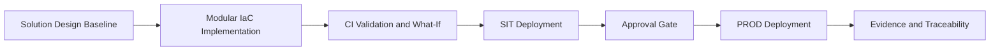

# Swiss Hospital Capacity Platform

| Field | Value |
| ----- | ----- |
| Version | 1.4.0 |
| Date | 2026-06-04 |
| Author | Urs Rueegg |
| Status | Reviewed |
| Previous Version | 1.3.1 (reviewed artefact linkage baseline) |

## Executive Summary

Swiss Hospital Capacity Platform is a governance-first blueprint for improving
patient flow and bed-capacity decisions across Swiss healthcare operations.

The solution combines:
1. Data interoperability and analytics for capacity visibility.
2. AI-assisted forecasting and discharge coordination.
3. GitHub-native, auditable delivery workflows for architecture, compliance,
	and implementation control.

The MVP is intentionally focused on a single-provider deployment with strict
Swiss in-country processing guardrails for PHI-sensitive workloads.

## Strategic Outcomes

1. Better occupancy and discharge planning through near-real-time capacity insight.
2. Faster, more consistent operational decisions supported by explainable AI outputs.
3. Stronger compliance posture through explicit traceability from requirements
	to architecture, security, and control evidence.

## Delivery Model (At a Glance)

1. Governance and requirements are documented first.
2. Agent-based workflows generate and review solution artefacts.
3. Security, compliance, and test evidence are built into the release path.

## Sprint 3 Implementation Summary

Sprint 3 delivered the infrastructure and promotion baseline from design into
validated SIT and PROD execution:

1. Implemented six domain infrastructure modules and composed them under `infra/main.bicep`.
2. Activated CI what-if validation for SIT and PROD through GitHub Actions.
3. Executed approval-gated SIT to PROD promotion workflow with OIDC authentication.
4. Completed provider registration controls and deployment runbook automation.
5. Achieved SIT and PROD domain module parity with deployment evidence.

## Key Artefacts

| Artefact | Why it matters for stakeholders | Link |
| ----- | ----- | ----- |
| Product Requirements | Business scope, FR and NFR commitments, traceability baseline | [docs/PRD.md](docs/PRD.md) |
| Solution Architecture | MVP architecture decisions, service boundaries, and constraints | [docs/ARCHITECTURE.md](docs/ARCHITECTURE.md) |
| AI Design | AI scope, safety boundaries, residency constraints, and operations | [docs/AI.md](docs/AI.md) |
| Security Baseline | Zero Trust pattern and requirement-level validation | [docs/SECURITY.md](docs/SECURITY.md) |
| Compliance Baseline | Swiss control mappings, evidence model, and release checks | [docs/COMPLIANCE.md](docs/COMPLIANCE.md) |
| Data Design | Data domains, contracts, retention model, and requirement mapping | [docs/DATA.md](docs/DATA.md) |
| Operations Model | Target operating model, run health, incident model, and monitoring baseline | [docs/OPERATIONS.md](docs/OPERATIONS.md) |
| Test Strategy | Quality gates, validation lanes, and evidence model for release readiness | [docs/TEST.md](docs/TEST.md) |
| ALM Plan | Git-first lifecycle model, promotion controls, and governance gates | [docs/ALM_PLAN.md](docs/ALM_PLAN.md) |
| Business Value Assessment | ROM-based ROI, TCO, value levers, and executive KPI framework | [docs/BVA.md](docs/BVA.md) |
| Solution Design Draft | MVP implementation view and phased delivery framing | [docs/SD.md](docs/SD.md) |
| Agent Registry | Operational view of agent responsibilities and side-effect controls | [AGENTS.md](AGENTS.md) |
| Sprint Trace | Detailed Sprint 02 refinement record and outcomes | [sprints/sprint-02-prd-refine-detailed-reviews.md](sprints/sprint-02-prd-refine-detailed-reviews.md) |
