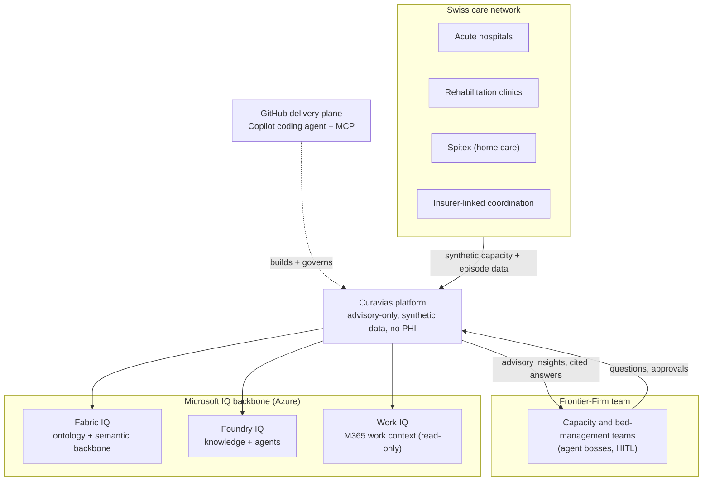

<!-- markdownlint-disable MD033 MD041 -->

  

<!-- markdownlint-enable MD033 MD041 -->

# Curavias — Swiss AI-Powered Patient Flow and Hospital Capacity Platform

| Field | Value |
| ----- | ----- |
| Version | 1.6.1 |
| Date | 2026-07-28 |
| Author | Urs Rueegg |
| Status | Reviewed |
| Previous Version | 1.6.0 (Sprint 34 WS-3: elevated README to the Curavias customer hero page — product-anchor line, refreshed executive summary, canonical system-context diagram, glossary + diagram-library navigation); this bump adds the Curavias brand-kit logo to the page header |

> **Curavias** is the Swiss AI-powered patient-flow and hospital-capacity
> platform — a Microsoft Frontier-Firm reference implementation grounded on
> Fabric IQ, Foundry IQ, and Work IQ.

## Executive summary

Curavias helps Swiss hospitals see and act on capacity — beds, occupancy,
discharges, staffing, and operating-room flow — with AI copilots that preview
and recommend while a human always decides. It is a Microsoft Frontier-Firm
reference implementation: human teams working alongside AI-agent teammates,
grounded on the Microsoft IQ backbone (Fabric IQ, Foundry IQ, and Work IQ) and
delivered GitHub-natively with full auditability. Curavias runs on synthetic
data with no PHI and is an advisory-only showcase — it previews and recommends,
never decides or diagnoses, and is not a medical device.

## Solution at a glance

Curavias in its ecosystem: the Swiss care network it serves, the human +
AI-agent Frontier-Firm team that operates it, the Microsoft IQ backbone that
grounds it, and the GitHub delivery plane that builds it. Canonical source:
[the diagram library](docs/architecture/diagram-library.md); terminology:
[GLOSSARY.md](docs/GLOSSARY.md).

## What Curavias delivers

1. Near-real-time capacity visibility across beds, occupancy, and discharge flow.
2. AI-assisted 72-hour forecasting, discharge coordination, and bed management.
3. GitHub-native, auditable delivery for architecture, compliance, and control
   evidence.

## Strategic outcomes

1. Better occupancy and discharge planning through near-real-time capacity insight.
2. Faster, more consistent operational decisions supported by explainable AI outputs.
3. Stronger compliance posture through explicit traceability from requirements to
   architecture, security, and control evidence.

## Delivery model (at a glance)

1. Governance and requirements are documented first.
2. Agent-based workflows generate and review solution artefacts.
3. Security, compliance, and test evidence are built into the release path.

## Key artefacts

| Artefact | Why it matters for stakeholders | Link |
| ----- | ----- | ----- |
| Glossary & Doc Standard | Curavias terminology and the customer-ready doc template | [docs/GLOSSARY.md](docs/GLOSSARY.md) |
| Diagram Library | Canonical mermaid diagrams (system context, medallion, agents, deployment, sequence) | [docs/architecture/diagram-library.md](docs/architecture/diagram-library.md) |
| Product Status (as-deployed) | Executive, evidence-backed view of what is actually deployed | [docs/CURAVIAS-PRODUCT-STATUS.md](docs/CURAVIAS-PRODUCT-STATUS.md) |
| Product Requirements | Business scope, FR and NFR commitments, traceability baseline | [docs/PRD.md](docs/PRD.md) |
| Solution Architecture | MVP architecture decisions, service boundaries, and constraints | [docs/ARCHITECTURE.md](docs/ARCHITECTURE.md) |
| AI Design | AI scope, safety boundaries, residency constraints, and operations | [docs/AI.md](docs/AI.md) |
| Security Baseline | Zero Trust pattern and requirement-level validation | [docs/SECURITY.md](docs/SECURITY.md) |
| Compliance Baseline | Swiss control mappings, evidence model, and release checks | [docs/COMPLIANCE.md](docs/COMPLIANCE.md) |
| Data Design | Data domains, contracts, retention model, and requirement mapping | [docs/DATA.md](docs/DATA.md) |
| Operations Model | Target operating model, run health, incident model, and monitoring baseline | [docs/OPERATIONS.md](docs/OPERATIONS.md) |
| Test Strategy | Quality gates, validation lanes, and evidence model for release readiness | [docs/TEST.md](docs/TEST.md) |
| ALM Plan | Git-first lifecycle model, promotion controls, and governance gates | [docs/ALM_PLAN.md](docs/ALM_PLAN.md) |
| Business Value Assessment | ROM-based ROI, TCO, value levers, and executive KPI framework | [docs/BVA.md](docs/BVA.md) |
| Solution Design Draft | MVP implementation view and phased delivery framing | [docs/SD.md](docs/SD.md) |
| Agent Registry | Operational view of agent responsibilities and side-effect controls | [AGENTS.md](AGENTS.md) |
| Superpowers Cutover Runbook | Migration guide for Superpowers-first execution while retaining governance controls | [docs/runbooks/superpowers-cutover.md](docs/runbooks/superpowers-cutover.md) |
| Sprint Trace | Detailed Sprint 02 refinement record and outcomes | [docs/sprints/sprint-02-prd-refine-detailed-reviews.md](docs/sprints/sprint-02-prd-refine-detailed-reviews.md) |
