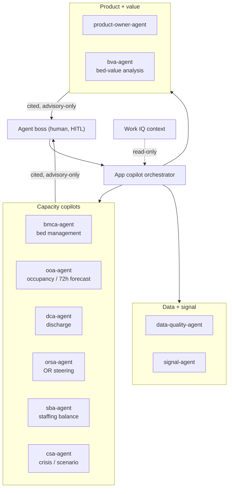
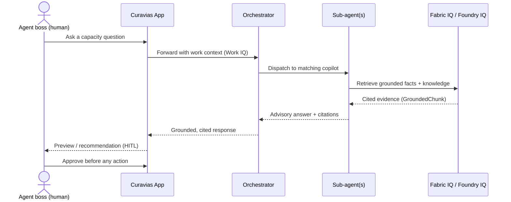

# Curavias — AI

| Field | Value |
| ----- | ----- |
| **Version** | 0.18.0 |
| **Date** | 2026-07-31 |
| **Author** | Urs Rueegg |
| **Status** | Reviewed |
| **Previous Version** | 0.17.0 (Sprint 34 WS-1 rebrand to the Curavias customer-ready template - anchored title, product anchor, executive summary, embedded canonical diagrams); this bump adds the Sprint 38 M5 operational-loop outcome-evaluation subsection (outcome_divergence + calibration gate + advisory backlog, realising FR-CLP-003) |

> **Curavias** is the Swiss AI-powered patient-flow and hospital-capacity
> platform — a Microsoft Frontier-Firm reference implementation grounded on
> Fabric IQ, Foundry IQ, and Work IQ.

## Executive summary

This document explains how Curavias uses AI responsibly: which AI services it
relies on, how patient-sensitive data stays in Switzerland, and how every AI
answer stays advisory-only and grounded in cited evidence. It is written so a
non-engineer stakeholder can understand what the platform's AI does and the
guardrails that keep it safe.

## Purpose

This document defines the AI architecture approach for Curavias, the Swiss
AI-powered patient-flow and hospital-capacity platform, with a GA-only service
baseline and Swiss data residency controls.

## Scope and Constraints

- React-based frontend is the mandatory MVP copilot channel.
- Agent runtime is application-hosted on Azure services, not Foundry-hosted
  agent resources.
- GA services only for MVP critical path.
- Strict Swiss in-country processing for PHI inference.
- PHI inference must use Standard/Regional deployments in Switzerland regions
  only.

> **Runtime pattern decision (Sprint 05):** the application-hosted default above is the
> binding baseline per `ADR-0008`. Foundry-hosted or hybrid runtime is permitted only
> under explicit workload scope with GA-in-region evidence and an approved boundary
> contract. The authoritative per-workload-class decision is recorded in
> [`docs/architecture/runtime-pattern-decision-matrix.md`](architecture/runtime-pattern-decision-matrix.md)
> and is consistent with `AR-D-007` in [`docs/ARCHITECTURE.md`](ARCHITECTURE.md); no
> PHI-sensitive workload class uses a Foundry-hosted or hybrid runtime in Sprint 05.

## Reference diagrams

The canonical agent topology and key request sequence below are maintained in
[architecture/diagram-library.md](architecture/diagram-library.md) and copied
here; update both places together when either changes.

### Agent topology and orchestration

### Key request sequence

## AI Use Cases

1. Bed and flow status Q and A for command-center users.
2. Forecast-aware operational recommendations with traceable grounding.
3. Discharge coordination support with auditable rationale and timestamps.
4. Role-based conversational assistance across operations personas.

> **As-deployed (Sprint 19):** the AI lane is live in PROD
> **`switzerlandnorth`** — Foundry `ai-ihzhhpf-prod` with 3 models (gpt-5,
> gpt-5-mini, o3) and 8 agents; agent-host `/agents` → 7; live inference
> verified (`PROD-SWN-OK`). The **Fabric IQ operational ontology** (`FR-ONT-002`)
> is **not at GA parity** in swn — availability-blocked by the Microsoft Preview
> per-capacity gate ([#270](https://github.com/urruegg/SwissHospitalCapacityPlatform/issues/270),
> [ADR-0042](adr/0042-prod-switzerland-north-ga-target-standing-preview-exception.md)).
> Synthetic data only, no PHI. Consolidated view:
> [CURAVIAS-PRODUCT-STATUS.md](CURAVIAS-PRODUCT-STATUS.md).

## GA Service Baseline (Non-Foundry-Hosted Agents)

### Recommended Reference Design

| Domain | Recommended GA Service Pattern | Notes |
| ------ | ------------------------------ | ----- |
| Frontend channel | Azure Static Web Apps (React) or Azure App Service (web) | Choose App Service if unified hosting model is preferred |
| Agent API runtime | Azure Container Apps (HTTP API) | Use autoscaling and minimum replicas for predictable latency |
| Background agent workers | Azure Container Apps jobs or worker apps | Offload long-running tools and non-interactive tasks |
| AI model inference | Azure OpenAI Standard/Regional deployments | For PHI-sensitive traffic, Switzerland regions only |
| Conversation/session cache | Azure Cache for Redis | Reduce repeated grounding and improve response latency |
| Durable conversation and audit store | Azure Cosmos DB or Azure SQL | Store conversation metadata, citations, and action logs |
| Async orchestration | Azure Service Bus queues/topics | Isolate spikes and smooth downstream dependency pressure |
| Secrets and credentials | Azure Key Vault with managed identity | No secrets in code or config files |
| Observability | Application Insights + Log Analytics + Azure Monitor alerts | Track latency, token use, failures, and user-impacting events |

### Why this design

- Keeps the agent runtime fully under provider control.
- Avoids dependency on preview-only or non-GA orchestration paths.
- Supports React-first MVP operations while preserving one shared backend
  contract for optional post-MVP channels.

## Capacity-Based Hosting Guidance

Based on architecture assumptions:

- 120 peak concurrent users
- 8000 copilot turns per day
- P95 interactive response objective under 4 seconds

### Synchronous vs asynchronous split

1. Synchronous path:
  user request, grounding retrieval, model call, response with citations.
2. Asynchronous path:
  expensive enrichments, partner lookups, long-running planning tasks.

This split protects interactive latency while preserving functional depth.

### Initial sizing guidance for pilot

| Component | Initial Baseline | Scale Strategy |
| --------- | ---------------- | -------------- |
| Agent API on Container Apps | 6 minimum replicas, 20 max replicas, 1 vCPU/2 GiB each | Scale on HTTP concurrency and CPU; keep min replicas during business hours |
| Worker runtime | 2 minimum replicas, 10 max replicas | Scale on queue depth and processing latency |
| Redis | Standard tier with zone-redundant option where supported | Monitor hit ratio and memory pressure |
| Service Bus | Premium when strict isolation and predictable throughput are required | Scale messaging units as queue latency grows |

Notes:

- Baseline above is a starting point, not a final production commitment.
- Final sizing must be validated with load tests against real prompts,
  grounding size, and model token profiles.

## Swiss Data Residency and Compliance Controls

1. Deploy PHI-sensitive AI paths only in Switzerland North and/or Switzerland
  West.
2. Use Azure OpenAI Standard or Regional Provisioned deployment types only for
  PHI-sensitive scenarios.
3. Block Global, Data Zone, and Developer deployment types for
  PHI-sensitive inference paths.
4. Disable PHI cross-region failover by default, including Switzerland North to
  Switzerland West failover, unless a compliance-approved runbook exists.
5. Keep audit records of prompt metadata, grounding identifiers, response IDs,
  timestamps, and user role context.

Related architecture decisions:

- `AR-D-003` and `AR-D-004` in `docs/ARCHITECTURE.md`
- `ADR-0003` and `ADR-0004` in `docs/adr/`

## IaC Coverage Assessment for Foundry and Fabric

### Coverage Matrix

| Domain | IaC Coverage Status | Tooling Evidence | Notes and Gaps |
| ------ | ------------------- | ---------------- | -------------- |
| Foundry and Azure OpenAI account provisioning | Full | Bicep and ARM support via Microsoft.CognitiveServices/accounts; Terraform azurerm_cognitive_account | Includes network controls, identity, CMK, project management flags |
| Model deployment provisioning | Full | Bicep and ARM support via Microsoft.CognitiveServices/accounts/deployments; Terraform azurerm_cognitive_deployment | Deployment type and SKU can be codified |
| Deployment-type compliance guardrails | Full | Azure Policy support for restricting deployment SKUs and types | Enforce Standard/Regional-only for PHI routes |
| Foundry account and project base setup | High | Azure quickstart templates for standard and network-secured setup | Used for model hosting and controls only; app runtime remains self-hosted |
| Fabric capacity infrastructure | High | Terraform azurerm_fabric_capacity; Azure Fabric capacity REST APIs | Capacity layer is automatable and policy-governable |
| Fabric workspace item lifecycle | Partial (hybrid) | Fabric Git integration, deployment pipelines, Fabric REST APIs, Fabric Terraform provider references | Not all item types are GA; several remain preview (including Ontology and Data Agents) |

### IaC Conclusion

1. Foundry and Azure OpenAI infrastructure is IaC-ready for production using
  Bicep or Terraform.
2. Fabric capacity is IaC-ready, but Fabric item-level lifecycle is hybrid:
  Git integration plus deployment pipelines plus REST automation.
3. Full end-to-end declarative IaC coverage for all Fabric items is not yet
  uniformly GA due to item maturity differences.

### Recommended Implementation Model

1. Infrastructure lane:
  Bicep or Terraform for resource groups, networking, identities,
  Cognitive Services accounts, model deployments, monitoring, and policy.
2. Fabric content lane:
  Git integration and deployment pipelines for supported GA item types,
  with REST automation for promotion orchestration.
3. Governance lane:
  Azure Policy blocks non-compliant Foundry deployment types for PHI inference
  and enforces region restrictions.

## Model and Prompt Governance

1. Maintain versioned system prompts and policy prompts in Git.
2. Require change approval for prompt updates affecting clinical or
  operational recommendations.
3. Enforce grounded responses with source references and timestamp metadata.
4. Keep role-aware prompt templates and explicit refusal behavior for
  out-of-scope or unsafe requests.
5. Separate prompt bundles by environment (DEV, SIT, PROD) with promotion gates.

## Data Quality Trust Score and Grounding Readiness (Sprint 31)

Sprint 31 (issue #453,
[ADR-0053](adr/0053-dqa-trust-score-model.md)) elevates the
`data-quality-agent` from ingestion gates to **proactive** assessment of the
gold/serving layer. Two deterministic contracts govern the surface:
`DC-DQ-TRUSTSCORE-v1` (per-domain trust) and `DC-DQ-GAP-v1` (gap detection with
impact and the frozen "new-source-needed" seam).

1. The per-domain **trust score** is an 8-dimension deterministic, unit-tested
   computation (`data-platform/quality/trust_score.py`) over governed metadata —
   **never an LLM estimate** — mirroring the `compute_expected_impact` pattern so
   every score is reproducible, versioned (`trustscore-v1`), and explainable.
   The dimension weights and per-decision-class thresholds are ADR-ratified in
   [ADR-0053](adr/0053-dqa-trust-score-model.md) (Accepted), with the values held
   in the versioned `data-platform/quality/trustscore-weights.json`
   (`trustscore-v1`) source of truth.
2. The agent is **advisory, human-in-the-loop, and read-only** (NFR-DQA-002): it
   assesses and routes findings to the owning domain, but never edits source
   data and never self-certifies grounding. It refuses `edit-source-data` and
   `self-certify-grounding` requests.
3. A **grounding-readiness certificate** (FR-DQA-012) gates whether a gold domain
   may be used for trusted grounding. When a domain scores below its
   decision-class threshold, the certificate is withheld and grounding is served
   **degraded or withheld** (FR-DQA-006) rather than presented as trusted —
   preventing a false-trusted answer.
4. Trust scores and gap assessments are an **input to agent evaluation**,
   converging with the Sprint 30 evaluation harness: a domain's readiness is one
   of the signals scored when curating evaluation datasets and advisory backlog.

## Prescriptive Decision Vocabulary (DC-INSIGHT-v1)

Sprint 26 Slice 1 (issue #335,
[ADR-0040](adr/0040-prescriptive-decision-ontology-and-runtime-store.md)) moves
the OOA -> DCA copilot pair from descriptive-only to prescriptive: every
grounded answer is assembled as the `DC-INSIGHT-v1` 5-beat vocabulary — SIGNAL,
UNDERSTANDING, RECOMMENDATION, ACTION, COORDINATION — plus PROVENANCE, rather
than a free-form sentence.

1. The RECOMMENDATION beat's `expected_impact` (delta beds / delta %) is always
   computed by a deterministic, unit-tested `compute_expected_impact` function
   over governed forecast/driver data — **never an LLM estimate** — so the
   number behind a ranked lever is auditable and reproducible.
2. The ACTION beat is advisory and human-in-the-loop: an action may be
   `PROPOSED` autonomously by a copilot, but is only `APPLIED` after a human
   posts the `approved-to-apply` confirmation on the governing PR/issue/comment
   thread ([AGENTS.md §4](../AGENTS.md#4-confirmation-rule-for-deploy--delete)).
   The agent refuses to self-approve and refuses a bot-identity approver.
3. The read-only Fabric Data Agent stays a grounding tool, emitting only the
   descriptive `signal`/`understanding`/`provenance` beats; the agent-host
   assembles `recommendation`/`action`/`coordination` at runtime, keeping the
   copilots' `write` side-effect ceiling unchanged.
4. WS-C ships **gated apply tooling** for the six decision-tier agents:
   `foundry/register_decision_tier.py` (mirroring
   `register_fabric_data_agent_tool.py`) emits a deterministic per-agent
   registration plan — each agent pointed at its own role lever catalog, the
   Cosmos `plans`/`proposed_actions` containers, and the deterministic impact
   tool — and only mutates the eastus2 Foundry project
   ([ADR-0032](adr/0032-foundry-control-plane-eastus2.md)) when handed a non-bot
   `--approved-to-apply` handle and a live registration factory. A real apply
   runs in-VNet, never from CI.

## Evaluation

The closed-loop learning approach below — capture contract, retention class, and
online-eval sampling — is ratified in
[ADR-0055](adr/0055-closed-loop-learning-capture-and-eval.md) (Sprint 30).

### Operational-Loop Outcome Evaluation (Sprint 38 M5)

The Sprint 38 EPIC closed-loop simulation engine feeds the learning loop a new,
non-conversational signal: each HITL-approved action applied to the twin emits a
`DC-SIM-OUTCOME-v1` record carrying the agent's **predicted-vs-realised
divergence**. `evals/lib/sim_outcome_eval.py` adds three deterministic,
advisory-only, PHI-safe surfaces over those records — realising `FR-CLP-003`:

- **`outcome_divergence`** — an evaluator (reusing the Sprint 30 `EvalResult`)
  that scores an outcome as passing when the agent's predicted impact aligns with
  the simulator's realised impact within a divergence threshold.
- **`run_calibration_gate`** — the "simulator is working" batch gate: it hard-
  fails only on internal inconsistency (`realised value != freed-bed count`,
  negative divergence, or non-`simulated` provenance) and rolls up the divergence
  distribution as an advisory signal (high divergence is a lead, not a failure).
- **`select_high_divergence`** — an advisory backlog of high-divergence journeys
  (ids / lever / numbers only, never raw state) as an agent-optimisation lead;
  drafts only, never auto-applied
  ([ADR-0058](adr/0058-sim-outcome-and-effect-schema.md), `NFR-AI-001`).

Deeper wiring of these leads into the Sprint 30 curator / prompt-optimizer /
fine-tune-plan jobs and live model fine-tuning remain the deferred continuation
(design spec §8.3).

### Agent-Turn Observability (Sprint 30 M1)

The Observe stage of the closed-loop foundation. Every orchestrator dispatch
emits an OpenTelemetry-shaped trace — a root `agent.turn` span with three child
spans (`agent.retrieve` -> `agent.model` -> `agent.assemble`) — plus one
`AgentTurn` Application Insights `customEvents` record per turn. The tracing
facade (`apps/hcc-agent-host/src/observability/tracing.py`) buffers spans/events
in memory behind a pluggable exporter: the dependency-free `NullExporter` is the
default (so unit tests and CI need no OpenTelemetry / Azure SDK and no network),
and a lazy `AzureMonitorExporter` is wired at startup only when
`APPLICATIONINSIGHTS_CONNECTION_STRING` is set. This mirrors the "mock in CI,
real in prod" pattern used for the chat model and Cosmos persistence.

The `AgentTurn` event carries **only** non-PHI metadata (`NFR-LEARN-001`,
[ADR-0016](adr/0016-no-phi-in-mvp-demo-scope.md)) — never raw prompt or answer
text:

| Field | Kind | Example |
|-------|------|---------|
| `agent` | property | `ooa-agent` |
| `interactionId` | property | `AIX-<hex>` (joins the `agent_interactions` record) |
| `correlationId` | property | 16-hex dispatch correlation id |
| `refused` | property | `true` / `false` |
| `degraded` | property | grounding degraded to tables |
| `provenance` | property | `live` / `simulated` |
| `latencyMs` | measurement | end-to-end turn latency |
| `citationCount` | measurement | number of cited sources |

A PHI-safety regression test asserts no raw prompt/answer text ever reaches a
span attribute or event property. The data-agent refusal path emits the event
with `refused=true` and **no** `agent.model` span (the model is not consulted).

### Online SLO Metrics

- P50, P95, P99 end-to-end response latency.
- Error rate by route and dependency.
- Grounding retrieval latency and cache hit ratio.
- Token consumption per request class.

### Quality and Safety Metrics

- Citation coverage rate for user-visible responses.
- Hallucination and unsupported-claim rate from sampled reviews.
- Actionability score for operations users.
- Refusal correctness for restricted request categories.

### Offline Evaluation Gate (Sprint 30 M3)

A shared, agent-agnostic **evaluator library** (`evals/lib/`) defines each metric
once so it is reused by the offline batch gate (this milestone) and the future
online continuous-eval sampler (M4). Six deterministic seed evaluators score
`DC-AGENT-INTERACTION-v1` records: citation coverage, groundedness (cited sources
are real), refusal correctness, PHI-leak, actionability (reco carries a lever +
deterministic impact), and advisory-voice. All are deterministic and require no
model access, so the gate runs in CI; LLM-as-judge groundedness is a later
hardening pass.

The offline harness (`evals/lib/harness.py`) runs the library over a versioned
golden dataset (`evals/<agent>/datasets/vN/`) and applies the regression gate —
citation coverage >= 0.95 and zero failures on the other five evaluators. The
lead agent's suite (`evals/ooa-agent/`) is enforced in CI by
[`eval-offline-gate.yml`](../.github/workflows/eval-offline-gate.yml) on every
change to the evaluator library, the golden dataset, the interaction contract, or
the `ooa-agent` prompt/manifest surface. No prompt / knowledge / model change is
promoted without an offline regression pass plus `approved-to-apply`
(`NFR-LEARN-003`). Rolls out to the other runtime agents in Sprint 31.

### Online Continuous Evaluation (Sprint 30 M4)

The online half of the Evaluate stage scores production traffic on a schedule so
quality is observed continuously, not only at promotion time. A scheduled **Azure
Container Apps job** (`evals/online_eval_job.py`) samples recent
`agent_interactions`, scores each sampled record, writes the verdict back onto the
record, and emits a per-agent quality rollup:

- **Sampling** — deterministic, rate-limited draw (`evals/lib/online.py`,
  default ~15%). The sample is seeded so a re-run of the same window yields the
  same subset; production sets the rate/seed via job parameters.
- **Scoring** — reuses the **same** six deterministic evaluators as the offline
  gate (`evals/lib/harness.py`); the metric is defined once and shared, so online
  and offline verdicts never drift. Online has no golden labels, so
  refusal-correctness falls back to its vacuous-pass behaviour.
- **Write-back** — each scored record's `eval` block is patched in place
  (`eval.scored = true`, `evaluatorSet`, `sampledAt`, per-evaluator `scores`,
  `passedAll`) through a narrow source/sink seam (`evals/lib/online_store.py`).
  CI runs against an in-memory store; the lazy Cosmos-backed store
  (`evals/lib/online_cosmos.py`) is built from `COSMOS_*` env vars only in
  production, mirroring the M1 Azure Monitor exporter seam.
- **Rollup** — per-agent, per-evaluator pass rates plus an overall `passedAll`
  rate feed the quality view. Empty-safe (no division by zero).

PHI-safety (ADR-0016 / `NFR-LEARN-001`): sampling and scoring read only the
already-redacted record fields; both the `eval` write-back and the rollup carry
counts / rates / ids / booleans, never raw prompt or answer text. The ACA
schedule (Bicep) is a deferred infra output; the testable job logic and Cosmos
runtime seam land in this milestone (`FR-LEARN-002`).

### Curation + Advisory Backlog (Sprint 30 M5)

The Learn step turns scored traces into training/eval signal without any
autonomous change. A curation job (`evals/curate_job.py`) reads recent **scored**
`agent_interactions` through the same source seam as the online-eval job
(`evals/lib/online_store.py`), applies a selection policy (`evals/lib/curator.py`),
and emits two advisory artefacts:

- **Selection policy** (`curator.select`) — picks *high-signal* interactions:
  evaluation failures (`passedAll = false`), low scores (any evaluator below a
  threshold), thumbs-down, and mis-refusals (`refused` disagrees with the
  `expected.should_refuse` label). A small **deterministic seeded random sample**
  of the remaining clean traffic is added for coverage without double-counting.
- **Dataset rows** (`curator.to_dataset_rows`) — candidate rows for a versioned
  dataset under `evals/<agent>/datasets/vN/`. Each row keeps **lineage** back to
  its `interactionId` in a `curation` block (`sourceInteractionId`, `reasons`,
  `curatedAt`, `signedOff: false`, `reviewer: null`) and carries an `expected`
  block for a reviewer to complete. `eval` is reset to `{"scored": false}`.
- **Advisory backlog** (`curator.to_backlog_items`) — GitHub-issue **drafts**
  grouped by agent + failing metric, tagged `learn` / `advisory` /
  `agent:<name>` / `metric:<name>`, carrying counts + source `interactionId`s.

Advisory-only (`NFR-LEARN-003`): the job **never** writes a dataset file, opens an
issue, or mutates a prompt / knowledge source / guardrail / model. A human reviews
the rows, sets `signedOff`, and applies changes gated by the offline regression
suite + `approved-to-apply`. PHI-safety (ADR-0016 / `NFR-LEARN-001`): backlog
drafts carry only ids / counts / metrics; dataset rows carry the already-redacted
record fields, never new PHI. The lineage trail (`trace → dataset → eval →
change`) is what makes each downstream Improve step (M7–M9) auditable
(`FR-LEARN-003`).

### Improve - Prompt Optimization (Sprint 30 M7)

The first Improve step turns curated failing signal into an **advisory prompt
proposal** for an agent, with no autonomous change. A prompt-optimization job
(`evals/prompt_optimize_job.py`) reads recent **scored** `agent_interactions`
through the same source seam as the online-eval and curation jobs
(`evals/lib/online_store.py`) and calls a deterministic optimizer
(`evals/lib/prompt_optimize.py`). There is no live Foundry "Agent Optimizer"
runtime in this repo (ADR-0002); M7 realises that capability as reviewable,
offline Python:

- **Improvement signal** - `run_prompt_optimization` filters scored records to the
  target agent, then reuses the curator (`curator.select` +
  `curator.to_backlog_items`) to derive the concrete **failing metrics** (e.g.
  `citation_coverage`, `actionability`, `user_feedback`). `random_rate` defaults
  to `0.0`, so only real failures - not a random sample - drive directives.
- **Directive library** (`propose_directives`) - maps each failing metric to a
  small, targeted instruction directive (a generic directive covers unmapped
  metrics). This is a lookup, not a generative rewrite, so proposals are
  deterministic and diffable.
- **Candidate instructions** (`build_candidate_instructions`) - appends a single
  `## Optimization directives (advisory, Sprint 30 M7)` block to the agent's base
  `AGENT.md` **in memory**. The transform is idempotent and replacing (re-running
  supersedes the prior block; it never stacks) and preserves the base verbatim.
- **Offline-gate guardrail** - the candidate is only promotable if the offline
  regression suite over the agent's golden dataset (`evals/lib/harness.py`)
  passes; the proposal carries `offlineGatePassed`.

Advisory-only (`NFR-LEARN-003`): the job **never** writes `AGENT.md`, opens an
issue, or mutates a prompt / model. It emits a proposal
(`advisory: true, applied: false, approvedToApply: false`) with full lineage
(`sourceMetrics`, `sourceInteractionIds`). A human applies the candidate only
after the offline gate passes **and** an explicit `approved-to-apply`.
PHI-safety (ADR-0016 / `NFR-LEARN-001`): the proposal carries only metric names,
interaction ids, directives, and the agent's own instruction text - never raw
prompt or answer content. This realises `FR-LEARN-005`.

### Improve - Knowledge Refresh (Sprint 30 M8)

The second Improve step turns curated **uncited-claim gaps** into an **advisory
knowledge-refresh proposal** for an agent, with no autonomous change. A
knowledge-refresh job (`evals/knowledge_refresh_job.py`) reads recent **scored**
`agent_interactions` through the same source seam as the online-eval, curation,
and prompt-optimize jobs (`evals/lib/online_store.py`) and calls a deterministic
refresher (`evals/lib/knowledge_refresh.py`). There is no live Foundry IQ / Fabric
knowledge-refresh runtime in this repo (ADR-0002); M8 realises that capability as
reviewable, offline Python:

- **Gap signal** - an uncited-claim gap is exactly an interaction that fails a
  **knowledge metric**: `citation_coverage` (a claim with no `Grounded on:`
  citation) or `groundedness` (a claim not present in or derived from the grounded
  rows). `run_knowledge_refresh` filters scored records to the target agent, reuses
  the curator (`curator.select` + `curator.to_backlog_items`) to derive failing
  metrics, then keeps only `KNOWLEDGE_METRICS`. Prompt-lane failures
  (actionability, advisory_voice, ...) are M7's concern and are excluded.
  `random_rate` defaults to `0.0`, so only real gaps drive the proposal.
- **Refresh-action library** (`propose_refresh_actions`) - maps each knowledge
  metric to a targeted grounding-source action (verify the gold snapshots are
  fresh and reachable; expand the reference-layer ontology + Fabric Data Agent
  `DC-INSIGHT-v1` grounding so the needed facts exist). This is a lookup, not a
  generative rewrite, so proposals are deterministic and diffable.
- **Gap extraction** (`extract_knowledge_gaps`) - names the agent's declared
  grounding sources (`agents/ooa-agent/AGENT.md` section 4) alongside each gap's
  metric, count, and interaction-id lineage.
- **Offline-gate guardrail** - the current grounding is only promotable-after-
  refresh if the offline regression suite over the agent's golden dataset
  (`evals/lib/harness.py`) passes; the proposal carries `offlineGatePassed`.

Advisory-only (`NFR-LEARN-003`): the job **never** writes a grounding source,
ontology file, `AGENT.md`, or any file, opens an issue, or mutates a knowledge
source / model. It emits a proposal (`advisory: true, applied: false,
approvedToApply: false`) with full lineage (`knowledgeMetrics`,
`sourceInteractionIds`, `groundingSources`). A human refreshes the grounding only
after the offline gate passes **and** an explicit `approved-to-apply`.
PHI-safety (ADR-0016 / `NFR-LEARN-001`): the proposal carries only metric names,
interaction ids, grounding-source names, and refresh actions - never raw prompt or
answer content. This realises `FR-LEARN-005`.

### Improve - Fine-tune (Sprint 30 M9)

The third and final Improve step turns the curated dataset into an **advisory
fine-tune plan** for an agent, with no autonomous change. A fine-tune planning job
(`evals/finetune_plan_job.py`) reads recent **scored** `agent_interactions` through
the same source seam as the online-eval, curation, prompt-optimize, and
knowledge-refresh jobs (`evals/lib/online_store.py`) and calls a deterministic
planner (`evals/lib/finetune_plan.py`). There is no live Foundry fine-tune runtime
in this repo (ADR-0002; fine-tune is not GA-in-Switzerland); M9 realises that
capability as reviewable, offline Python that builds the plan a human then runs:

- **Method classification** - `classify_finetune_examples` assigns each curated
  selection to the fine-tune method(s) its signal supports:
  - **SFT** (supervised) - quality-failure examples (eval failures, low scores,
    mis-refusals) that carry a human-corrected target to imitate.
  - **DPO** (preference) - **thumbs pairs**: a thumbs-down interaction becomes a
    preference pair.
  - **RFT** (reinforcement) - **graders**: examples the deterministic evaluator
    library can grade act as reward signal.
  `random_rate` defaults to `0.0`, so only real failure / preference / grader
  signal drives the plan.
- **Method library** (`propose_methods`) - a deterministic method -> description
  lookup (not a generative choice), so the plan is diffable.
- **Plan** (`build_finetune_plan`) - per-method feasibility, example counts, and
  interaction-id lineage, pinned to the demo region **eastus2** (ADR-0013 region
  pin, ADR-0032 Foundry / OpenAI quota). Swiss-region GA fine-tune follows the
  Preview-exception path (ADR-0006 / ADR-0042).
- **Evaluation-gated deploy** - `checkpointSelection` is the offline-regression
  gate: a fine-tuned checkpoint is only promotable if the offline suite over the
  agent's golden dataset (`evals/lib/harness.py`) passes; the plan carries the
  baseline `offlineGatePassed`.

Advisory-only (`NFR-LEARN-003`): the job **never** launches a training job, deploys
or registers a model, writes a file, or opens an issue. It emits a plan
(`advisory: true, applied: false, approvedToApply: false`) with full lineage
(`feasibleMethods`, per-method `interactionIds`). A human launches training and the
deploy requires the offline gate pass **and** an explicit `approved-to-apply`; the
first checkpoint is a proof of the loop, not a production model.
PHI-safety (ADR-0016 / `NFR-LEARN-001`): the plan carries only method names,
interaction ids, counts, and the demo region - never raw prompt or answer content.
This realises `FR-LEARN-005`.

### Load Validation Plan

1. Run baseline test at 40 concurrent users.
2. Run target test at 120 concurrent users.
3. Run burst test at 180 concurrent users for 10-minute windows.
4. Verify degradation behavior and queue backpressure handling.
5. Tune autoscale thresholds and minimum replica counts from observed P95/P99.

## Agent Registry (Runtime, Data-Plane)

Registers **runtime, user-facing agents** that serve bed managers, planners, and clinical stewards. Distinct from [AGENTS.md](../AGENTS.md), which lists **coding agents** operating on this repository.

All 3 runtime agents obey design-spec §1.4 demo-scope guardrails, ADR-0016 four-gate PHI enforcement, and ADR-0013 westus2 region pin (Swiss GA target: switzerlandnorth).

| Agent | Host (westus2 today / Swiss GA target) | Role | Ceiling | Primary grounding | Refusal rules | Pack |
| ----- | -------------------------------------- | ---- | ------- | ----------------- | ------------- | ---- |
| **BM-Copilot** *(existing)* | Foundry `ai-ihzhhpf-sit` westus2 → `switzerlandnorth` on Fabric IQ GA | Bed-management conversational copilot (advisory, HITL) | `read` | `gold/patient-flow/*` + MVO semantic model | Refuses: authoritative clinical direction, patient identity emission, clinical dosing / diagnosis Qs | [agents/bm-copilot/](../agents/bm-copilot/AGENT.md) |
| **Fabric Data Agent** *(new)* | Fabric IQ (westus2 demo) → switzerlandnorth on GA | Natural-language MVO ontology query (query-only) | `read` | MVO ontology + semantic model (Direct Lake) | Refuses: synthetic data generation, semantic model / ontology mutation, cross-hospital re-identification | [agents/fabric-data-agent/](../agents/fabric-data-agent/AGENT.md) |
| **CSA** — Capacity Simulation Agent *(new)* | Foundry `ai-ihzhhpf-sit` westus2 → `switzerlandnorth` on Fabric IQ GA | Advisory what-if capacity planning ("cut ward W by 4 beds → 7-day impact?") | `read` | `gold/patient-flow/*` + simulator `simRunId` history + `gold/forecast_output` | Refuses: real-data execution, clinical recommendation framing, confidence claims without `simRunId` evidence | [agents/csa-agent/](../agents/csa-agent/AGENT.md) |

**Auth model:** all 3 agents auth via User-Assigned Managed Identity (attached to Foundry / Fabric hosts) with least-privilege role assignments — no long-lived secrets. Bicep: [infra/modules/agents/foundry-hosted/](../infra/modules/agents/foundry-hosted/main.bicep).

**MCP allow-list:** no changes. Runtime agents consume Azure services via MI, not MCP. The [`.github/copilot/mcp.json`](../.github/copilot/mcp.json) allow-list is scoped to the coding agent only.

**Governance:**

- Agent packs (`agents/<name>/`) versioned per §9 Document Versioning.
- Golden-task fixtures under each pack; ≥3 per agent (happy / failure / PHI refusal) per design spec §5.5.
- Region-pin path documented in each `AGENT.md §8` for Swiss GA migration.

Refer to [design spec §5](superpowers/specs/2026-07-02-sprint-09-v2-refinement-design.md) for full architecture rationale.
