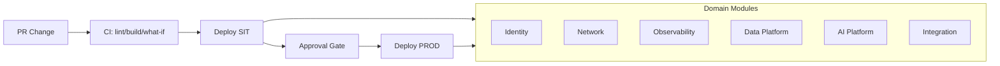

# ARCHITECTURE

| Field | Value |
| ----- | ----- |
| **Version** | 0.13.0 |
| **Date** | 2026-07-25 |
| **Author** | Urs Rueegg |
| **Status** | Reviewed |
| **Previous Version** | 0.12.0 (Sprint 05 CAF/WAF runtime + reliability baseline closure) |

## Purpose

This document defines the current baseline architecture for the Swiss AI-Powered
Patient Flow and Hospital Capacity Platform and maps architecture decisions to
the requirement baseline in docs/PRD.md.

## Architecture Drivers

- Provider-internal deployment model and governance boundary.
- Real-time operational visibility and 72-hour forecasting.
- Discharge coordination with external partner endpoints.
- Grounded operational copilot for bed and capacity management.
- Swiss compliance, security, and auditable operations.

## Deployment Baseline

primary region = switzerland north
secondary region = switzerland west (failover per compliance runbook)

> **Target vs. as-deployed:** the region baseline above is the **target GA
> architecture**. The current demo/proof-of-technology deployment runs PROD
> greenfield in **`switzerlandnorth`** (single-region, no Switzerland West
> failover yet) and SIT in `westus2` (+ `eastus2` Foundry split), synthetic
> data only, no PHI — per [ADR-0037](adr/0037-prod-region-switzerland-north-greenfield.md),
> [ADR-0013](adr/0013-temporary-us-region-demo-scope.md), and
> [ADR-0016](adr/0016-no-phi-in-mvp-demo-scope.md). Consolidated as-deployed
> view: [CURAVIAS-PRODUCT-STATUS.md](CURAVIAS-PRODUCT-STATUS.md).

## Reference Pattern

The target pattern combines:

- Microsoft Cloud Adoption Framework landing zone principles for governance,
  identity, and network boundaries.
- Azure Well-Architected pillars for reliability, security, cost,
  performance, and operations.
- A healthcare data and AI pattern with ingest, normalize, curate, predict,
  assist, and orchestrate phases.

## Logical Architecture

### Layered View

| Layer | Purpose | Primary Services |
| ----- | ------- | ---------------- |
| Source and event | Capture operational healthcare signals | KIS/EHR, ED, ADT, bed-state, staffing feeds |
| Interoperability and normalization | Normalize and standardize healthcare payloads | Azure Health Data Services, integration adapters |
| Data platform | Curate, transform, and serve governed data | Microsoft Fabric, OneLake |
| AI and decision intelligence | Forecasting and discharge scoring | Azure Machine Learning |
| Copilot and experience | Operational dashboard and conversational assistance | Power BI, Azure OpenAI |
| Orchestration | Partner workflow execution and callback handling | Azure Logic Apps |
| Governance and operations | Security, lineage, observability, policy | Entra ID, Key Vault, Purview, Monitor, Policy |

### Component Topology

| Domain | Components |
| ------ | ---------- |
| Identity and access | Microsoft Entra ID, managed identity, RBAC |
| Core platform | Azure Health Data Services, Fabric, Azure Machine Learning, Azure OpenAI, Logic Apps, Power BI |
| Security and governance | Azure Key Vault, Microsoft Purview, Azure Monitor, Log Analytics, Azure Policy |

### End-to-End Flow

1. Source events are ingested and normalized.
2. Curated datasets are produced in Fabric and OneLake.
3. Forecast and discharge models produce scored outputs.
4. Outputs are served to dashboards and copilot grounding pipelines.
5. Logic Apps orchestrates outbound and inbound partner coordination.
6. Partner acknowledgements are written back to governed datasets.
7. Traceability is preserved from source event to user-facing output and action.

## Deployment Architecture

## Sprint 3 Implementation Overlay

Sprint 3 implemented the landing-zone-aligned infrastructure composition and
promotion workflow defined in this architecture:

1. Bicep composition under `infra/main.bicep` now orchestrates all six domain modules.
2. SIT and PROD environment parameterization is active and deployment-validated.
3. CI and CD workflows enforce what-if gates and approval-controlled promotion.
4. Provider registration controls are integrated into deployment execution and runbook operations.

### Network and Security Boundaries

- Hub-spoke model with strict workload segmentation.
- Private connectivity and minimal public exposure for sensitive services.
- Centralized policy enforcement for encryption, diagnostics, and access.

### Environment Strategy

- DEV, SIT, PROD progression with approval gates.
- Separate environment configuration for data contracts, model versions,
  and prompt bundles.
- Repeatable Infrastructure as Code deployment workflow.

### Identity and Secret Strategy

- Managed identity as default workload authentication.
- Key Vault for secret and certificate material.
- Role assignments scoped by environment and workload ownership.

### Observability and Audit Strategy

- Centralized logs, metrics, and alerts for ingestion, model pipelines,
  copilot responses, and orchestration flows.
- Auditable chain from source event to model output, response, and partner trigger.
- Governance evidence artifacts retained for compliance review.

## Sprint 6 Onboarding and Data-Platform Overlay

Sprint 6 adds two onboarding lanes and an IaC-first data-platform bootstrap path
on top of the layered architecture, scoped to the MVP agents OOA/DCA/BMCA.

### Onboarding Lanes

| Lane | Architecture placement | Classification (FR-ONB-004) |
| ----- | ----- | ----- |
| Patient minimum-data onboarding | Interoperability/normalization -> data-platform curated zone, minimized pseudonymous contract `DC-ONB-PATIENT-v1` | Deterministic service |
| Specialty-driven capacity onboarding | Data-platform curated zone, specialty-tagged contract `DC-ONB-CAPACITY-v1` + provider extensions | Deterministic service |
| OOA/DCA/BMCA decision support over onboarded data | AI/decision-intelligence + copilot layers, advisory and HITL-gated | Agentic flow |

The deterministic-service-vs-agentic-flow classification criterion is defined in
[`docs/SD.md`](SD.md) and applied per onboarding workflow.

### Data-Platform Bootstrap (IaC-first)

1. The data-platform module
   [`infra/modules/data-platform/main.bicep`](../infra/modules/data-platform/main.bicep)
   provisions a governed storage account and a dedicated `onboarding` blob
   container for synthesized SIT onboarding datasets used by the MVP flows.
2. Synthesized, non-production datasets and their JSON Schema contracts live in
   [`data/synthetic/`](../data/synthetic/README.md); the CI gate
   [`.github/workflows/data-contracts.yml`](../.github/workflows/data-contracts.yml)
   validates contract conformance, re-identification minimization, and
   FR/NFR/CH traceability on every change (`NFR-MAINT-005`, `NFR-DQ-005`).
3. Agent-to-IaC component mapping for OOA/DCA/BMCA is recorded in
   [`docs/agents/sprint-06-mvp-agent-readiness.md`](agents/sprint-06-mvp-agent-readiness.md).

## Requirement Mapping Summary

| Requirement Family | Architectural Coverage |
| ------------------ | ---------------------- |
| FR-OM | Single-provider deployment, phased rollout boundary, endpoint-only external partner model |
| FR-DATA | FHIR normalization, curated datasets, semantic serving, source-to-consumption traceability |
| FR-FC | 72-hour forecast pipeline, specialty/time segmentation, dashboard and copilot feed |
| FR-DC | Discharge scoring pipeline, orchestration triggers, acknowledgement capture |
| FR-CX | Power BI command views and grounded operational copilot |
| FR-GOV | Auditable delivery, policy controls, access enforcement, provider-local operational control |
| NFR-COMP and NFR-SEC | Residency-oriented controls, RBAC, secure integration boundaries |
| NFR-DQ and NFR-PERF | Quality gates on feeds, near-real-time processing and hourly forecast cadence |
| NFR-REL and NFR-AI | Continuous operations, restartability, advisory copilot and response traceability |
| NFR-MAINT | Modular architecture lanes and Git-first release model |
| FR-ONB and onboarding NFRs | Sprint 6 onboarding lanes overlay, IaC-first data-platform bootstrap, synthesized-data contract/schema gate, OOA/DCA/BMCA agent-to-IaC mapping |

## Decisions

### Accepted In This Draft

1. Single-provider deployment boundary is preserved for each rollout.
2. External partners are treated as integration endpoints, not platform operators.
3. Fabric is the primary analytics backbone for curated operational data.
4. Azure Machine Learning and Azure OpenAI are the primary AI layers.
5. Logic Apps is the default orchestration mechanism for partner coordination.
6. Governance controls are architecture-native and not deferred.
7. Architecture scope is limited to GA-capable services for MVP critical path.

### Open For Review

1. Region resilience strategy for high availability and failover.
   Resolved for Sprint 05 baseline in
   [`docs/operations/reliability-dr-profile.md`](operations/reliability-dr-profile.md)
   (recovery classes R1/R2/R3, failover by data class). See `AR-D-008`.
2. Exact FHIR resource profile scope for first implementation increment.
3. Concrete SLO targets for data freshness, model latency, and copilot response.
4. Detailed backup and disaster recovery controls by data classification tier.
   Resolved for Sprint 05 baseline in
   [`docs/operations/reliability-dr-profile.md`](operations/reliability-dr-profile.md)
   (dependency redundancy posture + restore-proof rule). See `AR-D-008`.

### Sprint 05 CAF/WAF Baseline Closure

The Sprint 05 CAF/WAF review hardening closes two architecture ambiguities that were
previously open: agent runtime pattern scope and reliability/DR target state.

1. **Runtime pattern** is fixed to application-hosted by default, with Foundry/hybrid
   permitted only under explicit scope and GA-in-region rules. The authoritative,
   per-workload-class decision is in
   [`docs/architecture/runtime-pattern-decision-matrix.md`](architecture/runtime-pattern-decision-matrix.md)
   (ADR-0008). This matrix is consistent with the application-hosted default in
   [`docs/AI.md`](AI.md); there is no contradiction between the two documents. See
   `AR-D-007`.
2. **Reliability/DR** target state is defined in
   [`docs/operations/reliability-dr-profile.md`](operations/reliability-dr-profile.md)
   (ADR-0009). See `AR-D-008`.
3. CAF/WAF delta closure status is tracked in
   [`docs/architecture/caf-waf-alignment-matrix.md`](architecture/caf-waf-alignment-matrix.md).

### GA-Based Decision Record (As Of 2026-06-01)

The following decisions lock the architecture baseline to currently available GA
capabilities and remove preview dependencies from MVP-critical workflows.

| Decision ID | Decision | Status | Effective Scope |
| ----------- | -------- | ------ | --------------- |
| `AR-D-001` | Microsoft Fabric remains the core data platform in Switzerland North and Switzerland West with GA workloads only. See `ADR-0001`. | Accepted | MVP and PROD baseline |
| `AR-D-002` | Fabric IQ Ontology is excluded from MVP critical path because it is preview and has no published GA date. See `ADR-0002`. | Accepted | Deferred to post-MVP feature wave |
| `AR-D-003` | Copilot inference for PHI-sensitive scenarios must use Azure OpenAI Standard or Regional Provisioned deployments in Switzerland regions only. Cross-region failover is disabled by default and requires an approved compliance runbook. See `ADR-0003`. | Accepted | MVP and PROD baseline |
| `AR-D-004` | Global, Data Zone, and Developer deployment types are not permitted for PHI-sensitive copilot traffic. See `ADR-0004`. | Accepted | MVP and PROD baseline |
| `AR-D-005` | Dedicated React web app channel is mandatory for MVP as the primary GA-safe experience path. Microsoft 365 Copilot remains optional post-MVP. See `ADR-0005`. | Accepted | MVP and PROD baseline |
| `AR-D-006` | Any service or feature that is preview-only is classified as non-production for regulated data unless an explicit exception is approved. See `ADR-0006`. | Accepted | Governance control rule |
| `AR-D-007` | Application-hosted agent runtime is the default for regulated MVP paths; Foundry-hosted/hybrid runtime is permitted only under explicit workload scope with GA-in-region evidence and an approved boundary contract. See `ADR-0008` and `docs/architecture/runtime-pattern-decision-matrix.md`. | Accepted | MVP and PROD baseline |
| `AR-D-008` | Reliability/DR baseline uses recovery classes R1/R2/R3 with RTO/RPO targets and PHI cross-region failover default-deny; targets and evidence model are in `docs/operations/reliability-dr-profile.md`. See `ADR-0009`. | Accepted | MVP and PROD baseline |

### MVP Scope Impact From GA Decisions

1. Keep semantic modeling on GA Fabric assets and semantic models; do not depend
  on Fabric IQ Ontology for MVP release criteria.
2. Keep copilot grounding and orchestration on GA services with Swiss-region
  deployment constraints.
3. Use the dedicated React app as the mandatory MVP copilot channel.
4. Treat Microsoft 365 Copilot as optional post-MVP enablement.
5. Preserve a controlled backlog item to onboard Ontology after GA and regional
  validation in Switzerland.

## Architecture Challenge Patterns

This section challenges the current baseline with two alternative patterns and
clarifies where they complement or reshape the target architecture.

### Pattern 1: Fabric IQ Ontology Model with Data Agents

#### Pattern 1 Changes

- Add a semantic ontology layer in Microsoft Fabric IQ to formalize entities,
    relationships, and operational concepts (patient flow, capacity unit,
    discharge readiness, transfer window, partner constraints).
- Introduce data agents as controlled reasoning/automation components over the
    ontology for tasks like anomaly detection, semantic query assistance, and
    rule-aware recommendation generation.

#### Pattern 1 Architecture Impact

- Data platform layer evolves from curated datasets only to
  curated datasets plus explicit ontology semantics.
- AI and decision layer can shift some rule-heavy logic from custom pipeline
  code to ontology-grounded reasoning.
- Copilot grounding quality improves through consistent business terms and
  relationship-aware retrieval.

#### Pattern 1 Benefits

- Reduces semantic drift between dashboard metrics, model features, and
    copilot responses.
- Improves explainability by linking outputs to ontology concepts and
    relationships.
- Enables more reusable cross-domain logic across care pathways.

#### Pattern 1 Risks and Mitigations

- Risk: Ontology governance overhead and ownership ambiguity.
  Mitigation: assign data domain owners and publish a semantic change workflow.
- Risk: Latency overhead from ontology resolution in real-time scenarios.
  Mitigation: precompute materialized semantic views for operational paths.
- Risk: Early over-modeling before access patterns stabilize.
  Mitigation: start with a minimal ontology bounded to FR-FC and FR-DC.

### Pattern 2: Dedicated React Web App for Copilot Experience

#### Pattern 2 Changes

- Add a dedicated React-based operations portal as an alternative experience
    channel for organizations that do not run Microsoft 365 Copilot.
- Keep conversational copilot interactions, command views, and action traces in
    a single provider-controlled web application.

#### Pattern 2 Architecture Impact

- Experience layer becomes dual-channel:
  Microsoft 365 Copilot (when present) plus dedicated web app fallback.
- Identity/access integration must include Entra ID app registration,
  role-aware UI authorization, and session telemetry.
- Operational governance must include UI-level audit trails for prompt,
  response, and action confirmation events.

#### Pattern 2 Benefits

- Removes dependency on Microsoft 365 Copilot licensing or rollout maturity.
- Gives full UX and workflow control for capacity command center scenarios.
- Supports progressive enhancement and phased migration to Microsoft 365
    Copilot when ready.

#### Pattern 2 Risks and Mitigations

- Risk: Duplicated experience logic across channels.
  Mitigation: define shared prompt contracts and shared grounding APIs.
- Risk: Additional security and maintenance surface in a custom app.
  Mitigation: enforce Zero Trust controls, managed identity backends,
  and strict release gates.
- Risk: Divergence in user behavior data between channels.
  Mitigation: centralize telemetry schema and evaluation metrics.

### NFR Stress Test Against Assumed Capacity

The following assumptions are used only to challenge architecture fitness and
size headroom. They are not final production commitments.

#### Assumed Operational Capacity Envelope

| Capacity Signal | Assumption | Notes |
| --------------- | ---------- | ----- |
| Operational source events | 180000 per day, 5.4 million per month | Includes ED, ADT, bed-state, discharge, staffing updates |
| Burst headroom target | 3x average event rate for 10-minute windows | Aligns with NFR-PERF-004 |
| Forecast cadence | 24 runs per day, 720 runs per month | Hourly 72-hour forecast refresh |
| Discharge rescoring cadence | 48 scheduled runs per day plus event-triggered deltas | Supports NFR-PERF-003 |
| Copilot turns | 8000 turns per day, 240000 turns per month | Includes follow-up turns and clarification prompts |
| Concurrent copilot users | 120 peak concurrent users | Shift overlap and incident surge scenario |
| Interactive response objective | P95 under 4 seconds for standard grounded responses | Supports NFR-PERF-005 decision-cycle usability |

#### NFR Challenge Matrix

| NFR Group | Stress Scenario | Pattern 1: Fabric IQ Ontology + Data Agents | Pattern 2: Dedicated React Copilot App | Challenge Outcome |
| --------- | --------------- | -------------------------------------------- | -------------------------------------- | ---------------- |
| NFR-PERF-001 and NFR-PERF-004 | 180000 events/day with 3x bursts | Semantic layer can improve query quality but may add lookup latency unless semantic views are materialized | Neutral to ingestion throughput; app does not solve backend burst pressure | Backend buffering and stream partitioning remain mandatory regardless of channel |
| NFR-PERF-005 | 120 concurrent users and 8000 turns/day | Better grounding relevance reduces retry loops and total turn load | Improves UX control and caching strategy for high concurrency | Dual gain if shared grounding API and response caching are implemented |
| NFR-REL-001 to NFR-REL-003 | Continuous operations during dependency degradation | Ontology dependency can become a new critical path if not deployed with fail-open read strategy | Web app can implement graceful UI fallback patterns and degraded mode messaging | Both patterns must define degraded-mode behavior as a first-class contract |
| NFR-AI-002 to NFR-AI-004 | High-volume advisory responses with audit traceability | Strong positive fit through ontology-linked evidence and concept-level traceability | Strong positive fit if UI persists prompt, context ID, response ID, and action confirmation | Combined pattern best supports auditable response chains |
| NFR-SEC-001 to NFR-SEC-004 | 120 concurrent authenticated users across operational roles | Requires strict ontology access policies to avoid semantic overexposure | Requires hardened Entra app model, token lifecycle controls, and role-based UI gates | Security complexity increases with both patterns and must be offset by policy automation |
| NFR-MAINT-001 and NFR-MAINT-004 | Provider-specific rollout without re-architecture | Ontology offers reusable semantic backbone but needs governance discipline per provider | Web app channel flexibility helps providers without Microsoft 365 Copilot | Patterns are maintainable if shared contracts prevent channel-specific drift |

#### Capacity-Based Decision Guidance

1. Pattern 1 is justified if semantic inconsistency or low explainability is a
  current blocker for FR-CX and NFR-AI outcomes at forecast and discharge scale.
2. Pattern 2 is mandatory in MVP and is justified by provider control,
  predictable UX governance, and command-center concurrency requirements.
3. If both patterns are adopted, enforce one shared grounding and audit API
  contract to prevent fragmentation under monthly scale growth.
4. Before final architecture sign-off, run a load validation plan using the
  assumptions above and adjust SLO targets from observed P95/P99 behavior.

### Switzerland GA and Data Residency Challenge

For Swiss healthcare scope, architecture acceptance must require:

- Primary and failover services deployed in Switzerland regions.
- PHI and AI inference inputs/outputs processed in Switzerland-only scope when
  required by provider policy and cantonal controls.
- No dependency on preview-only features for MVP critical path.

#### Service Availability and Residency Gate Matrix

| Service Domain | Switzerland GA Signal | Residency Risk | Architecture Challenge and Rule |
| -------------- | --------------------- | -------------- | ------------------------------- |
| Microsoft Fabric core workloads | Fabric region availability lists Switzerland North and Switzerland West for all workloads | Low to medium (depends on workload-specific exceptions) | Accept as primary data platform, but enforce workload-level checks for every enabled Fabric capability |
| Fabric IQ Ontology | Fabric region guidance marks Ontology as preview and unavailable in some regions | Medium to high for MVP commitments | Keep ontology as phased feature gate, not mandatory MVP dependency until Switzerland availability is validated |
| Azure OpenAI and Foundry models | Foundry model region availability supports multiple deployment types; regional availability varies by model | High if non-regional deployment types are selected | For strict Swiss processing, use Standard or Regional Provisioned deployments in Switzerland regions only; block Global, Data Zone, and Developer modes for PHI flows |
| FHIR service (Azure Health Data Services) | FHIR service documented as managed PHI-capable platform, but Switzerland GA must be validated against region listings at implementation time | High if regional support is missing | Add a hard deployment gate: no go-live until Switzerland region support is confirmed for target SKU |
| Governance services (Key Vault, Monitor, Policy, Entra, Purview) | Core governance stack is generally broad in Azure, but feature-level regional variance can exist | Medium | Validate each service and feature in Products-by-Region and service-specific docs; define approved substitutes per control if unavailable |

#### Mandatory Residency Control Rules

1. PHI-bearing data stores must remain in Switzerland North or Switzerland West.
2. AI request processing for PHI scenarios must use regional inference only.
3. Cross-region failover for PHI workloads, including Switzerland North to
  Switzerland West failover, is not enabled by default and requires an approved
  compliance runbook.
4. Any feature without Switzerland GA support is classified as non-production for
  regulated data until validated.

#### Challenge Outcome for Current Baseline

1. Baseline architecture remains viable if services are pinned to Switzerland
  regions and residency-safe deployment modes.
2. Pattern 1 (Ontology) remains strategically valuable but must be treated as
  optional until regional availability is contractually validated.
3. Pattern 2 (React web app channel) is region-neutral and can strengthen
  provider control, as long as backend AI and data services obey Swiss region
  restrictions.

### Microsoft Purview Evaluation For Compliance Controls

This section assesses how Microsoft Purview can help implement the compliance
controls in `docs/COMPLIANCE.md`, with explicit GA and IaC boundaries.

#### Purview GA and Residency Position

1. Microsoft Purview account location mapping includes Switzerland North for
  Swiss tenant mapping scenarios.
2. Data Map scanner documentation includes Switzerland North in supported
  scanner regions.
3. MVP compliance architecture should treat Switzerland North as the Purview
  primary region and keep PHI-bearing system-of-record data in Switzerland
  data services as already defined in this architecture.

#### Purview IaC Coverage Assessment

| Purview capability area | GA maturity for production use | IaC automation status | Architecture action |
| ----------------------- | ------------------------------ | --------------------- | ------------------- |
| Purview account provisioning (`Microsoft.Purview/accounts`) | High | Full with ARM/Bicep and AVM module | Include in baseline landing-zone templates |
| Network and identity baseline for Purview account | High | Full at account resource layer | Enforce managed identity and network restrictions in IaC |
| Collections, source registration, and scan onboarding | Mixed | Partial; not fully covered by Bicep end-to-end in current guidance | Treat as controlled post-provision automation step with auditable runbooks |
| Data governance catalog, lineage, and classification operations | High | Partial; predominantly API and portal driven | Operationalize through scripted workflows plus evidence capture |
| Purview data security/compliance features (audit, DLP, eDiscovery, records) | High (feature-dependent licensing) | Partial; primarily policy/configuration workflows | Apply where Microsoft 365 data estate is in scope; keep controls mapped to CH-C IDs |

#### Control Coverage Guidance

1. Use Purview as a governance and evidence plane for CH-C01, CH-C03,
  CH-C05, and CH-C10 controls.
2. Do not assume full declarative IaC for all Purview data-plane setup tasks;
  include an explicit day-2 automation lane after infra deployment.
3. Keep compliance gates split:
  - IaC gate for account, identity, network, diagnostics.
  - Operational gate for collections, scans, classifications, and policy tuning.
4. Any Purview feature used for regulated PHI controls must be verified as GA
  for the selected region and workload before production enablement.

### Recommendation

1. Adopt Pattern 1 in phased form:
  minimal viable ontology first, then data-agent capabilities per domain.
2. Adopt Pattern 2 as the mandatory MVP experience strategy:
  dedicated React app in MVP,
  while preserving the same grounding and governance contracts.
3. Keep platform-runtime governance unchanged:
  GitHub Copilot coding agent remains the repository control-plane runtime
  per ADR-0002; the React app is an end-user experience surface, not an
  agent-runtime replacement.

### Requirement and Decision Traceability

- FR-DATA and FR-FC gain stronger semantic consistency through ontology modeling.
- FR-CX gains a resilient delivery option through the dedicated web channel.
- FR-GOV and NFR-AI gain improved traceability through ontology-linked evidence.
- Decision closed:
  React web app is mandatory in MVP scope.
  Microsoft 365 Copilot integration is optional and staged post-MVP.
