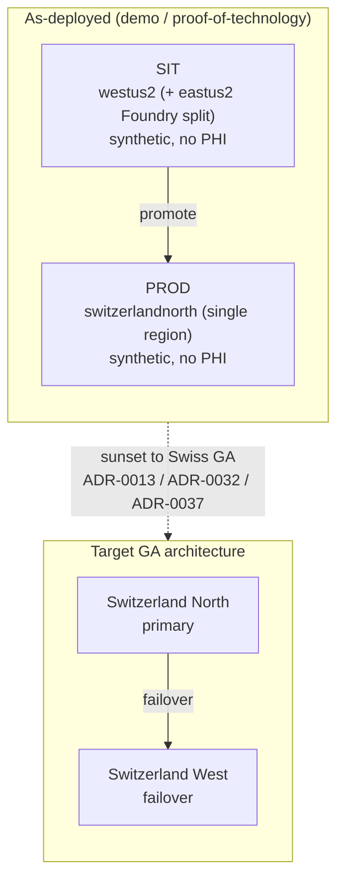

<!-- markdownlint-disable MD033 MD041 -->

  

<!-- markdownlint-enable MD033 MD041 -->

# Curavias — Product Status (as-deployed)

| Field | Value |
| ----- | ----- |
| **Version** | 1.2.1 |
| **Date** | 2026-07-28 |
| **Author** | Urs Rüegg |
| **Status** | Reviewed |
| **Previous Version** | 1.2.0 (Sprint 34 WS-3: added the product-anchor line, an executive summary, and the canonical deployment/region diagram); this bump adds the Curavias brand-kit logo to the document header |

> **Curavias** is the Swiss AI-powered patient-flow and hospital-capacity
> platform — a Microsoft Frontier-Firm reference implementation grounded on
> Fabric IQ, Foundry IQ, and Work IQ.
>
> **Purpose:** Executive, evidence-backed view of the Curavias platform **as
> actually deployed** at the end of Sprint 19, plus a requirements-coverage
> summary mapping every relevant `FR-*` / `NFR-*` family to **Covered**,
> **Open**, or **N/A-per-ADR**. The design docs
> ([ARCHITECTURE.md](ARCHITECTURE.md), [SECURITY.md](SECURITY.md),
> [DATA.md](DATA.md), [AI.md](AI.md)) describe the **target GA architecture**
> (Switzerland North primary + Switzerland West failover, PHI-in-Switzerland);
> **this document describes the deployed demo/proof-of-technology reality**
> (synthetic data only, no PHI). Where the two differ, an ADR is cited.
>
> **Showcase scope:** Curavias is an advisory-only showcase on synthetic data —
> it *previews / recommends*, never *decides / diagnoses* — and is **not a
> medical device**. Governing issue:
> [#239](https://github.com/urruegg/SwissHospitalCapacityPlatform/issues/239).

## Executive summary

This is the executive, evidence-backed view of what Curavias actually runs today
— a demo / proof-of-technology deployment on synthetic data with no PHI. The
design docs describe the target GA architecture (Switzerland North primary +
Switzerland West failover); this document records the deployed reality and cites
an ADR wherever the two differ. The diagram contrasts the two.

## 1. Deployment posture (confirmed facts)

| # | Fact | Governing ADR(s) |
|---|------|------------------|
| **F1** | **PROD is Azure Switzerland North**, single-region, resource group `rg-ihzhhpf-prod`, and is the GA target. Rebuilt greenfield in Sprint 19. | [ADR-0037](adr/0037-prod-region-switzerland-north-greenfield.md) *(Accepted)*, [ADR-0042](adr/0042-prod-switzerland-north-ga-target-standing-preview-exception.md) |
| **F2** | **No customer/patient PID/PHI.** The platform is metadata/episode-driven (the Hospitalisation Episode is the control unit; pseudonymised reference dims only). | [ADR-0016](adr/0016-no-phi-in-mvp-demo-scope.md) *(Accepted)* |
| **F3** | **SIT runs in US regions** (`westus2` + `eastus2`) and that is acceptable because SIT holds synthetic data only. | [ADR-0013](adr/0013-temporary-us-region-demo-scope.md) *(Accepted)* |
| **F4** | **SIT deliberately permits cross-region access** (westus2 ↔ eastus2 Foundry control plane, cross-geo inference). PROD is single-region Swiss with no cross-region hop — an intentional, ADR-backed asymmetry, **not a gap**. | [ADR-0013](adr/0013-temporary-us-region-demo-scope.md), [ADR-0032](adr/0032-foundry-control-plane-eastus2.md) |

## 2. As-deployed environment summary

| Dimension | SIT | PROD |
|-----------|-----|------|
| Region(s) | `westus2` (+ `eastus2` Foundry split) | **`switzerlandnorth`** (single-region) |
| Resource group | `rg-ihzhhpf-sit` | `rg-ihzhhpf-prod` |
| Data | Synthetic only, no PHI | Synthetic only, no PHI |
| Foundry | `ai-ihzhhpf-sit` + `ai-ihzhhpf-sit-eastus2` | `ai-ihzhhpf-prod` (3 models: gpt-5, gpt-5-mini, o3; 8 agents) |
| Fabric | SIT F-capacity + workspace | `fabricihzhhpfprod` (F2) + `ws-ihzhhpf-prod-data`, 50 Delta tables, 2 semantic models + report |
| App ingress | `appsit.curavias.ch` | `app.curavias.ch` → HTTP **200** + managed TLS |
| Agent-host | 7 agents | 7 agents (`/agents` → bmca, csa, data-quality, dca, ooa, orsa, sba) |
| Network | VNet + Cosmos PE | VNet + Cosmos PE + **KV PE** (PROD ≥ SIT hardening) |

**Evidence:**
[`prod-evidence-switzerlandnorth.md`](sprints/sprint-19/prod-evidence-switzerlandnorth.md)
(11/11 Definition-of-Done green) and
[`sit-prod-parity-matrix.md`](sprints/sprint-19/sit-prod-parity-matrix.md)
(all-levels, live `az` evidence).

## 3. SIT ↔ PROD parity summary

Full evidence-backed matrix:
[`sit-prod-parity-matrix.md`](sprints/sprint-19/sit-prod-parity-matrix.md).

| Verdict | Count | Notes |
|---------|-------|-------|
| ✅ Parity | 9 | Core production path aligned (agent-host, Cosmos, Event Hubs, KV, ingress, observability, compliance posture). |
| ⚠️ Deliberate asymmetry | 5 | ADR-backed (F1/F3/F4): PROD single-region Swiss; SIT US cross-region + sim-only runtime; PROD exceeds SIT on KV-PE + signal-runner UAMI. |
| 🟥 Gap → remediated | 1 | Data/AI/integration lane was disabled in PROD; closed this sprint via the D8 full-parity deploy slices (additive, 0 deletes, `Succeeded`). |
| N/A-per-ADR | 1 | Fabric IQ ontology (see §4). |

## 4. Requirements coverage (relevant `FR-*` / `NFR-*`)

Legend — **Covered**: realised and evidenced in the as-deployed platform;
**Open**: tracked, not yet realised; **N/A-per-ADR**: intentionally excluded
from GA parity by a cited ADR.

### Functional

| Family | IDs | Status | Evidence / Tracker |
|--------|-----|--------|--------------------|
| A) Operating model & scope | `FR-OM-001…005` | **Covered** | Governance + agent registry ([AGENTS.md](../AGENTS.md)) |
| B) Data & interoperability | `FR-DATA-001…008` | **Covered** (Fabric platform; FHIR interoperability design-staged) | Fabric F2 + 50 Delta tables ([evidence](sprints/sprint-19/prod-evidence-switzerlandnorth.md)) |
| C) Forecasting & capacity intelligence | `FR-FC-001…006` | **Covered** | `ooa-agent` live (72-h forecast) |
| D) Discharge coordination | `FR-DC-001…006` | **Covered** | `dca-agent` live |
| E) Bed-management copilot & UX | `FR-CX-001…006` | **Covered** | `bmca-agent` live; `app.curavias.ch` 200 + TLS |
| F) Governance, delivery & ops | `FR-GOV-001…006` | **Covered** | CI gates, ADRs, PR contract |
| G) Onboarding | `FR-ONB-001…004` | **Covered** | `onboarding-agent` |
| H) Semantic ontology | `FR-ONT-001,003–007` | **Covered** (reference + semantic model at parity) | Fabric semantic models + report published |
| H) Semantic ontology | `FR-ONT-002` (Fabric IQ operational ontology) | **N/A-per-ADR** | Availability-blocked `403 FeatureNotAvailable` (Microsoft Preview per-capacity gate) — [#270](https://github.com/urruegg/SwissHospitalCapacityPlatform/issues/270), [ADR-0042](adr/0042-prod-switzerland-north-ga-target-standing-preview-exception.md) |
| H) Semantic ontology | `FR-ONT-008` (Fabric→Foundry grounding) | **Covered** (demo scope, SIT `ooa`) | [ADR-0034](adr/0034-fabric-iq-demo-scope-artefacts.md) + [evidence](architecture/fabric-iq-ready-evidence.md) |
| I) Visualization & dashboards | `FR-VIZ-001…002` | **Covered** | Semantic models + report published in PROD |
| J) Product-marketing agent | `FR-MKT-001…003` | **Covered** | `product-marketing-agent` registered |
| J) Public Curavias web | `FR-WEB-001…005` | **Retired ([ADR-0044](adr/0044-retire-public-website.md))** | Website retired before go-live; app, SWA module, workflow, and runbooks removed. Shared `curavias.ch` zone retained for `app.curavias.ch` |
| K) Trusted external signals | `FR-EXT-001…020` | **Covered** (SIT-proven; PROD `ca-signal-runner` deployed + UAMI-hardened) | [ADR-0039](adr/0039-prod-network-parity-vnet-private-endpoints.md) |
| L) Org spine & skills evidence | `FR-ORG-001`, `FR-SKILL-001…008` | **Covered** | Sprint 23 org/skills PROD parity apply |

### Non-functional

| Family | IDs | Status | Evidence / Tracker |
|--------|-----|--------|--------------------|
| A) Compliance & privacy | `NFR-COMP-001…011` | **Covered** | No PHI (F2); synthetic-only (F3); residency exception `EX-2026-07-02-westus2-demo` in [policy/exceptions.json](../policy/exceptions.json) |
| B) Security & access control | `NFR-SEC-001…005` | **Covered** | AAD-only Cosmos, RBAC, KV public-access disabled + PE, network parity ([ADR-0039](adr/0039-prod-network-parity-vnet-private-endpoints.md)) |
| C) Data quality & integrity | `NFR-DQ-001…005` | **Covered** | `data-quality-agent` (Bronze/Silver/Gold contract checks) |
| D) Performance & throughput | `NFR-PERF-001…005` | **Covered** | Live Foundry inference `PROD-SWN-OK` (gpt-5-mini, finish=stop) |
| E) Reliability & operational continuity | `NFR-REL-001…005` | **Covered** | Single-region swn + DR-rebuild runbook; SIT untouched (no regression) |
| F) Responsible AI & auditability | `NFR-AI-001…005` | **Covered** | ADR-0016 four-gate PHI enforcement; refusal rules propagated |
| G) Maintainability & delivery | `NFR-MAINT-001…005` | **Covered** | CD repointed to `prod-swn.bicepparam` (#311); IaC coverage follow-up [#252](https://github.com/urruegg/SwissHospitalCapacityPlatform/issues/252) |
| H) Semantic ontology (NFR) | `NFR-ONT-001` | **Partial / N/A-per-ADR** | Ties to Fabric IQ operational ontology (see `FR-ONT-002` above) |
| I) Governance & audit | `NFR-GOV-001…006` | **Covered** | PR traceability contract (`NFR-GOV-006`) |
| J) External-signals governance | `NFR-EXT-*` | **Covered** | Sprint 21 provider-plugin + governance |
| K) Org/skills governance | `NFR-SKILL-001…002` | **Covered** | Sprint 23 org/skills governance |

## 5. Open items & follow-ups

| Item | Status | Tracker |
|------|--------|---------|
| Public Curavias marketing site (PROD SWA) | **Open — deferred to Sprint 20/24 UX track**; issue rescoped off the deleted `prod-eastus2.bicepparam` | [#275](https://github.com/urruegg/SwissHospitalCapacityPlatform/issues/275) |
| Fabric IQ operational ontology in PROD | **N/A for GA parity** — availability-blocked (Microsoft Preview per-capacity gate); attempted under ADR-0042 | [#270](https://github.com/urruegg/SwissHospitalCapacityPlatform/issues/270) |
| CSA Cosmos + ACR into `infra/main.bicep` (drift coverage) | **Open** | [#252](https://github.com/urruegg/SwissHospitalCapacityPlatform/issues/252) |
| Backport `eventHubsSimulatorMiPrincipalId` fix to SIT | **Open** (latent shared gap) | — |
| Trademark (CH/EU) + Swiss-cross legal clearance for public web | **Open — accepted residual risk** | [#268](https://github.com/urruegg/SwissHospitalCapacityPlatform/issues/268) |

## 6. References

- [ADR-0037 — PROD region Switzerland North greenfield](adr/0037-prod-region-switzerland-north-greenfield.md)
- [ADR-0042 — PROD Switzerland North GA-target + standing Preview exception](adr/0042-prod-switzerland-north-ga-target-standing-preview-exception.md)
- [ADR-0039 — PROD network parity (VNet + private endpoints)](adr/0039-prod-network-parity-vnet-private-endpoints.md)
- [ADR-0013 — Temporary US-region demo scope](adr/0013-temporary-us-region-demo-scope.md)
- [ADR-0016 — No PHI in MVP/demo scope](adr/0016-no-phi-in-mvp-demo-scope.md)
- [PROD Switzerland North rebuild evidence](sprints/sprint-19/prod-evidence-switzerlandnorth.md)
- [SIT ↔ PROD parity matrix](sprints/sprint-19/sit-prod-parity-matrix.md)
- [PRD — requirement catalogue & traceability](PRD.md)
