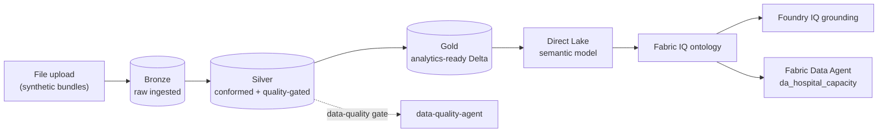
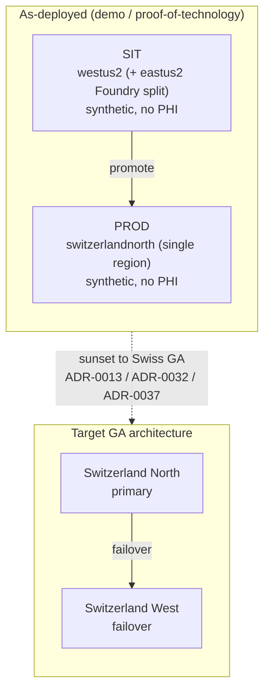
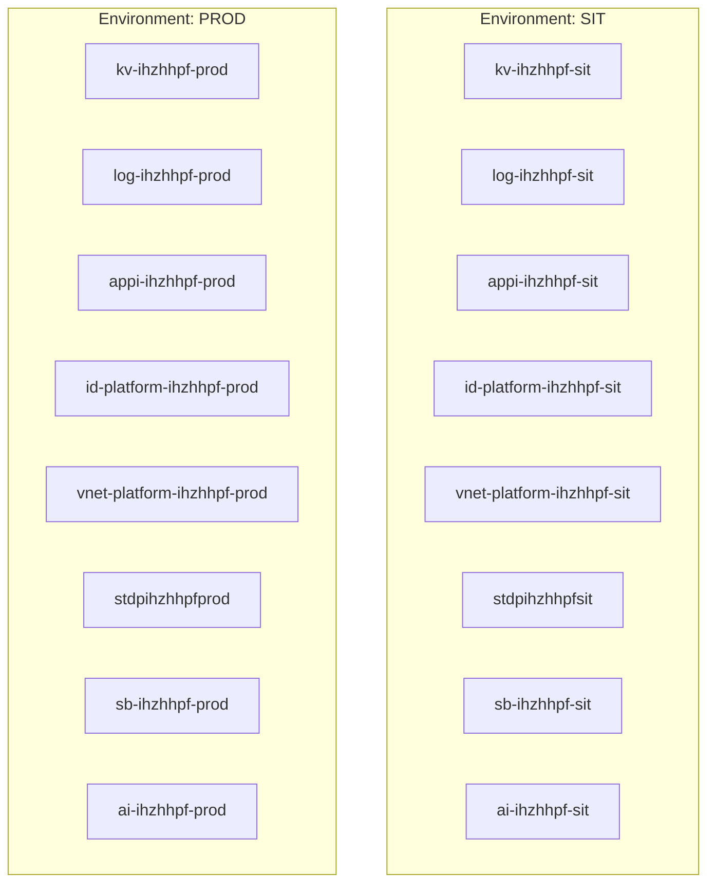

# Curavias — Infrastructure

| Field | Value |
| ----- | ----- |
| **Version** | 1.7.0 |
| **Date** | 2026-07-28 |
| **Author** | Urs Rueegg |
| **Status** | Reviewed |
| **Previous Version** | 1.6.0 (editorial: repaired UTF-8 mojibake; no semantic change); this bump rebrands the doc to the Curavias customer-ready template - anchored title, product anchor, executive summary, and embedded canonical medallion + deployment diagrams (Sprint 34 WS-2) |

> **Curavias** is the Swiss AI-powered patient-flow and hospital-capacity
> platform — a Microsoft Frontier-Firm reference implementation grounded on
> Fabric IQ, Foundry IQ, and Work IQ.

## Executive summary

This document defines the infrastructure baseline for Curavias: the Bicep
modules, environment parameters, and CI/CD workflows that provision and promote
the platform across SIT and PROD. It records the as-deployed demo reality
(synthetic data, no PHI) against the target GA architecture.

## Purpose

Define the infrastructure baseline for Curavias, the Swiss AI-powered
patient-flow and hospital-capacity platform, covering SIT and PROD provisioning
and promotion workflows.

## Canonical diagrams

These diagrams are maintained in
[architecture/diagram-library.md](architecture/diagram-library.md) and copied
here; update both places together when either changes.

### Medallion data flow



### Deployment and region



## Current Scope

- Root deployment entrypoint: infra/main.bicep
- Foundation module: infra/modules/platform-foundation/main.bicep
- Environment parameters:
  - infra/environments/sit.bicepparam
  - infra/environments/prod-swn.bicepparam (deployed PROD — Switzerland North greenfield, [ADR-0037](adr/0037-prod-region-switzerland-north-greenfield.md))
  - infra/environments/prod.bicepparam (westus2 demo baseline, referenced by `policy/policy-pack.json`)
- CI validation workflow: .github/workflows/ci-infra-validate.yml
- SIT deployment workflow: .github/workflows/cd-infra-deploy-sit.yml
- PROD deployment workflow: .github/workflows/cd-infra-deploy-prod.yml

> **As-deployed note (Sprint 19):** PROD is deployed greenfield in
> **`switzerlandnorth`** (resource group `rg-ihzhhpf-prod`); the automated
> `cd-infra-deploy-prod` pipeline targets `prod-swn.bicepparam` /
> `switzerlandnorth`. SIT stays in `westus2` (+ `eastus2` Foundry split).
> The retired `prod-eastus2.bicepparam` was deleted (#311). Consolidated
> as-deployed view + parity evidence:
> [CURAVIAS-PRODUCT-STATUS.md](CURAVIAS-PRODUCT-STATUS.md).

## Implemented Module Domains

Implemented module domains:

- identity
- network
- observability
- data-platform
- ai-platform
- integration

## Data platform

> **SQL-optional posture (2026-07-02, ADR-0015):** For the MVP demo scope, SQL Server is skipped entirely. Ingestion runs via direct-to-lakehouse (reference/master data) + Event Hubs → Fabric Eventstream (simulator events) → Fabric Spark bronze/silver/gold notebook chain. The `source-sql` Bicep module stays in the tree behind `enableSourceSqlModule=false`; enable when a customer PROD deployment requires KIS integration. See [ADR-0015](adr/0015-skip-sql-for-mvp-demo.md).

## Implemented Topology Snapshot



## Provider Registration Runbook

Use this runbook when workflow identities can deploy resources but cannot perform subscription-level provider registration operations.

Required providers for current module set:

- Microsoft.OperationalInsights
- Microsoft.KeyVault
- Microsoft.ManagedIdentity
- Microsoft.Network
- Microsoft.Insights
- Microsoft.Storage
- Microsoft.CognitiveServices
- Microsoft.ServiceBus

Owner-level bootstrap command:

```powershell
./infra/scripts/register-resource-providers.ps1 -SubscriptionId <subscription-id>
```

Verification command:

```powershell
az provider show --namespace Microsoft.ManagedIdentity --query registrationState -o tsv
```

Expected value: `Registered`.

## PROD Enablement Strategy

Current strategy has progressed from phased rollout to controlled parity enablement:

- Optional module flags are now enabled in `infra/environments/prod.bicepparam`.
- Deployments remain approval-gated and evidence-first via `workflow_dispatch` with explicit confirmation.
- Provider registration remains a prerequisite control and is captured in runbook automation.

## Sprint 05 Landing-Zone Governance Evidence

The CAF/WAF review (§4.1, §7) found landing-zone governance evidence — management-group
hierarchy, policy assignments, and RBAC scopes — weaker than architecture intent. A
dedicated landing-zone governance evidence document is a Phase 2 deliverable, tracked as
`RV-06` (owner `ARCH`) in
[`docs/sprints/sprint-05/requires-validation-register.md`\](sprints/sprint-05/requires-validation-register.md).
Policy assignment and residency/deployment-type enforcement are governed by `ADR-0010`
(policy-as-code) and implemented as CI checks in Sprint 05 Phase 2.

