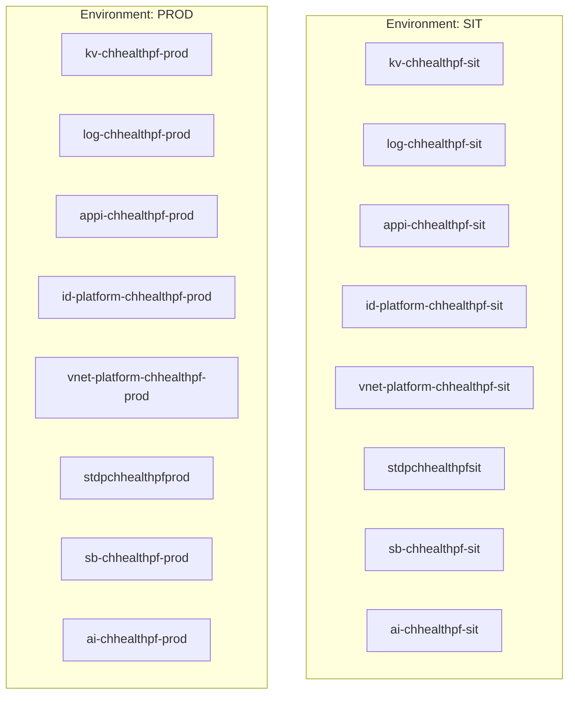

# Infrastructure Baseline

| Field | Value |
| ----- | ----- |
| **Version** | 1.3.0 |
| **Date** | 2026-06-09 |
| **Author** | Urs Rueegg |
| **Status** | Reviewed |
| **Previous Version** | 1.2.0 (Sprint 05 landing-zone governance evidence pointer) |

## Purpose

Define the infrastructure baseline for Sprint 3 SIT and PROD provisioning and promotion workflows.

## Current Scope

- Root deployment entrypoint: infra/main.bicep
- Foundation module: infra/modules/platform-foundation/main.bicep
- Environment parameters:
  - infra/environments/sit.bicepparam
  - infra/environments/prod.bicepparam
- CI validation workflow: .github/workflows/ci-infra-validate.yml
- SIT deployment workflow: .github/workflows/cd-infra-deploy-sit.yml
- PROD deployment workflow: .github/workflows/cd-infra-deploy-prod.yml

## Implemented Module Domains

Implemented module domains:

- identity
- network
- observability
- data-platform
- ai-platform
- integration

## Implemented Topology Snapshot



## Provider Registration Runbook

Use this runbook when workflow identities can deploy resources but cannot perform subscription-level provider registration operations.

Required providers for current module set:

- Microsoft.OperationalInsights
- Microsoft.KeyVault
- Microsoft.ManagedIdentity
- Microsoft.Network
- Microsoft.Insights
- Microsoft.Storage
- Microsoft.CognitiveServices
- Microsoft.ServiceBus

Owner-level bootstrap command:

```powershell
./infra/scripts/register-resource-providers.ps1 -SubscriptionId <subscription-id>
```

Verification command:

```powershell
az provider show --namespace Microsoft.ManagedIdentity --query registrationState -o tsv
```

Expected value: `Registered`.

## PROD Enablement Strategy

Current strategy has progressed from phased rollout to controlled parity enablement:

- Optional module flags are now enabled in `infra/environments/prod.bicepparam`.
- Deployments remain approval-gated and evidence-first via `workflow_dispatch` with explicit confirmation.
- Provider registration remains a prerequisite control and is captured in runbook automation.

## Sprint 05 Landing-Zone Governance Evidence

The CAF/WAF review (§4.1, §7) found landing-zone governance evidence — management-group
hierarchy, policy assignments, and RBAC scopes — weaker than architecture intent. A
dedicated landing-zone governance evidence document is a Phase 2 deliverable, tracked as
`RV-06` (owner `ARCH`) in
[`sprints/sprint-05/requires-validation-register.md`](../sprints/sprint-05/requires-validation-register.md).
Policy assignment and residency/deployment-type enforcement are governed by `ADR-0010`
(policy-as-code) and implemented as CI checks in Sprint 05 Phase 2.
