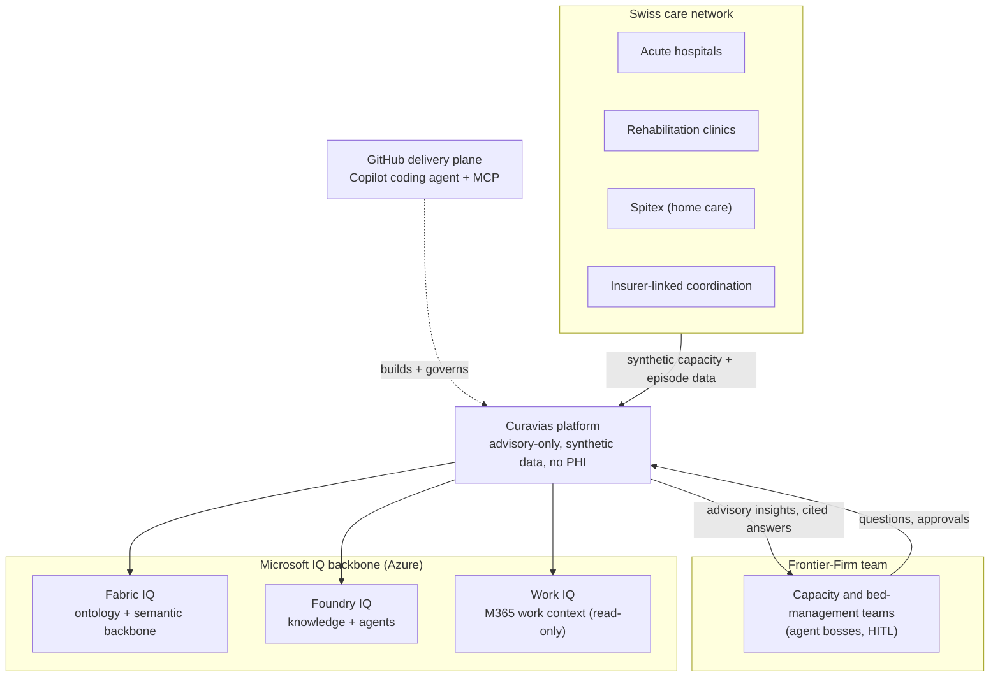

<!-- markdownlint-disable MD033 MD041 -->

  

<!-- markdownlint-enable MD033 MD041 -->

# Curavias — Product Requirements Document

| Field | Value |
| ----- | ----- |
| **Version** | 2.7.1 |
| **Date** | 2026-07-28 |
| **Author** | Urs Rueegg |
| **Status** | Reviewed |
| **Previous Version** | 2.7.0 (Sprint 34 WS-3: Curavias anchor + product-anchor line + executive summary + system-context diagram + NFR family S Documentation Quality); this bump adds the Curavias brand-kit logo to the document header |

> **Curavias** is the Swiss AI-powered patient-flow and hospital-capacity
> platform — a Microsoft Frontier-Firm reference implementation grounded on
> Fabric IQ, Foundry IQ, and Work IQ.

## Executive summary

Curavias is a provider-internal operational intelligence platform for Swiss
hospital capacity and patient-flow management. This document is the authoritative
catalogue of its functional and non-functional requirements — each with a stable
ID and a traceability link to the design, ADR, or evidence that realises it. It
is the baseline every architecture, security, data, AI, and delivery decision
maps back to. Curavias is an advisory-only showcase on synthetic data (no PHI);
it previews and recommends, and is not a medical device.

The diagram below places Curavias in its ecosystem; terminology follows
[GLOSSARY.md](GLOSSARY.md) and the canonical source is
[the diagram library](architecture/diagram-library.md).

## Purpose

This product requirements document defines the complete functional and non-functional
requirements for Curavias, the Swiss AI-powered patient-flow and hospital-capacity
platform, derived from the source specifications in `docs/specs`.

The target product is a provider-internal operational intelligence platform for one
Swiss cantonal hospital provider deployment at a time.

## Source Scope

### Canonical Inputs

- `docs/specs/Swiss AI-Powered Patient Flow and Hospital Capacity Platform.md`
- `docs/specs/Swiss AI-Powered Patient Flow and Hospital Capacity Platform analysis.md`

### In Scope

- Provider-internal deployment model for one provider instance.
- AI-powered operations support for forecasting, discharge coordination, and bed management.
- Integration with external ecosystem partners as controlled endpoints.
- Data, AI, application, integration, governance, and delivery lanes.

### Out Of Scope

- Multi-provider shared tenancy or cross-provider shared governance runtime.
- External partner direct platform operations access.
- Dynamics 365 case-management workflows.
- Full clinician workstation replacement.

## Functional Requirements

### A) Operating Model And Product Scope

| ID | Requirement |
| -- | ----------- |
| `FR-OM-001` | The solution shall be deployed for one hospital provider instance at a time. |
| `FR-OM-002` | The solution shall support provider-internal governance and data ownership boundaries. |
| `FR-OM-003` | The solution shall support an implementation sequence for USZ-first or LUKS-first rollout patterns. |
| `FR-OM-004` | External care entities shall be integrated as endpoints and not as first-class platform operators. |
| `FR-OM-005` | The product shall support a phased implementation model where capabilities can be enabled incrementally. |

### B) Data And Interoperability

| ID | Requirement |
| -- | ----------- |
| `FR-DATA-001` | The platform shall ingest provider-internal operational signals, including ED, ADT, bed-state, and discharge-related events. |
| `FR-DATA-002` | The platform shall support HL7 FHIR-oriented normalization where healthcare interoperability requires it. |
| `FR-DATA-003` | The platform shall maintain curated datasets that unify operational, planning, and model input data. |
| `FR-DATA-004` | The platform shall capture partner acknowledgements and status updates from integration flows. |
| `FR-DATA-005` | The platform shall expose governed semantic models for dashboard and copilot consumption. |
| `FR-DATA-006` | The platform shall support data ingestion from KIS/EHR, ED systems, bed management systems, and staffing/planning systems. |
| `FR-DATA-007` | The platform shall support outbound and inbound orchestration with downstream partners via integration workflows. |
| `FR-DATA-008` | The platform shall keep source-to-consumption traceability for operational and AI-serving datasets. |

### C) Forecasting And Capacity Intelligence

| ID | Requirement |
| -- | ----------- |
| `FR-FC-001` | The solution shall produce a 72-hour demand forecast for emergency demand and admission pressure. |
| `FR-FC-002` | Forecast outputs shall be segmented by specialty and time window. |
| `FR-FC-003` | Forecasting shall use provider-internal arrivals plus downstream capacity signals as model inputs. |
| `FR-FC-004` | Forecast outputs shall be published to operations-facing dashboards. |
| `FR-FC-005` | Forecast outputs shall be available as grounding context for the bed management copilot. |
| `FR-FC-006` | Forecast generation runs shall persist execution timestamps and model run identifiers for auditability. |
| `FR-FC-007` | The Fabric Data Agent shall emit the `DC-INSIGHT-v1` `signal`, `understanding`, and `provenance` beats as the governed grounding contract that prescriptive copilots consume (drivers, source-trust, and confidence for a forecast breach). |

### D) Discharge Coordination Intelligence

| ID | Requirement |
| -- | ----------- |
| `FR-DC-001` | The solution shall identify inpatients approaching discharge readiness. |
| `FR-DC-002` | The solution shall produce ranked discharge candidates with explanatory factors. |
| `FR-DC-003` | The solution shall trigger integration-based downstream actions for discharge coordination. |
| `FR-DC-004` | The solution shall record outbound coordination events and returned partner statuses. |
| `FR-DC-005` | The solution shall surface discharge blockers to operations users. |
| `FR-DC-006` | The solution shall make discharge-readiness outputs available to dashboards and copilot interactions. |

### E) Bed Management Copilot And User Experience

| ID | Requirement |
| -- | ----------- |
| `FR-CX-001` | The solution shall provide a copilot interface for operations teams to query bed and flow status. |
| `FR-CX-002` | The copilot shall provide grounded answers based on live operational data, forecast outputs, and discharge signals. |
| `FR-CX-003` | The copilot shall provide bottleneck explanations and recommended operational options. |
| `FR-CX-004` | The copilot shall present current bed state, predicted pressure windows, and likely same-day discharges. |
| `FR-CX-005` | Power BI-based operational visibility shall be available for non-conversational usage scenarios. |
| `FR-CX-006` | Copilot responses shall preserve references to source context and response timestamp metadata. |

### F) Governance, Delivery, And Operations

| ID | Requirement |
| -- | ----------- |
| `FR-GOV-001` | The solution shall provide auditable traceability between source data, model outputs, user-facing answers, and integration events. |
| `FR-GOV-002` | The solution shall support access-control enforcement for clinical and operational data surfaces. |
| `FR-GOV-003` | The delivery model shall support structured promotion across DEV, SIT, and PROD stages. |
| `FR-GOV-004` | The solution shall produce governance evidence artifacts for compliance reviews. |
| `FR-GOV-005` | The solution shall support policy-driven integration controls for outbound partner interactions. |
| `FR-GOV-006` | The solution shall maintain provider-local control over prompts, model configuration, and operational workflows. |

### G) Onboarding (Minimum-Data And Specialty-Driven Capacity)

Sprint 6 deltas. Onboarding is split into two lanes: a patient lane using only a
minimum required metadata set, and a hospital-capacity lane driven by
treatment-specialty metadata. See
[`docs/sprints/sprint-06-minimal-data-onboarding-and-capacity-specialty.md`\](sprints/sprint-06-minimal-data-onboarding-and-capacity-specialty.md).

| ID | Requirement |
| -- | ----------- |
| `FR-ONB-001` | The platform shall onboard new patients using a minimum required metadata set only. |
| `FR-ONB-002` | The platform shall onboard hospital capacity using specialty-tagged metadata. |
| `FR-ONB-003` | The platform shall support provider-specific specialty profiles for capacity planning. |
| `FR-ONB-004` | The platform shall classify onboarding workflows as deterministic service vs agentic flow using a documented criterion. |

### H) Semantic Ontology

Sprint 09 deltas per [ADR-0014](adr/0014-fabric-iq-ontology-target-backbone-ga-gated.md) (supersedes ADR-0002) and [AMA HCC/North Star review §5.1](reviews/2026-07-01-ama-hcc-northstar-review.md#51-ontology-requirements-new-family-fr-ont--nfr-ont). Adds a semantic backbone family that grounds copilot, dashboards and simulation on shared meaning. All items are gated per ADR-0014 §5 (G-A / G-B / G-C).

| ID | Requirement |
| -- | ----------- |
| `FR-ONT-001` | The platform shall maintain a **reference ontology** authored in OWL/RDF, importing established published ontologies (BFO ISO/IEC 21838-2:2021, OMRSE, OGMS, OOSTT, Goyer et al. healthcare-system classes) and adding the platform-specific `CapacityUnit` abstraction with subtypes for bed, OR slot, room, staff shift and device. |
| `FR-ONT-002` | The platform shall realise the **operational ontology** in Fabric IQ, auto-generated from the governed semantic model with static (lakehouse) and time-series (eventhouse) bindings. Use in `switzerlandnorth` PROD paths carrying PHI is gated on Fabric IQ Switzerland-region GA + DPA equivalence per ADR-0014 gate G-C; use in the `westus2` demo scope is permitted per ADR-0013. |
| `FR-ONT-003` | The platform shall model all in-scope hospital resource dimensions (beds, OR slots, rooms, staff shifts, devices) as **capacity-unit subtypes** with shared states (available / occupied / blocked / planned) and shared relations, so one set of KPIs, forecasts and simulation logic applies across all dimensions. |
| `FR-ONT-004` | The copilot and Fabric Data Agents shall **ground responses on ontology entities and relationships** to deliver concept-level traceability, extending `NFR-AI-002/003/004`. |
| `FR-ONT-005` | The platform shall provide a **process-ontology overlay** on the reference layer to support what-if simulation (`FR-SIM-*` when introduced). |
| `FR-ONT-006` | The ontology shall carry a **crosswalk to FHIR resource types and SNOMED CT concepts** for clinical interoperability (extends `FR-DATA-002`). |
| `FR-ONT-007` | The ontology shall support **provider-specific extensions** (specialisations) without re-architecture, realising `NFR-MAINT-004` at the semantic layer. |
| `FR-ONT-008` | Foundry-hosted copilots shall consume the read-only **Fabric Data Agent as their primary grounding source** ahead of table grounding (the Fabric-to-Foundry consumption seam), propagate its RLS and [ADR-0016](adr/0016-no-phi-in-mvp-demo-scope.md) PHI-gate `REFUSE:` codes **verbatim** (no route-around), and surface at least one `hcp:*` ontology citation per grounded answer. Realised per [ADR-0033](adr/0033-fabric-data-agent-as-foundry-grounding-tool.md); extends `FR-ONT-004`, `NFR-AI-002/004`. **Realised live (demo scope)** for the Foundry `ooa` surface — live E2E in [ADR-0034](adr/0034-fabric-iq-demo-scope-artefacts.md) + [evidence doc](architecture/fabric-iq-ready-evidence.md) (issue #251); the gpt-5 layer surfaces the refusal in natural language rather than the verbatim `REFUSE:` token (safety outcome preserved). App/agent-host surface pending. |
| `FR-GOV-ONT-001` | The data-governance RACI shall include a nominated **semantic / ontology owner**. Documented in [OPERATIONS.md](OPERATIONS.md) as of v1.4.0. |
| `FR-GOV-ONT-002` | Ontology changes shall follow an **OBO-inspired semantic change workflow** (proposal → domain-owner review → versioned release → downstream impact check), mirroring the data-contract breaking-change control in `NFR-MAINT-002`. |
| `FR-GOV-ONT-003` | The delivery pipeline shall include a **CI conformance check** verifying that every operational-layer entity maps to a reference-layer class (or is explicitly annotated as reference-layer-exempt). Failure fails the build. |

### I) Visualization And Dashboards (Sprint 09 T5)

Sprint 09 T5 deltas formalised per [ADR-0018](adr/0018-add-fr-viz-and-nfr-gov-ids.md). Referenced from [Sprint 09 v2 design spec §7.7](superpowers/specs/2026-07-02-sprint-09-v2-refinement-design.md#77-traceability).

| ID | Requirement |
| -- | ----------- |
| `FR-VIZ-001` | The platform shall provide an operational **bed-capacity dashboard page** exposing current occupancy, forecast pressure windows, and data-quality signals, aligned with `FR-CX-005`. |
| `FR-VIZ-002` | The platform shall provide an operational **OR-steering dashboard page** exposing case-level utilisation, first-case on-time performance, cancellation, and idle-slot metrics, aligned with `FR-CX-005`. |

### J) Product Marketing And Public Web (Sprint 24)

Sprint 24 deltas formalised per [Sprint 24 plan](superpowers/plans/2026-07-21-sprint-24-curavias-product-marketing-and-webpage.md) (epic #261). The product-marketing agent is **showcase-scoped** (advisory-only, synthetic data, not a medical device) and carries a mandatory disclaimer.

> **Retired (Sprint 28, [ADR-0044](adr/0044-retire-public-website.md)):** the public Curavias website (`apps/curavias-web`, `curavias.ch` / `www.curavias.ch`) was retired before go-live. `FR-WEB-001..005` below are **withdrawn** — kept for traceability, not reused. The `product-marketing-agent` (`FR-MKT-*`) is retained; only its website-copy deliverable is dropped. The shared `curavias.ch` DNS zone stays (it serves the `hcc-app-fluent` app, `app.curavias.ch`, per ADR-0030).

| ID | Requirement |
| -- | ----------- |
| `FR-MKT-001` | The solution shall provide a **product-marketing copilot agent** grounded in the Curavias brandkit, vision, and mission to keep product communication stringent and aligned across customer-facing, user-facing, and devops-team-facing channels. |
| `FR-MKT-002` | The product-marketing agent shall preserve the **advisory-only voice** (the platform *previews/recommends*, never *decides/diagnoses*) and enforce the showcase disclaimer across all generated messaging. |
| `FR-MKT-003` | The product-marketing agent shall operate in an explicit RACI with the `ux-design-agent` for all customer-facing experience surfaces. |
| `FR-WEB-001` | **[Retired — ADR-0044]** The solution shall publish a **public multilingual product landing page** (DE primary; EN/FR/IT) built on the Curavias brandkit (white background) from the approved `curavias-site` content. |
| `FR-WEB-002` | **[Retired — ADR-0044]** The public site shall display the **showcase disclaimer** ("Kein reales Produkt…", synthetic data, advisory-only, not a medical device) on every page. |
| `FR-WEB-003` | **[Retired — ADR-0044]** The public site shall be hosted **PROD-only** on Azure Static Web Apps and served on `curavias.ch` and `www.curavias.ch` with managed TLS. |
| `FR-WEB-004` | **[Retired — ADR-0044]** The public site shall meet **WCAG 2.1 AA** accessibility and expose SEO metadata including per-locale `hreflang` alternates and a sitemap. |
| `FR-WEB-005` | **[Retired — ADR-0044]** Public go-live shall proceed with the disclaimer and advisory framing while **trademark (CH/EU) and Swiss-cross legal clearance** remains a tracked open item (accepted residual risk, issue #268). |

### K) Trusted External Signals (Sprint 21)

Sprint 21 deltas formalised per the
[Sprint 21 trusted external signals design](superpowers/specs/2026-07-17-sprint-21-trusted-external-signals-fabric-design.md)
and [ADR-0036](adr/0036-external-trigger-governance.md). The scope is
public-authority plus synthetic data only, no PHI, and advisory-only CSA trigger
preparation.

| ID | Requirement |
| -- | ----------- |
| `FR-EXT-001` | Ingest Trust-A Swiss authority hazard feeds into the data lake. |
| `FR-EXT-002` | Normalize every source to `DC-EXT-SIGNAL-v1`. |
| `FR-EXT-003` | Activate advisory CSA runs from qualifying signals (dual-path trigger). |
| `FR-EXT-004` | Persist provenance + trigger audit (`ext_fact_trigger_event`). |
| `FR-EXT-005` | Noise governance: quarantine Test/Exercise/System; threshold gating. |
| `FR-EXT-006` | Align to CAP-Suisse standard; bridge with pollable feeds until federal GA. |
| `FR-EXT-010` | Build `gold.ext_fact_forecast_adjustment` from base `gold.forecast_output` x governed hazard-uplift, joined on specialty + canton + onset..expires window. |
| `FR-EXT-011` | Govern the hazard-uplift map (`forecast_uplift.yaml`) as versioned, offline-unit-tested data; uplift is incremental over baseline and clamped. |
| `FR-EXT-012` | Expose `gold.vw_forecast_adjusted` carrying both base and adjusted values plus a per-row signal `attribution[]` list for explainability. |
| `FR-EXT-013` | Prove the external-signals IQ loop end-to-end in SIT: live Fabric IQ ontology extension + SIT data-agent grounding + Foundry `ooa-agent` consumption, captured as evidence. |
| `FR-EXT-014` | Record full provenance (`rawHash`, `connectorVersion`, `ingestedAt`, licence) on every forecast adjustment row; `Test`/`Exercise`/`System` signals excluded from the overlay. |
| `FR-EXT-ONT-001` | Add ExternalSignal/TrustedSource/HazardType/HazardEvent/TriggerRule classes. |
| `FR-EXT-ONT-002` | Maintain reference<->operational<->contract crosswalk for the new classes. |
| `FR-EXT-GOV-001` | Enforce trust-tier + HITL + advisory-only trigger policy. |
| `FR-EXT-015` | Onboard new signal sources as manifest-driven provider plugins emitting `DC-EXT-SIGNAL-v1`. |
| `FR-EXT-016` | Provide real API adapters (LiveBinding) for confirmed-ready channels (SED, Alertswiss). |
| `FR-EXT-017` | Provide simulator plugins (SimulatorBinding) for channels without a confirmed API. |
| `FR-EXT-018` | Support internal signal channels (InternalBinding) derived from platform gold tables. |
| `FR-EXT-019` | Surface a data-driven live/simulated/internal trust badge per channel on the CSA/OCA boards. |
| `FR-EXT-020` | Host ingestion + simulation as Azure Container Apps services publishing to Event Hub/Eventstream (not GitHub Actions). |
| `NFR-EXT-PLG-001` | Live bindings are always mocked in CI; no external network calls in Actions. |
| `NFR-EXT-PLG-002` | A schema-invalid manifest fails CI and is excluded from the runtime catalogue (fail-closed). |

### L) Curavias Organisation Spine And Skills Evidence (Sprint 23)

Sprint 23 deltas (P1b) formalised per the
[Sprint 23 org-skills refactor design](superpowers/specs/2026-07-23-sprint-23-org-skills-refactor-design.md),
[Sprint 23 implementation plan](superpowers/plans/2026-07-23-sprint-23-org-skills-refactor-plan.md),
and [ADR-0050](adr/0050-curavias-landing-zone-and-skills-evidence-plugins.md).
Scope is synthetic, no-PHI master data loaded on demand; the skills-evidence
plugin reuses the Sprint 21 provider-plugin pattern. Extends the Step 1-4
org/skills ontology, does not replace it.

| ID | Requirement |
| -- | ----------- |
| `FR-ORG-001` | Fold `dim_hospital` into a **Curavias organisation spine** (`dim_tenant` / `dim_org_unit` / `dim_department`) and re-key the dependent facts (`fact_capacity_baseline`, `encounter`, `bed_assignment`, `or_case`, `or_schedule`) onto it. |
| `FR-SKILL-001` | Gather skills evidence from external systems via a **plugin architecture** - real-API adapters where an API exists, simulators where none does - each record flagged **live-vs-simulated** (`sourceMode`) with a trust tier (`trustTier` A/B/C). |
| `FR-SKILL-002` | Mimic **SuccessFactors** (HRIS), an **LMS** (learning/cert store), and **Skills-Manager with Work-ID** (worker-owned skills passport) as simulated sources, normalised to the `DC-SKILL-EVIDENCE-v1` contract. |
| `FR-SKILL-003` | Derive assurance from the evidence assertion (`self` -> L0, `employer_confirmed` -> L1); promote the `worker_gln` golden-thread key and set `consentScope` **only** when Work-ID consent was granted; Work-ID assertions are always `self`-declared. |
| `FR-SKILL-004` | Load the full synthetic Curavias master data (employees, assertions, org spine) **on demand** from a dedicated **ADLS Gen2 landing zone via a OneLake shortcut** and a Bronze->Silver->Gold pipeline, not from Microsoft Entra and not from git-committed extracts. |
| `FR-SKILL-005` | Use a **hybrid transport**: batch extract drops to the ADLS landing zone for HRIS/LMS master data; an Eventstream lane carries only near-real-time skills events (credential expiry, consent grant/revoke, newly-confirmed assertions). |
| `FR-SKILL-006` | Validate landed data at the **pipeline silver gate** (PK/FK, GLN mod-10, enum domains, load order), quarantining bad rows in Silver rather than at PR time. |
| `FR-SKILL-007` | Preserve the live-vs-simulated badge and trust tier **end-to-end** through Bronze/Silver so they surface on `gold.fact_skill_assertion`; they are never invented downstream. |
| `FR-SKILL-008` | Express the **bed-vs-ops skill-demand split** on the semantic and ontology surface: bed side = Pflegepersonal / nursing, ops side = doctors and specialised teams. |
| `FR-SKILL-ONT-001` | Extend the existing staff/person ontology view with the org spine, skill classes, and bed-vs-ops demand axis; keep `fact_skill_assertion` as the atomic unit and the proficiency (1-5) / assurance (L0-L4) axes and GLN golden thread unchanged (extend, don't replace). |

### M) Prescriptive Decision & Coordination Intelligence (Sprint 26)

Sprint 26 deltas (Slice 1, OOA -> DCA) formalised per the
[Sprint 26 decision-ontology design spec](superpowers/specs/2026-07-23-sprint-26-decision-ontology-actionable-insight-design.md),
the
[Sprint 26 Slice 1 implementation plan](superpowers/plans/2026-07-24-sprint-26-slice1-ooa-dca-plan.md),
and [ADR-0040](adr/0040-prescriptive-decision-ontology-and-runtime-store.md).
Extends the descriptive `DC-INSIGHT-v1` grounding contract (`FR-FC-007`) with
RECOMMENDATION, ACTION, and COORDINATION beats assembled at runtime by the
agent-host. Advisory-only and human-in-the-loop throughout; the deterministic
impact function replaces LLM-estimated expected impact; the runtime decision
store (Cosmos `proposed_actions` + `plans`) is agent-host-mediated so OOA/DCA
keep their `write` side-effect ceiling.

| ID | Requirement |
| -- | ----------- |
| `FR-DEC-001` | Prescriptive copilots shall assemble a RECOMMENDATION beat that ranks response levers from a governed lever catalog, where each lever's `expected_impact` is computed by a deterministic, forecast-grounded impact function (never an LLM estimate). |
| `FR-DEC-002` | Prescriptive copilots shall assemble an ACTION beat that is advisory and human-in-the-loop: an action may be PROPOSED autonomously but is only APPLIED after a human posts the `approved-to-apply` confirmation; the agent shall refuse to self-approve or accept a bot approver. |
| `FR-DEC-003` | Prescriptive copilots shall assemble a COORDINATION beat that carries a cross-role Plan / golden thread (including the OOA -> DCA handoff) and, on human approval, drives a deterministic live impact recompute for the affected ward (e.g. Medicine A forecast occupancy 102% -> 94%). |

### P) Curavias Product Owner Agent (Sprint 28)

Sprint 28 deltas per the
[Sprint 28 design spec Section 11](superpowers/specs/2026-07-25-sprint-28-product-owner-agent-design.md)
and [ADR-0043](adr/0043-product-owner-agent-foundry-iq-domain.md). The Product
Owner Agent is the advisory-only, source-grounded voice of the platform, embedded
as a Copilot rail and grounded on the four knowledge classes over the frozen
[`GroundedChunk` contract](superpowers/specs/2026-07-25-sprint-28-po-agent-contracts.md).

| ID | Requirement |
| -- | ----------- |
| `FR-POA-001` | The PO Agent shall answer product questions grounded only on the four knowledge classes (A corpus, B live-proof, C cost, D ontology), with mandatory citations. |
| `FR-POA-002` | The PO Agent shall be embedded as a Copilot rail on the Curavias App START and BACKSTAGE surfaces using the MAIN-board pattern. |
| `FR-POA-003` | The knowledge layer shall be a shared Foundry IQ Knowledge Layer registering the PO Agent as domain #1 and supporting additional domains. |
| `FR-POA-004` | The corpus shall refresh daily GitHub -> ADLS -> OneLake -> knowledge source, PHI-excluded, interviews first-order. |
| `FR-POA-005` | Class B live-proof shall answer the five reference questions read-only with reconcile-and-flag. |
| `FR-POA-006` | Class C shall reconcile effective PROD Azure cost + GitHub Copilot token cost to the BVA/TCO baseline. |
| `FR-POA-007` | Class D shall answer data questions via the ontology with concept + gold-binding citations. |
| `FR-POA-008` | The PO Agent shall answer in DE and EN with source-language transparency. |
| `FR-POA-009` | The PO Agent shall expose an entitlement-scoped partner tier that never sees internal cost/security detail. |

### Q) Application Context Architecture (Sprint 29)

Sprint 29 deltas per the
[Sprint 29 design spec](superpowers/specs/2026-07-26-sprint-29-foundry-iq-context-architecture-design.md),
its [implementation plan](superpowers/plans/2026-07-26-sprint-29-foundry-iq-context-architecture.md),
and [ADR-0052](adr/0052-app-context-envelope-per-agent-threads.md). The three
context tiers (user / agent / grounding) are made consistent by construction and
config-gated so the westus2 demo (simulated) lifts to live SIT without code edits.

| ID | Requirement |
| -- | ----------- |
| `FR-CTX-001` | The app shall derive a single `ContextEnvelope` from the signed-in user's claims and active role lens and attach it to every IQ read and agent turn. |
| `FR-CTX-002` | The app shall keep a separate conversation thread per `(userOid x agent)` so switching board-agents never leaks turns across agents, with a clean reset on sign-out. |
| `FR-CTX-003` | The app shall open the first patient-journey board the active role can see (role-first-eligible default) instead of a hard-coded default board. |
| `FR-CTX-004` | The app shall enforce per-user data scope (RLS by `hospitalScope`) and the OBO contract, simulated app-side this sprint and liftable to live Fabric RLS / OBO via configuration without code change. |

### R) App Experience Polish And Design System (Sprint 27)

Sprint 27 deltas formalised per the
[Sprint 27 UX polish design](superpowers/specs/2026-07-24-sprint-27-curavias-ux-polish-design.md)
and [implementation plan](superpowers/plans/2026-07-24-sprint-27-curavias-ux-polish-plan.md).
Experience-lane only: the internal app `apps/hcc-app-fluent` (app.curavias.ch);
no backend / data-contract / agent-prompt / infrastructure change; no PHI; the
public site `apps/curavias-web` and any Astro pattern are out of scope.

| ID | Requirement |
| -- | ----------- |
| `FR-UX-001` | The internal app shall provide a **codified design system** (semantic tokens + component recipes) derived from the Curavias brandkit and Fluent UI v9, used as the single source of visual truth by every polished screen. |
| `FR-UX-002` | The solution shall publish an **app style-guide** mapping each design-system token and recipe to its Fluent v9 primitive and the current M365 app pattern (Outlook / Teams / M365 Copilot) it mirrors, including the reusable per-screen heuristic checklist. |
| `FR-UX-003` | The internal app shall expose an **in-app brand gallery** route rendering every token and component-recipe state (light / dark) as a first-class accessibility-verified surface. |
| `FR-UX-004` | The solution shall provide a documented **SIT-connected local visual-verify loop** in which the app runs locally against SIT, is opened in a VS Code browser tab whose context is shared with GitHub Copilot via a read-only browser-automation server, and supports an edit → hot-reload → re-snapshot → accessibility-scan cycle. |
| `FR-UX-005` | The internal app shall deliver a **fully polished OOA reference vertical** (Start occupancy teaser, MAIN Occupancy board, OOA agent-plane context, and the shared five-plane chrome) meeting the acceptance bar, as the reference implementation for later role-board polish. |
| `FR-UX-006` | The solution shall maintain an **ordered polish backlog** applying the same design-system recipe to the remaining role boards and surfaces in later sprints. |

### S) Data Quality Agent — Proactive Assessment And Trust (Sprint 31)

Sprint 31 deltas formalised per the
[Sprint 31–32 SGA+DQA design](superpowers/specs/2026-07-27-sprint-31-32-signal-and-data-quality-agents-design.md),
the [Sprint 31 implementation plan](superpowers/plans/2026-07-27-sprint-31-data-quality-agent.md),
and [ADR-0053](adr/0053-dqa-trust-score-model.md). Elevates the existing
`data-quality-agent` from ingestion-time gates to **proactive** assessment of the
gold/serving decision layer. Advisory + HITL + read-only, GA-only, synthetic /
no-PHI. Answers the COO review's #1 finding — data quality is the single point of
failure.

| ID | Requirement |
| -- | ----------- |
| `FR-DQA-001` | Continuously assess gold/serving domains across completeness, timeliness, validity, uniqueness, consistency, and lineage-integrity. |
| `FR-DQA-002` | Detect data gaps and quantify each gap's impact on the KPIs and agents that depend on the affected domain. |
| `FR-DQA-003` | Publish a per-domain **Trust Score** that is deterministic, versioned, and explainable (never an LLM estimate), emitted as `DC-DQ-TRUSTSCORE-v1`. |
| `FR-DQA-004` | Route each gap to the accountable data owner (advisory / HITL) as a `DC-DQ-GAP-v1` finding; the owner remediates. |
| `FR-DQA-005` | Re-assess a domain after remediation and report the trust-score delta, closing the gap on the record. |
| `FR-DQA-006` | Advise **degraded-mode** for a below-threshold domain rather than silently serving low-trust data. |
| `FR-DQA-010` | Persist every assessment, gap, and remediation as an auditable GitHub-native artefact (HITL + audit). |
| `FR-DQA-012` | Certify a domain **grounding-ready** only when its trust score and gating dimensions clear the ADR-ratified threshold; certification is GA-gated (Fabric IQ first, Foundry IQ behind the same gate). |

### T) Signal Agent — Channel Intake Lifecycle (Sprint 32)

Sprint 32 deltas formalised per the
[Sprint 31-32 Signal Agent and Data Quality Agent design](superpowers/specs/2026-07-27-sprint-31-32-signal-and-data-quality-agents-design.md)
and issue #454. The `signal-agent` is advisory-only and human-in-the-loop: it
consumes a curated feed first, treats certification data as staff-PII, and never
activates a channel or ontology change without recorded data-owner and
compliance/DPO approval.

| ID | Requirement |
| -- | ----------- |
| `FR-SIG-001` | Discover and rank referenced-vs-wired signal gaps into a Signal Gap Register, demand-driven by a `DC-DQ-GAP-v1` `newSourceNeeded` gap. |
| `FR-SIG-003` | Classify a candidate channel by domain family, signal type, trust tier A/B/C, and data class PHI/staff-PII/non-PHI. |
| `FR-SIG-004` | Select a connector adapter from the governed adapter catalogue. |
| `FR-SIG-005` | Draft and register the channel data contract (`DC-REF-CERTIFICATION-v1` for the certification lane). |
| `FR-SIG-006` | Bind channel entities to the reference ontology (Credential/Competency/Qualification/IssuingAuthority) and maintain the crosswalk. |
| `FR-SIG-007` | Run a sandbox Channel Readiness Scorecard (schema conformance, provenance, dedup) on a curated sample feed before activation. |
| `FR-SIG-008` | Resolve credentials to competency codes and enrich the skills baseline by pseudonymised work-ID, feeding SBA skills-based assignment. |
| `FR-SIG-009` | Manage the channel lifecycle (discover -> classify -> adapter -> contract -> ontology-bind -> sandbox-test -> HITL-activate -> monitor -> retire) with provenance. |
| `FR-SIG-010` | Gate channel activation and ontology change on a recorded human data-owner and compliance/DPO `approved-to-apply` approval; the agent remains advisory-only with no autonomous activation. |
| `FR-SIG-011` | Record provenance and audit evidence for every onboarding decision and activation. |

### U) Closed-Loop Learning (Sprint 30)

Sprint 30 requirements per the
[Sprint 30 closed-loop-learning design](superpowers/specs/2026-07-27-sprint-30-closed-loop-learning-foundation-design.md)
and [ADR-0055](adr/0055-closed-loop-learning-capture-and-eval.md). The loop is
**advisory-only and human-in-the-loop**: it captures PHI-free interaction records,
evaluates and curates them, and surfaces an improvement backlog, but never promotes
a prompt / knowledge / guardrail / model change without an offline regression pass
and a recorded `approved-to-apply`.

| ID | Requirement |
| -- | ----------- |
| `FR-LEARN-001` | Capture every agent turn + user interaction as a `DC-AGENT-INTERACTION-v1` record (PHI-free, redaction-gated). |
| `FR-LEARN-002` | Continuously evaluate captured interactions (citation coverage, groundedness, refusal correctness, actionability, safety) online + offline. |
| `FR-LEARN-003` | Curate versioned golden datasets from real traces with full lineage back to the source `interactionId`. |
| `FR-LEARN-004` | Surface an advisory improvement backlog from low-scoring / uncited / mis-refused interactions, grouped by agent + failing metric. |
| `FR-LEARN-005` | Optimize prompts / knowledge / guardrails and fine-tune (SFT/DPO/RFT) from curated data for the lead agent, human-gated. |

### V) Business Value Assessment Agent (Sprint 33)

Sprint 33 requirements per the
[Sprint 33 BVA Agent design](superpowers/specs/2026-07-28-sprint-33-curavias-bva-agent-design.md),
the [WS-G0 contracts](superpowers/specs/2026-07-28-sprint-33-bva-agent-contracts.md),
and [ADR-0056](adr/0056-bva-agent-deterministic-computation.md). The `bva-agent`
is **advisory-only and deterministic**: all arithmetic is performed by the typed
`bva.simulate` tool (no LLM math), every figure is a cited Class-C `GroundedChunk`,
and it is a **peer** to the `product-owner-agent` under the App orchestrator — BVA
owns the numbers, PO owns the go/no-go verdict.

| ID | Requirement |
| -- | ----------- |
| `FR-BVA-001` | The platform shall produce grounded ROI/TCO answers computed over the `bva_*` gold measures, standardized in CHF. |
| `FR-BVA-002` | The platform shall support interactive new-hospital what-if analysis via the deterministic `bva.simulate` tool, parametric and benchmarked from the three existing hospitals. |
| `FR-BVA-003` | The platform shall compose a PO ↔ BVA fan-out into one cited answer: BVA numbers plus the Product Owner go/no-go verdict. |
| `FR-BVA-004` | The platform shall capture an Opportunity in the Cosmos system-of-record, project it into a `bva_opportunity` gold table, and expose it in the Backstage pipeline view. |
| `FR-BVA-005` | The platform shall surface BVA in the Curavias App Start (inline) and Backstage (pipeline) copilot rail. |

## Non-Functional Requirements

### A) Compliance And Privacy

| ID | Requirement |
| -- | ----------- |
| `NFR-COMP-001` | The solution shall support Swiss DSG compliance for healthcare data handling. |
| `NFR-COMP-002` | The solution shall support cantonal healthcare governance requirements in deployment and operations controls. |
| `NFR-COMP-003` | The solution shall support KVG/LAMal-aligned operational governance where applicable to patient flow data usage. |
| `NFR-COMP-004` | Data residency controls shall support Switzerland or permitted jurisdiction constraints for each dataset class. |
| `NFR-COMP-005` | The solution shall maintain a data processing inventory with legal basis and purpose tags for PHI and operational datasets. |
| `NFR-COMP-006` | The solution shall provide a documented data-subject-rights operating process with accountable ownership and response SLAs. |
| `NFR-COMP-007` | The solution shall implement policy-enforced default-deny behavior for PHI cross-border transfer and failover activation unless explicitly approved. |
| `NFR-COMP-008` | The solution shall maintain auditable privacy incident handling and notification decision workflows. |
| `NFR-COMP-009` | If EPR integration is enabled, the solution shall enforce consent, identity, access, and logging controls aligned to EPDG/EPDV-EDI obligations. |
| `NFR-COMP-010` | The solution shall maintain compliance evidence artifacts and review cadence mapped to legal obligations and internal controls. |
| `NFR-COMP-011` | Onboarding data contracts shall enforce minimum-sensitive-data controls and purpose tags (Sprint 6). |

### B) Security And Access Control

| ID | Requirement |
| -- | ----------- |
| `NFR-SEC-001` | Access shall be least-privilege and role-scoped by user and service identity. |
| `NFR-SEC-002` | Data access attempts and privilege changes shall be fully auditable. |
| `NFR-SEC-003` | Integration endpoints shall enforce authenticated and authorized communication patterns. |
| `NFR-SEC-004` | Secret material shall be managed outside source-controlled artifacts. |
| `NFR-SEC-005` | Onboarding identity and cross-tenant boundaries shall be explicit and auditable (Sprint 6). |

### C) Data Quality And Integrity

| ID | Requirement |
| -- | ----------- |
| `NFR-DQ-001` | Critical operational feeds shall include quality checks for completeness and schema validity. |
| `NFR-DQ-002` | Curated operational datasets shall support lineage from source to serving views. |
| `NFR-DQ-003` | Data model changes shall preserve backward compatibility or include controlled migration plans. |
| `NFR-DQ-004` | Integration message failures shall be observable and recoverable without silent data loss. |
| `NFR-DQ-005` | Specialty metadata shall include quality checks and controlled versioning (Sprint 6). |

### D) Performance And Throughput

| ID | Requirement |
| -- | ----------- |
| `NFR-PERF-001` | Ingestion shall support near-real-time updates for ED, ADT, bed-state, and discharge status signals. |
| `NFR-PERF-002` | Forecast inference shall support at least hourly refresh cadence for the 72-hour horizon. |
| `NFR-PERF-003` | Discharge-readiness scoring shall support multiple recalculations per day. |
| `NFR-PERF-004` | The platform shall support burst headroom above average event volume. |
| `NFR-PERF-005` | End-user operational surfaces shall support interactive decision cycles without batch-only dependence. |

### E) Reliability And Operational Continuity

| ID | Requirement |
| -- | ----------- |
| `NFR-REL-001` | The platform shall support continuous operations and shall not be designed as overnight batch-only service. |
| `NFR-REL-002` | Critical data and inference pipelines shall provide failure visibility and restartability. |
| `NFR-REL-003` | Operational dashboards and copilot services shall degrade gracefully when non-critical dependencies fail. |
| `NFR-REL-004` | Integration workflows shall provide retry and exception-handling behavior for transient endpoint errors. |
| `NFR-REL-005` | Onboarding services shall remain available under defined degraded-mode behavior (Sprint 6). |

### F) Responsible AI And Auditability

| ID | Requirement |
| -- | ----------- |
| `NFR-AI-001` | Copilot outputs shall remain advisory and shall not replace human operational authority. |
| `NFR-AI-002` | Copilot outputs shall be retrieval-grounded in provider operational context and model outputs. |
| `NFR-AI-003` | Forecast and discharge model outputs shall be traceable to model version and execution time. |
| `NFR-AI-004` | User-facing AI responses and coordination triggers shall be auditable to source context. |
| `NFR-AI-005` | AI-serving behavior shall support provider-local governance and change control. |
| `NFR-DEC-001` | Prescriptive decision outputs shall remain advisory and human-in-the-loop: no proposed action is applied without an explicit human `approved-to-apply` confirmation, and the system shall refuse self-approval or a bot approver. |

### G) Maintainability And Delivery

| ID | Requirement |
| -- | ----------- |
| `NFR-MAINT-001` | The solution shall support modular architecture lanes for data, AI, app, integration, and governance assets. |
| `NFR-MAINT-002` | Delivery workflows shall be Git-first and support auditable promotion across environments. |
| `NFR-MAINT-003` | Requirement artifacts shall remain traceable to specification sources and implementation increments. |
| `NFR-MAINT-004` | Platform configuration shall support provider-specific rollout without full re-architecture. |
| `NFR-MAINT-005` | Sprint 6 onboarding and MVP agent services shall be deployable through IaC-first pipelines with reproducible environment bootstrap (Sprint 6). |

### H) Semantic Ontology (Sprint 9)

| ID | Requirement |
| -- | ----------- |
| `NFR-ONT-001` | The ontology (reference layer OWL/RDF + operational layer Fabric IQ + crosswalk) shall be **versioned, governed and promoted as a first-class asset** with DEV/SIT/PROD gates, an explicit reference↔operational crosswalk artefact (`docs/ontology/crosswalk.md`), and a **CI conformance check** enforcing `FR-GOV-ONT-003`. Extends `NFR-MAINT-002`. |

### I) Governance And Audit (Sprint 09 T5)

Sprint 09 T5 deltas formalised per [ADR-0018](adr/0018-add-fr-viz-and-nfr-gov-ids.md).

| ID | Requirement |
| -- | ----------- |
| `NFR-GOV-001` | The platform shall record change-management traceability for semantic-model, dashboard, and agent artefacts (aligns with `FR-GOV-001`). |
| `NFR-GOV-002` | The platform shall support audit-review workflows for governance evidence artefacts (aligns with `FR-GOV-004`). |
| `NFR-GOV-003` | The dashboard consumption path shall enforce role-scoped filtering that prevents PHI-tagged column exposure to any non-owner role (extends [ADR-0016](adr/0016-no-phi-in-mvp-demo-scope.md) gate 4). |
| `NFR-GOV-004` | Semantic-model and dashboard artefacts shall be round-trippable to source-controlled TMDL/PBIP such that any deployed state can be replayed from repository content alone. |
| `NFR-GOV-005` | Governance evidence artefacts shall be co-located with the sprint or ADR that produced them under `docs/sprints/*/evidence/` or `docs/adr/*.md`. |
| `NFR-GOV-006` | Every dashboard visual shall carry per-visual traceability back to its underlying semantic-model measure and its ontology-grounded source (`hcp:*` entities), aligned with `FR-CX-006` and `FR-ONT-004`. |

### J) Trusted External Signals Governance (Sprint 21)

| ID | Requirement |
| -- | ----------- |
| `NFR-EXT-ONT-001` | Operational (Fabric IQ) binding GA-gated per ADR-0014. |
| `NFR-EXT-GOV-001` | Record source licence/attribution for every ingested signal. |
| `NFR-EXT-GOV-002` | No PHI/personal data; public authority feeds + synthetic fixtures only. |
| `NFR-EXT-EVID-001` | External signals shall be demonstrably queryable on SIT via the `external-signals` Direct-Lake semantic model (trust-badge measures) and the `da_hospital_capacity` data agent, with the PHI refusal gate preserved; captured as a versioned evidence artefact. |

### K) Curavias Org Spine And Skills Evidence Governance (Sprint 23)

| ID | Requirement |
| -- | ----------- |
| `NFR-SKILL-001` | Skills-evidence ingestion and simulation run as **Azure Container Apps** services publishing to Event Hub/Eventstream, never as GitHub Actions workflows (Actions is CI-only). |
| `NFR-SKILL-002` | All Curavias org/skills data is **synthetic, no-PHI**; the master-data generator is deterministic and git-owned for reproducibility, while the generated extracts are uploaded to the landing zone and not committed to git. |

### L) Curavias Product Owner Agent (Sprint 28)

| ID | Requirement |
| -- | ----------- |
| `NFR-POA-001` | Citation coverage >= 95%; zero hallucination on CFO/CISO/CLO classes. |
| `NFR-POA-002` | 100% audit coverage (question -> sources -> answer -> caller). |
| `NFR-POA-003` | All runtime + data in Switzerland North; no PHI; Preview services accepted per design D3. |
| `NFR-POA-004` | Advisory-only, human-in-the-loop; the agent never mutates a system. |

### M) Application Context Architecture (Sprint 29)

| ID | Requirement |
| -- | ----------- |
| `NFR-CTX-001` | The context architecture shall remain demo-safe: synthetic data only, no PHI (ADR-0013 / ADR-0016), westus2 demo scope. |
| `NFR-CTX-002` | Provenance and citations shall be preserved on every result; an envelope-less IQ call is refused and degradation surfaces `simulated` provenance loudly (no silent "live"). |

### N) App Experience Polish Governance (Sprint 27)

| ID | Requirement |
| -- | ----------- |
| `NFR-UX-001` | Every polished screen shall pass **WCAG 2.1 AA** via automated `axe-core` scanning as a merge gate. |
| `NFR-UX-002` | Every polished screen shall pass the **Fluent v9 + M365 heuristic checklist** (8 pt spacing grid, type ramp, elevation, motion, hover / pressed / focus states, explicit empty / loading / error states, dark-mode parity). |
| `NFR-UX-003` | Every polished screen shall carry **before / after visual evidence** (light / dark, desktop / narrow) attached to its pull request. |
| `NFR-UX-004` | UX polish shall remain **experience-lane only**: no backend / data-contract / agent-prompt / infrastructure change, no PHI, and no public-site (Astro) patterns introduced into the internal app. |

### O) Data Quality Agent Governance (Sprint 31)

Sprint 31 non-functional deltas per the
[Sprint 31–32 SGA+DQA design](superpowers/specs/2026-07-27-sprint-31-32-signal-and-data-quality-agents-design.md)
and [ADR-0053](adr/0053-dqa-trust-score-model.md).

| ID | Requirement |
| -- | ----------- |
| `NFR-DQA-001` | The Trust Score shall be **reproducible**: the same dimension inputs always produce the same score, with the model version recorded on every record. |
| `NFR-DQA-002` | The agent shall operate **read-only under Zero-Trust**: it never edits source data, and treats every value returned by a tool or model as untrusted. |

### P) Signal Agent Governance (Sprint 32)

| ID | Requirement |
| -- | ----------- |
| `NFR-SIG-001` | Signal-channel ingestion shall follow Zero-Trust, read-scoped ingestion: every external, MCP, or model value is treated as untrusted and re-validated at each boundary. |
| `NFR-SIG-002` | Staff-PII certification data shall be handled under nDSG with pseudonymised `WID-*` work-IDs only, Swiss-region residency, never names/AHV, and never treated as non-PHI-free operational data (ADR-0016). |

### Q) Closed-Loop Learning Governance (Sprint 30)

Sprint 30 non-functional deltas per the
[Sprint 30 closed-loop-learning design](superpowers/specs/2026-07-27-sprint-30-closed-loop-learning-foundation-design.md)
and [ADR-0055](adr/0055-closed-loop-learning-capture-and-eval.md).

| ID | Requirement |
| -- | ----------- |
| `NFR-LEARN-001` | No PHI in captured interactions: the deterministic redaction gate is the single persistence choke point; raw prompts are hashed, not stored (ADR-0016). |
| `NFR-LEARN-002` | The interaction store honours Swiss residency at GA and a defined retention class (R3, AI trace and model evidence). |
| `NFR-LEARN-003` | No prompt / knowledge / guardrail / model change is promoted without an offline regression pass **and** a recorded `approved-to-apply` (no bot self-approval). |
| `NFR-LEARN-004` | Full lineage is preserved end to end: interaction -> dataset -> eval -> change. |

| `NFR-BVA-005` | BVA agent output shall preserve **DE / EN parity**. |

### S) Documentation Quality (Sprint 34)

Sprint 34 (Curavias Documentation Alignment) non-functional deltas per the
[Sprint 34 doc-alignment design](superpowers/specs/2026-07-28-sprint-34-doc-alignment-design.md),
grounded on [GLOSSARY.md](GLOSSARY.md) and
[the canonical diagram library](architecture/diagram-library.md).

| ID | Requirement |
| -- | ----------- |
| `NFR-DOC-001` | Main solution documentation shall be Curavias-anchored and terminology-consistent with `docs/GLOSSARY.md` (Fabric IQ / Foundry IQ / Work IQ / Frontier Firm used correctly). |
| `NFR-DOC-002` | Each in-scope main doc shall be customer-ready: a Curavias-anchored title, the one-line product-anchor blockquote, an executive summary, and plain professional wording. |
| `NFR-DOC-003` | Canonical mermaid diagrams from `docs/architecture/diagram-library.md` shall be embedded in the documents the library assigns them to, and copies kept in sync from that source. |
| `NFR-DOC-004` | Every documentation edit shall pass the mojibake + markdownlint gates and carry a §9 SemVer version bump. |

## MVP Definition

The MVP is a provider-internal release that demonstrates end-to-end operational value with controlled risk:

- Baseline ingestion and semantic visibility for core capacity and discharge signals.
- Initial 72-hour demand forecasting output in operational views.
- Initial discharge-readiness scoring and partner coordination triggers.
- Grounded copilot support for bed management operations.
- Compliance, security, and audit controls active for pilot scope.

## Traceability Matrix

| Source | Requirement Coverage |
| ------ | -------------------- |
| `docs/specs/Swiss AI-Powered Patient Flow and Hospital Capacity Platform.md` | `FR-OM-001` to `FR-OM-005`, `FR-DATA-001` to `FR-DATA-007`, `FR-FC-001` to `FR-FC-005`, `FR-DC-001` to `FR-DC-005`, `FR-CX-001` to `FR-CX-005`, `NFR-COMP-001` to `NFR-COMP-004`, `NFR-SEC-001` to `NFR-SEC-004` |
| `docs/specs/Swiss AI-Powered Patient Flow and Hospital Capacity Platform analysis.md` | `FR-DATA-008`, `FR-FC-006`, `FR-DC-006`, `FR-CX-006`, `FR-GOV-001` to `FR-GOV-006`, `NFR-DQ-001` to `NFR-DQ-004`, `NFR-PERF-001` to `NFR-PERF-005`, `NFR-REL-001` to `NFR-REL-004`, `NFR-AI-001` to `NFR-AI-005`, `NFR-MAINT-001` to `NFR-MAINT-004` |
| `docs/COMPLIANCE.md` | `NFR-COMP-005` to `NFR-COMP-010` |
| `docs/sprints/sprint-06-minimal-data-onboarding-and-capacity-specialty.md` | `FR-ONB-001` to `FR-ONB-004`, `NFR-COMP-011`, `NFR-SEC-005`, `NFR-DQ-005`, `NFR-REL-005`, `NFR-MAINT-005` |
| [`docs/adr/0014-fabric-iq-ontology-target-backbone-ga-gated.md`](adr/0014-fabric-iq-ontology-target-backbone-ga-gated.md) *(supersedes [`0002`](adr/0002-defer-fabric-iq-ontology-from-mvp.md))* | `FR-ONT-001` to `FR-ONT-007`, `FR-GOV-ONT-001` to `FR-GOV-ONT-003`, `NFR-ONT-001` |
| [`docs/reviews/2026-07-01-ama-hcc-northstar-review.md`](reviews/2026-07-01-ama-hcc-northstar-review.md) *(source review, §5.1 and §5.8)* | `FR-ONT-001` to `FR-ONT-007`, `FR-GOV-ONT-001` to `FR-GOV-ONT-003`, `NFR-ONT-001` |
| [`docs/OPERATIONS.md`](OPERATIONS.md) *(v1.4.0 semantic-owner RACI + Live Risk Register)* | `FR-GOV-ONT-001`, `NFR-ONT-001` (partial — owner named; workflow + CI implementation pending) |
| [`docs/sprints/sprint-10-e2e-pipeline-and-dashboard-completion.md`](sprints/sprint-10-e2e-pipeline-and-dashboard-completion.md) *(Sprint 10 charter)* | `FR-VIZ-001` to `FR-VIZ-002`, `NFR-GOV-001` to `NFR-GOV-006`, `FR-CX-005`, `FR-DATA-005`, `FR-DATA-008`, `FR-GOV-001`, `FR-GOV-004`, `FR-ONT-004`, `FR-ONT-006` |
| [`docs/adr/0018-add-fr-viz-and-nfr-gov-ids.md`](adr/0018-add-fr-viz-and-nfr-gov-ids.md) *(formalises drift from Sprint 09 v2 design spec §7.7)* | `FR-VIZ-001` to `FR-VIZ-002`, `NFR-GOV-001` to `NFR-GOV-006` |
| [`docs/sprints/sprint-09-master-data-simulation-and-capacity-dashboard.md`](sprints/sprint-09-master-data-simulation-and-capacity-dashboard.md) *(recovered draft — pre-refresh)* | `FR-ONT-001` to `FR-ONT-007` (MVO scope), `NFR-ONT-001` (target implementation slot) |

| [`docs/adr/0033-fabric-data-agent-as-foundry-grounding-tool.md`](adr/0033-fabric-data-agent-as-foundry-grounding-tool.md) *(Fabric-to-Foundry grounding seam, Slice 0)* | `FR-ONT-008` (extends `FR-ONT-004`, `NFR-AI-002/004`) |
| [`docs/adr/0034-fabric-iq-demo-scope-artefacts.md`](adr/0034-fabric-iq-demo-scope-artefacts.md) + [`docs/architecture/fabric-iq-ready-evidence.md`](architecture/fabric-iq-ready-evidence.md) *(live demo-scope realisation)* | `FR-ONT-008` (Foundry `ooa` surface proven live, issue #251) |
| [`docs/superpowers/plans/2026-07-21-sprint-24-curavias-product-marketing-and-webpage.md`](superpowers/plans/2026-07-21-sprint-24-curavias-product-marketing-and-webpage.md) *(Sprint 24: product-marketing agent + public Curavias site, epic #261, issues #262–#268)* | `FR-MKT-001` to `FR-MKT-003`; `FR-WEB-001` to `FR-WEB-005` **Retired ([ADR-0044](adr/0044-retire-public-website.md), Sprint 28)** |

| [`docs/superpowers/specs/2026-07-17-sprint-21-trusted-external-signals-fabric-design.md`](superpowers/specs/2026-07-17-sprint-21-trusted-external-signals-fabric-design.md) + [`docs/adr/0036-external-trigger-governance.md`](adr/0036-external-trigger-governance.md) *(Sprint 21: trusted external signals contract, triggers, ontology, and governance)* | `FR-EXT-001` to `FR-EXT-006`, `FR-EXT-ONT-001` to `FR-EXT-ONT-002`, `FR-EXT-GOV-001`, `NFR-EXT-ONT-001`, `NFR-EXT-GOV-001` to `NFR-EXT-GOV-002` |
| [`docs/superpowers/specs/2026-07-17-sprint-21-trusted-external-signals-fabric-design.md`](superpowers/specs/2026-07-17-sprint-21-trusted-external-signals-fabric-design.md) + [`docs/adr/0036-external-trigger-governance.md`](adr/0036-external-trigger-governance.md) *(Sprint 21 forecast overlay and SIT IQ-layer proof extension)* | `FR-EXT-010` to `FR-EXT-014` |
| [`docs/superpowers/specs/2026-07-23-sprint-21-signal-provider-plugin-architecture-design.md`](superpowers/specs/2026-07-23-sprint-21-signal-provider-plugin-architecture-design.md) + [`docs/adr/0036-external-trigger-governance.md`](adr/0036-external-trigger-governance.md) *(Sprint 21 provider-plugin architecture refactor)* | `FR-EXT-015` to `FR-EXT-020`, `NFR-EXT-PLG-001`, `NFR-EXT-PLG-002` |
| [`docs/superpowers/specs/2026-07-23-sprint-23-org-skills-refactor-design.md`](superpowers/specs/2026-07-23-sprint-23-org-skills-refactor-design.md) + [`docs/adr/0050-curavias-landing-zone-and-skills-evidence-plugins.md`](adr/0050-curavias-landing-zone-and-skills-evidence-plugins.md) *(Sprint 23: Curavias org spine, skills-evidence plugins, landing zone + hybrid transport)* | `FR-ORG-001`, `FR-SKILL-001` to `FR-SKILL-008`, `FR-SKILL-ONT-001`, `NFR-SKILL-001` to `NFR-SKILL-002` |
| [`docs/architecture/signals-fabric-evidence.md`](architecture/signals-fabric-evidence.md) *(Sprint 21 M3: live SIT signal Fabric evidence — data + semantic + ontology/data-agent)* | `FR-EXT-013`, `NFR-EXT-EVID-001` |
| [`docs/CURAVIAS-PRODUCT-STATUS.md`](CURAVIAS-PRODUCT-STATUS.md) + [`docs/sprints/sprint-19/sit-prod-parity-matrix.md`](sprints/sprint-19/sit-prod-parity-matrix.md) + [`docs/sprints/sprint-19/prod-evidence-switzerlandnorth.md`](sprints/sprint-19/prod-evidence-switzerlandnorth.md) *(Sprint 19: as-deployed PROD Switzerland North status + SIT↔PROD parity; per [ADR-0037](adr/0037-prod-region-switzerland-north-greenfield.md), [ADR-0039](adr/0039-prod-network-parity-vnet-private-endpoints.md), [ADR-0042](adr/0042-prod-switzerland-north-ga-target-standing-preview-exception.md))* | Deployment coverage for `FR-DATA-*`, `FR-FC-*`, `FR-DC-*`, `FR-CX-*`, `FR-VIZ-*`, `FR-EXT-*`, `FR-ORG-001`, `FR-SKILL-*`, `NFR-SEC-*`, `NFR-COMP-*`, `NFR-REL-*` (Covered); `FR-ONT-002`, `NFR-ONT-001` (N/A-per-ADR, #270); `FR-WEB-001` to `FR-WEB-005` (Retired, [ADR-0044](adr/0044-retire-public-website.md)) |
| [`docs/superpowers/specs/2026-07-23-sprint-26-decision-ontology-actionable-insight-design.md`](superpowers/specs/2026-07-23-sprint-26-decision-ontology-actionable-insight-design.md) + [`docs/adr/0040-prescriptive-decision-ontology-and-runtime-store.md`](adr/0040-prescriptive-decision-ontology-and-runtime-store.md) + [`docs/superpowers/plans/2026-07-24-sprint-26-slice1-ooa-dca-plan.md`](superpowers/plans/2026-07-24-sprint-26-slice1-ooa-dca-plan.md) *(Sprint 26 Slice 1: DC-INSIGHT-v1 descriptive -> prescriptive extension, OOA -> DCA)* | `FR-FC-007`, `FR-DEC-001` to `FR-DEC-003`, `NFR-DEC-001` |
| [`docs/superpowers/specs/2026-07-25-sprint-28-product-owner-agent-design.md`](superpowers/specs/2026-07-25-sprint-28-product-owner-agent-design.md) + [`docs/superpowers/specs/2026-07-25-sprint-28-po-agent-contracts.md`](superpowers/specs/2026-07-25-sprint-28-po-agent-contracts.md) + [`docs/adr/0043-product-owner-agent-foundry-iq-domain.md`](adr/0043-product-owner-agent-foundry-iq-domain.md) *(Sprint 28: Curavias Product Owner Agent full build; frozen GroundedChunk + A/B/C/D tool contracts; PO Agent as Foundry IQ domain #1; issue #377)* | `FR-POA-001` to `FR-POA-009`, `NFR-POA-001` to `NFR-POA-004` |

| [`docs/superpowers/specs/2026-07-26-sprint-29-foundry-iq-context-architecture-design.md`](superpowers/specs/2026-07-26-sprint-29-foundry-iq-context-architecture-design.md) + [`docs/superpowers/plans/2026-07-26-sprint-29-foundry-iq-context-architecture.md`](superpowers/plans/2026-07-26-sprint-29-foundry-iq-context-architecture.md) + [`docs/adr/0052-app-context-envelope-per-agent-threads.md`](adr/0052-app-context-envelope-per-agent-threads.md) *(Sprint 29: app context envelope + per-(user x agent) threads + role-first-eligible board + envelope propagation/guard + config-gated Foundry thread map + simulated OBO/RLS; issue #399)* | `FR-CTX-001` to `FR-CTX-004`, `NFR-CTX-001` to `NFR-CTX-002` |
| [`docs/superpowers/specs/2026-07-24-sprint-27-curavias-ux-polish-design.md`](superpowers/specs/2026-07-24-sprint-27-curavias-ux-polish-design.md) + [`docs/superpowers/plans/2026-07-24-sprint-27-curavias-ux-polish-plan.md`](superpowers/plans/2026-07-24-sprint-27-curavias-ux-polish-plan.md) *(Sprint 27: Curavias app UX polish — OOA reference vertical + design system)* | `FR-UX-001` to `FR-UX-006`, `NFR-UX-001` to `NFR-UX-004` |
| [`docs/superpowers/specs/2026-07-27-sprint-31-32-signal-and-data-quality-agents-design.md`](superpowers/specs/2026-07-27-sprint-31-32-signal-and-data-quality-agents-design.md) + [`docs/superpowers/plans/2026-07-27-sprint-31-data-quality-agent.md`](superpowers/plans/2026-07-27-sprint-31-data-quality-agent.md) + [`docs/adr/0053-dqa-trust-score-model.md`](adr/0053-dqa-trust-score-model.md) *(Sprint 31: Data Quality Agent — proactive assessment, deterministic Trust Score, gap→owner remediation, grounding-readiness cert, frozen DC-DQ-GAP-v1 seam; issues #451, #453)* | `FR-DQA-001` to `FR-DQA-006`, `FR-DQA-010`, `FR-DQA-012`, `NFR-DQA-001` to `NFR-DQA-002` |
| [`docs/superpowers/specs/2026-07-27-sprint-31-32-signal-and-data-quality-agents-design.md`](superpowers/specs/2026-07-27-sprint-31-32-signal-and-data-quality-agents-design.md) + [`docs/adr/0054-signal-channel-lifecycle.md`](adr/0054-signal-channel-lifecycle.md) *(Sprint 32 Signal Agent channel-intake lifecycle; issue #454)* | `FR-SIG-001` to `FR-SIG-011`, `NFR-SIG-001` to `NFR-SIG-002` |
| [`docs/superpowers/specs/2026-07-27-sprint-30-closed-loop-learning-foundation-design.md`](superpowers/specs/2026-07-27-sprint-30-closed-loop-learning-foundation-design.md) + [`docs/adr/0055-closed-loop-learning-capture-and-eval.md`](adr/0055-closed-loop-learning-capture-and-eval.md) *(Sprint 30: closed-loop learning — capture contract, online + offline eval, curator + advisory backlog; issue #443)* | `FR-LEARN-001` to `FR-LEARN-005`, `NFR-LEARN-001` to `NFR-LEARN-004` |
| [`docs/superpowers/specs/2026-07-28-sprint-33-curavias-bva-agent-design.md`](superpowers/specs/2026-07-28-sprint-33-curavias-bva-agent-design.md) + [`docs/superpowers/specs/2026-07-28-sprint-33-bva-agent-contracts.md`](superpowers/specs/2026-07-28-sprint-33-bva-agent-contracts.md) + [`docs/adr/0056-bva-agent-deterministic-computation.md`](adr/0056-bva-agent-deterministic-computation.md) *(Sprint 33: Business Value Assessment Agent — deterministic `bva.simulate` ROI/TCO engine, cited Class-C GroundedChunks, Cosmos Opportunity SoR + gold projection, peer-to-PO fan-out; issues #489, #501)* | `FR-BVA-001` to `FR-BVA-005`, `NFR-BVA-001` to `NFR-BVA-005` |
| [`docs/superpowers/specs/2026-07-28-sprint-34-doc-alignment-design.md`](superpowers/specs/2026-07-28-sprint-34-doc-alignment-design.md) + [`docs/GLOSSARY.md`](GLOSSARY.md) + [`docs/architecture/diagram-library.md`](architecture/diagram-library.md) *(Sprint 34: Curavias Documentation Alignment — Curavias anchor + IQ / Frontier-Firm terminology + canonical mermaid library + customer-ready presentation; tracker #505)* | `NFR-DOC-001` to `NFR-DOC-004` |

## Assumptions To Validate In Implementation Planning

- Provider-specific event-rate baselines and peak distributions.
- Exact FHIR profile and integration message sets by provider.
- Jurisdiction-specific residency controls by dataset class.
- Operational SLO values for data freshness, inference latency, and dashboard response time.

### Sprint 05 CAF/WAF Baseline Cross-References

The Sprint 05 documentation baseline operationalizes several of these assumptions into
explicit, release-gated artifacts mapped back to the requirements above:

- `NFR-COMP-001`/`NFR-COMP-002` (cantonal governance): [`docs/compliance/cantonal-annex.md`](compliance/cantonal-annex.md) (ADR-0011).
- `NFR-REL-001`/`NFR-REL-003` (reliability/DR): [`docs/operations/reliability-dr-profile.md`](operations/reliability-dr-profile.md) (ADR-0009).
- `NFR-AI-001`/`NFR-COMP-004` (runtime pattern + residency): [`docs/architecture/runtime-pattern-decision-matrix.md`](architecture/runtime-pattern-decision-matrix.md) (ADR-0008).
- CAF/WAF delta closure status: [`docs/architecture/caf-waf-alignment-matrix.md`](architecture/caf-waf-alignment-matrix.md).

