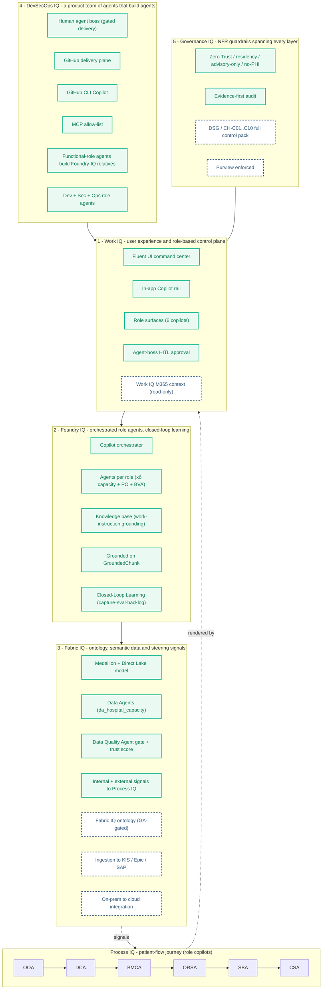

<!-- markdownlint-disable MD033 MD041 -->

  

<!-- markdownlint-enable MD033 MD041 -->

# Curavias — Solution Design

| Field | Value |
| ----- | ----- |
| **Version** | 1.6.0 |
| **Date** | 2026-07-28 |
| **Author** | Urs Rueegg |
| **Status** | Reviewed |
| **Previous Version** | 1.5.1 (added the Curavias brand-kit logo to the document header); this bump adds the IQ-layered solution-design section — Work / Foundry / Fabric / DevSecOps / Governance IQ plus the Process IQ spine, with MVP vs Target scope |

> **Curavias** is the Swiss AI-powered patient-flow and hospital-capacity
> platform — a Microsoft Frontier-Firm reference implementation grounded on
> Fabric IQ, Foundry IQ, and Work IQ.

## Executive summary

This document translates the Curavias requirements and architecture decisions
into an implementable MVP solution shape across the data, AI, application,
integration, security, and operations lanes. It is the bridge from what the
platform must do (PRD) and how it is structured (ARCHITECTURE) to how the MVP is
built and delivered.

## Purpose

This document defines the MVP Solution Design baseline for Curavias, the Swiss
AI-powered patient-flow and hospital-capacity platform.

It translates requirements and architecture decisions into an implementable
solution shape across data, AI, app, integration, security, and operations.

## Source Baseline

This design is derived from and constrained by:
- `docs/PRD.md`
- `docs/ARCHITECTURE.md`
- `docs/AI.md`
- `docs/COMPLIANCE.md`
- `docs/SECURITY.md`
- `docs/adr/0001-runtime-is-github-copilot-coding-agent.md` and current ADR set

## MVP Scope

### In Scope

1. Provider-internal operational platform for one provider deployment at a time.
2. Near-real-time ingestion and curated operational datasets.
3. 72-hour demand forecast and discharge-readiness scoring.
4. React-based command-center experience and grounded copilot support.
5. Integration orchestration with external partner endpoints.
6. Zero Trust controls, Swiss residency constraints, and audit evidence baseline.

### Out of Scope

1. Multi-provider shared tenancy.
2. Preview-only features on the MVP critical path.
3. Fabric IQ Ontology dependency for MVP acceptance.
4. Autonomous or non-HITL agent action. (Foundry IQ orchestrated agents *are* in
   MVP scope — the Foundry Agent Service is deployed per `ADR-0032`; the
   application-hosted vs Foundry-hosted runtime nuance is governed by Design
   Principle 7 and `ADR-0008`.)

## Design Principles

1. GA-only services in MVP critical path.
2. Swiss-first residency for PHI-sensitive data and AI inference.
3. Zero Trust by default across identity, network, workload, and data.
4. Evidence-first governance for compliance and auditability.
5. IaC-first infrastructure with operational automation for non-declarative areas.
6. Degraded-mode support over hard failure where clinically safe.
7. Application-hosted agent runtime by default; Foundry-hosted/hybrid only under
   explicit scope per `ADR-0008` and
   [`docs/architecture/runtime-pattern-decision-matrix.md`](architecture/runtime-pattern-decision-matrix.md).

> These principles are also presented per IQ layer in
> [IQ-Layered Solution Design](#iq-layered-solution-design-operating-model) below.

## Solution Overview

### Logical Domains

| Domain | MVP Responsibility | Primary Services | IQ Layer |
| ----- | ----- | ----- | ----- |
| Experience | Operations UI and copilot interaction | React app on Azure App Service or Static Web Apps | Work IQ |
| API and agent runtime | Request handling, orchestration, policy checks | Azure Container Apps | Foundry IQ |
| Data ingestion and curation | Source normalization and serving datasets | Azure Health Data Services, Microsoft Fabric | Fabric IQ |
| AI decisioning | Forecasting, discharge scoring, grounded inference | Azure Machine Learning, Azure OpenAI | Foundry IQ |
| Integration | External partner workflow and acknowledgements | Azure Logic Apps, Service Bus | Fabric IQ |
| Security and governance | Identity, key management, policy, logs, evidence | Entra ID, Key Vault, Policy, Monitor, Purview | Governance IQ |

### Region and Environment Topology

- Primary region: Switzerland North
- Secondary region: Switzerland West (failover gated by compliance runbook)
- Environments: DEV, SIT, PROD
- Promotion model: Git-first with environment approval gates

### Azure Resource Naming Standard

- Solution short name: `ihzhhpf`.
- Apply this short name to Azure resource names in all environments.
- Environment suffix policy:
   - DEV: no mandatory postfix rule in this baseline (project teams may use `dev` when needed).
   - SIT: always postfix `sit`.
   - PROD: always postfix `prod`.
- Shared resources across environments: no environment postfix.
- Recommended pattern for non-shared resources: `<resource-type>-ihzhhpf-<env-suffix>`.

Examples:
- SIT Key Vault: `kv-ihzhhpf-sit`
- PROD Key Vault: `kv-ihzhhpf-prod`
- Shared Log Analytics workspace: `log-ihzhhpf`

## IQ-Layered Solution Design (Operating Model)

Curavias is structured as five stacked Microsoft **IQ** layers plus one
cross-cutting **Process IQ** spine — the patient-flow journey through the six
role copilots. This is the customer-facing operating-model view of the same
platform detailed engineering-first in *Core Component Design* below. Colour
coding: **green = MVP** (built / demoable now); **dashed blue = Target**
(full-scope roadmap).

### Process IQ — Patient-Flow Journey (Spine)

Process IQ is the end-to-end patient-flow journey: a single capacity signal is
steered through the six role copilots `OOA -> DCA -> BMCA -> ORSA -> SBA -> CSA`.
Worked golden thread: *Medicine A reaches 102% occupancy within 72 hours, so the
site releases 16 beds.* Process IQ is a cross-cutting spine, not a stacked layer —
Fabric IQ signals steer it and Work IQ renders it.

### Capability Scope by Layer (MVP vs Target)

| Layer | MVP (built / demoable now) | Target (full-scope roadmap) |
| ----- | ----- | ----- |
| **1 · Work IQ** | Fluent UI command center; In-app Copilot rail; Role surfaces (6 copilots); Agent-boss HITL approval | Work IQ M365 context (read-only) |
| **2 · Foundry IQ** | Copilot orchestrator; Agents per role (×6 capacity + PO + BVA); Knowledge base (human work-instruction grounding); Grounded on GroundedChunk; Closed-Loop Learning | — |
| **3 · Fabric IQ** | Medallion + Direct Lake model; Data Agents (`da_hospital_capacity`); Data Quality Agent gate + trust score; Internal + external signals to Process IQ | Fabric IQ ontology (GA-gated); Ingestion to KIS / Epic / SAP; On-prem to cloud integration |
| **4 · DevSecOps IQ** | Human agent boss (gated delivery); GitHub delivery plane; GitHub CLI Copilot; MCP allow-list; Functional-role agents build their Foundry-IQ relatives; Dev + Sec + Ops role agents | — |
| **5 · Governance IQ** | Zero Trust · Swiss residency · advisory-only · no-PHI; Evidence-first audit | DSG / CH-C01..C10 full control pack; Purview enforced |

### Per-Layer Design and Principles

#### 1 · Work IQ — User Experience and Role-Based Control Plane

- **Responsibilities**: Fluent UI capacity command-center; in-app Copilot rail;
  role-aware surfaces for the six copilots; agent-boss approval of every
  actionable output.
- **Key controls**: Entra-authenticated sessions; role-based action guardrails;
  advisory-only response framing with citations; full interaction telemetry.
- **Principles applied**: role-based least-surface UX; advisory-only with
  citations; human-in-the-loop gating by a human agent boss (Design
  Principles 3 and 6).

#### 2 · Foundry IQ — Orchestrated Role Agents and Closed-Loop Learning

- **Responsibilities**: orchestrate the per-role agents; ground answers on the
  knowledge base (human work-instruction grounding) over the `GroundedChunk`
  contract; run closed-loop learning.
- **Key controls**: grounded-only responses; bounded per-role agent scope;
  capture → evaluate → curated-backlog learning loop.
- **Principles applied**: grounding-first; orchestration over monolith
  (one agent per role); closed-loop improvement.

#### 3 · Fabric IQ — Ontology, Semantic Data and Steering Signals

- **Responsibilities**: medallion Bronze/Silver/Gold plus the Direct Lake
  semantic model; Data Agents; the Data Quality Agent gate and trust score;
  internal and external signals steering Process IQ. Target: the Fabric IQ
  ontology, ingestion to downstream KIS / Epic / SAP, and on-prem to cloud
  integration.
- **Key controls**: the Data Quality Agent as a hard gate; residency enforced by
  data class; GA-only services in the MVP critical path (ontology GA-gated).
- **Principles applied**: quality-gated medallion; signals steer the process;
  GA-only critical path; residency by data class (Design Principles 1, 2, 4).

#### 4 · DevSecOps IQ — A Product Team of Agents That Build Agents

- **Responsibilities**: a product team of agents — functional-role agents that
  build their Foundry-IQ relatives, plus Dev / Sec / Ops role agents — delivered
  through the GitHub delivery plane, GitHub CLI Copilot, and the MCP allow-list,
  and gated by a human agent boss.
- **Key controls**: a human gate on delivery; a least-privilege MCP allow-list;
  an evidence-first delivery trail (issues, PRs, commits).
- **Principles applied**: agents build agents under a human gate; GitHub-native
  delivery; least privilege; evidence-first.

#### 5 · Governance IQ — NFR Guardrails Spanning Every Layer

- **Responsibilities**: express the NFR boundaries as guardrails that span every
  layer — Zero Trust, Swiss residency, advisory-only, no-PHI, and evidence-first
  audit. Target: the DSG / CH-C01..C10 full control pack and Purview enforcement.
- **Key controls**: Zero Trust by default; centralized auditability; residency
  enforcement by data class.
- **Principles applied**: NFR boundaries as guardrails; Zero Trust default;
  Swiss-first residency; evidence-first governance (Design Principles 2, 3, 4).

## Core Component Design

### 1) Experience Layer (React MVP Channel)

Responsibilities:
- Capacity command-center views.
- Copilot prompt and response interaction with citations.
- Role-aware UI actions.

Key controls:
- Entra-authenticated sessions.
- Role-based access and action guardrails.
- Full interaction telemetry and audit metadata.

### 2) API and Runtime Layer

Responsibilities:
- Route user requests to data and AI paths.
- Enforce policy checks before execution.
- Aggregate responses and evidence metadata.

Key controls:
- Managed identity for downstream access.
- Request-level authorization and safety checks.
- Correlation IDs across request, model call, and side effects.

### 3) Data Platform Layer

Responsibilities:
- Ingest and normalize operational signals (ED, ADT, bed-state, discharge).
- Maintain curated datasets and semantic serving views.
- Preserve source-to-consumption traceability.

Key controls:
- Data classification and minimization for PHI paths.
- Dataset lineage and quality checks.
- Residency enforcement by dataset class.

### 4) AI Layer

Responsibilities:
- Run forecast and discharge scoring pipelines.
- Support grounded copilot inference with context references.
- Persist model and response provenance.

Key controls:
- PHI inference only on approved regional deployment types.
- Block Global, Data Zone, and Developer deployment types for PHI scenarios.
- Advisory-only response framing with traceability metadata.

### 5) Integration Layer

Responsibilities:
- Trigger external coordination workflows.
- Capture partner acknowledgements.
- Handle retries and exceptions.

Key controls:
- Authenticated partner integration boundaries.
- Queue-based backpressure and retry control.
- Full event audit logging for outbound and inbound exchanges.

## End-to-End Flow (MVP)

1. Source systems emit operational events.
2. Ingestion normalizes and lands data into curated platform stores.
3. Forecast and discharge pipelines generate scored outputs.
4. React UI and copilot APIs query governed context and AI outputs.
5. API returns responses with citations, timestamps, and trace metadata.
6. Actionable events trigger Logic Apps partner workflows.
7. Acknowledgements are written back and surfaced in operational views.
8. Logs and evidence artifacts are emitted for governance review.

## Onboarding Lanes and Deterministic Classification (Sprint 6)

Sprint 6 introduces two onboarding lanes with a minimum-sensitive-data design.
This section is the design baseline for `FR-ONB-001` to `FR-ONB-004` and
`NFR-COMP-011`, `NFR-SEC-005`, `NFR-DQ-005`, `NFR-REL-005`, `NFR-MAINT-005`.

### Lane Design

| Lane | Responsibility | Data contract | Minimization rule |
| ----- | ----- | ----- | ----- |
| Patient minimum-data onboarding | Onboard patients with the least required, pseudonymous metadata | `DC-ONB-PATIENT-v1` (see `docs/DATA.md`) | No direct identifiers; pseudonym + age band + purpose tag only (`NFR-COMP-011`, `CH-C01`) |
| Specialty-driven capacity onboarding | Onboard hospital capacity using specialty-tagged metadata and provider profiles | `DC-ONB-CAPACITY-v1` plus provider extensions `DC-ONB-CAPACITY-HIRSLANDEN-v1` / `DC-ONB-CAPACITY-ZOLLIKERBERG-v1` | Specialty taxonomy versioned; capacity invariant `bedsAvailable <= bedsTotal` (`NFR-DQ-005`) |

Both lanes are validated against their contracts by the synthesized-data gate
[`data/synthetic/validate_datasets.py`](../data/synthetic/validate_datasets.py),
which produces SIT contract/schema evidence and enforces re-identification
minimization on the patient lane. Onboarding services follow the
degraded-mode-over-hard-failure principle (`NFR-REL-005`) and are deployed
through the IaC-first data-platform bootstrap path (`NFR-MAINT-005`).

### Deterministic Service vs Agentic Flow Classification (FR-ONB-004)

Each onboarding workflow is classified before implementation using a documented
criterion. A workflow is an **agentic flow** only when **all** of the following
hold; otherwise it is implemented as a **deterministic service/workflow**
(default), consistent with Design Principle 4 (deterministic components are not
AI agents by default).

| Classification test | Deterministic service | Agentic flow |
| ----- | ----- | ----- |
| Decision space | Fixed rules / schema validation | Open-ended reasoning over heterogeneous context |
| Inputs | Structured, contract-bound | Mixed structured + unstructured / conversational |
| Output authority | No clinically impactful recommendation | Advisory recommendation requiring human-in-the-loop |
| Reproducibility | Same input yields same output | Context-dependent synthesis |

Applying this criterion to the onboarding lanes: patient-minimum onboarding
ingestion, specialty-capacity contract validation, and synthesized-data
validation are **deterministic services**; OOA/DCA/BMCA decision support over
onboarded capacity is **agentic** and remains advisory and HITL-gated. See
[`docs/agents/sprint-06-mvp-agent-readiness.md`](agents/sprint-06-mvp-agent-readiness.md).

## Non-Functional Design Targets

### Performance and Demand Targets (Planning Baseline)

- Operational source events: 180000 per day baseline.
- Burst headroom target: 3x average in 10-minute windows.
- Copilot peak concurrency target: 120 users.
- Interactive response objective: P95 under 4 seconds for standard grounded paths.

### Reliability Targets

- Continuous operation (not batch-only).
- Restartable data and AI pipelines.
- Graceful degradation for non-critical dependency failures.

### Security Targets

- Least-privilege access and just-in-time admin elevation.
- No secrets in code or static app configuration.
- Centralized auditability for access and privileged actions.

## Security and Compliance Design Mapping

### Requirement Coverage

- FR-GOV-001/002/004/005/006 through policy, audit, and access controls.
- NFR-SEC-001 to NFR-SEC-004 through identity, logging, integration auth,
  and secretless workload design.
- NFR-COMP-004 to NFR-COMP-010 through residency, incident, evidence,
  EPR-aware control model, and compliance workflows.

### Control Coverage

This design is aligned to the compliance control model CH-C01 to CH-C10.
Current design coverage is complete; residual gaps are implementation tasks:
1. DSR process operationalization.
2. Cross-border transfer legal sign-off workflow.
3. Privacy incident timing matrix.
4. EPR conformance pack when EPR is enabled.
5. AI override and safety acceptance metrics.

## IaC and Delivery Design

### IaC-first Controls

Implement in Bicep or Terraform:
1. Resource topology, identity, and networking.
2. Key Vault, diagnostics, and policy assignments.
3. AI account and deployment resources.
4. Environment-scoped RBAC and baseline governance resources.

### Hybrid Operational Controls

Implement via scripted ops workflows:
1. Purview collections, scans, and policy lifecycle.
2. Access recertification and evidence collection.
3. Incident simulation and runbook validation.

## Implementation Plan (MVP)

### Phase 1: Foundation

1. Establish environment and network baseline.
2. Deploy core platform resources and identity model.
3. Enforce policy and diagnostic baseline.

### Phase 2: Data and AI Core

1. Integrate source ingestion and curated datasets.
2. Implement forecast and discharge scoring pipelines.
3. Establish AI inference path with Swiss PHI restrictions.

### Phase 3: Experience and Integration

1. Deliver React command-center and copilot UI.
2. Deliver API orchestration and citation-capable responses.
3. Deliver partner workflow integration and acknowledgement loop.

### Phase 4: Hardening and Readiness

1. Validate performance and concurrency assumptions.
2. Validate security, compliance, and evidence gates.
3. Execute readiness review for MVP go/no-go.

## Open Decisions

1. Final service SKUs and sizing by measured load test outcomes.
2. Exact FHIR profile and message-set boundaries per provider.
3. EPR integration timing and conformance sequencing.
4. Recovery objectives by data class and workflow criticality.
   Baseline recovery classes (R1/R2/R3) and RTO/RPO targets are now defined in
   [`docs/operations/reliability-dr-profile.md`](operations/reliability-dr-profile.md)
   (ADR-0009); remaining work is SIT rehearsal validation in Phase 3.

## Acceptance Criteria for MVP Solution Design

1. All MVP in-scope capabilities are mapped to implementable components.
2. Security and compliance controls are mapped to design and operations evidence.
3. Architecture constraints (GA-only, Swiss PHI controls, React MVP channel)
   are reflected without contradiction.
4. Residual risks and implementation dependencies are explicit and trackable.

## Notes

This document is the first draft solution design baseline.
It is intended to be refined through implementation planning and measured
validation results in subsequent sprints.
