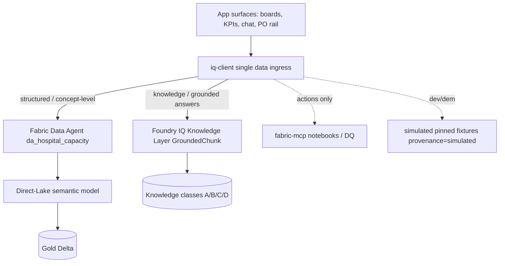

# App Data Access via the IQ Layer — best-practice pattern (proposed)

| Field | Value |
|-------|-------|
| **Version** | 1.1.0 |
| **Date** | 2026-07-26 |
| **Author** | Urs Rüegg (with Copilot) |
| **Status** | Accepted — implemented in Sprint 27 (ADR-0044) |
| **Previous Version** | 1.0.0 (draft for review) |
| **Sprint** | 27 (Curavias App UX Polish, tracker #365) — data-access backlog item |
| **Applies to** | `apps/hcc-app-fluent` (internal app) data access |
| **Related** | [Fabric to Foundry grounding contract](fabric-foundry-grounding-contract.md), [ADR-0033](../adr/0033-fabric-data-agent-as-foundry-grounding-tool.md), [ADR-0034](../adr/0034-fabric-iq-demo-scope-artefacts.md), [ADR-0035](../adr/0035-fabric-iq-layer-region-westus2.md), [ADR-0014](../adr/0014-fabric-iq-ontology-target-backbone-ga-gated.md); ADR-0043 (Foundry IQ domain, on `main`) |

> Captured from the 2026-07-25 architecture discussion and **implemented in
> Sprint 27** (2026-07-26) via the IQ-layer gateway `src/data/iq-client.ts`; the
> decision is recorded in [ADR-0044](../adr/0044-app-data-access-via-iq-layer.md).
> `provenance` folds the doc's `golden` into the frozen contract's `live`
> (`live` == golden evidence from the IQ layer) to avoid breaking `RoleBoard`.

## 1. Question

Does the app always go through the **IQ layer** to reach **golden data**, and can
we establish a best-practice pattern that guarantees it?

## 2. Current state (assumption is partially correct)

The app has two data paths; only one is IQ-governed today.

| Path | Route | IQ-governed? |
|------|-------|--------------|
| **Conversational** (chat / reco) | App → Foundry Agent ([`agent-manifest.ts`](../../apps/hcc-app-fluent/src/copilot-drawer/agent-manifest.ts), `VITE_AGENT_HOST_URL`) → agent grounds via the **Fabric Data Agent** `da_hospital_capacity` (ADR-0033/0034) → Direct-Lake semantic model over Gold | Yes — Fabric IQ primary, Foundry IQ secondary, `hcp:*` citations, RLS + PHI gate, loud degradation |
| **Structured board reads** (OOA table, KPIs) | App → [`golden-source-client.ts`](../../apps/hcc-app-fluent/src/data/roleboard/golden-source-client.ts) (`VITE_GOLDEN_SOURCE_URL`) → REST over Gold, or simulated pinned fixtures | Partial — reads Gold but bypasses the ontology / semantic IQ surface; `simulated` in demo |

Both paths already carry a `provenance` flag (`simulated | live`), so the honesty
contract exists; it is the **routing** that is not yet unified.

## 3. The two IQ layers (what "golden evidence" means)

- **Fabric IQ** — the MVO ontology + Direct-Lake semantic model over the Gold Delta
  tables, fronted by the read-only **Fabric Data Agent** (`da_hospital_capacity`).
  Golden surface for **structured** capacity facts; enforces RLS + ADR-0016 PHI gate
  - `hcp:*` citations.
- **Foundry IQ** — the shared **Knowledge Layer** (ADR-0043, `GroundedChunk` contract,
  knowledge classes A corpus / B live-proof / C cost / D ontology), consumed by the
  Foundry agents. Golden surface for **knowledge / document / grounded-answer** context.

## 4. Proposed pattern: one IQ gateway, grounding-precedence, provenance-always

> **Rule: the app never reads raw Gold / lakehouse tables ad hoc. All reads pass
> through a single typed IQ gateway that mirrors the grounding precedence contract.**

Five contracts for the app:

1. **Single ingress.** One `iq-client` module is the only place allowed to hold an
   endpoint or `fetch`. Board loaders (`golden-source-client`) and `agent-manifest`
   become thin callers. Enforce with an ESLint rule so no component fetches Gold.
2. **Precedence, mirrored from the contract.** Structured facts to the **Fabric Data
   Agent** (primary); knowledge / answers to **Foundry IQ** (secondary); `fabric-mcp`
   for **actions only** — never a read path. This is ADR-0033 applied at the app edge.
3. **Every response is an evidence envelope.**
   `{ data, provenance: 'golden' | 'live' | 'simulated', citations: string[], degraded: boolean }`.
   Structured reads must include at least one `hcp:*` citation; the board path should
   shift from a bespoke Gold REST to the semantic-model / Data-Agent surface so it can
   carry `hcp:*` citations too.
4. **Fail loud, never silent.** If the IQ surface is unavailable, degrade to table
   grounding with a visible `grounding degraded` badge — never render ungrounded.
5. **Config, not code (region-agnostic).** Endpoints from env only
   (`VITE_AGENT_HOST_URL`, `FABRIC_DATA_AGENT_ENDPOINT`, `FABRIC_WORKSPACE_ID`,
   `VITE_GOLDEN_SOURCE_URL`) so westus2 (demo, ADR-0013/0035) lifts to
   eastus2 / switzerlandnorth without edits.

## 5. Proposed first slices (for the 2026-07-26 action plan)

1. ADR "App data access via the IQ layer" (records precedence + envelope).
2. `apps/hcc-app-fluent/src/data/iq-client.ts` — single ingress + evidence envelope;
   refactor `golden-source-client` + `agent-manifest` to call it (keep the simulated
   fallback + `provenance`).
3. Route the board's structured reads through the Fabric Data Agent / semantic-model
   surface (so board KPIs carry `hcp:*` citations, matching the chat path).
4. ESLint guard: only `iq-client` may hold a `fetch` / endpoint import.
5. `grounding degraded` UI affordance + golden tests for the envelope.

**Delivered 2026-07-26** (all five slices): `src/data/iq-client.ts` gateway;
`golden-source-client` + `agent-manifest` routed through it; `RoleBoardData` gains
optional `citations` / `degraded`; `GroundingNotice` on the OOA board; vitest
single-ingress guard (`tests/unit/iq-ingress-guard.test.ts`) + envelope test
(`tests/unit/iq-envelope.test.ts`); [ADR-0044](../adr/0044-app-data-access-via-iq-layer.md).
The board `live` path still uses the golden-source REST shape — full Fabric Data
Agent natural-language structured queries remain a follow-up once the endpoint is
live in SIT (`VITE_GOLDEN_SOURCE_URL`).

## 6. Constraints

- Demo scope only: simulated data, no PHI (ADR-0013, ADR-0016). Provenance must always
  be surfaced (`simulated` vs `golden` / `live`).
- Fabric IQ operational ontology in PROD `switzerlandnorth` carrying PHI stays GA-gated
  (ADR-0014); the `westus2` demo scope is permitted.
- This is a **data-lane** change; keep it behind the existing `provenance` contract and
  add golden tests. No data-contract or infra change is implied by the app-side gateway.
