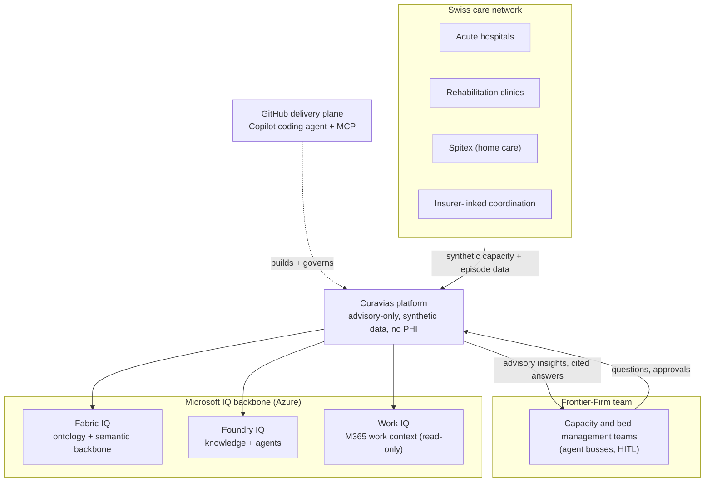
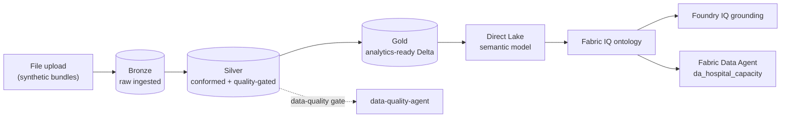
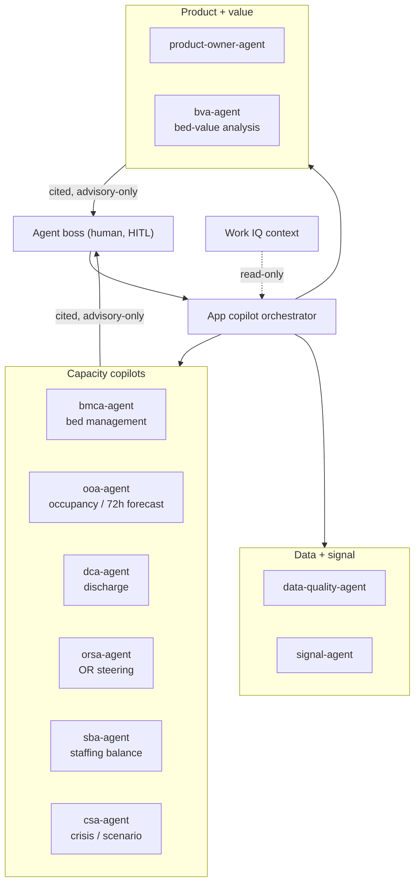
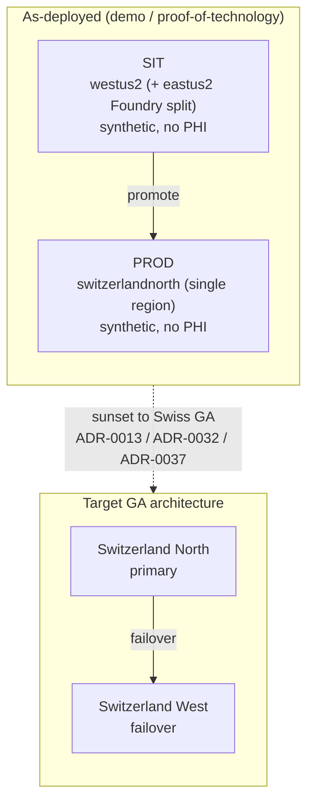
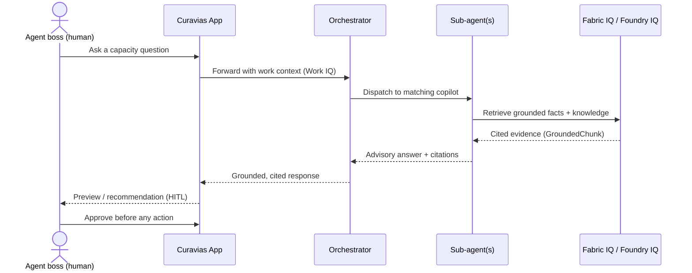

# Curavias — Canonical Diagram Library

| Field | Value |
| ----- | ----- |
| **Version** | 1.0.0 |
| **Date** | 2026-07-28 |
| **Author** | Urs Rüegg (with Copilot) |
| **Status** | Draft |
| **Previous Version** | n/a (initial version) |

> **Curavias** is the Swiss AI-powered patient-flow and hospital-capacity
> platform — a Microsoft Frontier-Firm reference implementation grounded on
> Fabric IQ, Foundry IQ, and Work IQ.

## Executive summary

This is the single source of truth for the five canonical Curavias diagrams:
system context, medallion data flow, agent topology, deployment and region, and
the key request sequence. Each diagram is authored once here and copied into the
documents listed in its **Embed in** note (GitHub Markdown cannot transclude, so
copies are kept in sync from this library). Terminology follows
[GLOSSARY.md](../GLOSSARY.md); facts follow
[ARCHITECTURE.md](../ARCHITECTURE.md),
[INFRASTRUCTURE.md](../INFRASTRUCTURE.md), and
[CURAVIAS-PRODUCT-STATUS.md](../CURAVIAS-PRODUCT-STATUS.md).

## How to use this library

* Copy the fenced `mermaid` block into the target doc under a short caption.
* When a diagram changes here, update **every** doc in its **Embed in** note in
  the same PR so copies do not drift.
* Keep node labels terminology-aligned to [GLOSSARY.md](../GLOSSARY.md).

## 1. System context (C4 level 1)

Curavias in its ecosystem: the Swiss care network it serves, the human + AI-agent
Frontier-Firm team that operates it, the Microsoft IQ backbone that grounds it,
and the GitHub delivery plane that builds it.

**Embed in:** README.md, ARCHITECTURE.md, PRD.md, CURAVIAS-PRODUCT-STATUS.md.

## 2. Medallion data flow

The Bronze / Silver / Gold lakehouse path from file upload to grounded
consumption. Silver is quality-gated (schema, FK, PHI-absence); Gold feeds the
Direct Lake semantic model and Fabric IQ, which in turn ground Foundry IQ and the
Fabric Data Agent.

**Embed in:** DATA.md, ARCHITECTURE.md, INFRASTRUCTURE.md.

## 3. Agent topology and orchestration

The in-app Curavias copilot orchestrator dispatches to the Product Owner (PO),
Bed-Value Analysis (BVA), and capacity copilots, with supporting data and signal
agents. Every actionable output returns to a human agent boss for approval.

**Embed in:** ARCHITECTURE.md, AI.md, AGENTS.md.

## 4. Deployment and region

As-deployed demo reality versus the target GA architecture. The demo runs PROD
single-region in Switzerland North with SIT in US regions (synthetic data only);
target GA adds Switzerland West failover.

**Embed in:** INFRASTRUCTURE.md, ALM_PLAN.md, CURAVIAS-PRODUCT-STATUS.md.

## 5. Key request sequence

A user question in the Curavias app flows through the orchestrator to the right
sub-agent(s) and returns a grounded, cited, advisory-only answer that a human
approves before any action.

**Embed in:** ARCHITECTURE.md, AI.md, OPERATIONS.md.
