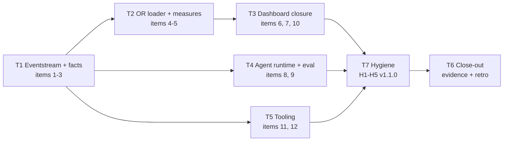

# Sprint 10 — End-to-End Pipeline + Dashboard Completion

| Field | Value |
| ----- | ----- |
| **Version** | 1.1.0 |
| **Date** | 2026-07-08 |
| **Author** | @urruegg |
| **Status** | Executing |
| **Previous Version** | 1.0.0 (added §11 Execution Strategy + T7 hygiene track + ADR-0019 pivot annotation for S10.1) |

> **Sprint theme.** Sprint 09 v2 shipped 80% fully-complete with 3 formal DoD carry-overs. Sprint 10 unblocks those 3 items (E2E pipeline, agent eval, RLS PHI gate) and completes the capacity-dashboard (visuals + Option D measure catch-up). Scope is derived from the 15-item [Sprint 09 retrospective §5](sprint-09/retrospective.md#5-follow-ups-sprint-10) backlog.
>
> **Charter shape.** This is a **scoped follow-up sprint** — a full design-spec + implementation-plan pair (Sprint 09 v2 pattern) is optional per track. Add design + plan for tracks where scope grows beyond the enumerated items; skip for tracks where the retrospective backlog is self-contained.

## Table of Contents

1. [Sprint goal](#1-sprint-goal)
2. [Source baseline](#2-source-baseline)
3. [Sprint scope](#3-sprint-scope)
4. [Track structure](#4-track-structure)
5. [Deliverables (mapped from retrospective §5)](#5-deliverables-mapped-from-retrospective-5)
6. [Definition of Done](#6-definition-of-done)
7. [Risk register](#7-risk-register)
8. [Traceability](#8-traceability)
9. [Sprint close checklist](#9-sprint-close-checklist)
10. [References](#10-references)
11. [Execution strategy (v1.1.0)](#11-execution-strategy-v110)

---

## 1. Sprint goal

Close the 3 open Sprint 09 v2 DoD items (E2E pipeline, 9 agent eval fixtures, RLS PHI gate) and land the remaining T5 dashboard scope (Option D measure catch-up + PBIP Page 1 + Page 2 visuals), so that the capacity-dashboard is demo-ready end-to-end for the AMA session sequence and the ADR-0013 westus2 demo-scope expiry milestone (2026-09-30).

Success shape:

- Simulator → Event Hubs → Fabric Eventstream → bronze → silver → gold → Direct Lake semantic model → Page 1 + Page 2 visuals runs green end-to-end on Fabric F2 SIT.
- All 13 spec §6.3 measures authored and rendering on the correct dashboard cards.
- 4 RLS roles verified in portal against a synthetic PHI fixture.
- 9 agent golden-task fixtures replay green via automated harness.

---

## 2. Source baseline

Read these in order before touching Sprint 10 code or docs:

1. [Sprint 09 retrospective](sprint-09/retrospective.md) — authoritative Sprint 10 backlog (§5) + risk-register outcomes (§6)
2. [Sprint 09 v2 sprint doc](sprint-09-master-data-simulation-and-capacity-dashboard.md) v2.1.0 — DoD carry-over annotations
3. [Sprint 09 v2 design spec](../superpowers/specs/2026-07-02-sprint-09-v2-refinement-design.md) — measure/relationship contract source
4. [Sprint 09 v2 implementation plan](../superpowers/plans/2026-07-02-sprint-09-v2-refinement-plan.md) — task breakdown patterns
5. [`docs/sprints/sprint-09/checkpoint-2026-07-06-fabric-and-model.md`](sprint-09/checkpoint-2026-07-06-fabric-and-model.md) §9.1 — Option D catch-up plan for measures
6. [`docs/sprints/sprint-09/evidence/rls-phi-verification.md`](sprint-09/evidence/rls-phi-verification.md) v1.0.0 — 3 concrete RLS blockers
7. [`docs/sprints/sprint-09/evidence/agent-eval-replay.md`](sprint-09/evidence/agent-eval-replay.md) v1.0.0 — 2 concrete agent-eval blockers
8. [`data-platform/reports/capacity-dashboard.SemanticModel/README.md`](../../data-platform/reports/capacity-dashboard.SemanticModel/README.md) — measure inventory (5 authored, 8 deferred)
9. [ADR-0013](../adr/0013-temporary-us-region-demo-scope.md) — westus2 demo scope expiry 2026-09-30 (sets Sprint 10 close deadline pressure)
10. [ADR-0016](../adr/0016-no-phi-in-mvp-demo-scope.md) — no PHI ingest constraint (drives Blocker 3 of RLS gate: needs synthetic PHI fixture)
11. [ADR-0017](../adr/0017-sprint-09-v2-track-restructure.md) — Sprint 09 v2 5-track structure precedent

---

## 3. Sprint scope

### In scope

1. **Fabric Eventstream + Event Hubs wiring** (retrospective §5 item 1) — provision Eventstream Bicep + execute post-deploy portal step ([`configure-eventstream.ps1`](../../infra/modules/data-platform/fabric-eventstream/post-deploy/configure-eventstream.ps1)) against SIT.
2. **Eventstream bronze/silver/gold notebooks** (item 2) — port the reference-data pattern to the streaming path.
3. **4 missing fact tables** (item 3) — `fact_encounter`, `fact_bed_state`, `fact_bed_assignment`, `fact_forecast_output` in `lh_ihzhhpf_sit/gold/`.
4. **8 Option D measures** (item 4) — author on the new fact tables per [checkpoint §9.1 table](sprint-09/checkpoint-2026-07-06-fabric-and-model.md#91-sprint-10-handoff--capacity-dashboard-measures-option-d).
5. **OR loader schema extension** (item 5) — derive `isFirstCase`, `actualStart`, `plannedStart`, `cancellationLeadTimeHours`, `turnoverMinutes` on `or_case`; align `or_schedule.status` vocabulary to include `available`; retire the Sprint 09 `Idle-Slot Minutes` proxy in favour of the spec-exact filter.
6. **Re-author 4 RLS roles + column-level PHI tagging** (item 6) — Fabric web modeling → **Manage roles** → BedOps, ORPlanner, Analyst, SemanticOwner; add column-level `[phi]="true"` annotations on PHI-shaped columns.
7. **Synthetic PHI fixture** (item 7) — design + inject procedure into an **isolated test lakehouse** (NOT `lh_ihzhhpf_sit`), then exercise the RLS filter for each of 4 roles per [rls-phi-verification.md](sprint-09/evidence/rls-phi-verification.md#sprint-10-verification-procedure-post-blocker-resolution).
8. **Automated agent-eval harness** (item 8) — extend [`.github/workflows/eval-goldens.yml`](../../.github/workflows/eval-goldens.yml) to drive the 9 fixtures against deployed agents.
9. **Deploy 3 agent runtime hosts** (item 9) — BM-Copilot (Foundry-hosted), Fabric Data Agent, CSA (Foundry-hosted). Executes the already-shipped D4.5 Foundry Bicep + D4.6 Fabric REST deploy against SIT.
10. **PBIP Page 1 + Page 2 visual authoring** (item 10) — implement the layout READMEs against the 13 measures.
11. **Verifier extension** (item 11) — [`export_semantic_model_tmdl.ps1`](../../data-platform/scripts/export_semantic_model_tmdl.ps1) asserts measure count (13 target) + RLS role count (4 target).
12. **CI verifier workflow** (item 12) — `.github/workflows/verify-semantic-model.yml` runs `-VerifyOnly` on every PR touching `data-platform/reports/capacity-dashboard.SemanticModel/**`.

### Out of scope (explicit)

1. **PHI ingestion into `lh_ihzhhpf_sit`** — ADR-0016 unchanged; RLS testing uses an isolated test lakehouse with a synthetic fixture only.
2. **`switzerlandnorth` lift-and-shift** (retrospective §5 item 15) — carry-forward to a governance-scoped sprint after Fabric IQ Swiss GA + DPA equivalence is confirmed. Only the `-Region` parameter flip on deploy scripts is validated in Sprint 10.
3. **Frozen `MngEnvMCAP228255` tenant teardown** (retrospective §5 item 14) — carry-forward to a governance-scoped sprint; blocker is management-plane approval, not technical.
4. **Nightly HCC MAPE re-validation harness** (retrospective §5 item 13) — carry-forward; the sprint-09 blocking test (MAPE 2.44%) is sufficient for Sprint 10 demo scope.
5. **PROD deployment** — Sprint 10 targets SIT only; PROD replication uses the [checkpoint §3 replication checklist](sprint-09/checkpoint-2026-07-06-fabric-and-model.md#3-fabric-f2-prod-replication-checklist) in a subsequent sprint.

---

## 4. Track structure

Six seven tracks, dependency order **T1 → T2 → (T3 ∥ T4 ∥ T5) → T7 → T6**:

| Track | Items (retrospective §5 + v1.1.0 additions) | Owner | Notes |
| ----- | ------------------------ | ----- | ----- |
| **T1 Eventstream + facts** | 1, 2, 3 | @urruegg | S10.1 delivered under [ADR-0019](../adr/0019-fabric-eventstream-custom-endpoint-entra-id.md) (Custom Endpoint pivot). Unblocks all Page-1 measures. |
| **T2 OR loader + measures** | 4, 5 | @urruegg | Unblocks all 8 Option D measures + retires Sprint 09 `Idle-Slot Minutes` proxy. Depends on T1 for `fact_*` context. |
| **T3 Dashboard closure** | 6, 7, 10 | @urruegg | RLS re-authoring + synthetic PHI fixture + PBIP visuals. Independent from T1 for RLS; visuals depend on T2 measures. |
| **T4 Agent runtime + eval** | 8, 9 | @urruegg | Deploy 3 agents + build automation harness. Independent from T1/T2/T3; may run in parallel. Agents now subscribe to Fabric-side Lakehouse Delta outputs (per ADR-0019), not Azure EH consumer groups. Cost budget for Foundry deployments. |
| **T5 Tooling** | 11, 12 | @urruegg | Verifier extension + CI workflow. Depends on T3 for role count assertion + T2 for measure count. |
| **T7 Hygiene (new v1.1.0)** | H1..H5 | @urruegg | Cleanup surfaced during T1 execution + [ADR-0019](../adr/0019-fabric-eventstream-custom-endpoint-entra-id.md) sunset items. See [completion strategy §5](../superpowers/specs/2026-07-08-sprint-10-completion-strategy.md#5-t7-hygiene-track-new). |
| **T6 Close-out** | (evidence + retrospective) | @urruegg | Update Sprint 09 v2 evidence reports (rls-phi-verification.md, agent-eval-replay.md) from "carry-over" → "PASS"; author Sprint 10 retrospective. |

---

## 5. Deliverables (mapped from retrospective §5)

Total: 12 deliverables + evidence/retro close-out. Full retrospective §5 backlog has 15 items; items 13, 14, 15 are explicitly out of scope (see §3).

| Track | # | Deliverable | Retrospective item | Design/plan needed? |
| ----- | - | ----------- | ------------------ | ------------------- |
| T1 | S10.1 | Fabric Eventstream Bicep + post-deploy portal wiring | 1 | **Delivered under [ADR-0019](../adr/0019-fabric-eventstream-custom-endpoint-entra-id.md)** (Custom Endpoint pivot) — see PRs #128, #129, #130 |
| T1 | S10.2 | Eventstream bronze/silver/gold notebooks | 2 | Design: brief; plan: yes ([M1 plan](../superpowers/plans/2026-07-08-sprint-10-m1-vertical-slice-plan.md) covers the M1 slice) |
| T1 | S10.3 | 4 fact tables landed in `lh_ihzhhpf_sit/gold/` | 3 | Design: brief; plan: yes ([M1 plan](../superpowers/plans/2026-07-08-sprint-10-m1-vertical-slice-plan.md) covers 2 of 4 in M1) |
| T2 | S10.4 | 8 Option D measures authored on new fact tables | 4 | Design: n/a (spec §6.3 authoritative); plan: brief ([M1 plan](../superpowers/plans/2026-07-08-sprint-10-m1-vertical-slice-plan.md) covers 2 of 8 in M1) |
| T2 | S10.5 | OR loader schema extension + status vocabulary alignment | 5 | Design: brief; plan: brief |
| T3 | S10.6 | 4 RLS roles re-authored in Fabric web modeling + column-level `[phi]` annotations | 6 | Design: brief (fixture-injection contract); plan: brief |
| T3 | S10.7 | Synthetic PHI fixture design + injection procedure | 7 | Design: yes; plan: yes |
| T3 | S10.8 | PBIP Page 1 + Page 2 visual authoring | 10 | Design: reference layout READMEs; plan: brief ([M1 plan](../superpowers/plans/2026-07-08-sprint-10-m1-vertical-slice-plan.md) covers 2 of ~10 tiles in M1) |
| T4 | S10.9 | Automated agent-eval harness under `evals/` + workflow | 8 | Design: brief; plan: yes |
| T4 | S10.10 | 3 agent runtime hosts deployed to SIT | 9 | Design: n/a (D4.5/D4.6 authoritative); plan: brief |
| T5 | S10.11 | `export_semantic_model_tmdl.ps1` verifier extension (measure + role count) | 11 | Design: n/a; plan: brief |
| T5 | S10.12 | `.github/workflows/verify-semantic-model.yml` CI merge gate | 12 | Design: n/a; plan: brief |
| **T7** | **H1** | Delete stale branch `sprint-10/t1-s10.1-eventstream-deploy` (post-M4) | v1.1.0 T7 | n/a — requires `approved-to-apply` |
| **T7** | **H2** | Sunset Fabric SIT keep-alive workflow (closes issue #126) at Sprint 10 close | v1.1.0 T7 | Plan: brief |
| **T7** | **H3** | Fix `.github/workflows/fabric-capacity-lifecycle.yml` OIDC env-scope + secrets-vs-vars (mirror PR #130) | v1.1.0 T7 | Plan: trivial |
| **T7** | **H4** | Add `.github/workflows/ci-build-sim-capacity.yml` for auto-rebuild on `apps/sim-capacity/**` changes | v1.1.0 T7 | Plan: brief |
| **T7** | **H5** | Vestigial Azure EH decision (delete `evh-ihzhhpf-sit-y26y` + consumer groups OR raise Sprint 11 tracking) | ADR-0019 sunset | Plan: brief; deletion requires `approved-to-apply` |
| **T7** | **H6** | Downscale Fabric F16 → F2 at Sprint 10 close (F16 raised 2026-07-08 for M1-B dev velocity; ~USD 1,730/mo at 24×7) | This session | Plan: trivial |

**Total: 12 deliverables (S10.1..S10.12) + 6 hygiene items (H1..H6) = 18 units.** S10.1 delivered under [ADR-0019](../adr/0019-fabric-eventstream-custom-endpoint-entra-id.md) architecture. Compare to Sprint 09 v2 (35 deliverables) — still a scoped follow-up sprint.

---

## 6. Definition of Done

Sprint 10 closes when all of the following are true:

- [ ] All 12 deliverables (S10.1..S10.12) completed and evidenced.
- [ ] All 5 T7 hygiene items (H1..H5) completed or explicitly deferred with a Sprint 11 tracking issue.
- [ ] Sprint 09 v2 DoD item 4 (E2E pipeline) verified: simulator → EH → Eventstream → bronze → silver → gold → semantic model → Page 1 + Page 2 renders real values. **Under [ADR-0019](../adr/0019-fabric-eventstream-custom-endpoint-entra-id.md), the ingest surface is a Fabric Custom Endpoint, not an Azure EH source connector.**
- [ ] Sprint 09 v2 DoD item 6 (agent eval) verified: 9 golden-task fixtures replay green via automated harness (no manual runs).
- [ ] Sprint 09 v2 DoD item 8 (RLS PHI gate) verified: 4 roles return 0 rows on PHI-tagged columns against synthetic PHI fixture; verification log populated in [`rls-phi-verification.md`](sprint-09/evidence/rls-phi-verification.md).
- [ ] All 13 spec §6.3 measures rendering on the correct Page 1 / Page 2 visuals with no `BLANK`s (except intentional forecast-window truncation).
- [ ] `export_semantic_model_tmdl.ps1 -VerifyOnly` asserts `Total: 14, Active: 12, Inactive: 2, Measures: 13, Roles: 4` and passes on every PR touching `capacity-dashboard.SemanticModel/**`.
- [ ] Sprint 10 evidence pack under `docs/sprints/sprint-10/evidence/` mirrors Sprint 09 pattern (one report per DoD gate); includes M1..M4 close-out reports per [§11 Execution Strategy](#11-execution-strategy-v110).
- [ ] Sprint 10 retrospective committed in [`docs/sprints/sprint-10/retrospective.md`](sprint-10/retrospective.md) *(create at sprint kick-off)*.
- [ ] Fabric F2 SIT operational-cost hygiene reviewed at sprint close: user decision on suspend vs keep-active for AMA demo window; keep-alive workflow (Sprint 10 T1 temporary override) sunset per T7 H2.

---

## 7. Risk register

Inherits Sprint 09 v2 OPS-RISK-01..05 (see [`docs/OPERATIONS.md`](../OPERATIONS.md)). Sprint-10-scoped additions:

- **OPS-RISK-06** *(new)* — **Fabric web-modeling round-trip drops RLS role scaffolds** (Sprint 09 finding). Mitigation: Sprint 10 S10.6 re-authors roles in the portal; verifier extension S10.11 asserts role count in CI so future round-trips can't silently drop them again.
- **OPS-RISK-07** *(new)* — **Foundry-hosted agent deployment cost overrun**. Deploying 3 agents (BM-Copilot + CSA + FDA) may exceed Sprint 09 v2 F2 SIT cost baseline. Mitigation: rehearse in a scratch deployment first, budget explicit cap in track kick-off.
- **OPS-RISK-08** *(new in v1.1.0)* — **M1 vertical-slice slippage cascades into M2/M3/M4.** M1 is on the critical path for the AMA demo. Mitigation: M3 spec authoring (S10.7 + S10.9) parallelises with M1 execution since specs don't depend on Fabric state. See [completion strategy §7](../superpowers/specs/2026-07-08-sprint-10-completion-strategy.md#7-risk-deltas--rollback).
- **OPS-RISK-09** *(new in v1.1.0)* — **Vestigial Azure EH deletion (T7 H5) surprises a downstream consumer.** BM-Copilot and CSA agents were originally designed to subscribe to `evh-ihzhhpf-sit-y26y` consumer groups. Under [ADR-0019](../adr/0019-fabric-eventstream-custom-endpoint-entra-id.md) they now subscribe to Fabric-side Lakehouse Delta outputs. Mitigation: verify no runtime agent has a live connection to `evh-ihzhhpf-sit-y26y` before deletion; if any does, defer H5 to Sprint 11.
- **ADR-0013 westus2 exception expiry (2026-09-30)** — 3 months runway at Sprint 10 start. If Sprint 10 slips beyond 2026-09, the westus2 demo scope needs an ADR-0013 extension decision.

---

## 8. Traceability

Per-track FR/NFR anchors from [`docs/PRD.md`](../PRD.md):

| Track | Requirement anchors |
| ----- | ------------------- |
| T1 Eventstream + facts | `FR-DATA-001`, `FR-DATA-003`, `FR-DATA-005`, `FR-DATA-008`, `NFR-DQ-001..004`, `NFR-PERF-001` |
| T2 OR loader + measures | `FR-DATA-005`, `FR-DATA-008`, `FR-CX-005`, `NFR-DQ-001..004` |
| T3 Dashboard closure | `FR-CX-005`, `FR-GOV-001`, `FR-GOV-002`, ADR-0016 gate 4 |
| T4 Agent runtime + eval | `FR-CX-001..006`, `FR-ONT-004`, `FR-ONT-006`, `NFR-AI-001..005`, ADR-0016 gate 3 |
| T5 Tooling | `FR-GOV-001`, `FR-GOV-004`, `NFR-MAINT-001..005` |
| **T7 Hygiene (v1.1.0)** | `NFR-GOV-001` (no long-lived secrets — H3 fix), `NFR-OPS-002` (Fabric availability — H2 sunset), `NFR-MAINT-001..005` (repo cleanliness — H1, H4, H5) |
| T6 Close-out | `FR-GOV-004`, `NFR-MAINT-002` |

**Design-spec drift carry-forward from Sprint 09:** resolved by [ADR-0018](../adr/0018-add-fr-viz-and-nfr-gov-ids.md); PRD.md bumped to v1.5.0 in the Sprint 10 kickoff PR set (see [`docs/superpowers/specs/2026-07-06-sprint-10-kickoff-design.md`](../superpowers/specs/2026-07-06-sprint-10-kickoff-design.md) §4.2). No further action needed.

---

## 9. Sprint close checklist

- [ ] Full CI pipeline green on all Sprint 10 PRs (markdown lint, link check, Bicep build, actionlint, semantic-model verifier from S10.12).
- [ ] End-to-end demo dry-run: launch simulator → observe live update on Page 1 + Page 2 within Direct Lake refresh window.
- [ ] All 9 agent eval fixtures replay green via automated workflow.
- [ ] 4 RLS roles verified against synthetic PHI fixture; 0 rows returned per role; verification log populated.
- [ ] All 5 T7 hygiene items (H1..H5) completed OR explicitly deferred with a Sprint 11 tracking issue linked from the retrospective.
- [ ] Sprint 09 v2 evidence pack updated: [`rls-phi-verification.md`](sprint-09/evidence/rls-phi-verification.md) + [`agent-eval-replay.md`](sprint-09/evidence/agent-eval-replay.md) transition Status from "Carry-over → Sprint 10" to "PASS".
- [ ] Sprint 09 v2 sprint-doc DoD items 4, 6, 8 flipped from "CARRY-OVER" to "[x]" (item 4 flipped in M1 per M1 plan Task 4 Step 6).
- [ ] Sprint 10 retrospective committed under [`docs/sprints/sprint-10/retrospective.md`](sprint-10/retrospective.md).
- [ ] Sprint 10 PR merged to `main` with full PR output contract fields populated.

---

## 10. References

- [Sprint 09 retrospective §5 (Sprint 10 backlog)](sprint-09/retrospective.md#5-follow-ups-sprint-10) — authoritative scope source
- [Sprint 09 v2 sprint doc](sprint-09-master-data-simulation-and-capacity-dashboard.md) — DoD carry-over annotations
- [Sprint 09 v2 design spec](../superpowers/specs/2026-07-02-sprint-09-v2-refinement-design.md) §6.3 (measures) + §6.5 (RLS access model)
- [Sprint 09 v2 implementation plan](../superpowers/plans/2026-07-02-sprint-09-v2-refinement-plan.md) — Sprint 09 pattern for track/task structure
- [`docs/sprints/sprint-09/checkpoint-2026-07-06-fabric-and-model.md`](sprint-09/checkpoint-2026-07-06-fabric-and-model.md) §9.1 — Option D unblock plan
- [`docs/sprints/sprint-09/evidence/rls-phi-verification.md`](sprint-09/evidence/rls-phi-verification.md) — 3 concrete RLS blockers
- [`docs/sprints/sprint-09/evidence/agent-eval-replay.md`](sprint-09/evidence/agent-eval-replay.md) — 2 concrete agent-eval blockers
- [`data-platform/reports/capacity-dashboard.SemanticModel/README.md`](../../data-platform/reports/capacity-dashboard.SemanticModel/README.md) — measure inventory
- [`data-platform/scripts/export_semantic_model_tmdl.ps1`](../../data-platform/scripts/export_semantic_model_tmdl.ps1) — TMDL round-trip + contract verifier
- [ADR-0013](../adr/0013-temporary-us-region-demo-scope.md) — westus2 demo expiry 2026-09-30
- [ADR-0016](../adr/0016-no-phi-in-mvp-demo-scope.md) — no PHI ingest → drives synthetic-fixture design
- [ADR-0017](../adr/0017-sprint-09-v2-track-restructure.md) — track/deliverable pattern precedent
- [ADR-0018](../adr/0018-add-fr-viz-and-nfr-gov-ids.md) — PRD FR-VIZ / NFR-GOV formalisation (already merged in kickoff)
- [ADR-0019](../adr/0019-fabric-eventstream-custom-endpoint-entra-id.md) — Custom Endpoint pivot; drives S10.1 delivered architecture + T7 H5 sunset
- [Sprint 10 completion strategy (v1.1.0)](../superpowers/specs/2026-07-08-sprint-10-completion-strategy.md) — M1..M4 milestone breakdown + T7 hygiene design
- [Sprint 10 M1 plan](../superpowers/plans/2026-07-08-sprint-10-m1-vertical-slice-plan.md) — vertical-slice E2E execution
- [Sprint 10 T1 plan (superseded)](../superpowers/plans/2026-07-06-sprint-10-t1-eventstream-plan.md) — historical, retained with supersession annotation

---

## 11. Execution strategy (v1.1.0)

Sprint 10 execution follows a **four-milestone vertical-slice-first** approach, added in v1.1.0 to reflect (a) [ADR-0019](../adr/0019-fabric-eventstream-custom-endpoint-entra-id.md) Fabric Custom Endpoint pivot for S10.1 and (b) five hygiene items that surfaced during T1 execution.

| Milestone | Scope | Charter deliverables | Exit criterion |
| --------- | ----- | -------------------- | -------------- |
| **M1** Vertical slice E2E | 2 event kinds through the whole spine (with in-flight silver bypass per 2026-07-08 finding) | Slice of S10.2, S10.3, S10.4, S10.8 | Sprint 09 v2 DoD item 4 closed; Page 1 KPI cards render live |
| **M1.5** Silver hardening | Close silver-notebook debt from M1 pivot; restore bronze → silver → gold flow | S10.2 hardening (in-sprint, not deferred) | `02_silver_eventstream` completes green; gold re-authored to read silver |
| **M2** Thicken the spine | Complete T1 + T2 remainder | Rest of S10.2, S10.3, S10.4, plus S10.5, S10.8 remainder | All 13 measures render on both dashboard pages |
| **M3** Governance in parallel | RLS + PHI fixture + agent eval | S10.6, S10.7, S10.9, S10.10 | Sprint 09 v2 DoD items 6 + 8 closed |
| **M4** Tooling + close-out + T7 | Verifier + CI + hygiene + retrospective | S10.11, S10.12, T7 H1..H6, T6 | Sprint 10 charter §9 checklist all green |

**Sequencing:** M1 → M1.5 → M2 → (M3 ∥ M4). M3 spec authoring (S10.7 + S10.9) begins in parallel with M1 execution to compress the critical path.

**Cross-cutting guardrails** (applied to every PR in M1..M4):

1. **One PR per slice, ≤5 files, <10 min review** — inherited from Sprint 09 v2 retrospective §4 findings and kickoff design §3 pattern.
2. **Every TMDL/portal edit round-trips to git in the same PR** — enforces `NFR-GOV-004`; catches Fabric-side drops early (OPS-RISK-06 mitigation).
3. **No PROD until SIT green end-to-end + AMA dry-run passed** — matches [ADR-0013](../adr/0013-temporary-us-region-demo-scope.md) demo scope.

Full detail (per-milestone scope, exit criteria, sub-slice tables, risk deltas) in [`2026-07-08-sprint-10-completion-strategy.md`](../superpowers/specs/2026-07-08-sprint-10-completion-strategy.md). M1 execution steps in [`2026-07-08-sprint-10-m1-vertical-slice-plan.md`](../superpowers/plans/2026-07-08-sprint-10-m1-vertical-slice-plan.md).
