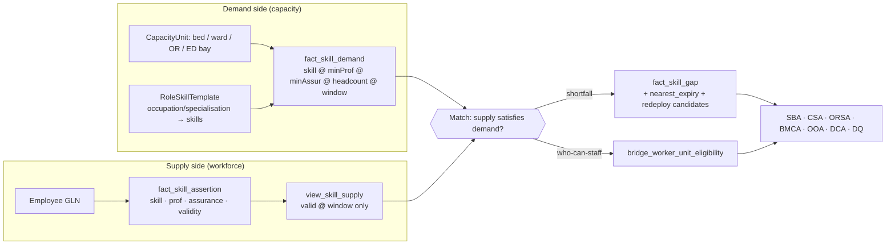

# Step 1 — Curavias Skills-Based Ontology Model (Organisation Extension)

### Detailed ontology model for skills-based metadata matching between workforce/employee and demand/available capacity

| Field | Value |
| ----- | ----- |
| **Prepared for** | Urs Rüegg — Sr Solution Engineer Hub, Microsoft Switzerland (CH-STU-InnoHub) |
| **Deliverable** | Step 1 of 4 — *Detailed Ontology Model* |
| **Scope** | Extends the **Curavias / HCC North-Star ontology** with the **Organisation layer** — Department, Specialisation, Workforce, Employee, Skill — and the **skill-supply ↔ skill-demand ↔ capacity** matching mechanism |
| **Builds on** | `HCC-North-Star-Ontology-Model-Analysis` (base ontology), `Curavias-Evidence-Based-Skills-Ontology-Analysis-and-Design` (assurance & evidence model), `Demo-Hospitals-Master-Data` (the three showcase tenants), `05_evidence_taxonomy` / `04_knowledge_base_register` (evidence-level pattern) |
| **Interop rails** | ESCO (skill concepts) · HL7 FHIR R5 (verified qualifications) · SNOMED CT (clinical acts) · ISCO-08 (occupations) · GLN (golden identifier) |
| **Status** | Design v1.0 — advisory, evidence-based, HITL-governed |
| **Date** | 19 July 2026 |

> **How this document relates to the prior work.** The `HCC-North-Star-Ontology-Model-Analysis` established the *upper* model (BFO/OBO continuant–occurrent skeleton, the **capacity-unit** abstraction over beds/OR/rooms/staff/equipment, and the two-layer reference↔Fabric-IQ realisation). The `Curavias-Evidence-Based-Skills-Ontology-Analysis-and-Design` established the *evidence* model (the L0–L4 assurance ladder, the 18-field skill-assertion schema, and the GLN golden thread). **This Step-1 document does the missing middle:** it makes the **Organisation** — Department, Specialisation, Workforce, Employee, Skill — a first-class part of the ontology, grounds every class in the actual Curavias master data, and specifies the **matching engine** that turns "how many bodies" into "how much valid competency, where, when."

---

## 0. The problem this model solves (one paragraph)

A hospital bed is only capacity if a *qualified, currently-valid* person can run it. Curavias' organisation master data already knows the **structure** — 3 tenants, 8 legal entities, 9 sites, 24 departments, and their bed and FTE counts (`Demo-Hospitals-Master-Data`). What it does **not** yet encode is the **competency layer**: which employee holds which skill, at what proficiency, proven by what evidence, valid until when — and which ward/OR/shift **requires** which skills. Skills-based matching needs both halves plus a join. This model supplies the missing half (Employee → Skill, evidenced) and the demand half (Capacity unit → required Skill), and connects them through a single, deterministic identifier — the **GLN** — so that "match employee to demand to available capacity" becomes a query, not a guess.

---

## 1. Design stance and the four extension concepts

### 1.1 Extend, do not replace

The model **reuses** the North-Star classes — `HospitalOrganisation`, `HealthcareFacility`, `Site`, `Ward/Unit`, `Room`, `Bed`, `CapacityUnit`, `HealthWorker`, `Shift`, `Encounter` — and the `Curavias-Evidence-Based-Skills-Ontology` classes — `SkillAssertion`, `EvidenceRecord`, `AssuranceLevel`, `IssuingAuthority`. It **adds** the four organisation concepts the request names, and binds them to the existing spine:

| Requested concept | Ontology treatment | Anchored in master data |
| ----------------- | ------------------ | ----------------------- |
| **Department (Fachbereich/Klinik)** | `Department` — an `OrganisationalUnit` bearing a `care-delivery function`, part-of a `Site` | The 24 `Department` rows (e.g. `CN-D7` *Intensiv- & Notfallmedizin*, `VT-D6` *Intensivstation*) |
| **Specialisation (Spezialisierung)** | `Specialisation` — a `care-competency-area` a department offers and a worker qualifies into (medical specialty, nursing NDS HF, therapy, technical) | Derived from the department `legal_form_or_role` text (e.g. *Kardiologie, Anästhesie, Intensivpflege*) |
| **Workforce (Personalbestand / Establishment)** | `WorkforcePosition` — a *planned, budgeted* role slot (establishment), distinct from the person who fills it | The `fte_approx` per department, decomposed into positions |
| **Employee (Mitarbeitende)** | `Employee` = a `Person` bearing a `HealthWorker` role at a Department; keyed on **GLN** | New — the synthetic workforce generated in Step 4 |
| **Skill (Kompetenz)** | `Skill` (reused) — a demonstrable competency, ESCO-aligned, asserted via evidence | New — the competency catalogue from Step 2 |

### 1.2 The two axes that must never collapse (carried from the evidence design)

Every skill a person holds is described on **two orthogonal axes** — this is the single most important modelling rule, taken directly from the `Curavias-Evidence-Based-Skills-Ontology-Analysis-and-Design`:

- **Proficiency (1–5): *how capable*** — novice → expert. Drives surge suitability and case-complexity allocation.
- **Assurance (L0–L4): *how proven*** — self-declared → federally registered. Drives **eligibility gating**.

A demand can therefore require *proficiency ≥ 4 **and** assurance ≥ L2-valid*, which is what lets the platform say "6 people are *certified* for ICU, but only 3 are expert-proficient and currency-valid."

### 1.3 Establishment vs. person — why "Workforce" and "Employee" are two classes

The request lists **Workforce** and **Employee** separately, and the ontology honours that. They answer different questions:

- **`WorkforcePosition`** (Workforce / *Stellenplan*) — the **budgeted establishment**: "Department CN-D7 is funded for 42 ICU-nurse FTE across a 3-shift pattern." It exists whether or not it is filled. Gaps against it are *structural vacancy*.
- **`Employee`** — the **actual person** filling (part of) a position. Gaps against **demand** (below) are *competency/currency* gaps, which is a different and finer signal.

Keeping them apart lets the model distinguish "we are 4 FTE short of budget" (an HR/recruiting problem for Skills-Manager) from "the beds are budgeted and staffed, but on Tuesday night only 2 of the rostered ICU nurses have a valid ACLS" (a capacity/safety problem for the SBA/CSA agents).

---

## 2. Core class catalogue (organisation + skills layer)

Classes marked **(reused)** come from the two prior designs; **(new)** are introduced here. `Kind` is the BFO category, consistent with the North-Star upper skeleton.

| Class | Kind | Definition | Binds to | Master-data anchor |
| ----- | ---- | ---------- | -------- | ------------------ |
| `Tenant` **(reused)** | independent continuant | One Curavias instance = one hospital provider | — | 3 tenants (`CN`,`CP`,`VT`) |
| `HospitalOrganisation` **(reused)** | organisation | Provider bearing a healthcare-organisation role | FHIR `Organization` | Hospital-Org / Hospital-Group rows |
| `LegalEntity` **(reused)** | organisation | Rechtsträger owning/administering facilities | FHIR `Organization` (type) | 8 Legal-Entity rows |
| `Site` **(reused)** | object | Physical location/campus | FHIR `Location` | 9 Site rows |
| `Department` **(new)** | organisational unit | A Klinik/Fachbereich bearing a care-delivery function, part-of a Site | FHIR `Organization`(part-of) / `HealthcareService` | 24 Department rows |
| `Specialisation` **(new)** | care-competency area | A named clinical/nursing/technical field a department offers and a worker qualifies into | ESCO occupation branch · SIWF title · SNOMED specialty | Derived from dept roles |
| `CapacityUnit` **(reused)** | object / time-slot | Bed, ward, ICU, OR slot, ED bay, dialysis station, delivery room, imaging modality — bears a capacity function + state | FHIR `Location`/`Slot` | beds per dept + generated units |
| `WorkforcePosition` **(new)** | information content entity | A budgeted establishment slot (occupation × department × FTE × shift pattern) | — (HRIS establishment) | `fte_approx` decomposed |
| `Person` **(reused)** | independent continuant | A human being | — | synthetic (Step 4) |
| `Employee` / `HealthWorker` **(new/reused)** | role | A person bearing a worker role at a Department; **GLN-keyed** | FHIR `Practitioner` (identifier = GLN) | synthetic (Step 4) |
| `OccupationRole` **(reused)** | role | The occupation held (nurse, anaesthetist, scrub tech…) | ESCO occupation / ISCO-08 | `dim_occupation_role` |
| `Skill` **(reused)** | disposition | A demonstrable competency | **ESCO skill URI** (+ SNOMED) | `dim_skill` (Step 2) |
| `SkillAssertion` **(reused)** | information content entity | worker × skill × evidence × validity × assurance × proficiency — **the atomic unit** | (§4.1 of evidence design) | `fact_skill_assertion` |
| `EvidenceRecord` **(reused)** | information content entity | The typed, tiered proof for one assertion | issuer + ref + assurance | embedded in assertion |
| `IssuingAuthority` / `TrustedSource` **(reused)** | independent continuant | Body that issued/verifies evidence | FHIR `qualification.issuer` | `dim_issuing_authority` |
| `AssuranceLevel` **(reused)** | quality | How proven (L0–L4) | — | `dim_assurance_level` |
| `ProficiencyLevel` **(reused)** | quality | How capable (1–5) | — | `dim_proficiency_level` |
| `ValidityPeriod` **(reused)** | temporal region | `valid_from … valid_until` | FHIR `qualification.period` | assertion columns |
| `SkillDemand` **(reused)** | requirement | A CapacityUnit/Shift needs skill @ min proficiency @ min assurance @ headcount | demand template | `fact_skill_demand` |
| `RoleSkillTemplate` **(new)** | information content entity | The reusable "this occupation/specialisation requires these skills" map | demand generator | `bridge_role_skill_demand_template` |
| `SkillSupply` **(reused)** | derived view | Count of valid assertions available in a time window | computed | `view_skill_supply` |
| `SkillGap` **(reused)** | derived | demand − supply per skill/unit/window | drives SBA/CSA | `fact_skill_gap` |
| `WorkerUnitEligibility` **(new)** | derived bridge | Pre-computed "can this worker *safely* staff this unit right now" | fast surge query | `bridge_worker_unit_eligibility` |
| `WorkIdProfile` **(new)** | information content entity | The consent-bound link to an external Work-ID skills passport | Work-ID | `dim_work_id_profile` (Step 3) |

---

## 3. The organisation hierarchy — grounded in the master data

The ontology's organisation spine is exactly the hierarchy already present in `Demo-Hospitals-Master-Data`, now typed and extended down to the person and the skill:

```text
Tenant (curanova | curalp | vialta)
  └─ HospitalOrganisation            (CN, CP, VT)
       └─ LegalEntity                (CN-LE1 … VT-LE5)     — Rechtsträger
            └─ Site                  (CN-S1 … VT-S1)       — Campus/Standort
                 └─ Department       (CN-D1 … VT-D8)       — Klinik/Fachbereich  ── offers ──▶ Specialisation
                      ├─ CapacityUnit (ward / ICU / OR / ED bay / dialysis …)    ── requires ──▶ SkillDemand
                      └─ WorkforcePosition (budgeted establishment)              ── filled_by ─▶ Employee
                                                                                        │
                                                                          Employee ── asserts ──▶ SkillAssertion ──▶ Skill
                                                                                        │                    (evidenced_by → EvidenceRecord → IssuingAuthority, AssuranceLevel, ValidityPeriod)
                                                                                        └─ (consent) ──▶ WorkIdProfile
```

**Worked anchor.** `CN-D7 — Intensiv- & Notfallmedizin` (`grounded_on: USZ Intensiv/Notfall`, 90 beds, ~720 FTE) *offers* the specialisations **Intensivmedizin**, **Notfallmedizin**, **Intensivpflege NDS HF**, **Anästhesiepflege NDS HF**. Its `CapacityUnit`s (six ICU wards + the Notfallzentrum) *require* skills like *ventilator management*, *ACLS-valid*, *critical-care nursing* at set proficiency/assurance floors. Its `WorkforcePosition`s are budgeted from the ~720 FTE. Its `Employee`s each *assert* skills evidenced against **GesReg** (nursing licence, L4), **OdASanté/SBFI** (NDS HF diploma, L3) and **SRC** (ACLS certificate, L2, expiring).

---

## 4. Relations (RO-style) — the object properties

```text
Tenant                 —— owns ——▶                 HospitalOrganisation
HospitalOrganisation   —— has_legal_entity ——▶     LegalEntity
LegalEntity            —— administers ——▶          Site
Site                   —— has_part ——▶             Department
Department             —— offers ——▶               Specialisation
Department             —— has_part ——▶             CapacityUnit
Department             —— budgets ——▶              WorkforcePosition
WorkforcePosition      —— defines_occupation ——▶   OccupationRole
WorkforcePosition      —— filled_by ——▶            Employee            (0..1, may be vacant)
Person                 —— has_role ——▶             Employee (HealthWorker)
Employee               —— member_of ——▶            Department
Employee               —— bearer_of ——▶            OccupationRole      (ESCO/ISCO)
Employee               —— qualifies_into ——▶       Specialisation
Employee               —— asserts ——▶              SkillAssertion
SkillAssertion         —— about_skill ——▶          Skill               (ESCO URI)
SkillAssertion         —— has_proficiency ——▶      ProficiencyLevel    (1..5)
SkillAssertion         —— evidenced_by ——▶         EvidenceRecord
EvidenceRecord         —— issued_by ——▶            IssuingAuthority    (TrustedSource)
EvidenceRecord         —— has_assurance ——▶        AssuranceLevel      (L0..L4)
EvidenceRecord         —— valid_during ——▶         ValidityPeriod
EvidenceRecord         —— verified_against ——▶     Registry (MedReg/GesReg/NAREG/PsyReg)
OccupationRole         —— requires (template) ——▶  RoleSkillTemplate ──▶ Skill @ minProf @ minAssur
Specialisation         —— requires (template) ——▶  RoleSkillTemplate ──▶ Skill @ minProf @ minAssur
CapacityUnit / Shift   —— requires ——▶             SkillDemand ──▶ Skill @ minProf @ minAssur @ headcount
SkillSupply            —— satisfies ——▶            SkillDemand
SkillGap               —— computed_from ——▶        (SkillDemand − SkillSupply)
WorkerUnitEligibility  —— derived_from ——▶         (Employee assertions vs CapacityUnit demand)
Employee               —— has_workid (consent) ─▶  WorkIdProfile
Skill                  —— aligned_to ——▶           ESCO / SNOMED concept
```

---

## 5. The matching engine — from headcount to valid competency

This is the core of what the request asks for: *skills-based metadata matching between workforce/employee and demand and available capacity*. It is a four-stage pipeline, all evaluated **at a point in time** (the forecast window) so that an expired credential silently drops out of supply.

### 5.1 Stage A — Express demand as skills, not headcount

A `CapacityUnit` (a bed, a ward, an OR slot, an ED bay) does not demand "a nurse." It demands a **bundle of skills at floors**. Two ways a demand row is produced:

1. **From a `RoleSkillTemplate`** — e.g. the occupation *ICU nurse* template says: `critical-care nursing ≥ P3/L3`, `ventilator management ≥ P3/L1-signoff`, `ACLS valid ≥ L2`, `ward-round language DE ≥ CEFR-B2/L2`. Encoded once (`bridge_role_skill_demand_template`), reused everywhere.
2. **From a `CapacityUnit` opening** — e.g. "open 2 monitored beds on ward CN-D7-ICU3 for the Tue-night shift" instantiates the template into concrete `fact_skill_demand` rows with `headcount_required` and `shift_window`.

### 5.2 Stage B — Compute supply as *valid* assertions

`view_skill_supply` counts, per (unit-or-pool × skill × window), the assertions where **all** hold:

```text
assurance_level ≥ demand.min_assurance
AND window ∈ [valid_from, valid_until]         -- currency: expired = not supply
AND proficiency_level ≥ demand.min_proficiency
AND jurisdiction_scope covers unit.canton      -- an L4 licence is canton-scoped
AND assertion is Gold (deny-by-default gate)
```

Supply is therefore a **temporal** quantity — "valid ICU supply *next Tuesday night*," not "ICU-badged headcount."

### 5.3 Stage C — Gap = demand − valid supply

`fact_skill_gap` = `headcount_required − supply` per skill/unit/window, decorated with **nearest-expiry** (which credential lapses first) and **redeploy_candidates** (who from other units could *safely* fill it). A positive gap is the actionable signal; a zero gap with a nearest-expiry inside the window is an *early-warning* signal.

### 5.4 Stage D — Eligibility bridge for fast surge

`bridge_worker_unit_eligibility` pre-computes, for each (Employee × CapacityUnit), whether the worker can *safely* staff that unit **right now** (all mandatory template skills present, valid, at floor), plus the `limiting_factor` when they cannot (e.g. "ACLS expired 2026-05-30") and their `nearest_cert_expiry`. This is what lets the CSA agent muster a surge team in one lookup instead of a cross-join at query time.

### 5.5 Matching, visually



### 5.6 Worked matching example (grounded in Curavias)

**Scenario.** BMCA proposes opening 4 additional monitored beds on `VT-D6 — Intensivstation` (Vialta, 12 IPS beds, ~110 FTE) for a winter surge.

1. **Demand:** the *monitored-bed* template instantiates `ventilator management ≥P3`, `critical-care nursing ≥P3/L3`, `ACLS valid ≥L2`, `DE ward-round language ≥B2` — `headcount_required = 4` for the night shift window.
2. **Supply:** `view_skill_supply` for Vialta ICU that window finds 6 nurses with the NDS HF Intensivpflege diploma (L3) — but only **3** have an ACLS valid through the window, and **1** of those is proficiency 2 (novice).
3. **Gap:** `4 − 2 = 2` (only 2 are simultaneously valid *and* proficiency ≥3). `nearest_expiry` = an ACLS lapsing in 9 days.
4. **Eligibility & delegation:** `bridge_worker_unit_eligibility` surfaces 2 CuraNova ICU nurses eligible to be redeployed (L4 licence covers canton HN; ACLS valid). SBA proposes an ACLS refresher for the near-expiry nurse *before* she becomes ineligible, and delegates the 2-person surge shortfall to CSA.

**The point:** the bed count said "12 → 16." The *skills* said "you can safely open 2, not 4, unless you refresh one ACLS and redeploy two." That gap is invisible to headcount planning and is exactly the "dramatic" improvement the evidence design predicted.

---

## 6. Assurance gating and the Gold "deny-by-default" rule (carried forward)

The matching engine only consumes **Gold** assertions. Promotion rules (from the evidence design, restated so this document is self-contained):

| Layer | Rule for a skill assertion |
| ----- | -------------------------- |
| **Bronze** | Raw ingest from HRIS / Work-ID / Skills-Manager / LMS / register — any assurance, unverified |
| **Silber** | Deduped on `(worker_gln, skill_id, evidence_ref)`; assurance computed from strongest evidence; validity parsed; language/PII classified |
| **Gold** | **Only assertions usable for capacity:** `assurance ≥ L2` **and** `now ∈ validity` **and** (for legally-gated roles) a matching **L4 licence** present. Everything else stays visible for discovery but is excluded from `view_skill_supply` |

`L0` (self-declared) and `L1` (manager sign-off) may **surface candidates** but are always flagged and never auto-counted as safety-critical supply. This is the same deny-by-default posture as the platform's PHI gates.

---

## 7. Fabric IQ operational realisation

Per the North-Star two-layer approach, the reference layer (this document, BFO/OBO-aligned, portable OWL/RDF) maps to the **Fabric IQ operational layer**:

| Reference class | Fabric IQ construct | Binding |
| --------------- | ------------------- | ------- |
| `Employee`, `Skill`, `SkillAssertion`, `Department`, `CapacityUnit`, `IssuingAuthority`, `SkillDemand` | Entity type | — |
| worker & skill & department dimensions | Entity properties | **Static binding** ← lakehouse (HRIS + ESCO reference) |
| assertion validity, CME/cert currency | Time-series properties | **Time-series binding** ← eventhouse |
| `member_of`, `has_part`, `about_skill`, `requires`, `evidenced_by` | Relationship type | FK relationship bindings |
| `SkillGap`, `SkillSupply`, `WorkerUnitEligibility` | Entity types bound to computed tables | derived views |
| **GLN verification connector** | scheduled job | keys on `worker_gln`, reconciles against MedReg/GesReg/NAREG → sets `verification_status = register-verified` |

The **GLN golden thread** makes every join deterministic: HR carries GLN (already used for e-billing/EPD), the three federal registers publish GLN, and FHIR `Practitioner.identifier` is GLN. No fuzzy name matching anywhere in the matching engine.

---

## 8. HL7 FHIR exchange contract (so evidence travels on open rails)

| Ontology class | FHIR resource / element |
| -------------- | ----------------------- |
| `Employee` / `HealthWorker` | `Practitioner` (`identifier` = **GLN**) |
| `OccupationRole` | `PractitionerRole.code` |
| `Specialisation` | `PractitionerRole.specialty` (FMH title / ESCO) |
| `Qualification` / `Certificate` / `Registration` | `Practitioner.qualification` (`code` + `issuer` + `period` + `identifier`) |
| `IssuingAuthority` | `qualification.issuer` (Organization) |
| `ValidityPeriod` | `qualification.period` |
| `Department` / `CapacityUnit` | `Organization`(part-of) / `Location`, `PractitionerRole.location` |

Curavias ingests a worker's verified credentials as a standard **FHIR `Practitioner` + `PractitionerRole`** bundle, codes the skills with **ESCO**, and never invents a proprietary interchange format. The internal ontology is richer (proficiency, assurance, demand/supply, gap, eligibility) but the *evidence* is portable.

---

## 9. What is deliberately not modelled

- **No PHI.** The skills ontology is about *workers*, not patients — a clean DSG boundary (skills are employee personal data, not patient health data).
- **No performance ranking.** The model records *evidenced competency and currency*, never a manager's quality/performance rating. Proficiency is an evidenced capability level, not an appraisal — consistent with Curavias' no-employee-performance-evaluation policy.
- **No auto-action.** Every skills-driven proposal (roster, redeploy, slate cover) is advisory and passes a HITL gate.

---

## 10. How the organisation extension improves matching — summary

| Before (headcount/role) | After (this model — skills, evidenced) |
| ----------------------- | -------------------------------------- |
| "CN-D7 has 720 FTE" | "CN-D7 has *N* nurses with valid ACLS **and** NDS HF Intensivpflege at proficiency ≥3 for the Tue-night window" |
| "the bed is staffed" | "the bed is staffable — or physically open but not safely coverable" (BMCA reconfiguration-feasibility) |
| "find an agency nurse" | "3 internal, currency-valid nurses can be redeployed first" (agency/overtime avoidance) |
| "two ICU nurses = same supply" | supply differentiated by proficiency **and** live currency |
| structural vacancy only | vacancy (Workforce) **and** competency/currency gap (Employee) as separate, routable signals |

The Organisation extension is what makes the evidence model *operational*: it names the departments and positions the skills attach to, and it wires those skills to the capacity units that demand them — so the platform can match, gap, and surge on **verified competency**, at the grain of a single shift.

---

*Prepared 19 July 2026 · Step 1 of 4 · advisory, evidence-based, HITL-governed · extends the Curavias North-Star and Evidence-Based Skills ontologies.*
