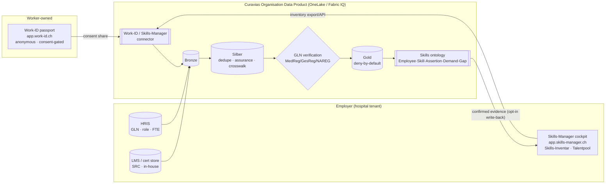

# Step 3 — Solution Design: Curavias × Work-ID × Skills-Manager

### Incorporating the Work-ID and Skills-Manager skills ecosystem into the Curavias ontology model and Organisation Data Product

| Field | Value |
| ----- | ----- |
| **Prepared for** | Urs Rüegg — Sr Solution Engineer Hub, Microsoft Switzerland (CH-STU-InnoHub) |
| **Deliverable** | Step 3 of 4 — *Solution Design Curavias & Work-ID & Skills-Manager* |
| **In-scope sources** | **Work-ID** — `app.work-id.ch` (individual skills passport) · **Skills-Manager** — `app.skills-manager.ch` (company skills-inventory cockpit; the Microsoft Innovation Hub Schweiz is a live tenant) |
| **Integrates with** | Step 1 ontology (`Employee`, `Skill`, `SkillAssertion`, `WorkIdProfile`) · Step 2 competency catalogue · the Curavias **Organisation Data Product** on OneLake/Fabric IQ |
| **Status** | Solution design v1.0 — product facts confirmed against public pages (July 2026); items needing vendor confirmation are flagged |
| **Date** | 19 July 2026 |

> **Confidence note.** Work-ID and Skills-Manager marketing and positioning are confirmed from the vendors' public sites. Their **internal proficiency scale, skill taxonomy, and API/export surface are not publicly documented.** This design therefore integrates through a **stable abstraction** (skill_id + level + confirmation-source + consent) and an **ESCO crosswalk**, with the vendor-specific mechanics isolated behind a connector so they can be confirmed with Work-ID AG without reworking the ontology. Every such item is marked **[confirm with vendor]**.

---

## 1. What Work-ID and Skills-Manager are (the confirmed picture)

Both products are operated by **Work-ID AG, Seestrasse 40, CH-8800 Thalwil** — one vendor, two faces of the *same* skills-based matching ecosystem for the Swiss labour and education market:

| Product | Audience | Role in the ecosystem | Confirmed characteristics |
| ------- | -------- | --------------------- | ------------------------- |
| **Work-ID** | The individual worker | "Der digitale Skills-Ausweis für die Schweiz" — a portable, lifelong skills passport | **Anonymous** and **owned by the worker**; the worker decides who may see it; documents "what workers can do"; suggests matching jobs; grows over a career; positioned as *Skills statt Lebenslauf* (skills instead of CV) |
| **Skills-Manager** | The company | The employer cockpit: **Skills-Inventar**, **Talentpool**, **1-Klick-Bewerbung**, internal + external skills-based matching | Finds who fits by skills "intern und extern"; surfaces latent internal talent ("up to 30% of missing skills are already in the company"); free Starter tier includes the Skills-Inventar |

**Ecosystem thesis (theirs):** *"Look for Skills, not Degrees"* — recruiting/deploying on skills is more predictive of performance than on diplomas. **Curavias' counter-thesis (ours):** in a hospital, skills are decisive **but only when evidence-backed** — a self-declared ICU skill cannot staff a ventilator shift. The two theses are complementary, and this design places them in exactly the right relationship: **Work-ID / Skills-Manager for breadth and discovery; federal registers for the safety-critical floor.**

**Relevance to Urs.** The Skills-Manager cockpit URL in the request is the **Microsoft Innovation Hub Schweiz** company tenant — i.e. the InnoHub *already runs* Skills-Manager. That makes the InnoHub a natural **reference implementation and pilot integration partner** for the Curavias connector, and gives you a real Skills-Inventar to test the crosswalk against.

---

## 2. The core design decision — where these sources sit in the model

The single most important decision: **Work-ID and Skills-Manager are *source systems*, not the evidence authority.** They feed the ontology's **Bronze** layer alongside HRIS and the LMS. Their skill assertions enter at **assurance L0–L1** (self-declared, or employer-confirmed inside Skills-Manager) and must **earn** any higher assurance by being reconciled — via **GLN** — against the federal registers (MedReg/GesReg/NAREG/PsyReg) that already anchor the Curavias evidence model.

```
                        ┌─────────────────────────── Curavias ontology (Steps 1–2) ───────────────────────────┐
 Discovery / breadth    │  Bronze ─▶ Silber ─▶ Gold (deny-by-default)                                          │
 (L0–L1)                │                        ▲                                                             │
 ┌───────────────┐      │   L0/L1 assertions     │  promotion needs valid, sufficient evidence                │
 │ Work-ID       │──────┼──▶ enter here ─────────┘  ── reconciled on GLN against ──▶  MedReg/GesReg/NAREG (L4) │
 │ Skills-Manager│──────┤                                                            SIWF/OdASanté (L3)        │
 └───────────────┘      │                                                            SRC/BAG (L2)             │
 Safety-critical floor  └──────────────────────────────────────────────────────────────────────────────────┘
 (L2–L4) from federal evidence — Work-ID/Skills-Manager never override it
```

**Why this is the safe and correct placement:**
1. It **preserves the assurance gate.** Nothing from a self-declared source can silently become safety-critical supply; Gold stays deny-by-default.
2. It **captures the breadth value.** Skills-Manager's "30% latent skills" insight is real for *non-safety-critical* competencies (languages, digital, leadership, transversal) and for **discovery** — surfacing that a ward nurse also holds a wound-care or de-escalation skill worth confirming.
3. It **respects Work-ID's ownership/anonymity model** — the integration is **consent-first** by construction (§4), which is a governance strength, not a workaround.

---

## 3. Integration architecture

### 3.1 Component view



### 3.2 Integration surface — three modes, connector-abstracted

The connector is built so the *mechanism* can be confirmed later without touching the ontology. Three modes, in order of preference:

| Mode | How | When to use | Status |
| ---- | --- | ----------- | ------ |
| **A. API sync** | REST/OAuth pull from Skills-Manager (company inventory) + per-worker Work-ID share token | Preferred steady-state | **[confirm with vendor]** whether a partner/API tier exists |
| **B. Bulk export/import** | Skills-Manager **Skills-Inventar export** (CSV/XLSX) → landed in Bronze; Work-ID shares via export/QR/token | Reliable fallback; works with the free Starter tier | Export exists in-product; exact format **[confirm]** |
| **C. Manual/attended** | Curavias DQ steward imports a periodic inventory snapshot | Pilot / smallest tenants (e.g. Vialta) | Always available |

All three land the *same* canonical Bronze shape (§3.3), so downstream logic is mode-independent.

### 3.3 The canonical inbound record (what the connector normalises to)

```yaml
inbound_skill_record:            # one per (worker, skill) from Work-ID / Skills-Manager
  external_system: work_id | skills_manager
  external_person_ref:  string   # Work-ID pseudonymous id OR Skills-Manager employee id
  worker_gln:           string?  # present only if the worker consented to link GLN [key to promotion]
  external_skill_code:  string   # vendor skill id/label
  external_skill_label: string
  self_or_confirmed:    self | employer_confirmed   # drives L0 vs L1
  external_level:       string?  # vendor proficiency label  [confirm scale]
  consent_scope:        string   # what the worker authorised the employer to see/use
  captured_at:          date
```

Note `worker_gln` is **optional** — Work-ID is anonymous by default, so the GLN link (and therefore any promotion above L1) only exists when the worker **consents** to it (§4).

---

## 4. Identity & consent — the make-or-break design element

### 4.1 Two identifiers, bridged by consent

| Identifier | Where | Nature |
| ---------- | ----- | ------ |
| **Work-ID pseudonymous id** | Work-ID | Anonymous, worker-owned; *not* inherently linkable to an employee |
| **GLN** | HRIS, MedReg/GesReg/NAREG, FHIR `Practitioner.identifier` | The Curavias golden thread; deterministic join to federal evidence |
| **Skills-Manager employee id** | Skills-Manager tenant | Employer-scoped id for a person in the company inventory |

The **`WorkIdProfile`** class (Step 1) and its table **`dim_work_id_profile`** (Step 4) hold exactly this bridge: `employee_id ↔ worker_gln ↔ work_id_ref ↔ consent_status ↔ visibility_scope`. The bridge only becomes active on **worker consent**.

### 4.2 Consent-first flow (respecting Work-ID's ownership model)

```
1. Employee opts in inside their Work-ID to share their passport with the hospital's Curavias/Skills-Manager tenant.
2. The share carries a consent_scope (which skills, for what purpose = capacity planning).
3. Curavias links the Work-ID share to the employee's HRIS record → populates worker_gln in dim_work_id_profile.
4. Only now can a shared skill be GLN-reconciled against federal registers and potentially promoted above L1.
5. Consent is revocable: on revoke, the WorkIdProfile is deactivated and Work-ID-sourced L0/L1 assertions drop from discovery (federally-verified L2–L4 assertions persist — they come from the registers, not Work-ID).
```

This is not merely compliant — it is the **cleanest** possible posture under the revised Swiss **DSG**: purpose-limited (capacity planning only), consent-based, and revocable, with staff/works-council *Mitwirkung* built into the opt-in. A skills graph of staff is culturally sensitive; letting the worker own the share (as Work-ID already does) is a feature.

---

## 5. Skill crosswalk — reconciling three vocabularies

Work-ID/Skills-Manager use their own skill labels; Curavias normalises on **ESCO** (+ SNOMED for clinical acts). The **`map_skill_crosswalk`** table (Step 4) is the reconciliation spine:

| Column | Purpose |
| ------ | ------- |
| `internal_skill_id` | Curavias catalogue id (e.g. `SK-NDS-IPS`, from Step 2) |
| `esco_uri` | Canonical ESCO concept — the shared anchor |
| `snomed_code` | Clinical granularity where needed |
| `skills_manager_skill_code` | Vendor code in the company inventory **[confirm]** |
| `work_id_skill_label` | Label as it appears in the worker's passport **[confirm]** |
| `mapping_confidence` | high/medium/low — low mappings are discovery-only, never gating |

**Matching logic.** An inbound external skill is resolved to `internal_skill_id` via (1) exact `external_skill_code` match, else (2) ESCO-label match, else (3) fuzzy/manual review by the DQ steward. Only `high`-confidence crosswalk rows may contribute to a **Gold** promotion; medium/low remain in discovery.

---

## 6. Bidirectional value — consume and (optionally) contribute

### 6.1 Curavias consumes (inbound) — the primary flow

- **Discovery of latent competency.** Skills-Manager's Skills-Inventar surfaces skills HR never recorded (a nurse's wound-care course, a technician's second language). These enter as **L0/L1 candidates** and feed the SBA "who *might* help" surfacing — always flagged, never auto-counted as safety supply.
- **Talent-pool for surge & vacancy.** Skills-Manager talent pools (internal + external) become a candidate source for `WorkforcePosition` vacancies and, for **non-safety-critical** roles, for flexing capacity — reducing agency spend, the exact ROM cost line Curavias monetises.

### 6.2 Curavias contributes back (outbound, opt-in) — the differentiator

Because Curavias reconciles skills against federal registers, it can **write a confirmation signal back** to Skills-Manager (with worker consent): "this skill is now employer-confirmed / register-verified." That raises the assurance of the worker's Work-ID entry and makes the *whole ecosystem* more evidence-based — turning Curavias from a consumer into a **trust contributor**. **[confirm write-back API with vendor]** — fallback is a periodic confirmed-skills export the employer uploads in Skills-Manager.

> **Guardrail on write-back:** contribute only *skill-confirmation* metadata (skill held, employer-confirmed, valid-until) — **never** patient data, never a performance rating, and never the raw federal record. The write-back asserts *"this competency is real and current,"* not *"this person is good."*

---

## 7. Mapping to the Curavias Organisation Data Product

The integration is realised as first-class artefacts in the OneLake/Fabric IQ data product:

| Artefact | Realisation |
| -------- | ----------- |
| **New Bronze tables** | `bronze_work_id_share`, `bronze_skills_manager_inventory` (canonical inbound shape, §3.3) |
| **Ontology entities** | `WorkIdProfile` (Fabric IQ entity) + relationship `Employee —has_workid→ WorkIdProfile` |
| **Reference/bridge tables** | `dim_work_id_profile`, `map_skill_crosswalk` (Step 4) |
| **Connector job** | scheduled ingest (mode A/B/C) → Bronze; crosswalk resolve in Silber; GLN reconcile in verification step |
| **Sync observability** | `fact_skills_manager_sync_log` — every run's direction, counts, status (Step 4) for the DQ agent |
| **Data contract** | `DC-WORKID-SKILLS-v1` (§8) governs the inbound payload and the assurance floor |
| **Governance** | consent captured in `dim_work_id_profile.consent_status`; Purview lineage tags `source_system = work_id | skills_manager` |

### 7.1 Data contract — `DC-WORKID-SKILLS-v1`

```yaml
contract: DC-WORKID-SKILLS-v1
subject: inbound_skill_record
identity:
  external_person_ref: required          # vendor pseudonymous id
  worker_gln: optional                    # present only with consent → enables promotion
required_fields:
  - external_system                       # work_id | skills_manager
  - external_person_ref
  - external_skill_code
  - self_or_confirmed                     # self → L0 ; employer_confirmed → L1
  - consent_scope
  - captured_at
assurance_rules:
  default_assurance: L0                    # self-declared
  employer_confirmed_assurance: L1
  promotion_above_L1_requires:
    - worker_gln present (consented)
    - high-confidence crosswalk to internal_skill_id
    - matching federal register record (MedReg/GesReg/NAREG) OR dated cert (SRC/BAG)
governance:
  sensitivity_class: PII-personal          # DSG personal data, not PHI
  consent_basis: required
  revocable: true
  no_performance_scoring: true
  write_back: opt_in_only                  # confirmation metadata only, never PHI/rating
```

---

## 8. Governance, DSG & risk (integration-specific)

- **Consent & ownership.** Work-ID is worker-owned and anonymous; the employer only sees what the worker shares. The integration inherits that — consent is the gate on linking, promoting, and writing back. Revocation is honoured.
- **Assurance floor holds.** No self-declared/marketing skill becomes safety-critical supply. Work-ID/Skills-Manager sit **below** the federal evidence floor by design.
- **Purpose limitation.** Skills data is used for **capacity planning only**; no secondary use, no cross-provider flow. Residency: the Curavias copy runs in the Switzerland-region deployment.
- **No performance evaluation.** The bridge records evidenced capability & currency, never a rating — even on write-back.
- **Mitwirkung.** Works-council/staff-rep engagement is a prerequisite for switching the connector on; the opt-in model makes this straightforward.
- **Vendor dependency.** API/export specifics are **[confirm with vendor]**; the connector abstraction (modes A/B/C) de-risks this — the ontology does not depend on any single mechanism.

---

## 9. Phased rollout

| Phase | Deliverable | Notes |
| ----- | ----------- | ----- |
| **P0 — Crosswalk seed** | Build `map_skill_crosswalk` for the Step-2 catalogue ↔ ESCO; pull the InnoHub Skills-Manager inventory as a test corpus | Uses the InnoHub tenant you already run |
| **P1 — Read-only discovery** | Connector mode B/C → Bronze; surface L0/L1 candidates in SBA discovery (flagged, non-gating) | No consent-to-GLN needed for pure discovery of the employer's own inventory |
| **P2 — Consent & promotion** | Work-ID consent flow → `dim_work_id_profile`; GLN reconcile; enable promotion of crosswalked skills that meet federal evidence | The evidence-based value unlocks here |
| **P3 — Talent-pool & surge** | Wire Skills-Manager talent pools to `WorkforcePosition` vacancies and non-safety-critical flex | Agency/overtime reduction |
| **P4 — Write-back** | Opt-in confirmation write-back to Skills-Manager/Work-ID | Curavias becomes a trust contributor **[confirm API]** |

---

## 10. Summary

Work-ID and Skills-Manager give Curavias two things it lacks: a **breadth** of latent, worker-owned skills (Work-ID) and an **employer cockpit** to inventory and pool them (Skills-Manager) — the InnoHub already runs the latter, making it the natural pilot. The solution design plugs both in as **consent-gated source systems feeding Bronze**, resolves their vocabularies to **ESCO** via a crosswalk, and — crucially — keeps them **below the federal evidence floor** so the safety-critical assurance gate is never weakened. Where the vendor's API and taxonomy specifics are not yet public, a **connector abstraction** and the `DC-WORKID-SKILLS-v1` contract isolate that uncertainty. The result: Curavias gets the labour-market skills breadth *and* keeps its evidence-based safety guarantee — and can even give trust back to the ecosystem through opt-in, consented confirmation write-back.

---

*Prepared 19 July 2026 · Step 3 of 4 · product facts confirmed against public pages July 2026; vendor-specific mechanics flagged for confirmation · advisory, consent-first, HITL-governed.*
