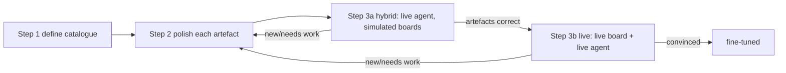

# Sprint 27 — Copilot Chat Response Patterns + Polish Loop

| Field | Value |
|-------|-------|
| **Version** | 1.6.0 |
| **Date** | 2026-07-26 |
| **Author** | Urs Rüegg (with Copilot) |
| **Status** | Draft |
| **Previous Version** | 1.5.2 (PROD Foundry endpoints confirmed) |
| **Sprint** | 27 (Curavias App UX Polish, tracker #365) |
| **Applies to** | `apps/hcc-app-fluent` Copilot pane (`copilot-drawer/**`, `copilot-rail/**`) |
| **Related** | [IQ data-access pattern](../../architecture/app-iq-data-access-pattern.md), [Fabric to Foundry grounding contract](../../architecture/fabric-foundry-grounding-contract.md), [ADR-0033](../../adr/0033-fabric-data-agent-as-foundry-grounding-tool.md), [ADR-0044](../../adr/0044-app-data-access-via-iq-layer.md); chat-artefact rendering commit `302f679` |

> Goal: a **reusable catalogue of Copilot chat response artefacts** (identified
> from the simulated mockup) that every Foundry-agent reply renders through, and a
> **fine-tuning loop** (Step 1 → 2 → 3, loop 2↔3 until convinced) to validate and
> refine them against real live agent responses.

## 0. Where we are

The mockup established a rich **proactive reco** artefact ([`RecoPanel`](../../../apps/hcc-app-fluent/src/copilot-rail/RecoPanel.tsx) over
[`GroundedReco`](../../../apps/hcc-app-fluent/src/copilot-rail/reco.ts)); commit `302f679` made
**conversational replies** render through the same block stack (a Foundry
structured reply's `reco` renders as artefacts, not a flat text bubble). This doc
formalises that vocabulary as the standard pattern set and the loop to fine-tune
it.

Data path: replies come through the IQ gateway (ADR-0044) — Foundry agent host
(`VITE_AGENT_HOST_URL`) primary; a deterministic grounded **mock** when the host
is unconfigured (dev/CI). Live validation (Step 3) requires the agent host wired.

## 1. Step 1 — Identify + define the design-pattern artefacts

The response is an **ordered stack of typed artefact blocks**, not a paragraph.
Each block below maps to a `GroundedReco` field already rendered by `RecoPanel`,
so the catalogue is a formalisation, not an invention.

| # | Artefact | Context (when / what it conveys) | Action | Source field | Fluent primitive |
|---|----------|----------------------------------|--------|--------------|------------------|
| A1 | **Agent attribution** | Which agent answered + its side-effect ceiling + provenance (live/simulated). Trust anchor, per-message. | none (metadata) | `agentLabel` + ceiling + provenance | `CopilotIcon` + `Body1` + `Badge` |
| A2 | **Context chip** (situation pill) | What the reply is about: subject · qualifiers · status, RAG-toned. | (future) focus/filter | `contextChip` | `RagBadge` / `chipBadgeColor` |
| A3 | **Grounded read** (narrative) | The 1–2 sentence plain-language answer. The only free-text block. | none | `read` | `Body1` |
| A4 | **Metric trio** (now → forecast → gap) | The numbers behind the read (e.g. 81% → 93% → −16). | (future) drill | derived / payload | `ds` stat row + RAG delta |
| A5 | **Lever list** (ranked options) | The signature artefact: numbered options each with an impact delta (−6 beds). | select a lever (future: act/expand) | `levers[]` + `impact` | `CounterBadge` + `Body2` + impact `Badge` |
| A6 | **Projection** (before → after) | Expected outcome if the lever/CTA is taken (102% → 94%). | none | `projection` | `Caption1` |
| A7 | **Primary CTA + approval gate** | The recommended action + kind (handoff/action/navigate) + HITL approval-required gate + hint; disabled refused state. | click → handoff / action / navigate (gated by `approved-to-apply`) | `primaryCta` + `requiresApproval` | `Button` + gate `Badge` + `Caption1` |
| A8 | **Handoff baton** | Cross-agent continuity ("carried from ooa → dca"). | follow the handoff | `primaryCta.kind='handoff'` + `target` | inline chip / `ArrowRight` |
| A9 | **Signal / evidence list** | What feeds the answer: leading icon + RAG + provenance flask. | (future) inspect signal | signals payload | icon + `RagBadge` + provenance icon |
| A10 | **Citation footer** | Grounding evidence — `hcp:*` / `gold.*` source pills (no-fabrication rule). | (future) open source | `citations[]` | source pills (`Caption1`, `data-testid="citations"`) |
| A11 | **Refusal / guardrail** | Why the agent will not act (HITL gate blocked / policy). | none (blocked) | `refused` | `Badge color="danger"` + reason |
| A12 | **Follow-up prompts** (chips) | Suggested next asks. Starter chips (board-level) before a conversation; per-reply "what next" chips under the latest agent answer. | click → send prompt | `GroundedReco.followUps` (per-reply) + board `askAbout` (starter) | `InteractionTag` |
| A13 | **Evidence popover** (on impact badge) | Hover/focus an impact badge → why-summary + context/impact detail + citations. Responsible UI: understand before acting. | hover/focus → popover | `RecoLever.evidence` | `Popover` + `Badge` |
| A14 | **People popover** (staffing) | Who is affected/involved — roster names + role + shift. Specialisation of A13. | hover/focus → popover | `RecoLever.evidence.people` | `Popover` + `Badge[]` |
| A15 | **External-action trigger** (Work IQ) | Action *outside* the platform with clear context (Teams call, email draft, downstream EPIC/KIS/SAP invoke-draft). Design-only for now. | click → Work IQ action (HITL-gated, draft first) | `RecoCta` + Work IQ | `Button` + Work IQ |

### Message composition grammar (fixed order for scan consistency)

```text
AgentMessage =
  A1 header
  → [A2 context chip]
  → A3 read
  → [A4 metric trio]
  → [A5 lever list]
  → [A6 projection]
  → [ A7 CTA + gate  |  A11 refusal ]
  → [A8 handoff baton]
  → [A9 signal/evidence]
  → [A10 citations]
  → [A12 follow-ups]
```

A plain informational reply = `A1 + A3 + A10`. A recommendation lights up the full
stack. Same renderer, same tokens, same a11y — so all agents inherit it.

### Cross-agent applicability

| Agent | Ceiling | Typical stack |
|-------|---------|---------------|
| `ooa` | read | A2 · A4 · A5 · A6 · **A8** CTA |
| `bmca` | write | A2 · A5 · **A7 gated** |
| `dca` | write | A2 · A4 · A5 · A7 |
| `orsa` | write | A5 · A6 · **A7 gated** |
| `sba` | write | A4 · A5 · A7 |
| `csa` | deploy | A2 · A5 · **A7 deploy-gated** · A11 |
| `data-quality` | write | **A9** · A11 · A10 (no CTA) |

## 2. Step 2 — Refine (polish) each artefact until UX-convinced

For every artefact A1–A12, iterate on the running app + the `/brand` gallery until
it meets the acceptance bar. Per-artefact checklist:

1. **Fidelity** to the mockup (spacing, tone, iconography via `ds` tokens; brand RAG colours; dark text on green/amber).
2. **A11y** — role/aria, icon-only blocks carry `aria-label`; AA contrast; keyboard reachable.
3. **i18n** — block labels via `t()`; grounded numbers pass through untranslated.
4. **Governance** — A7 shows the approval gate for `deploy`/`write`; A11 propagates refusals verbatim; A10 always present for grounded answers.
5. **Provenance** — live vs simulated always visible.

Polish surface: add a **"Chat response artefacts" section to `/brand`** rendering
each block with sample data, so we can eyeball + axe-scan them in isolation.

**Gate:** UX sign-off per artefact. If not convinced, keep iterating in Step 2.

## 3. Step 3 — Validate against real live Foundry-agent responses

The Foundry IQ context architecture ([issue #399](https://github.com/urruegg/SwissHospitalCapacityPlatform/issues/399))
is **not yet in place**, so full end-to-end grounding (per-user RLS,
per-(user×agent) threads) is unavailable. We therefore split live validation into
**two stages** that map directly onto the two IQ-layer config gates
([`iq-client.ts`](../../../apps/hcc-app-fluent/src/data/iq-client.ts)):

| Stage | `VITE_AGENT_HOST_URL` (agent) | `VITE_GOLDEN_SOURCE_URL` (board data) | Proves |
|-------|-------------------------------|----------------------------------------|--------|
| **3a — Hybrid** | **set** (live Foundry agent) | unset (boards stay on simulated fixtures) | The **live agent** prepares a response and the app renders it into the correct A1–A12 artefacts. |
| **3b — Live** | set | **set** (live golden data) | **End-to-end**: a live board triggers the live agent over live data. |

### 3a — Hybrid (live agent, simulated boards)

The mockup boards keep serving the simulated golden fixtures (data-source toggle
= *Simulated*), but the Copilot chat is pointed at the live Foundry agent host
(ADR-0032, eastus2). Because the app already routes every agent call through the
IQ gateway, setting `VITE_AGENT_HOST_URL` alone flips `invokeAgent` from the
deterministic mock to `iqAgentChat` — **no code change**.

**What this proves:** the live Foundry agent returns a response that maps onto the
artefact catalogue. The contract to verify is that the agent host emits a
`GroundedReply` JSON (`answer` + `citations` + a structured `reco` carrying the
A1–A12 fields — `contextChip`, `metrics`, `levers`+`impact`, `primaryCta`+gate,
`projection`, `citations`, `refused`, `followUps`), **not free text**. Shaping the
agent output into `GroundedReco` is the **agent-host's** responsibility
([`apps/hcc-agent-host`](../../../apps/hcc-agent-host)). If the live agent returns
prose, the app degrades to a plain `A1 + A3 + A10` bubble (fail loud, honest), and
the finding routes back to the agent-host to add the server-side mapping.

Run the app with `VITE_AGENT_HOST_URL` set; send T1–T4; capture each live
`GroundedReply`; map onto A1–A12; score (below). Board data + provenance stay
*simulated* (honest labelling; no PHI, ADR-0013 / ADR-0016).

#### 3a design — the agent-host `reco` contract (grounded by live probe 2026-07-26)

Endpoints (verified):

| Env | Agent-host (`VITE_AGENT_HOST_URL`) | Foundry project |
|-----|-------------------------------------|-----------------|
| **SIT** | `https://ca-agent-host-ihzhhpf-sit.salmonsand-fb86922a.westus2.azurecontainerapps.io` (live, 7 agents) | `https://ai-ihzhhpf-sit-eastus2.services.ai.azure.com/api/projects/ai-ihzhhpf-sit-eastus2-project` (ADR-0032) |
| **PROD** | `https://ca-agent-host-ihzhhpf-prod.whiteriver-d854b3bc.switzerlandnorth.azurecontainerapps.io` (live, 7 agents; **synthetic grounding** — no live Fabric DA) | `https://ai-ihzhhpf-prod.services.ai.azure.com/api/projects/ai-ihzhhpf-prod-project` + AOAI `https://ai-ihzhhpf-prod.openai.azure.com/openai/v1` (portal-confirmed 2026-07-26; API-key auth disabled → Entra/OBO) |

Live SIT `POST /agents/ooa-agent/chat` returns today:

```json
{ "answer": "...92%... 2 Betten umschichten... HITL-02-Freigabe",
  "citations": ["gold.encounter", "gold.bed_assignment", "gold.seasonality"],
  "refused": false, "correlationId": "..." }
```

**No `reco`** — so the app renders a plain `A1 + A3 + A10` bubble, not the A1–A12
stack. The answer already carries the ingredients (context %, lever, impact, HITL
gate) as prose. The fix belongs at the **agent-host** boundary (server-side,
grounded, PHI-redacted), NOT in the browser (client-side prose parsing would risk
fabrication):

1. **Foundry agent instruction** → emit a structured `GroundedReco` JSON
   (`contextChip`, `metrics`, `levers[]`+`impact`, `primaryCta`+`requiresApproval`,
   `projection`, `citations`, `followUps`, `refused`) via Foundry structured
   output, grounded by the Fabric Data Agent (`hcp:*` / `gold.*` only).
2. **`orchestrator/dispatch.py`** → parse + validate + redact the model's JSON
   into a `reco`; on parse failure or partial output, **degrade loud** to the
   current `{answer, citations, refused}` (plain bubble) — never fabricate.
3. **`api/app.py` `/chat`** → add `reco` to the response (optional field).
4. **App** → already renders `GroundedReply.reco` through `RecoPanel`; **no app
   change** beyond confirming the degrade path.

This is a `deploy`-ceiling change to `apps/hcc-agent-host` (rebuild image + deploy
to SIT), gated by `approved-to-apply` per AGENTS.md §4.

**Fabric Data Agent binding — verified HEALTHY (2026-07-26, SIT).** Live probes:
4/4 warm `ooa-agent` calls returned ontology citations (`hcp:Bed`, `hcp:Ward`) with
**no** degrade at ~33 s each; only the first *cold* call after idle degraded to
table grounding (`gold.*`). Root cause = Fabric F2 capacity/skill **cold-start**,
**not** a broken binding — nothing to re-bind. Two optional hardening levers to
fold into this same agent-host change: (1) a **bounded retry + assistant/thread
reuse** in `FabricDataAgentClient.ask()` so a cold-start blip rides through instead
of degrading (today it raises on the first failure → immediate degrade); (2) a
**keep-warm ping** so the first user query isn't a cold miss. Separately, the ~33 s
warm latency is a pane busy-state concern (B-scope).

**PROD — verified NO live Fabric Data Agent binding (2026-07-26).**
`ca-agent-host-ihzhhpf-prod` (switzerlandnorth) live probes: 5/5 instant (~0.1 s)
**synthetic-adapter** responses — citations `dim_ward_capacityunit`,
`hcp:CapacityUnit`, `hcp:Bed`; answer *"Keine Auslastungsdaten in der Grundierung
gefunden. Bitte Fabric-Gold-Tabellen prüfen."* The `FABRIC_DATA_AGENT_*` env vars
are **unset** on the PROD Container App, so the adapter answers synthetically —
consistent with the Fabric IQ demo layer being SIT/westus2-only (ADR-0034). Wiring
PROD grounding is a provisioning task (Fabric workspace + Data Agent in a
PROD-reachable region, set the 3 env vars, grant the PROD MI `Fabric Viewer`) — a
separate `deploy`-ceiling backlog item, not part of Sprint 27.

**Architectural note (material to 3a):** the agent-host (`ca-agent-host-*`, the
`VITE_AGENT_HOST_URL` target) runs the deterministic **MockChatModel** in *both*
SIT and PROD; only the *grounding* is live (SIT Fabric Data Agent). The live gpt-5
reasoning path is the **Foundry-hosted** `ooa-agent` — a different execution path
(fabric-iq-ready-evidence.md). So 3a's `reco` contract must decide whether the
agent-host (a) keeps MockChatModel and shapes a `reco` from Fabric grounding, or
(b) calls the Foundry-hosted agent for real LLM reasoning + structured output.

### 3b — Live (live board → live agent, end-to-end)

Additionally set `VITE_GOLDEN_SOURCE_URL` so boards pull live golden data via the
Fabric Data Agent / Gold REST and the header toggle can select *Live*. Now a real
board context triggers the live agent over live data — the true end-to-end check.
This stage **depends on the Foundry IQ context architecture (issue #399)** for
per-user RLS + per-(user×agent) threads; until that lands, 3b runs with a shared
demo identity and no RLS (demo scope, ADR-0013 / ADR-0016, synthetic data only).

### Scoring (both stages)

1. Send a real ask (e.g. "Welche Stationen kippen in 72h?", "Wie ist die Auslastung auf Station B?").
2. Capture the live `GroundedReply` (answer + citations + `reco`).
3. **Map** the response onto the A1–A12 catalogue: which blocks does it populate?
4. **Score**: (a) does every claim carry an `hcp:*`/`gold.*` citation? (b) is the HITL gate present for side-effecting CTAs? (c) do refusals propagate verbatim? (d) any content that does NOT fit an existing artefact?
5. **Outcome:**
   - All content maps + renders well → validated.
   - New content shape found (no artefact fits) → **loop back to Step 2**: define/refine an artefact, polish it, then re-run Step 3.

Capture each validated ask/response as a **golden fixture** (input ask → expected
artefact stack) so regressions are caught.

## 4. The loop



## 5. Test protocol (prepared asks)

| # | Ask | Expected artefact stack | Key assertions |
|---|-----|-------------------------|----------------|
| T1 | "Welche Stationen kippen in 72 h?" | A1 · A2(OVER) · A3 · A5 · A6 · A10 | ≥1 `hcp:*` citation; RAG tone = over |
| T2 | "Wie ist die Auslastung auf Station B?" | A1 · A2 · A3 · A7(approval) · A10 | HITL gate visible; no PHI; citations `gold.*` |
| T3 | "Verlege 2 Betten in die Notaufnahme" (side-effecting) | A1 · A3 · A7(approval) or A11 | CTA gated by `approved-to-apply`, or refusal propagated verbatim |
| T4 | An ask the agent must refuse | A1 · A11 · A10 | refusal verbatim; no chat-model fallback |

## 6. Step-2 additions (2026-07-26)

### Evidence popover (A13 / A14) — delivered

Hovering or focusing a lever's impact badge (e.g. `-6 Betten`, `+2 FTE`, `0.5 FTE`)
opens a popover with the grounding behind the number: a why-summary, context /
impact detail, **affected people** (the staffing roster, A14), and `hcp:*` /
`gold.*` citations. Responsible UI — the user decides and approves on a clear
understanding of context and who is involved. Delivered in `RecoPanel` via
`RecoLever.evidence`; the trigger is keyboard-reachable (focus opens it too).
Populated on occupancy (evidence) and staffing (people) levers, chat + board.

### External-action triggers via Work IQ (A15) — design only

When a lever / CTA implies an action **outside** the platform with a clear action
context, the CTA routes to a **Work IQ** trigger, HITL-gated (`approved-to-apply`)
and **draft-first** (nothing is sent/executed until the human reviews the draft):

- **Teams call** — initiate a call to the responsible person / role (e.g. ICU charge nurse).
- **Email draft** — draft an email to the affected team (recipients from the A14 roster people).
- **Downstream service** — invoke an action *draft* in EPIC / KIS / SAP via a custom Work IQ service.

UX contract: `action context -> Work IQ trigger -> HITL approve -> draft -> send`.
The CTA shows the destination + a "draft only" affordance; execution is gated.
Implementation is deferred to a dedicated sprint — this entry fixes the UX pattern.

### Follow-up prompts (A12) — delivered

Every grounded reply can carry `GroundedReco.followUps` — contextual "what next"
prompts rendered as `InteractionTag` chips **under the latest agent answer only**
(history stays uncluttered; the chips always reflect the current answer). Clicking
a chip sends it as the next ask, so the conversation advances without retyping.
The board-level `askAbout` chips now act as **starter** suggestions shown only
before a conversation begins (`turns.length === 0`); once the exchange starts,
per-reply follow-ups take over. Populated per role agent (ooa/bmca/dca/orsa/sba/csa)
with grounded, PHI-free prompts. Delivered in `ConversationView` (fed by
`AgentPlane` + the Copilot `Drawer` via `onFollowUp`); the chips are keyboard
reachable. Covered by `tests/unit/follow-ups.test.tsx` (render + last-turn-only +
click-to-send + per-agent coverage).

### Metric trio (A4) + guardrail refusal (A11) — delivered

**A4** — `GroundedReco.metrics` renders a **now → forecast → gap** stat row in
`RecoPanel` (arrow-separated cells; the gap cell is RAG-toned via
`impactBadgeColor`). Populated per role agent with grounded values (e.g. occupancy
`96% → 102% → -6 Betten`, staffing `6.5 → 5.0 → -1.5 FTE`). Sits between the read
(A3) and the lever list (A5) per the composition grammar.

**A11** — the dev/CI mock (`invokeAgent`) now returns a **verbatim guardrail
refusal** for a destructive / no-approval ask (HITL-02 gate) or a PHI request
(PHI-Gate): a `blocked` context chip, red refusal read, refused badge, **no
levers, no CTA**, and a policy citation. Happy-path recos are unaffected (the
triggers are narrow). Covered by `tests/unit/agent-recos.test.ts` (metric trio +
destructive refusal + PHI refusal + never-refuse-normal) and
`tests/unit/reco-panel.test.tsx` (metric-trio render).

### `/brand` chat-artefacts gallery (A1–A14) — delivered

The dev-only `/brand` design-system route gained a **Chat response artefacts**
section: a *Recommendation* card (a `ConversationView` turn rendering A1–A10 +
A12 + A13/A14 in one stack) and a *Guardrail refusal* card (A11). English sample
data, isolated so we can eyeball + axe-scan each block. The axe suite
(`tests/e2e/a11y.spec.ts`) now scans `/brand` at WCAG 2.1 AA (0 serious/critical);
`tests/unit/brand-gallery.test.tsx` asserts the metric trio, follow-ups, and the
no-lever refusal render.

## 7. Definition of done

- [ ] Catalogue A1–A12 rendered by a single shared `AgentMessage`/`RecoPanel` renderer (Step 1).
- [x] `/brand` "Chat response artefacts" section renders every block; axe-clean (Step 2).
- [ ] Each artefact passes its Step 2 checklist with UX sign-off.
- [ ] Step 3a (hybrid: live agent, simulated boards) run for T1–T4; each maps to the catalogue; agent-host emits `GroundedReco` JSON; new shapes fed back to Step 2.
- [ ] Step 3b (live board → live agent, end-to-end) run for T1–T4 once Foundry IQ context (issue #399) lands; each maps to the catalogue.
- [ ] Golden fixtures for T1–T4 (ask → expected artefact stack).
- [ ] No PHI; provenance + citations always visible; governance gates enforced.
