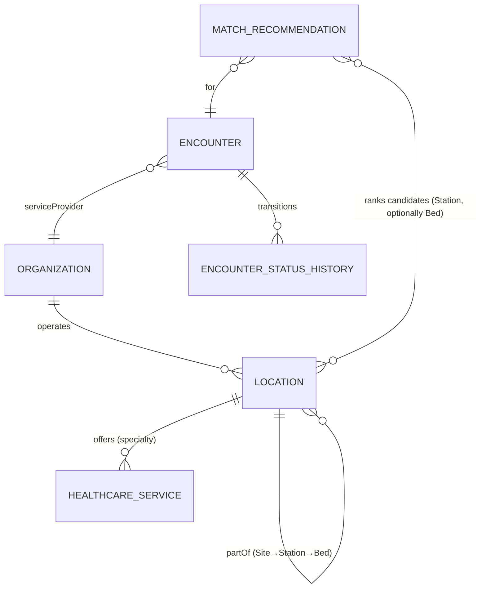
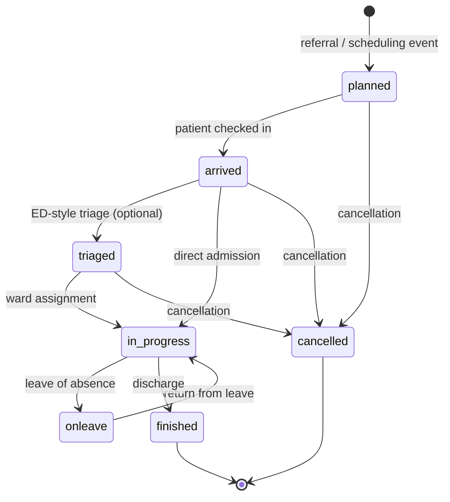

# Patient Capacity Planning — Data Product Design (Sprint 07)

| Field | Value |
| ----- | ----- |
| **Version** | 1.0.1 |
| **Date** | 2026-06-12 |
| **Author** | Urs Rüegg (with GitHub Copilot) |
| **Status** | Drafted (pending user review) |
| **Previous Version** | 1.0.0 (initial approved spec) |
| **Sprint** | [Sprint 07 — Data Platform and Data Products](../../sprints/sprint-07-data-platform-and-data-products-superpowers.md) |
| **Skill used** | `superpowers/brainstorming` |

## 1. Purpose

Define the data model and four data contracts that realise the Sprint 07
*patient capacity planning* data product. The design is grounded in the
**Microsoft Healthcare Common Data Model (CDM)** — specifically the
Foundational/Commoncore and Administration entities — which is itself aligned
to HL7 FHIR R4. Field names, identifiers, and state machines are taken
directly from FHIR where an equivalent exists, so future KIS integration is a
mapping exercise rather than a reinterpretation.

## 2. Conceptual model — the hotel-lens narrative

The Swiss Hospital Capacity Platform plans capacity the way a hotel chain
plans occupancy. The analogy is **conceptual only**: it is used in
documentation and stakeholder communication, but **no hotel terminology
appears in JSON Schemas, contract IDs, field names, or code**. This satisfies
AMA SD review `ER-01` (data minimisation, clinical-vocabulary alignment) and
keeps FHIR/KIS integration unambiguous.

| Hotel concept | Hospital reality (canonical term) | CDM/FHIR entity | Why it matters |
| ----- | ----- | ----- | ----- |
| Hotel group | Hospital | `Organization` | Legal/operational entity; tenancy boundary |
| Hotel property | Site | `Location` (`physicalType=si`) | Physical campus; a Hospital may run several |
| Floor/wing with profile | Station | `Location` (`physicalType=wa`) + `HealthcareService` | Carries specialty profile; primary planning unit |
| Room | Bed | `Location` (`physicalType=bd`) | Physical allocation unit; optional fidelity |
| Reservation request | Hospitalisation Encounter | `Encounter` (`class=IMP`) | Demand unit; the control unit per AMA review |
| Check-in → stay → check-out | Encounter lifecycle states | `Encounter.status` + `EncounterStatusHistory` | Drives LOS calibration and discharge-readiness |
| Room-type fit (smoking, accessible, sea view) | Required capabilities (isolation, monitoring, gender) | `Location.characteristic` | Drives the match |
| Allocation engine | Match recommendation engine | *(bespoke; no FHIR equivalent)* | Produces ranked top-N candidates |

## 3. Decisions baked into this design

These decisions were taken during the brainstorming session and are
non-negotiable inputs to the implementation plan.

| # | Decision | Rationale |
| ----- | ----- | ----- |
| D-01 | Hotel analogy is conceptual only; not in schemas/code | AMA `ER-01`, FHIR/KIS alignment |
| D-02 | Supply hierarchy is layered: Hospital → Site → Station → Bed | Mirrors real operational structure; supports multi-site providers |
| D-03 | Demand metadata is **lean + lifecycle** (option B); extensible for future criteria | Minimum-data principle (review constraint #2); supports LOS calibration |
| D-04 | Rich clinical context is a **separate future data product** `DP-EPISODE-CLINICAL-CONTEXT-v0` (option C3) | Keeps planning core compliant; clean separation of concerns |
| D-05 | Match output is **ranked top-N candidates** (cap N=5 for MVP) at Station granularity, with bed-level recommendation when supply emits beds | Matches how bed managers decide; advisory-only framing per SD.md |
| D-06 | Files extend the existing `data/synthetic/` pattern | Same governance gates, no new tooling |
| D-07 | Adopt FHIR/CDM terminology in contract IDs and field names | Microsoft Healthcare CDM becomes canonical reference |
| D-08 | Supply hierarchy collapses into **one recursive `Location` contract** + `Organization` | FHIR-native modelling; less code; easier validation |
| D-09 | Sprint 06 contract `DC-ONB-CAPACITY-v1` is **superseded** by `DC-SUPPLY-LOCATION-v1`/`DC-SUPPLY-ORGANIZATION-v1`; deprecation tracked separately | Cohesive supply model; provider extensions migrate |
| D-10 | Bed-level **recommendation** is in scope; bed-level **allocation** (state change, write-back) is out of scope | Middle-path: useful end-to-end without crossing into operational workflow |

## 4. The four contracts at a glance

All four schemas live under `data/synthetic/schema/` and are validated by an
extended `validate_datasets.py`.

| Contract ID | Role | CDM/FHIR source | Granularity |
| ----- | ----- | ----- | ----- |
| `DC-SUPPLY-ORGANIZATION-v1` | Tenancy and legal-entity catalog (Hospital) | `Organization` (Commoncore) | One record per Hospital |
| `DC-SUPPLY-LOCATION-v1` | Supply hierarchy: Site → Station → Bed (recursive) | `Location` + embedded `HealthcareService` | One record per Site/Station/Bed; discriminated by `physicalType` |
| `DC-DEMAND-ENCOUNTER-v1` | Hospitalisation demand (lean + lifecycle) | `Encounter` (`class=IMP`) + `EncounterStatusHistory` | One record per inpatient encounter |
| `DC-MATCH-RECOMMENDATION-v1` | Ranked top-N candidate Stations per Encounter (with bed-level recommendation when available) | *(bespoke)* | One record per Encounter, embedding ordered candidates |

### 4.1 Entity relationships

### 4.2 Extensibility model (locked from D-03)

All four contracts follow the same evolution rules:

1. **Lean core** — only fields the matching algorithm or governance demand.
2. **Optional capability extensions** — providers may emit additional fields
   under a namespaced `extensions.<provider>` object (same pattern as
   `DC-ONB-CAPACITY-HIRSLANDEN-v1`).
3. **Additive evolution** — MINOR version bumps for new optional fields;
   MAJOR bumps for breaking changes (with an ADR).
4. **Future rich product** — `DP-EPISODE-CLINICAL-CONTEXT-v0` lives in a
   later sprint and consumes its own contract; never embedded.

### 4.3 Relationship to existing Sprint 06 contracts

| Existing | Sprint 07 treatment |
| ----- | ----- |
| `DC-ONB-PATIENT-v1` | **Unchanged.** Identity onboarding lane; `DC-DEMAND-ENCOUNTER-v1` references `pseudonymId` from it. |
| `DC-ONB-CAPACITY-v1` (+ provider variants) | **Superseded** by `DC-SUPPLY-LOCATION-v1` + `DC-SUPPLY-ORGANIZATION-v1`. Provider variants migrate to `extensions.<provider>` on the new `Location` contract. Sprint 06 contract remains in place during migration; deprecation tracked in a separate follow-up. |

## 5. Supply contracts in detail

### 5.1 `DC-SUPPLY-ORGANIZATION-v1` (Hospital)

Maps to FHIR `Organization`. One record per Hospital. Lean by design.

| Field | Type | Req? | FHIR mapping | Notes |
| ----- | ----- | ----- | ----- | ----- |
| `contractId` | const string | ✓ | — | `"DC-SUPPLY-ORGANIZATION-v1"` |
| `organizationId` | string | ✓ | `Organization.id` | Pseudonymous stable key, e.g. `ORG-HIRSLANDEN` |
| `name` | string | ✓ | `Organization.name` | Public legal name; hospitals are public entities, no PHI risk |
| `organizationType` | enum | ✓ | `Organization.type` | Constrained to `prov` (provider) for MVP |
| `active` | boolean | ✓ | `Organization.active` | Soft-delete signal |
| `country` | enum | ✓ | `Organization.address.country` | `CH` for MVP (residency invariant) |
| `canton` | enum | ✓ | `Organization.address.state` | ISO 3166-2:CH; drives cantonal compliance routing |
| `dataResidencyRegion` | enum | ✓ | *(governance extension)* | `switzerlandnorth` \| `switzerlandwest` — matches SD.md residency baseline |
| `extensions` | object | ✗ | — | Provider-namespaced extension hook |

**Validator rules**:

1. `country === "CH"` (hard fail otherwise — MVP residency invariant).
2. `dataResidencyRegion ∈ { switzerlandnorth, switzerlandwest }`
   (matches `ADR-0003`).

### 5.2 `DC-SUPPLY-LOCATION-v1` (Site / Station / Bed — recursive)

Maps to FHIR `Location` + linked `HealthcareService`. Discriminated by
`physicalType`.

| Field | Type | Req? | FHIR mapping | Notes |
| ----- | ----- | ----- | ----- | ----- |
| `contractId` | const string | ✓ | — | `"DC-SUPPLY-LOCATION-v1"` |
| `locationId` | string | ✓ | `Location.id` | Stable pseudonymous key |
| `organizationId` | string | ✓ | `Location.managingOrganization` | FK to `DC-SUPPLY-ORGANIZATION-v1` |
| `physicalType` | enum | ✓ | `Location.physicalType` | **Discriminator**: `si` (site) \| `wa` (ward/station) \| `bd` (bed) |
| `partOfId` | string \| null | conditional | `Location.partOf` | Required when `physicalType ∈ {wa, bd}` |
| `name` | string | ✓ | `Location.name` | Operational label; no patient data |
| `status` | enum | ✓ | `Location.status` | `active` \| `suspended` \| `inactive` |
| `operationalStatus` | enum | ✓ when `physicalType=bd` | `Location.operationalStatus` (FHIR `v2-0116`) | `U` unoccupied, `O` occupied, `H` housekeeping, `I` isolated, `K` contaminated, `C` closed |
| `bedsTotal` | integer | ✓ when `physicalType=wa` | *(aggregate)* | Station-level supply capacity |
| `bedsAvailable` | integer | ✓ when `physicalType=wa` | *(aggregate)* | Live planning signal |
| `specialtyServiceIds` | `array<string>` | ✓ when `physicalType=wa` | `HealthcareService.id[]` | FK to embedded `HealthcareService` |
| `characteristic` | `array<enum>` | ✗ | `Location.characteristic` (R4-B+) | `isolation`, `cardiac-monitoring`, `negative-pressure`, `bariatric`, `single-room`, `pediatric-equipped`, `female-only`, `male-only` |
| `asOfTimestamp` | datetime (UTC) | ✓ | *(governance)* | Snapshot freshness |
| `extensions` | object | ✗ | — | Provider-namespaced |

**Embedded `HealthcareService` sub-shape** (referenced from
`specialtyServiceIds`):

| Field | Type | Req? | FHIR mapping | Notes |
| ----- | ----- | ----- | ----- | ----- |
| `healthcareServiceId` | string | ✓ | `HealthcareService.id` | |
| `specialty` | enum | ✓ | `HealthcareService.specialty` | Versioned via `specialtyTaxonomyVersion` |
| `specialtyTaxonomyVersion` | string | ✓ | *(governance)* | Inherited rule from Sprint 06 |
| `category` | enum | ✓ | `HealthcareService.category` | `inpatient`, `surgical`, `icu`, `rehab` |

> For MVP, `HealthcareService` records are **embedded** inside the Site or
> Station Location they belong to (not a separate contract). If providers
> later need cross-Location services (e.g. a roving cardiology team), promote
> to `DC-SUPPLY-HEALTHCARE-SERVICE-v1` in a follow-up sprint.

**Validator rules**:

1. `physicalType=si` → `partOfId === null`.
2. `physicalType=wa` → `partOfId` references a Location with `physicalType=si`.
3. `physicalType=bd` → `partOfId` references a Location with `physicalType=wa`.
4. `bedsAvailable <= bedsTotal` (Sprint 06 invariant `NFR-DQ-005`).
5. `physicalType=wa` requires `specialtyServiceIds.length >= 1`.
6. `organizationId` must resolve in the supplied Organization dataset.

### 5.3 Partition key strategy (Cosmos DB readiness)

Per repo Cosmos DB best practices (hierarchical partition keys):

| Contract | HPK |
| ----- | ----- |
| `DC-SUPPLY-ORGANIZATION-v1` | `organizationId` (single-key; catalog volume is trivial) |
| `DC-SUPPLY-LOCATION-v1` | `organizationId / partOfId / locationId` (Hospital-scoped scans + Station roll-ups) |

> Design intent only. Sprint 07 produces contracts + synthetic data;
> Cosmos containers are a later sprint.

## 6. Demand contract — `DC-DEMAND-ENCOUNTER-v1`

Maps to FHIR `Encounter` (`class=IMP`, inpatient) +
`EncounterStatusHistory` + `Encounter.hospitalization`. Renamed from
"Episode" per CDM alignment (the term *Episode of Care* in FHIR has a
broader meaning — multi-Encounter care relationships — and is the wrong fit).

### 6.1 Core record

| Field | Type | Req? | FHIR mapping | Notes |
| ----- | ----- | ----- | ----- | ----- |
| `contractId` | const string | ✓ | — | `"DC-DEMAND-ENCOUNTER-v1"` |
| `encounterId` | string | ✓ | `Encounter.id` | Pseudonymous stable key |
| `pseudonymId` | string | ✓ | `Encounter.subject` (pseudonymous) | FK to `DC-ONB-PATIENT-v1.pseudonymId`; never a direct identifier |
| `organizationId` | string | ✓ | `Encounter.serviceProvider` | FK to `DC-SUPPLY-ORGANIZATION-v1` |
| `class` | const enum | ✓ | `Encounter.class` | `"IMP"` (inpatient) — fixed for MVP |
| `status` | enum | ✓ | `Encounter.status` | See state machine in 6.3 |
| `admissionType` | enum | ✓ | `Encounter.hospitalization.admitSource` | `emergency` \| `elective` \| `transfer` \| `observation` |
| `requestedSpecialtyServiceId` | string | ✓ | `Encounter.serviceType` → `HealthcareService` | FK to a specialty service; drives match |
| `requiredCharacteristics` | `array<enum>` | ✗ | `Encounter.hospitalization.specialArrangement` | Subset of supply-side `characteristic` enum; **hard** constraints |
| `acuityBand` | enum | ✓ | `Encounter.priority` (banded) | `routine` \| `urgent` \| `asap` \| `stat` |
| `expectedArrivalTimestamp` | datetime (UTC) | ✓ | `Encounter.period.start` (planned) | Planning horizon anchor |
| `expectedLOSDays` | integer | ✓ | *(governance)* | Provider-estimated length of stay; calibrated over time |
| `expectedDischargeTimestamp` | datetime (UTC) | ✗ | *(derived)* | `expectedArrivalTimestamp + expectedLOSDays` if absent |
| `purposeTag` | enum | ✓ | *(governance, `CH-C01`)* | Inherited from `DC-ONB-PATIENT-v1` |
| `dataResidencyRegion` | enum | ✓ | *(governance)* | Must match parent Organization |
| `asOfTimestamp` | datetime (UTC) | ✓ | *(governance)* | Snapshot freshness |
| `extensions` | object | ✗ | — | Provider-namespaced |

### 6.2 Lifecycle as a sub-stream

Status transitions are an embedded array — FHIR-native, no clinical content.

| Field | Type | Req? | FHIR mapping |
| ----- | ----- | ----- | ----- |
| `statusHistory[]` | array | ✓ (min 1) | `EncounterStatusHistory` |
| ↳ `status` | enum | ✓ | `Encounter.status` |
| ↳ `periodStart` | datetime (UTC) | ✓ | `EncounterStatusHistory.period.start` |
| ↳ `periodEnd` | datetime (UTC) \| null | ✓ | Open-ended for current status |
| ↳ `locationId` | string \| null | ✗ | FK to `DC-SUPPLY-LOCATION-v1` (Station-level); set once status reaches `in-progress` |

A separate `locationHistory[]` for bed-level moves *within* a Station is **out
of scope for Sprint 07** — covered by `Encounter.location[]` in a later
sprint when bed-level fidelity is needed.

### 6.3 State machine (FHIR-aligned, MVP subset)

Valid `status` values (FHIR `EncounterStatus` subset): `planned`, `arrived`,
`triaged`, `in-progress`, `onleave`, `finished`, `cancelled`. Excluded from
MVP: `unknown`, `entered-in-error`.

### 6.4 Validator rules

1. `class === "IMP"` (outpatient/ED-only encounters out of scope for MVP).
2. `pseudonymId` matches the `DC-ONB-PATIENT-v1` pseudonym pattern.
3. `requestedSpecialtyServiceId` resolves to some `HealthcareService` in
   the supplied Location dataset.
4. `requiredCharacteristics` is a subset of the supply-side `characteristic`
   enum.
5. `statusHistory[].periodStart` strictly ordered; only the last entry may
   have `periodEnd === null`.
6. Current `status` equals the last entry's `status` in `statusHistory[]`.
7. `dataResidencyRegion` matches parent `Organization.dataResidencyRegion`.
8. `expectedLOSDays >= 1` (hard fail below 1); `expectedLOSDays > 90`
   emits a warning but does not fail validation (long-stay rehab encounters
   are legitimate).

### 6.5 PHI/PII guardrails (re-applies AMA `ER-01`)

The validator **rejects** any record containing:

1. Direct identifiers (name, DOB, AHV/SSN, address, phone, email).
2. Free-text clinical notes.
3. Diagnosis codes (ICD/SNOMED) other than `requestedSpecialtyServiceId`.
4. Any field outside the published schema
   (`additionalProperties: false`, strict mode).

### 6.6 Partition key strategy

| Contract | HPK |
| ----- | ----- |
| `DC-DEMAND-ENCOUNTER-v1` | `organizationId / encounterId` |

## 7. Match recommendation contract — `DC-MATCH-RECOMMENDATION-v1`

No native CDM/FHIR equivalent — this is a planning artefact, not a clinical
record. Advisory-only (humans decide), explainable per candidate, traceable
to inputs.

### 7.1 Core record (one per Encounter, point-in-time)

| Field | Type | Req? | Notes |
| ----- | ----- | ----- | ----- |
| `contractId` | const string | ✓ | `"DC-MATCH-RECOMMENDATION-v1"` |
| `recommendationId` | string | ✓ | Stable key per run, e.g. `REC-2026-06-12T14:32:00Z-ENC-2026-0001` |
| `encounterId` | string | ✓ | FK to `DC-DEMAND-ENCOUNTER-v1` |
| `organizationId` | string | ✓ | FK to `DC-SUPPLY-ORGANIZATION-v1`; matching is scoped within one Hospital for MVP |
| `generatedAt` | datetime (UTC) | ✓ | When the recommendation was computed |
| `validUntil` | datetime (UTC) | ✓ | Hard expiry; UI must not display stale recommendations |
| `algorithmId` | string | ✓ | Identifier of the matching algorithm version |
| `algorithmVersion` | string | ✓ | Semver |
| `inputSnapshot` | object | ✓ | Trace block (see 7.3) |
| `candidates` | array (1..5) | ✓ | Ordered top-N (cap N=5 for MVP) |
| `status` | enum | ✓ | `advisory` (only valid value in MVP) |
| `dataResidencyRegion` | enum | ✓ | Must match parent Organization |
| `extensions` | object | ✗ | Provider-namespaced |

### 7.2 Candidate sub-shape

| Field | Type | Req? | Notes |
| ----- | ----- | ----- | ----- |
| `rank` | integer | ✓ | 1..N, dense, no gaps |
| `stationLocationId` | string | ✓ | FK to `DC-SUPPLY-LOCATION-v1` with `physicalType=wa` |
| `recommendedBedLocationId` | string \| null | conditional | Required when parent Hospital emits `physicalType=bd`; null otherwise |
| `fitScore` | number (0.0–1.0) | ✓ | Composite score; not a probability |
| `capacityHeadroom` | integer | ✓ | `bedsAvailable - committedDemand` at `generatedAt` |
| `expectedAdmitWindowStart` | datetime (UTC) | ✓ | Earliest admit time given current supply |
| `expectedAdmitWindowEnd` | datetime (UTC) | ✓ | Latest acceptable admit time before fit degrades |
| `explanationFactors` | `array<object>` | ✓ (min 1) | See 7.4 |
| `bedFitFactors` | `array<enum>` | conditional | Required when `recommendedBedLocationId` is non-null: `single-room-available`, `isolation-capable`, `monitoring-equipped`, `bariatric-equipped`, `last-cleaned-within-2h`, `gender-constraint-met` |
| `hardConstraintsMet` | boolean | ✓ | True iff every `requiredCharacteristic` is satisfied |
| `softConstraintGaps` | `array<string>` | ✗ | Preferences not met (informational) |

> **Cap at N=5** for MVP. Bed managers don't reason over more than a handful;
> larger N is a future optimisation product (bipartite assignment plan).

### 7.3 `inputSnapshot` — traceability block

Without this block we can't defend a recommendation in a clinical review.

| Field | Type | Req? | Notes |
| ----- | ----- | ----- | ----- |
| `encounterAsOf` | datetime (UTC) | ✓ | `asOfTimestamp` of the Encounter at compute time |
| `supplyAsOf` | datetime (UTC) | ✓ | Newest `asOfTimestamp` across consulted Location records |
| `consideredStationIds` | `array<string>` | ✓ | Every Station the algorithm evaluated (not just the top-N); enables fairness audits |
| `excludedStationIds` | `array<object>` | ✗ | `{stationId, reason}` for hard-constraint failures |

### 7.4 `explanationFactors` — per-candidate justification

Controlled vocabulary so UI and copilot render consistent reasons.
**Not free text** — that would drift toward clinical content.

| Field | Type | Req? | Notes |
| ----- | ----- | ----- | ----- |
| `factor` | enum | ✓ | `specialty-match`, `capacity-headroom`, `characteristic-match`, `admit-window-fit`, `acuity-fit`, `partial-characteristic-match` |
| `weight` | number (0.0–1.0) | ✓ | Contribution to `fitScore`; weights sum to 1.0 |
| `evidence` | string | ✗ | Short structured snippet, no PHI |

### 7.5 Validator rules

1. `candidates.length >= 1 && <= 5`.
2. `candidates[*].rank` is `1..length`, dense, ordered ascending;
   `fitScore` non-increasing with rank.
3. Every `stationLocationId` resolves to a `DC-SUPPLY-LOCATION-v1` with
   `physicalType=wa`.
4. If `recommendedBedLocationId` is set, its `partOfId === stationLocationId`.
5. If the parent Hospital emits any `physicalType=bd` records,
   `recommendedBedLocationId` is required on every candidate.
6. `hardConstraintsMet === true` for **all** included candidates (anything
   failing hard constraints belongs in `inputSnapshot.excludedStationIds`).
7. `validUntil > generatedAt` and
   `(validUntil - generatedAt) <= 60 minutes` (MVP staleness bound).
8. `sum(explanationFactors[*].weight)` ≈ 1.0 (±0.01 tolerance).
9. `status === "advisory"` (MVP guard).
10. `additionalProperties: false` (strict mode).

### 7.6 Partition key strategy

| Contract | HPK |
| ----- | ----- |
| `DC-MATCH-RECOMMENDATION-v1` | `organizationId / encounterId / recommendationId` |

### 7.7 Lifecycle and retention (design intent, not Sprint 07 implementation)

1. Recommendations are **append-only** — a new run produces a new
   `recommendationId`, never updates an old one
   (`NFR-AI-003`, `CH-C03`).
2. Retention class **R3** (AI trace and model evidence — 24 months,
   per `DATA.md`).
3. `dataResidencyRegion` inherited from the Encounter; no cross-region
   replication for MVP.

## 8. Sample-data generator

Ships as `data/synthetic/generate_planning_datasets.py`. Same pattern as the
existing validator.

### 8.1 Configuration knobs

| Knob | Default | Purpose |
| ----- | ----- | ----- |
| `--organizations` | 2 | Number of Hospitals (default pseudonyms: Hirslanden, Zollikerberg) |
| `--sites-per-org` | 2 | Sites per Hospital |
| `--stations-per-site` | 6 | Specialty mix |
| `--beds-per-station` | 12 | Bed-level supply (gated by `--with-beds`) |
| `--with-beds` | false | Emit `physicalType=bd` records; activates bed-level recommendation |
| `--encounters` | 500 | Inpatient demand records |
| `--horizon-days` | 14 | Spread for `expectedArrivalTimestamp` |
| `--seed` | `42` | Deterministic generation for golden-task fixtures |

### 8.2 Outputs

1. `data/synthetic/datasets/dc-supply-organization-v1.sample.json`
2. `data/synthetic/datasets/dc-supply-location-v1.sample.json`
3. `data/synthetic/datasets/dc-demand-encounter-v1.sample.json`
4. `data/synthetic/datasets/dc-match-recommendation-v1.sample.json`
5. `data/synthetic/datasets/manifest.json` — parameters, counts, checksums

### 8.3 Generator-enforced guarantees

1. Only enum values from published schemas.
2. No direct identifiers — only pseudonymous IDs.
3. All records carry `dataResidencyRegion ∈ { switzerlandnorth, switzerlandwest }`.
4. Distribution shaped to be realistic, **not** real: `acuityBand` weighted
   (60% routine / 25% urgent / 12% asap / 3% stat); specialty mix matches
   Swiss ward distribution priors at the cantonal level.

### 8.4 Stub matcher (just enough to populate the recommendation contract)

A **deterministic rules pass**, not an AI model:

1. Filter Stations within the Encounter's Hospital by
   `requestedSpecialtyServiceId`.
2. Drop Stations that fail `requiredCharacteristics` (recorded in
   `inputSnapshot.excludedStationIds`).
3. Score remaining Stations on `capacityHeadroom`, `characteristic-match`,
   `admit-window-fit`.
4. If `--with-beds`: within the chosen Station, filter beds on
   `operationalStatus='U'`, score against Encounter `requiredCharacteristics`,
   pick the best; emit `bedFitFactors[]`.
5. Emit top-5 candidates with `explanationFactors`.

The stub matcher is **not** a commitment to a real matching algorithm — that
is the AI lane in a later sprint.

## 9. Validator extensions

Extend `data/synthetic/validate_datasets.py` with four new schema bindings
and cross-contract checks.

| Check | Where | Severity |
| ----- | ----- | ----- |
| JSON Schema strict validation per contract | per file | error |
| `physicalType` parent/child hierarchy (§5.2 rules 1–3) | locations | error |
| `bedsAvailable <= bedsTotal` invariant | stations | error |
| FK resolution: encounter→organization, encounter→service, recommendation→encounter+station(+bed) | cross-file | error |
| Residency consistency (Org/Encounter/Recommendation alignment) | cross-file | error |
| Recommendation explanation weights sum ≈ 1.0 | recommendations | error |
| Bed-level recommendation required when supply emits beds | recommendations | error |
| Forbidden-field scan (Sprint 06 PHI denylist + clinical-code denylist) | all files | error |
| Freshness: every `asOfTimestamp` within 24h of `manifest.generatedAt` | all files | warn |

CI gate: `validate_datasets.py` continues to run on every PR touching
`data/synthetic/**` or `docs/DATA.md`.

## 10. Deliverables checklist (Sprint 07 exit)

| # | Artefact | Path | Status |
| ----- | ----- | ----- | ----- |
| 1 | `DC-SUPPLY-ORGANIZATION-v1` JSON Schema | `data/synthetic/schema/dc-supply-organization-v1.schema.json` | new |
| 2 | `DC-SUPPLY-LOCATION-v1` JSON Schema | `data/synthetic/schema/dc-supply-location-v1.schema.json` | new |
| 3 | `DC-DEMAND-ENCOUNTER-v1` JSON Schema | `data/synthetic/schema/dc-demand-encounter-v1.schema.json` | new |
| 4 | `DC-MATCH-RECOMMENDATION-v1` JSON Schema | `data/synthetic/schema/dc-match-recommendation-v1.schema.json` | new |
| 5 | Generator script (incl. stub matcher) | `data/synthetic/generate_planning_datasets.py` | new |
| 6 | Synthetic datasets (4 files + manifest) | `data/synthetic/datasets/` | new |
| 7 | Validator extensions | `data/synthetic/validate_datasets.py` | edit |
| 8 | Validator unit tests for new rules | `data/synthetic/tests/` | new |
| 9 | `docs/DATA.md` update — register new contracts, deprecation note for `DC-ONB-CAPACITY-v1` | `docs/DATA.md` | edit (MINOR) |
| 10 | Sprint 06 terminology follow-up note (Episode → Encounter) | `docs/sprints/sprint-07/cdm-terminology-followup.md` | new |
| 11 | This design spec | `docs/superpowers/specs/2026-06-12-patient-capacity-data-product-design.md` | new |

## 11. Requirements traceability

| Requirement | How satisfied |
| ----- | ----- |
| `FR-DATA-001` | Demand contract ingests inpatient encounter events; lifecycle covers admit/discharge signals |
| `FR-DATA-002` | All four contracts FHIR R4-aligned via Microsoft Healthcare CDM |
| `FR-DATA-003` | Curated supply + demand + match form the first planning data product |
| `FR-DATA-005` | Contracts are the governed semantic boundary for dashboard and copilot consumption |
| `FR-DATA-006` | Generator and contracts shaped for ingestion from KIS/EHR, ED, bed-management, staffing/planning |
| `FR-DATA-008` | `inputSnapshot` block + append-only recommendation lifecycle provide source-to-consumption trace |
| `FR-ONB-003` | Provider-specific specialty profiles via `HealthcareService.specialty` + `extensions.<provider>` |
| `NFR-COMP-011` | Strict `additionalProperties: false`; PHI/PII denylist extended to new contracts |
| `NFR-DQ-005` | `bedsAvailable <= bedsTotal` invariant carried forward; specialty taxonomy versioning |
| `NFR-AI-003` | `algorithmId`/`algorithmVersion`/`generatedAt` on recommendations; append-only |
| `NFR-AI-004` | `explanationFactors` + `bedFitFactors` + `inputSnapshot.consideredStationIds` |
| `CH-C01` | `purposeTag` carried into Encounter contract |
| `CH-C03` | `inputSnapshot.consideredStationIds` + `excludedStationIds` provide fairness/audit trace |
| `CH-C05` | `dataResidencyRegion` invariants validated across contracts |
| AMA `ER-01` | Lean schema; rich attributes deferred to `DP-EPISODE-CLINICAL-CONTEXT-v0` |
| `ADR-0003` | `dataResidencyRegion` constrained to Swiss regions |

**Not addressed by this design** (intentional — these are integration-flow
requirements, not planning-data-product requirements):
`FR-DATA-004` (partner acknowledgements) and `FR-DATA-007` (outbound
orchestration) are covered by the integration lane in a later sprint.

## 12. Scope guards (what Sprint 07 explicitly does NOT do)

1. No real Cosmos DB containers, no Fabric pipelines, no ingestion code —
   contracts + synthetic data only.
2. No real matching algorithm — stub rules-based only.
3. No bed-level **allocation** workflow (`DC-ALLOCATION-ASSIGNMENT-v1`).
   Sprint 07 produces *recommendations* (advisory, stateless), not
   *allocations* (state change, write-back, conflict resolution).
4. No `DP-EPISODE-CLINICAL-CONTEXT-v0` — explicitly deferred (D-04).
5. No Sprint 06 contract removal — `DC-ONB-CAPACITY-v1` is marked
   deprecated; removal in a later sprint with a migration note.
6. No multi-Hospital matching — Encounter→Station matching is scoped
   within one Organization.
7. No outpatient/ED-only encounters (`Encounter.class != IMP`).

## 13. Risks and open questions

| Risk | Mitigation |
| ----- | ----- |
| Sprint 06 vocabulary still uses "episode" loosely | Deliverable #10 — separate CDM terminology follow-up note; rename is a separate PR |
| `Location.characteristic` is FHIR R4-B+ — may not be in every KIS partner's FHIR profile | Use the codes; map at integration boundary in a later sprint |
| `requestedSpecialtyServiceId` assumes the demand-side system can emit a service reference | Validator allows either: native service ID, or a string that resolves via the taxonomy version |
| Synthetic data realism is shallow (priors only) | Acceptable for MVP; tighten with provider-supplied distributions in a later sprint |
| Bed-level recommendation makes the recommendation contract larger | Bounded by N=5 cap + controlled `bedFitFactors` enum; no free text |

## 14. Next step

Hand off to the `superpowers/writing-plans` skill to produce an implementation
plan for Sprint 07 deliverables 1–10 above, with TDD slices per contract and
verification-before-completion gates per AGENTS.md.
