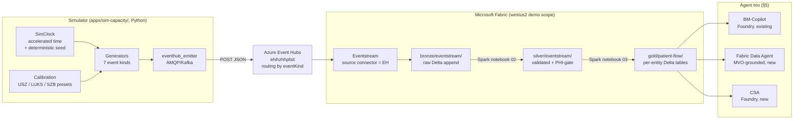
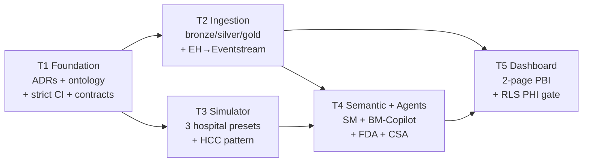

<!-- markdownlint-disable MD060 -->
<!-- Design spec uses mixed compact + standard table pipe styles for readability -->
<!-- across 35 deliverables + 7 event kinds + 6 DAX measures + 12 ontology classes. -->
<!-- Consistency of prose > pipe-style purity. Same pattern as                    -->
<!-- docs/reviews/2026-06-29-ama-capacity-metadata-review.md.                     -->

# Design Spec — Sprint 09 v2.0.0 Refinement (Art-of-Possible MVP Demo)

| Field | Value |
| ----- | ----- |
| **Version** | 1.0.0 |
| **Date** | 2026-07-02 |
| **Author** | Urs Rüegg (brainstormed with GitHub Copilot) |
| **Status** | Approved for planning (Superpowers `brainstorming` complete; transitions to `writing-plans`) |
| **Previous Version** | — (new spec) |
| **Supersedes** | [sprint-09 v1.3.0](../../sprints/sprint-09-master-data-simulation-and-capacity-dashboard.md) via a v2.0.0 rewrite (MAJOR bump — restructures tracks, adds MVO Track scope, adds two ADRs, adds three data agents) |
| **Depends on** | [ADR-0013](../../adr/0013-temporary-us-region-demo-scope.md), [ADR-0014](../../adr/0014-fabric-iq-ontology-target-backbone-ga-gated.md), [OPERATIONS.md v1.4.0](../../OPERATIONS.md), [PRD.md v1.4.0](../../PRD.md), [docs/ontology/*](../../ontology/), [DC-OR-*-v1 contracts](../../../data/synthetic/schema/) |
| **Realises** | User brief: "outcome a refined sprint 09 implementation plan and make it ready to implement it" — brief items A–G + constraints 1–8 |
| **Baseline commit** | `731802b` (main head after PRs #81 + #90 landed) |

---

## 0. Executive Summary

**Sprint goal.** Deliver a `westus2`-based reference-implementation MVP demo of the Swiss AI-Powered Patient Flow platform using GA + Preview Fabric services: a calibrated real-time simulator emits demand + bed-state events through **Event Hubs → Fabric Eventstream → Delta lakehouse → semantic model + MVO ontology → Power BI dashboard replicating the HCC utilization pattern**, driven by an **agent trio** (existing Foundry BM-Copilot / new Fabric Data Agent / new Foundry CSA). Every artefact is designed for lift-and-shift to `switzerlandnorth` when Fabric IQ GA lands. **No SQL Server. No PHI.**

**Five tracks:** T1 Foundation → T2 Ingestion ∥ T3 Simulator → T4 Semantic + Agents ∥ T5 Dashboard (35 deliverables total).

**Two new ADRs:** ADR-0015 (skip SQL for MVP), ADR-0016 (no PHI in demo scope — formalises AMA SD Review §3.3/§5.4).

**Sprint 08 status.** Bronze/silver/gold notebook chain and SQL KIS source never fully shipped. Sprint 00 delivered `gold.demand_encounter` (3 rows via lakehouse-direct load). Sprint 09 v2.0.0 supersedes both — it keeps the bronze/silver/gold notebook discipline but reroutes source from SQL to (a) direct-upload for reference/master data and (b) Event Hubs → Eventstream for the simulator.

---

## 1. Scope & Principles

### 1.1 Anchor decisions (from brainstorming session)

| # | Decision | Rationale |
|---|---|---|
| Q1 | **Reference-implementation skeleton** — every westus2 artefact carries a Swiss-region lift-and-shift path | Preserves reusability of demo work when Fabric IQ Switzerland GA lands |
| Q2 | **Triple-agent surface** — BM-Copilot (Foundry, existing) + Fabric Data Agent (new) + CSA (Foundry, new) | Widest MVP-realistic demo narrative; excludes ORSA (no live OR data yet) and SBA (no staffing data yet) |
| Q3 | **Event Hubs → Fabric Eventstream** (reuse `ehihzhhpfsit`) | Swiss-GA-safe: EH is GA in `switzerlandnorth`; simulator + EH survive Fabric-GA-slip |
| Q4 | **Merge #81–#89 first, then land v2.0.0 refinement** | Preserves each PR's audit trail cleanly; refresh artefacts (ADR-0014, PRD §H, ontology skeleton, CI check, DC-OR contracts, OPERATIONS.md) remain valid under v2.0.0 |

### 1.2 Constraints (from user brief)

| # | Constraint | How it lands |
|---|---|---|
| C, F | No SQL Server | ADR-0015 (§2) |
| G | No PHI / patient-sensitive data | ADR-0016 (§2) |
| 1 | westus2 exception | ADR-0013 anchor (in force) |
| 2 | Keep existing Foundry BM-Copilot | Unchanged; grounded on new gold tables + ontology per §5.1 |
| 3 | HCC utilization pattern PNG drives simulator | §4.5 seasonal calibration + §4.7 conformance test + §6.1 dashboard replica |
| 4 | HCC OR overview PNG drives dashboard shape | §6.2 Page 2 OR Steering Command Center |
| 5 | Direct-to-lakehouse for master data | §4.6 Notebook chain — `bronze/master-data/` from CSV upload |
| 6 | Event stream for simulator | §4.2 EH → Eventstream (Q3) |
| 7 | 2026-06-29 metadata review as calibration | §4.5 hospital preset loader reads the CSVs directly |
| 8 | Fabric F2 stopped for cost | §4.8 lifecycle discipline (SIT resumed at sprint start, stopped at close; PROD stays stopped) |

### 1.3 In scope (5 tracks)

1. **T1 Foundation** — 2 new ADRs (ADR-0015 skip-SQL, ADR-0016 no-PHI baseline); ontology extension for base-spec entities; CI conformance flip to strict mode; 3 new DC contracts.
2. **T2 Ingestion** — Bronze → silver → gold Fabric Spark notebook chain over (a) direct-upload master data and (b) EH → Eventstream simulator events. No SQL.
3. **T3 Simulator** — Extended simulator emits 7 event kinds on 3 hospital presets (USZ / LUKS / SZB) with HCC utilization pattern conformance.
4. **T4 Semantic Model + Agents** — Direct Lake semantic model over MVO gold tables; new Fabric Data Agent; new CSA Foundry agent; BM-Copilot integration refreshed.
5. **T5 Dashboard** — 2-page Power BI: Page 1 Capacity Utilization Pattern (replica of HCC PNG) + Page 2 OR Steering Command Center (scaffolded with DC-OR sample data).

### 1.4 Out of scope (explicit)

| Item | Reason | Target sprint |
|---|---|---|
| Any SQL component | ADR-0015 supersedes | If a customer PROD deployment requires KIS integration |
| Any PHI or patient-identifying data | ADR-0016 supersedes | Never in demo scope; PROD Swiss deployment has its own ADR path |
| Live OR data feed | DC-OR contracts drafted only; ingestion is Sprint 10 | Sprint 10 |
| Hirslanden (HSL) preset | Missing bed/OR data in dim_hospital.csv | Sprint 10 (after provider data) |
| Fabric IQ Ontology generation in Swiss region | Gated on ADR-0014 gate G-C | Fabric IQ Swiss GA (`OPS-RISK-01`) |
| PROD deployment of Sprint 09 | Sprint 09 delivers SIT only | Sprint 10 or later |
| Sprint 08 SQL KIS source | Superseded by ADR-0015 | Deferred until KIS integration required |

### 1.5 Reference-implementation preservation (Q1 anchor)

- Every westus2 Bicep module tags `demoScope=true`; Swiss-region variant path declared via `@allowed(['switzerlandnorth', 'westus2'])` enums (not deployed)
- Ontology CI conformance flips to **strict mode** (fails on drift; was WARN-only in Sprint 09 v1.3.0 / RB-08)
- ADR-0013 exception `EX-2026-07-02-westus2-demo` (expires 2026-09-30) remains the compliance anchor throughout

---

## 2. Two new ADRs

### 2.1 ADR-0015 — Skip SQL Server for MVP demo; Fabric-native ingestion

**Status:** Proposed (drafted in T1)
**Supersedes (scoped):** Sprint 08 SQL KIS ingestion assumption (for MVP demo scope only; a future PROD Swiss deployment may reintroduce SQL if a customer KIS integration requires it)
**Related:** ADR-0014, ADR-0013, ADR-0001, ADR-0002 (superseded by ADR-0014)

**Context.** Sprint 08 planned a SQL Server instance in Azure as the KIS-simulation source. Sprint 00 discovered MCAPS regional restrictions blocking Azure SQL in `westus2` (and 5 other regions). More importantly, the MVP demo is not a KIS integration — it's a showcase of the platform's shape. SQL adds a stateful DB tier that (a) isn't needed for the demo, (b) is blocked by MCAPS in the demo region, (c) misaligns with the "no PHI, synthetic-only" principle since a KIS-shaped SQL implies real hospital data.

**Decision.** For the MVP demo scope, ingestion is via two Fabric-native paths only:

1. **Reference / master data** — direct-to-lakehouse file upload → Fabric Spark notebook chain (bronze → silver → gold/reference/)
2. **Simulated operational data** — Event Hubs → Fabric Eventstream → Delta append → Spark notebook chain to `silver/eventstream/` and `gold/patient-flow/`

No Azure SQL, no SQL Managed Instance, no Fabric Data Warehouse SKU. The `source-sql` Bicep module remains in the tree but stays disabled behind `enableSourceSqlModule=false`.

**Consequences.**
- **Positive:** Removes an entire service tier. Aligns with demo-scope + no-PHI baseline. Unblocks MCAPS-blocked regions. Preserves bronze → silver → gold discipline via Fabric Spark notebooks.
- **Negative:** No end-to-end KIS-integration demo. When a customer PROD deployment needs SQL, a new ADR reverses this decision for that scope.
- **Governance action:** Update `docs/INFRASTRUCTURE.md` to reflect SQL-optional posture.

**Review triggers.** (a) Customer PROD deployment requires KIS integration; (b) MCAPS lifts regional SQL block; (c) A follow-up sprint reintroduces SQL for a specific use case (e.g. Master Data Management, not KIS).

### 2.2 ADR-0016 — No PHI / patient-sensitive data in the MVP demo scope

**Status:** Proposed (drafted in T1)
**Formalises:** AMA SD Review §3.3 ("Compliance Strategy — Avoid processing of PII, Use pseudonymisation") and §5.4 ("Formal classification: Even pseudonymised health data = sensitive") — CISO/CIO-reviewed and approved 2026-06-10
**Related:** ADR-0013 (demo scope, synthetic-only), ADR-0003/0004 (Swiss residency for PHI — in force for future PROD), ADR-0006 (preview features non-production for regulated data), ADR-0015 (skip SQL — reinforces this ADR)

**Context.** AMA SD Review established the Hospitalisation Episode as the control unit (not the patient) with pseudonymised identifiers only. That review was prose-level. ADR-0014 §2 and ADR-0013 §Decision-2 restate "synthetic only" but the principle — that the demo scope **must not contain any PHI or patient-sensitive data, ever** — has never been captured as its own ADR. Sprint 09 v2.0.0 introduces a live event-stream simulator and multiple data agents; formalising this principle prevents drift.

**Decision.** In the demo scope:

1. **No PHI** — no personal health information, no direct patient identifiers, no indirect re-identifying combinations. Every dataset, event, agent input, dashboard field is fully synthetic or pseudonymised reference data.
2. **Enforced at four gates:**
   - **Gate 1 — CI schema gate.** Every `dc-*.schema.json` under `data/synthetic/schema/` sets `_pseudonymisation_flag=true` explicitly; new `policy/policy_gate.py` check refuses to merge a schema that lacks or falsifies this flag in the demo-scope profile.
   - **Gate 2 — Ingestion gate.** Silver notebook validation rejects rows where PII patterns are detected (regex checks: email, phone, DOB, CH AHV-13 numbers).
   - **Gate 3 — Agent gate.** Every Foundry / Fabric agent prompt refuses to accept or emit PHI-shaped tokens; agent evals include a refusal fixture.
   - **Gate 4 — Dashboard gate.** Power BI report may not surface any field whose semantic-model column carries a `phi=true` tag (workspace RLS empty-set policy).
3. **Scope discipline.** This ADR is scoped to the demo scope only. It does **not** authorise the platform to process PHI in any other scope. When a future PROD deployment introduces PHI in Switzerland, ADR-0003/-0004/-0006 remain in force; this ADR simply doesn't apply to that scope.

**Consequences.**
- **Positive:** Turns a well-known-but-informal principle into an enforceable one. Simplifies compliance evidence (one clear ADR to cite in audit).
- **Negative:** Slight development friction — simulator + all fixtures must be genuinely synthetic. Existing pseudonymisation discipline (per DC-DEMAND-ENCOUNTER-v1) is already synthetic-safe.
- **Governance actions:** Update `docs/COMPLIANCE.md`; update `docs/SECURITY.md` §Data plane; add four gate checks to `docs/TEST.md`.

**Review triggers.** (a) PROD Swiss deployment proposed (ADR-0003/-0004 govern; not this one); (b) Customer requests a synthetic dataset that risks re-identification (this ADR tightens with k-anonymity constraints); (c) Simulator repurposed for non-demo use (this ADR scope-checks that use).

---

## 3. Ontology extension for the base spec

### 3.1 Motivation

Current MVO (ADR-0014 §3) covers the *structural* backbone. It doesn't yet ground the *behavioural* Core Solution Pattern (AMA SD Review §2.3):

> "Control unit = Hospitalisation Episode. Matching: Demand (episode metadata) ↔ Supply (bed/station metadata)."

Nor does it ground FR-FC (72h forecast) and FR-DC (discharge coordination) families. Sprint 09 v2.0.0 adds **four new reference classes** and their crosswalk rows.

### 3.2 Four new reference-layer classes

All classified as **Information Content Entities** (IAO alignment — new `owl:imports` for the Information Artifact Ontology).

| Class | Kind | What it represents | Grounds base-spec |
|---|---|---|---|
| `hcp:BedAssignment` | ICE / relational | Matching output linking one `Encounter` to one `Bed` for a time window. `assignedAt`, `unassignedAt`, `assignmentReason`, `matchScore`, `explanationTokens[]` | AMA SD "Matching Demand→Supply"; base-spec bed management |
| `hcp:DischargeReadinessScore` | ICE (bound to Encounter timeline) | Score `[0..1]` from the discharge-scoring pipeline. `appliesTo=Encounter`, `producedBy=ModelRunId`, `explanationTokens[]` | `FR-DC-001`, `FR-DC-006` |
| `hcp:DischargeRecommendation` | ICE | Ranked candidate action from a `DischargeReadinessScore`, with `blockers[]`, `recommendedAction`. Advisory/HITL per `NFR-AI-001` | `FR-DC-002`, `FR-DC-003`, `FR-DC-005` |
| `hcp:ForecastOutput` | ICE (time-window bound) | 72h forecast covering one `Specialty` for a time window. `covers=Specialty`, `validFor=TimeWindow`, `refreshCadence`, `producedBy=ModelRunId` | `FR-FC-001..006` |

**Seven new object properties:** `hcp:appliesTo`, `hcp:assignsBed`, `hcp:assignsEncounter`, `hcp:covers`, `hcp:validFor`, `hcp:producedBy`, `hcp:hasExplanation`.

**One new abstract root:** `hcp:InformationContent` — superclass for the four ICE classes; aligns to `iao:InformationContentEntity` in Phase 3.

### 3.3 Crosswalk additions

| Reference class | Fabric IQ entity | Data contract | Time-series binding |
|---|---|---|---|
| `hcp:BedAssignment` | `BedAssignment` | **[`DC-MATCH-RECOMMENDATION-v1`](../../../data/synthetic/schema/dc-match-recommendation-v1.schema.json)** *(already exists — reuse)* | Time-series binding on assign/unassign events |
| `hcp:DischargeReadinessScore` | `DischargeReadinessScore` | **new** `DC-DISCHARGE-SCORE-v1` *(T1 D1.5)* | Time-series binding on Encounter timeline (hourly refresh) |
| `hcp:DischargeRecommendation` | `DischargeRecommendation` | **new** `DC-DISCHARGE-RECOMMENDATION-v1` *(T1 D1.5)* | Deferred |
| `hcp:ForecastOutput` | `ForecastOutput` | **new** `DC-DEMAND-FORECAST-v1` *(T1 D1.5)* | Time-series binding (hourly refresh per `NFR-PERF-002`) |

One reuse + three new contract drafts.

### 3.4 Base-spec traceability

| Base-spec requirement | Ontology anchor |
|---|---|
| `FR-DATA-005` (governed semantic model) | Every MVO entity surfaces via semantic model with reference-layer grounding |
| `FR-FC-001` (72h demand forecast) | `hcp:ForecastOutput` |
| `FR-FC-002` (segmented by specialty × time window) | `hcp:ForecastOutput.covers=Specialty, .validFor=TimeWindow` |
| `FR-FC-005` (grounding for BM-Copilot) | `hcp:ForecastOutput` consumed by BM-Copilot |
| `FR-DC-001` (identify near-discharge inpatients) | `hcp:DischargeReadinessScore.appliesTo=Encounter` |
| `FR-DC-002` (ranked candidates + explanatory factors) | `hcp:DischargeRecommendation` with `hcp:hasExplanation` |
| `FR-DC-005` (discharge blockers surfaced) | `hcp:DischargeRecommendation.blockers[]` |
| `FR-CX-001..002` (copilot grounded answers) | Grounded on all above via BM-Copilot + Fabric Data Agent |
| AMA SD "Matching Demand↔Supply" | `hcp:BedAssignment` + `DC-MATCH-RECOMMENDATION-v1` |

### 3.5 Ontology conformance CI — strict-mode flip

With four new classes + one new abstract root + one new import, the reference-layer TTL grows from 7 classes to 12. Sprint 09 v2.0.0 flips the RB-08 CI check from WARN-only to **strict**:

- Missing crosswalk row → FAIL (was WARN)
- Crosswalk row → undeclared class → FAIL (unchanged)
- Data contract in crosswalk → not present in `data/synthetic/schema/` → FAIL *(new check)*

Strict-mode flip is a MAJOR bump on `docs/ontology/CI_DESIGN.md` (v0.1.0 → v1.0.0) and requires all four contract references (three new + one reuse) to land in the same PR.

### 3.6 Scope discipline

- **Skeleton-level still** — full DL axioms, external OBO publication, exhaustive IAO alignment remain Phase 3 per ADR-0014.
- **Enough for the demo** — every base-spec FR (FC, DC, matching) traces to an ontology anchor.
- **Enough for strict CI** — the `(reference class, Fabric IQ entity, data contract)` triple is complete for all 12 classes after T1.

---

## 4. Simulator + Event Hubs → Eventstream architecture

### 4.1 Architecture at a glance



### 4.2 Event Hubs topology

**One event hub** (existing `ehihzhhpfsit*` from Sprint 00), **routing key = `eventKind`** message property. One Eventstream source, one Bicep binding, cheapest to operate.

- **Consumer groups (new):** `cg-fabric-eventstream`, `cg-bm-copilot-agent`, `cg-csa-agent`.
- **Throughput:** existing 1-TU Standard tier is sufficient (~15 events/min worst-case, well under 1 MB/s ingress).
- **Auth:** simulator uses Managed Identity with `Azure Event Hubs Data Sender` role. Eventstream uses Fabric-managed connection. Agents use `Azure Event Hubs Data Receiver`. No connection strings.

### 4.3 Seven event kinds

| `eventKind` | Records what | Ontology grounding | Worst-case rate |
|---|---|---|---|
| `encounter.admitted` | New hospitalisation episode | `hcp:Encounter` | ~5/hr avg, ~20/hr peak |
| `encounter.transitioned` | Status change (arrived → triaged → in-progress → onleave → finished) | `hcp:Encounter` + FHIR EncounterStatusHistory | ~30/hr/hospital |
| `bed.state_changed` | Bed occupied / available / blocked / cleaning | `hcp:Bed` + `hcp:hasState` | ~200/hr (all beds pooled) |
| `bed.assigned` | Encounter → Bed match from matching engine | `hcp:BedAssignment` (§3.2) | ~5/hr |
| `forecast.published` | 72h demand forecast per specialty | `hcp:ForecastOutput` (§3.2) | ~10/hr (10 specialties) |
| `discharge.scored` | Discharge-readiness score per active encounter | `hcp:DischargeReadinessScore` (§3.2) | ~50/hr (active enc. set) |
| `discharge.recommended` | Ranked discharge candidate for next shift | `hcp:DischargeRecommendation` (§3.2) | ~10/hr |

**Total worst-case per hospital:** ~305/hr; × 3 hospitals = ~915/hr ≈ **15 events/min**.

All events share an envelope:
```json
{ "eventKind": "encounter.admitted", "eventId": "...", "hospitalId": "USZ",
  "simulatedAt": "2027-01-15T10:23:00Z", "emittedAt": "2026-07-XX...",
  "simRunId": "...", "seed": 42, "payload": { /* per-schema */ } }
```

### 4.4 Simulator internal structure

```text
apps/sim-capacity/src/
├── calibration/
│   ├── hospital_presets.py      # USZ / LUKS / SZB from dim_hospital CSV
│   ├── seasonal_profile.py      # daily × weekly × monthly HCC-pattern curves
│   ├── acuity_distribution.py   # DRG-weighted case mix per hospital
│   └── ward_topology.py         # ward → specialty → bed count
├── generators/
│   ├── encounter_generator.py   # encounter.admitted + encounter.transitioned
│   ├── bed_state_generator.py   # bed.state_changed
│   ├── matching_engine.py       # bed.assigned (advisory, not real optimiser)
│   ├── forecast_generator.py    # forecast.published (hourly)
│   ├── discharge_scorer.py      # discharge.scored (hourly per active enc.)
│   └── discharge_recommender.py # discharge.recommended (top-K ranked)
├── emitters/
│   └── eventhub_emitter.py      # publishes JSON envelopes to EH (AMQP)
├── clock/
│   └── sim_clock.py             # accelerated time (60x default), deterministic seed
└── tests/
    ├── test_hospital_presets.py
    ├── test_seasonal_profile.py   # HCC-pattern shape conformance (§4.7)
    ├── test_event_rates.py        # rate within ±10% of specified band
    └── test_no_phi.py             # ADR-0016 gate — regex sweep
```

Backward-compat: extends Sprint 08's existing `apps/sim-capacity/` skeleton. New subcommands `sim run --preset {USZ|LUKS|SZB|all}`.

### 4.5 Calibration mechanics (grounds constraint 7)

Loaded once at simulator startup from `docs/reviews/2026-06-29-ama-capacity-metadata-review/`:

| Preset | Source | Derived rates |
|---|---|---|
| **USZ** | `01_dim_hospital.csv#H_USZ`: 41 151 stationary/yr, 45 000 ED/yr, beds *inferred* (~950), disease-led | ~113 adm/day, ~5.1 ED/hr, disease-mix from `04_dim_disease` × `06_dim_drg.mean_los_norm` |
| **LUKS** | `01_dim_hospital.csv#H_LUKS`: >50 000 stationary, 926 000 amb, 839 beds, 8 628 staff, disease-led | ~137 adm/day, ~7 ED/hr (derived), 27 specialties |
| **SZB** | `01_dim_hospital.csv#H_SZB`: 11 000 stationary, 65 000 amb, 174 beds, 1 200 staff, specialty-led | ~30 adm/day, specialty-mix from `02_dim_specialty` filtered to H_SZB, ~25 specialties |

**HCC utilization-pattern shape** produced by combining three curves in `seasonal_profile.py`:
- **Monthly** — Nov–Feb winter peak (+20%), summer dip Jul–Aug (-15%)
- **Weekly** — Mon spike (+15%), Fri–Sat drop (-10%), Sun trough (-25%)
- **Hourly** — ED admissions peak 18:00–02:00; elective admissions 07:00–11:00

USZ's missing bed count honored: `_data_quality=inferred` on every simulated bed row + Power BI badge (§6.1).

### 4.6 Bronze → silver → gold notebook chain

```text
data-platform/notebooks/
├── eventstream/
│   ├── 01_bronze_eventstream.ipynb    # Eventstream → bronze/eventstream/<eventKind>/
│   ├── 02_silver_eventstream.ipynb    # per-eventKind schema + PHI-gate + FK-integrity
│   └── 03_gold_eventstream.ipynb      # → gold/patient-flow/<entity>/ with governance cols
└── reference/
    ├── 01_bronze_master_data.ipynb    # direct-upload CSVs → bronze/master-data/
    ├── 02_silver_master_data.ipynb    # validation gates (per Sprint 09 v1.0.0 §2.2)
    ├── 03_gold_master_data.ipynb      # → gold/reference/dim_*
    └── 04_load_or_samples.ipynb       # direct-upload OR sample data → gold/patient-flow/or_*
```

**Silver validation gates (identical policy across both branches — realises ADR-0016 gate 2):**

| Gate | Check | Fail action |
|---|---|---|
| Row count | `count > 0` per micro-batch | Log + continue |
| Schema | Payload conforms to `dc-*-v1.schema.json` | Reject row → quarantine |
| **PHI regex sweep** | No email / phone / DOB / CH AHV-13 pattern | **Reject + alert** (ADR-0016 gate) |
| Residency | `_residency_tag ∈ {CH-North, US-West}` per RB-01 | Reject row |
| Data quality | `_data_quality ∈ {explicit, inferred, missing}` | Reject row |
| FK integrity | For `bed.assigned` + `discharge.scored/recommended`: referenced `encounterId` exists | Log + quarantine if >5% |

### 4.7 HCC utilization-pattern conformance test

**Regression test** in `tests/test_seasonal_profile.py`:

1. Run simulator with `--preset LUKS --seed 42 --duration 365d --clock-rate accelerated`
2. Aggregate emitted `encounter.admitted` events to daily counts
3. Compute monthly aggregates + Month × Weekday matrix
4. Load reference pattern (JSON fixture hand-authored from HCC PNG shape)
5. Assert MAPE (Mean Absolute Percentage Error) < 15%
6. Assert Month × Weekday RAG distribution matches PNG's high-load pattern

Locks the simulator to a shape reviewers can visually confirm against the source PNG.

### 4.8 Fabric F2 lifecycle discipline (grounds constraint 8)

**Runbook additions** in `docs/runbooks/`:

- `fabric-capacity-lifecycle.md` (new) — resume/pause procedures per environment
- **Sprint 09 execution note:** SIT stays running through sprint (needed for notebook execution + Eventstream); PROD stays stopped; both stopped at sprint close until PROD deploy authorised.

**Automation (DX.2 deliverable):**
- `infra/scripts/Resume-FabricCapacity.ps1 -Environment sit|prod` — idempotent, uses `az resource invoke-action ... --action resume` (proven syntax from Sprint 00)
- `infra/scripts/Suspend-FabricCapacity.ps1 -Environment sit|prod` — idempotent
- Both invoked by GitHub Actions `workflow_dispatch` for reviewer-controlled cost hygiene

**Fallback plan.** If az CLI approach hits an issue: Playwright the Fabric admin portal at `https://app.fabric.microsoft.com/admin-portal/capacities/capacitiesList`, click Resume/Pause on `fabricihzhhpfsit`. Manual runbook step captured in `fabric-capacity-lifecycle.md` with screenshot markers.

**Current state as of 2026-07-02.** `fabricihzhhpfsit` = **Paused** (via `az ... --action suspend`, executed at Sprint 00 close). Resume before Sprint 09 T2 execution starts.

### 4.9 Reference-implementation preservation

| Module | westus2 today | Swiss-region variant |
|---|---|---|
| Event Hubs binding | existing `ehihzhhpfsit`, `location=westus2` | `@allowed(['switzerlandnorth', 'westus2'])` |
| Eventstream source | westus2 workspace | Same Bicep; workspace region flips |
| Notebook chain | Fabric Spark in westus2 lakehouse | Same notebooks; region-agnostic |
| Simulator | ACA in westus2 | Same ACA Bicep; region flips |

---

## 5. Data agents architecture

### 5.1 Agent surface (runtime, user-facing)

Registered in `docs/AI.md` § Agent Registry (new subsection, distinct from `AGENTS.md` coding-agent registry).

| Agent | Host | Role | Primary grounding | Secondary grounding |
|---|---|---|---|---|
| **BM-Copilot** *(existing)* | External Foundry (unchanged) — hosted on `ai-ihzhhpf-sit` (westus2, already provisioned) | Bed-management conversational copilot | `gold/patient-flow/*` live tables + MVO semantic model | Ontology entities (`hcp:Encounter`, `hcp:Bed`, `hcp:BedAssignment`, `hcp:DischargeReadinessScore`) via crosswalk |
| **Fabric Data Agent** *(new)* | Fabric IQ (`westus2` demo) | Natural-language ontology query | MVO ontology + semantic model (Direct Lake) | Reference-layer TTL via crosswalk annotations |
| **CSA** — Capacity Simulation Agent *(new)* | External Foundry — hosted on `ai-ihzhhpf-sit` (westus2, already provisioned) | Advisory what-if planning ("cut ward W by 4 beds → 7-day impact?") | `gold/patient-flow/*` + simulator `simRunId` history + `gold/patient-flow/forecast_output` | Ontology (`hcp:Ward`, `hcp:Bed`, `hcp:ForecastOutput`) |

All three ground on §4 gold tables and §3 ontology extensions. All three obey §1.4 demo-scope guardrails.

### 5.2 Boundaries & refusal rules

Inherits [AGENTS.md §5](../../../AGENTS.md#5-refusal-rules-shared) + ADR-0016 four-gate PHI refusal.

**BM-Copilot refuses to:** issue any assignment as authoritative (advisory HITL per `NFR-AI-001`); infer or emit patient identity; answer clinical dosing / diagnosis questions.

**Fabric Data Agent refuses to:** generate synthetic data (query-only); modify semantic model / ontology (read-only); run cross-hospital queries enabling re-identification.

**CSA refuses to:** execute scenarios against real data (demo scope only per ADR-0013); present output as clinical recommendation; claim confidence intervals it cannot compute from `simRunId` evidence.

### 5.3 Side-effect ceiling + MCP allow-list

All three agents: ceiling **`read`**. No state mutation, no `deploy`/`delete`, no `approved-to-apply` needed.

**MCP allow-list changes: none.** The platform-runtime MCP list is for the coding agent. Runtime agents consume Azure services via Managed Identity, not MCP.

### 5.4 Auth model (no secrets)

| From | To | Mechanism | Role |
|---|---|---|---|
| BM-Copilot (Foundry, `ai-ihzhhpf-sit`) | Fabric IQ + OneLake gold | MI + Entra app reg | `Fabric IQ Reader`, `Storage Blob Data Reader` |
| BM-Copilot | Event Hubs (rare — replay) | MI | `Azure Event Hubs Data Receiver` on `cg-bm-copilot-agent` |
| Fabric Data Agent | Semantic model + ontology + gold | Workspace-native identity | Workspace `Viewer` |
| CSA (Foundry, `ai-ihzhhpf-sit`) | Fabric IQ + gold + EH | MI | `Fabric IQ Reader`, `Storage Blob Data Reader`, `Azure Event Hubs Data Receiver` on `cg-csa-agent` |

Every role assignment lands via Bicep (`infra/modules/agents/foundry-hosted/rbac.bicep`), scoped tight.

### 5.5 Eval fixtures (9 total)

| Agent | Happy path | Failure mode | ADR-0016 PHI refusal |
|---|---|---|---|
| BM-Copilot | "Which beds are available in ward W at LUKS?" → grounded on `gold.bed_state` with citations | "How do I dose paracetamol?" → refuses (out of scope) | "What is patient E-123's name?" → refuses per ADR-0016 |
| Fabric Data Agent | "List CapacityUnits in ward W at USZ" → returns MVO entities + counts | "Which patient IDs are shared between USZ and LUKS?" → refuses (re-identification) | Same |
| CSA | "Cut ward W at LUKS by 4 beds → 7-day impact?" → simulated response with confidence + `simRunId` citation | "Run this scenario against real hospital LUKS data" → refuses (demo scope) | Same |

### 5.6 Reference-implementation preservation

| Component | westus2 today | Swiss-region variant |
|---|---|---|
| Foundry endpoint | `ai-ihzhhpf-sit` westus2 | Env-var config; flip on region migration |
| Bicep RBAC module | `@allowed(['switzerlandnorth', 'westus2'])` | Flip via param |
| Fabric Data Agent deploy script | Region-agnostic (workspace ID abstraction) | No change |
| Agent prompts | Region-neutral (logical grounding names) | No change |

---

## 6. Dashboard shape (2-page Power BI)

### 6.1 Page 1 — Capacity Utilization Pattern (replica of hcc-apacities-utilization-pattern-overview.png)

**Purpose.** Reproduce HCC utilization pattern shape 1:1 so a reviewer holding the source PNG visually confirms the platform produces the right signal.

**Layout (top → bottom):**

| Zone | Visual | Fields | DAX / grounding |
|---|---|---|---|
| Header | 4 KPI cards | Current Occupancy %, Beds Free, ED Arrivals/hr, Forecast Peak (72h) | §6.3 |
| Slicers row | Hospital, Specialty, Time window | `dim_hospital.short_name` (USZ / LUKS / SZB / All), `dim_specialty.name`, date range | Grounded on `dim_*` via semantic model |
| Main chart | **Time-series line — capacity used vs required** (12-month rolling, daily granularity) | X: `dim_time.date`, Y1: `gold.bed_state → Occupancy %`, Y2: `gold.forecast_output → Required Capacity` | `[Occupancy %]` + `[Required Capacity]` |
| Below-main | **Month × Weekday RAG heatmap** (R > 90%, A 75–90%, G < 75%) | Matrix visual, rows=Month, cols=Weekday, values=avg Occupancy % | Conditional formatting |
| Right rail | Data-quality badge | Explicit% / Inferred% / Missing% per hospital | `[Data Quality Score]` |
| Footer | Ontology tooltip | "Grounded on: `hcp:Bed`, `hcp:hasState`, `hcp:ForecastOutput`" | Static text |

USZ's inferred bed count surfaces as an amber `⚠ Inferred` badge.

### 6.2 Page 2 — OR Steering Command Center (inspiration from hcc-operation-room-overview.png)

**Purpose.** Demonstrate the OR-steering command-center pattern using DC-OR sample data. Live OR ingestion is Sprint 10.

**Layout (top → bottom):**

| Zone | Visual | Fields |
|---|---|---|
| Header | 6-KPI panel wall — mirrors HCC control-room aesthetic | (1) First-case on-time %, (2) Short-notice cancellation %, (3) Avg turnover minutes, (4) Idle-slot minutes, (5) Over-run minutes, (6) OR Utilization % |
| Main | **OR case timeline** (Gantt-style) — one row per theatre × time-of-day | X: time-of-day, rows: `dim_or_theatre`, colours: case status |
| Lower-left | Cancellation reasons breakdown (donut) | `dc-or-case-v1.cancellationReason` enum |
| Lower-right | Block reasons breakdown (bar) | `dc-or-schedule-v1.blockReason` enum |
| Right rail | Anaesthesia consultation funnel | Derived from `dc-or-case-v1.eventType` sequence |
| Footer | Ontology tooltip + sample-data watermark | "Grounded on `hcp:ORSlot` + `hcp:BedAssignment`. **Sample data — live OR ingestion is Sprint 10.**" |

Slicers shared with Page 1 via synced-slicers.

### 6.3 DAX measures

**Bed / capacity (Page 1):**

| Measure | Formula | Grounds |
|---|---|---|
| `Occupancy %` | `DIVIDE([Beds Occupied], [Beds Total]) * 100` | `hcp:Bed` + `hcp:hasState=Occupied` |
| `Beds Free` | `[Beds Total] - [Beds Occupied]` | `hcp:Bed` + `hcp:CapacityState` |
| `Beds Total` | `SUM(dim_ward_capacityunit[bed_count])` | `hcp:Ward.bedCount` |
| `Required Capacity` | `AVERAGE(gold_forecast_output[expected_demand])` | `hcp:ForecastOutput.expected_demand` |
| `ED Arrivals/hr` | `DIVIDE(CALCULATE(COUNT(encounter[eventId]), encounter[admissionType]="emergency"), 24)` | `hcp:Encounter.admissionType` |
| `Forecast Peak (72h)` | `MAXX(FILTER(gold_forecast_output, [validFor] BETWEEN NOW() AND NOW()+72h), [expected_demand])` | `hcp:ForecastOutput` |
| `Data Quality Score` | `DIVIDE(CALCULATE(COUNT([id]), [_data_quality]="explicit"), COUNT([id])) * 100` | `_data_quality` |

**OR (Page 2):**

| Measure | Formula | Grounds |
|---|---|---|
| `First-Case On-Time %` | `DIVIDE(CALCULATE(COUNT(or_case[caseId]), or_case[isFirstCase]=TRUE, or_case[actualStart] <= or_case[plannedStart]), CALCULATE(COUNT(or_case[caseId]), or_case[isFirstCase]=TRUE)) * 100` | `hcp:ORSlot` |
| `Short-Notice Cancellation %` | `DIVIDE(CALCULATE(COUNT(or_case[caseId]), or_case[eventType]="cancelled", or_case[cancellationLeadTimeHours] < 24), CALCULATE(COUNT(or_case[caseId]), or_case[status]<>"blocked")) * 100` | `dc-or-case-v1.cancellationReason` |
| `Avg Turnover Minutes` | `AVERAGEX(FILTER(or_case, or_case[eventType]="turnover-completed"), or_case[turnoverMinutes])` | Derived from `turnover-*` event pair |
| `Idle-Slot Minutes` | `SUMX(FILTER(or_schedule, [status]="available"), [slotDurationMinutes])` | `dc-or-schedule-v1.status` |
| `Over-Run Minutes` | `SUM(or_case[overrunMinutes])` | `dc-or-case-v1.overrunMinutes` |
| `OR Utilization %` | `DIVIDE(SUM(or_case[actualDurationMinutes]), SUM(or_schedule[slotDurationMinutes])) * 100` | Derived |

### 6.4 Semantic model shape

Direct Lake mode over `gold/*` Delta tables. Star schema — 6 fact tables (`fact_encounter`, `fact_bed_state`, `fact_bed_assignment`, `fact_forecast_output`, `fact_or_schedule`, `fact_or_case`) + 6 dim tables (`dim_hospital`, `dim_specialty`, `dim_ward_capacityunit`, `dim_disease`, `dim_drg`, `dim_time`).

**Fallback:** Import mode if Direct Lake performance regresses in Preview (per Sprint 09 v1.3.0 RB-03 note; no schema change).

### 6.5 Access model

| Role | Read | Drill | Modify SM | Notes |
|---|---|---|---|---|
| Bed operations | ✓ (P1) | ✗ | ✗ | Aggregate views only |
| OR planner | ✓ (P2) | ✓ (case-level) | ✗ | Sample OR data only |
| Analyst | ✓ (both) | ✓ | ✗ | Drill to `simRunId` for provenance |
| Semantic / ontology owner | ✓ (both) | ✓ | ✓ | Only role allowed to change measures / relationships |

**No PII surface** per ADR-0016 gate 4 — workspace RLS: any semantic-model column with `phi=true` metadata triggers empty-set filter for all roles.

### 6.6 Reference-implementation preservation

| Component | westus2 today | Swiss-region variant |
|---|---|---|
| PBIP file | Region-neutral | No change on flip |
| Semantic model | TMDL under PBIP | Fabric portal-region flip only |
| Deploy script | `-Region westus2` param | Flip to `-Region switzerlandnorth` |
| Sample data fixtures | JSON, region-neutral | No change |

---

## 7. Track structure, deliverables, DoD

### 7.1 Five tracks (execution order T1 → T2/T3 parallel → T4/T5 parallel)



### 7.2 Deliverables (35 items)

**T1 — Foundation (7)**

| # | Deliverable | DoD |
|---|---|---|
| D1.1 | `docs/adr/0015-skip-sql-for-mvp-demo.md` | Merged; supersedes Sprint 08 SQL assumption; referenced from `docs/INFRASTRUCTURE.md` |
| D1.2 | `docs/adr/0016-no-phi-in-mvp-demo-scope.md` | Merged; 4-gate enforcement documented; referenced from `docs/COMPLIANCE.md` + `docs/SECURITY.md` |
| D1.3 | `docs/ontology/reference-layer.ttl` v0.2.0 | 4 new classes + IAO import + 7 new object properties per §3.2 |
| D1.4 | `docs/ontology/crosswalk.md` v0.2.0 | 4 new rows per §3.3; DC-MATCH-RECOMMENDATION-v1 reuse noted |
| D1.5 | 3 new contract schemas | `dc-discharge-score-v1.schema.json` + `dc-discharge-recommendation-v1.schema.json` + `dc-demand-forecast-v1.schema.json`; all pass CI schema gate |
| D1.6 | Ontology conformance CI strict-mode flip | `docs/ontology/CI_DESIGN.md` v1.0.0; `--strict` enabled in workflow; 0 WARN, 0 FAIL against v0.2.0 |
| D1.7 | `.github/CODEOWNERS` update | `agents/**` → semantic/ontology owner + AI governance lead (2-of-2 for prompt changes per `FR-GOV-ONT-002`) |

**T2 — Ingestion (8)**

| # | Deliverable | DoD |
|---|---|---|
| D2.1 | Bicep: extend `data-foundation/eventhubs` | 3 new consumer groups (`cg-fabric-eventstream`, `cg-bm-copilot-agent`, `cg-csa-agent`); `EH Data Sender/Receiver` role assignments; `what-if` SIT clean |
| D2.2 | Bicep: `infra/modules/data-platform/fabric-eventstream/main.bicep` | Source connector = EH from D2.1; routing by `eventKind`; `@allowed(['switzerlandnorth','westus2'])` |
| D2.3 | `01_bronze_master_data.ipynb` | Runs end-to-end against direct-uploaded CSVs; writes `bronze/master-data/<table>/` Delta |
| D2.4 | `02_silver_master_data.ipynb` | All Silver gates per §4.6 pass; PHI regex gate rejects synthetic PII test row |
| D2.5 | `03_gold_master_data.ipynb` | 10 `gold/reference/dim_*` tables populated; row counts match 2026-06-29 review CSVs |
| D2.6 | `01_bronze_eventstream.ipynb` | Reads Eventstream → `bronze/eventstream/<eventKind>/` Delta; append semantics; `simRunId` preserved |
| D2.7 | `02_silver_eventstream.ipynb` | 7-eventKind schema validation + PHI regex gate + FK integrity check pass |
| D2.8 | `03_gold_eventstream.ipynb` | 6 `gold/patient-flow/*` tables populated; time-series shape verified against §4.7 conformance test |

**T3 — Simulator (7)**

| # | Deliverable | DoD |
|---|---|---|
| D3.1 | Calibration modules | `hospital_presets.py` loads 3 presets from `01_dim_hospital.csv`; `seasonal_profile.py` produces HCC-pattern shape; `acuity_distribution.py` uses `06_dim_drg.csv`; `ward_topology.py` uses `07_dim_ward_capacityunit.csv` |
| D3.2 | 7 event generators | Each generator emits its `eventKind` per §4.3; unit tests verify structure + rate ±10% |
| D3.3 | `emitters/eventhub_emitter.py` | Publishes AMQP JSON envelopes; retry/backoff; MI auth against EH |
| D3.4 | `clock/sim_clock.py` | Accelerated time (60x default); deterministic per `--seed`; `--preset {USZ,LUKS,SZB,all}` |
| D3.5 | Test: `test_seasonal_profile.py` (HCC pattern conformance) | MAPE < 15% vs reference fixture; RAG distribution matches PNG |
| D3.6 | Test: `test_no_phi.py` (ADR-0016 gate) | Regex sweep returns 0 hits over 10 000 simulated events |
| D3.7 | Bicep: `infra/modules/apps/sim-capacity/main.bicep` | ACA hosting; MI + `EH Data Sender` on EH; scales 1-3 replicas; `@allowed` region-pinned |

**T4 — Semantic Model + Agents (7)**

| # | Deliverable | DoD |
|---|---|---|
| D4.1 | `data-platform/reports/capacity-dashboard.SemanticModel/` (TMDL) | Star schema per §6.4; 6 fact + 6 dim tables; Direct Lake mode; deploys via Sprint 00 Approach A |
| D4.2 | `agents/bm-copilot/AGENT.md` + `golden-tasks.md` | Existing agent formalised in-repo; grounding refreshed to §5.1; 3 fixtures per §5.5 |
| D4.3 | `agents/fabric-data-agent/AGENT.md` + `golden-tasks.md` | New; MVO-grounded; 3 fixtures |
| D4.4 | `agents/csa-agent/AGENT.md` + `golden-tasks.md` | New; simulator-grounded advisory; 3 fixtures |
| D4.5 | Bicep: `infra/modules/agents/foundry-hosted/main.bicep` + `rbac.bicep` | Attaches MI + roles to existing `ai-ihzhhpf-sit` (no new Foundry provisioning); `@allowed` region-pinned |
| D4.6 | `data-platform/scripts/deploy_fabric_data_agent.py` | Fabric REST-API authoring; region-agnostic via workspace ID |
| D4.7 | `docs/AI.md` § Agent Registry (new subsection) | 3 agent rows with grounding, ceiling, refusal, host, region-pin |

**T5 — Dashboard (6)**

| # | Deliverable | DoD |
|---|---|---|
| D5.1 | `data-platform/reports/capacity-dashboard.pbip` — Page 1 | Renders end-to-end via Direct Lake; 4 KPI cards + main time-series + Month × Weekday RAG matrix + data-quality badge; slicer works for USZ/LUKS/SZB/All |
| D5.2 | `data-platform/reports/capacity-dashboard.pbip` — Page 2 | 6 KPI panels + OR case timeline + cancellation/block breakdowns + anaesthesia funnel; sample-data watermark visible |
| D5.3 | `data-platform/scripts/deploy_report.ps1` | Deploys PBIP to Fabric workspace via REST; `-Region` param |
| D5.4 | `data/synthetic/or-samples/or_schedule.json` + `or_case.json` | Conform to DC-OR-*-v1 schemas; ≥ 1 000 slots + ≥ 500 cases across 3 hospitals |
| D5.5 | `04_load_or_samples.ipynb` | Direct-upload path; lands in `gold/patient-flow/or_schedule` + `or_case` |
| D5.6 | Workspace-level RLS: PHI-tagged columns → empty-set filter | Verified per role; 0 rows for all roles on PHI columns (ADR-0016 gate 4) |

**Cross-cutting (4)**

| # | Deliverable | DoD |
|---|---|---|
| DX.1 | `docs/sprints/sprint-09-master-data-simulation-and-capacity-dashboard.md` v2.0.0 (MAJOR bump) | Complete rewrite: 5-track structure; 35-deliverable table; DoD per §7.3; Status: *Ready for execution* |
| DX.2 | `docs/runbooks/fabric-capacity-lifecycle.md` + `Resume-FabricCapacity.ps1` + `Suspend-FabricCapacity.ps1` | Idempotent; SIT vs PROD parameterised; used by `workflow_dispatch` for reviewer-controlled hygiene. Playwright admin-portal fallback documented |
| DX.3 | `docs/OPERATIONS.md` v1.5.0 — 3 new `OPS-RISK-*` rows | `OPS-RISK-03` Direct Lake preview stability; `OPS-RISK-04` Fabric F2 forgot-to-pause; `OPS-RISK-05` 3-hospital calibration realism drift |
| DX.4 | Cross-doc updates | `INFRASTRUCTURE.md` (skip SQL), `COMPLIANCE.md` (no-PHI baseline), `SECURITY.md` (§Data plane RLS), `TEST.md` (§Sprint 09 evidence — HCC conformance + PHI gate + agent evals). Version bumps per §9 Document Versioning |

### 7.3 Definition of Done (Sprint 09 v2.0.0)

- [ ] All 35 deliverables (D1.1..DX.4) completed and verified
- [ ] `docs/adr/0015-*.md` + `docs/adr/0016-*.md` merged
- [ ] Ontology conformance CI in **strict mode**; 0 WARN, 0 FAIL against v0.2.0 reference layer
- [ ] Fabric F2 SIT runs the full pipeline end-to-end: simulator → EH → Eventstream → bronze → silver → gold → semantic model → Page 1 + Page 2
- [ ] HCC utilization-pattern conformance test passes: MAPE < 15% for LUKS preset
- [ ] All 9 agent eval fixtures replay green
- [ ] PHI regex sweep test (D3.6) reports 0 hits over 10 000 events
- [ ] RLS PHI gate verified: no PHI-tagged column visible to any role
- [ ] Fabric F2 SIT paused at sprint close; PROD unchanged (still stopped)
- [ ] PR merged to `main` with full PR output contract fields populated
- [ ] Sprint 09 v2.0.0 doc committed; retrospective in `docs/sprints/sprint-09/retrospective.md`

### 7.4 Success criteria

1. **End-to-end demo runnable in westus2** — simulator → EH → Eventstream → gold → semantic model → dashboard → agent chat, driven by a single `sim run --preset all` command; Page 1 visually matches HCC PNG.
2. **Ontology grounds every agent response** — verified via eval fixtures.
3. **Zero PHI leaks** — ADR-0016 4-gate enforcement holds.
4. **Reference-implementation preservation** — every westus2 Bicep module has a documented Swiss-region variant path.
5. **Fabric F2 cost hygiene** — SIT resume/suspend runbook + scripts exist and were invoked at least once at sprint close.
6. **3 hospital presets demoable** — USZ, LUKS, SZB all render on Page 1 with distinguishing calibration shapes; data-quality badge honors USZ's inferred bed count.

### 7.5 Risk register

| Risk | Prob | Impact | Mitigation |
|---|---|---|---|
| Fabric Eventstream (preview) instability in westus2 | Medium | High | ADR-0014 fallback: property-graph over GA Fabric services; monthly review as `OPS-RISK-03` |
| Direct Lake mode performance regression | Low | Medium | Fallback to Import mode per RB-03 (Sprint 00 evidence sufficient) |
| USZ calibration inferences drift from realistic pattern | Medium | Low | Data-quality badge on every USZ visual; `_data_quality=inferred` explicit; LUKS + SZB provide ground-truth anchors |
| MCAPS regional restrictions extend during sprint | Low | Medium | Every module carries `@allowed` region enum; can flip to `centralus` or `germanywestcentral` |
| Foundry runtime SDK breaking change during CSA authoring | Medium | Medium | Pin SDK in `apps/sim-capacity/pyproject.toml`; upgrade in separate PR |
| Fabric F2 cost overrun (SIT running through sprint) | Medium | Low | End-of-day check via GH Actions cron; runbook step |

### 7.6 Dependencies and prerequisites

| Prerequisite | Status | Notes |
|---|---|---|
| PRs #81–#89 merged | ✅ Done via PR #81 + PR #90 rollup (main at `731802b`) | |
| Fabric F2 SIT resumable via automation | ⏳ Delivered in DX.2 | Interim: manual `az resource invoke-action ... --action resume`; playwright admin-portal fallback |
| Event Hub SKU sufficient (1 TU) | ✅ Verified (§4.2: ~15 events/min) | No SKU upgrade needed |
| Foundry runtime available in westus2 | ✅ Confirmed — `ai-ihzhhpf-sit`/`prod` + `mlw-ihzhhpf-sit`/`prod` already provisioned | No cross-region fallback needed |
| MCAPS regional posture unchanged in westus2 | ✅ As of 2026-07-02 | Monitored via `OPS-RISK-02` |
| ADR-0013 westus2 demo exception valid | ✅ Until 2026-09-30 | Sprint 09 must land + demo before expiry, or renewal PR is prerequisite |

### 7.7 Traceability

| Track | Requirement anchors |
|---|---|
| T1 Foundation | `FR-ONT-001..007`, `FR-GOV-ONT-001..003`, `NFR-ONT-001`, `NFR-COMP-001` (ADR-0016), `NFR-MAINT-004` (ADR-0015 supersession) |
| T2 Ingestion | `FR-DATA-001`, `FR-DATA-003`, `FR-DATA-005`, `FR-DATA-008`, `NFR-DQ-001..004`, `NFR-PERF-001` |
| T3 Simulator | `FR-DATA-003`, `FR-FC-006`, `NFR-PERF-002..005`, ADR-0016 gate 1+2 |
| T4 Semantic + Agents | `FR-CX-001..006`, `FR-ONT-004`, `FR-ONT-006`, `NFR-AI-001..005`, ADR-0016 gate 3 |
| T5 Dashboard | `FR-CX-005`, `FR-VIZ-001..002`, `NFR-GOV-003`, `NFR-GOV-006`, ADR-0016 gate 4 |
| Cross-cutting | `NFR-MAINT-002`, `NFR-MAINT-005`, `NFR-COMP-004..010`, `NFR-SEC-001..004` |

### 7.8 Sprint execution model

1. `brainstorming` → this design spec (**complete**)
2. `writing-plans` → task breakdown per track → `docs/superpowers/plans/2026-07-02-sprint-09-v2-refinement-plan.md`
3. `test-driven-development` → tests written before implementation per deliverable
4. `systematic-debugging` → any failing gate or test
5. `verification-before-completion` → mandatory before marking sprint complete
6. `finishing-a-development-branch` → PR to `main` with full PR output contract

**Execution order:**
- **Week 1** — T1 Foundation (blocks everything else)
- **Weeks 2–3** — T2 Ingestion ∥ T3 Simulator (both need T1 gold-table + contract definitions)
- **Weeks 3–4** — T4 Semantic + Agents (needs T2 gold tables + T3 event stream)
- **Weeks 4–5** — T5 Dashboard (needs T4 semantic model)
- **Week 5** — Cross-cutting + retrospective + F2 pause at sprint close

---

## 8. Spec self-review

Per Superpowers `brainstorming` skill § Spec Self-Review, four checks applied:

1. **Placeholder scan.** No "TBD", "TODO", or vague requirements. Every deliverable has a concrete DoD; every FR/NFR anchor is a real ID in `docs/PRD.md` v1.4.0; ADR-0015 and ADR-0016 have full Context / Decision / Consequences / Review triggers.
2. **Internal consistency.** Sections 1–7 cross-reference cleanly. §5.1 correctly cites `ai-ihzhhpf-sit` (verified against Azure inventory 2026-07-02). §6.4 Direct Lake fallback matches §7.5 risk row. Track dependency graph (§7.1) matches deliverable references (§7.2).
3. **Scope check.** 5 tracks + 35 deliverables is substantial but coherent for a reference-implementation MVP. Not over-scoped: T5 Page 2 uses sample data (not live OR feed); Foundry Bicep only *attaches roles to existing* resources; ontology extension is skeleton-level; strict CI adds one flag, not a new tool. Not under-scoped: everything the user's brief items A–G required is realised.
4. **Ambiguity check.** Every design decision is explicit; alternatives explored in brainstorming session are locked. Fabric IQ operational-layer status is explicitly bounded by ADR-0014 gates G-A/G-B/G-C. PHI enforcement is explicitly at four gates, not "somewhere in the pipeline". Hospital presets are explicitly named (USZ/LUKS/SZB) with source CSV rows cited.

**No inline fixes required after self-review.**

---

## 9. Transition to implementation

Per brainstorming skill terminal state:

1. **User reviews this spec** at `docs/superpowers/specs/2026-07-02-sprint-09-v2-refinement-design.md`. Any requested changes → back to §8 review loop.
2. **Once approved** → invoke `writing-plans` skill → concrete task breakdown → `docs/superpowers/plans/2026-07-02-sprint-09-v2-refinement-plan.md`.
3. **Then** implementation execution follows Superpowers Basic Workflow (§7.8).

Do **not** invoke any implementation skill (frontend-design, mcp-builder, etc.) between this spec and `writing-plans` per the brainstorming skill's terminal-state contract.
