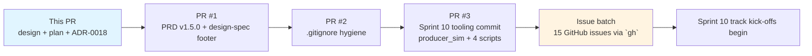

# Sprint 10 Kickoff — Design

| Field | Value |
| ----- | ----- |
| **Version** | 1.0.0 |
| **Date** | 2026-07-06 |
| **Author** | Urs Rüegg |
| **Status** | Reviewed |
| **Previous Version** | n/a |

## 1. Purpose

Transition Sprint 10 from the merged charter ([`docs/sprints/sprint-10-e2e-pipeline-and-dashboard-completion.md`](../../sprints/sprint-10-e2e-pipeline-and-dashboard-completion.md)) into an **executable state**: create tracking issues, close open residual risks from the Sprint 09 close review, and land the local-tooling and working-tree cleanup so the Sprint 10 execution phase can begin against a clean baseline.

**This is a kickoff/plumbing spec**, not a delivery spec for the 12 Sprint 10 deliverables (`S10.1..S10.12`). Each of those keeps its own per-track design + plan cycle at the individual track's kick-off, per Sprint 10 charter §5.

## 2. Scope

### In scope

1. **Sprint 10 issue set architecture** — 12 deliverable-level issues + 1 tracker + 2 investigation issues (`S10.13` PBIP regression, `S10.14` notebook diffs) = **15 GitHub issues**.
2. **Sprint 09 design-spec drift correction** — formalise the missing `FR-VIZ-*` and `NFR-GOV-*` IDs in `docs/PRD.md` per [ADR-0018](../../adr/0018-add-fr-viz-and-nfr-gov-ids.md).
3. **Working-tree cleanup** — per-item disposition for the 4 sub-groups (`D1..D4`) identified in the PR #101 review.
4. **Repository hygiene** — extend `.gitignore` for Python build artefacts and PBIP local caches that are currently untracked but should never be committed.
5. **PBIP regression handling** — raise investigation ticket (`S10.13`) rather than fix blind; revert working-tree damage.

### Out of scope

1. Authoring per-track design specs for the 12 Sprint 10 deliverables — those come at each track's kickoff.
2. Executing any deliverable (`S10.1..S10.12`) — the plan produced from this design only performs kickoff plumbing.
3. Fabric F2 SIT suspend / cost hygiene — user is developing; F2 stays active.
4. Any Bicep, Fabric REST, or Foundry deployment operation.

## 3. Architecture — 3 PRs + 1 batch of GitHub issues

Sprint 10 kickoff work lands as **3 sequential PRs to `main`** plus **1 batch of GitHub-only issue creation**. Sequence matters: PRD update lands first because Sprint 10 issue bodies reference the new PRD IDs.



Each PR is small (<10 files), scoped to one concern, and reviewable in <10 minutes.

## 4. Component design

### 4.1 Sprint 10 issue set (15 issues)

Issue shape per copilot-instructions §6 "PR Output Contract" and Sprint 09 v2 pattern:

**Deliverable issue template** (12 issues, `S10.1..S10.12`):

- **Title:** `[S10.<n>] <track prefix>: <deliverable-name>`
  - Examples: `[S10.1] T1: Fabric Eventstream Bicep + post-deploy portal wiring`, `[S10.4] T2: Author 8 Option D measures`
- **Body sections:**
  - **Deliverable ID:** `S10.<n>`, track `T<x>`
  - **Charter reference:** anchor link to sprint-10 charter §5 row
  - **Retrospective source:** anchor link to sprint-09/retrospective.md §5 item
  - **Acceptance criteria:** 3–5 bullet points derived from charter §6 DoD
  - **Dependencies:** upstream deliverables (per charter §4 mermaid graph)
  - **Design-doc scope:** "yes" / "brief" / "n/a" per charter §5 table
- **Labels:** `sprint-10`, `track-<x>`, plus `needs-design` if charter marks design required
- **Milestone:** `Sprint 10` (create at issue-batch time)

**Tracker issue** (1 issue):

- **Title:** `[S10] Sprint 10 — E2E Pipeline + Dashboard Completion (tracker)`
- **Body:** links to all 12 deliverables + charter + retrospective; DoD checklist mirrored from charter §6.
- **Labels:** `sprint-10`, `tracker`

**Investigation issues** (2 issues):

- `[S10.13] Investigate .pbip semanticModel artifact removal (Fabric-shift vs regression)` — see §4.4 below.
- `[S10.14] Review 4 pre-existing modified reference notebooks (01–04) — commit or revert` — see §4.3 D2 below.

### 4.2 PRD.md v1.5.0 additions (per ADR-0018)

Two additive PRD sub-sections appended to their respective top-level sections:

- **New FR "I) Visualization And Dashboards (Sprint 09 T5)"** appended after existing FR "H) Semantic Ontology" — carries `FR-VIZ-001` and `FR-VIZ-002`.
- **New NFR "I) Governance and Audit (Sprint 09 T5)"** appended after existing NFR "H) Semantic Ontology (Sprint 9)" — carries `NFR-GOV-001..006`.
- **PRD §7 Traceability matrix** — add a new row for `docs/sprints/sprint-10-e2e-pipeline-and-dashboard-completion.md` covering the new IDs.
- **PRD header bumped** to v1.5.0 with Previous Version pointer to 1.4.0.

Design-spec is **not modified** structurally — only a small `> See ADR-0018 for the provenance of FR-VIZ-* and NFR-GOV-* IDs.` blockquote appended to `docs/superpowers/specs/2026-07-02-sprint-09-v2-refinement-design.md` §7.7 as provenance. Design-spec version stays at current.

### 4.3 Working-tree cleanup (per sub-group)

Consolidated from the PR #101 review analysis:

| Sub-group | Verdict | Action | Which PR? |
| --------- | ------- | ------ | --------- |
| **D1** PBIP Report scaffold (`.Report/definition.pbir`, `pages.json`, `report.json`, deleted `page1-capacity/`+`page2-or/`, new `ad8d9cbb.../`, `.pbi/`, `.platform`, `StaticResources/`, `version.json`) | **REVERT working-tree changes; raise S10.13** | `git checkout` modified + `git clean` untracked; investigation ticket raised in issue batch | Working-tree op — no PR (see §4.5) |
| **D2** 4 modified reference notebooks (01–04, 216 lines diff) | **DEFER — raise S10.14 investigation issue** | Leave working-tree state; new owner reviews diffs and decides commit/revert | No PR |
| **D3a** `apps/sim-capacity/src/producer_sim.py` (198 lines) | **COMMIT** — legitimate Sprint 10 T1 streaming producer, MI-auth, ACA-ready | Stage + commit | PR #3 |
| **D3b** `apps/sim-capacity/src/sim_capacity.egg-info/` (7 files, ~893 B) | **GITIGNORE** — Python setuptools build artefact | Add `**/*.egg-info/` to root `.gitignore` | PR #2 |
| **D4a** `data-platform/scripts/import_notebooks.py` (Fabric notebook REST import) | **COMMIT** — Sprint 10 T1/T2 needs it to push notebooks into workspace | Stage + commit | PR #3 |
| **D4b** `data-platform/scripts/run_notebooks.py` (Fabric notebook run trigger) | **COMMIT** — Sprint 10 T1/T2 needs it to trigger the pipeline | Stage + commit | PR #3 |
| **D4c** `data-platform/scripts/upload_to_onelake.py` (OneLake Files/ upload) | **COMMIT** — Sprint 10 T3.7 will use this for synthetic PHI fixture upload | Stage + commit | PR #3 |
| **D4d** `data-platform/scripts/deploy_fabric_data_agent.py` (T4.6 Fabric Data Agent deploy) | **COMMIT** — Sprint 10 T4 S10.10 directly executes this | Stage + commit | PR #3 |
| **`.vscode/`** — user's editor state (already `.gitignore`d via `.vscode/*` pattern with exception list) | **LEAVE** — no action needed; already filtered | n/a | n/a |

**Rationale for D1 revert:** Power BI Desktop scaffolded a single blank GUID-named page (`ad8d9cbb00d05e04d371/` — 250-byte page.json) and **deleted** the two curated page skeletons (`page1-capacity/page.json`, `page2-or/page.json`) that were the T5.1 + T5.2 deliverable outputs. Committing the current working-tree state would land a **regression** on the T5.1/T5.2 layout READMEs that Sprint 10 S10.8 relies on. `.pbip` file also lost its `semanticModel` artifact reference — same PR #101 finding, same conclusion.

### 4.4 `.pbip` regression → investigation issue (S10.13)

The `.pbip` file at [`data-platform/reports/capacity-dashboard.pbip`](../../../data-platform/reports/capacity-dashboard.pbip) currently declares only the `report` artifact — the `semanticModel` reference is missing after this session's Fabric-web-modeling activity. Two hypotheses:

- **Hypothesis A (Fabric shift):** Fabric web modeling deliberately removed the `semanticModel` reference because the model lives in the cloud workspace, not in the local PBIP folder. If true, this is aligned with `NFR-GOV-004` (round-trippability) — the model is authoritatively cloud-hosted and locally represented as an exported TMDL folder rather than a PBIP artifact reference.
- **Hypothesis B (Regression):** Fabric web modeling has a bug that drops the reference on cross-artifact operations. If true, S10.13 owner should file an upstream bug (Fabric GitHub) and manually restore the reference until fixed.

`S10.13` investigation procedure: open the `.pbip` in Power BI Desktop, observe whether the semantic model shows in the artifact navigator; try to re-add the reference and round-trip; compare behaviour to a fresh Desktop-authored PBIP. Report findings in the issue.

**Do not fix blind in this kickoff PR set.** The revert covered in §4.3 D1 does NOT touch `.pbip` — the `.pbip` regression is scoped separately to `S10.13`.

### 4.5 Working-tree destructive operation (D1 revert)

The D1 revert (§4.3) removes untracked new files and reverses modified files. Per copilot-instructions `<operationalSafety>`, destructive operations affecting shared systems require confirmation. **The D1 revert affects the LOCAL working tree only** — no remote state changes, no commits pushed. It is reversible via `git reflog` for the checkout portion but the `git clean` portion is destructive to untracked content.

**Mitigation:** the plan below performs D1 revert as **explicit, per-file operations** — never a broad `git clean -fdx`. Each destructive command is called out separately so it can be skipped or partially applied.

## 5. Data flow — Sprint 10 issue creation

Executed via `gh issue create` in a scripted batch (part of PR #3's plan; not a separate PR). No repo files are added by issue creation — pure GitHub API.

```text
Sprint 10 charter §5 (12 deliverables)
        │
        ├── S10.1..S10.12 issue bodies generated from charter §5 row
        │      + charter §6 DoD row
        │      + retrospective §5 origin row
        │
        └── + S10.13 (PBIP investigation)
              + S10.14 (notebook diff review)
              + Tracker issue (S10)
              │
              └── `gh issue create` × 15
                    │
                    └── Sprint 10 execution begins
```

## 6. Error handling / rollback

| Scenario | Rollback |
| -------- | -------- |
| PRD v1.5.0 introduces broken anchor from cross-doc reference | `git revert` PR #1; PRD stays at v1.4.0; ADR-0018 remains merged as a superseded proposal (Status: Superseded); ADR-0019 authored with fixed approach |
| `.gitignore` addition inadvertently excludes needed content | `git revert` PR #2; specific pattern re-scoped |
| `producer_sim.py` commit reveals a secret or PHI-shaped token | `git revert` PR #3; standard secret-rotation runbook |
| D1 working-tree revert removes a legitimate in-progress edit | `git reflog` restores checkout state; `git clean` casualties recovered from PBI Desktop's own recovery cache (`.pbi/cache.abf`) |
| Issue batch creates malformed issues | Delete via `gh issue delete` per issue; regenerate with fixed template |

## 7. Testing

- **PR #1 (PRD v1.5.0):** `npx markdownlint-cli2` + `lychee` link check; verifier: `grep -c '^| \`FR-VIZ-' docs/PRD.md` == 2; `grep -c '^| \`NFR-GOV-' docs/PRD.md` == 6.
- **PR #2 (.gitignore):** stage-and-check-status only; verify `git status` no longer shows `apps/sim-capacity/src/sim_capacity.egg-info/`.
- **PR #3 (tooling commit):** `python -c 'import ast; ast.parse(open("<script>").read())'` on each of the 5 Python files; `az account get-access-token` env sanity check for scripts that use Fabric REST.
- **Issue batch:** `gh issue list --label sprint-10 --state open | wc -l` == 15.

## 8. Sprint 10 track design-doc scoping (decision recorded here, executed later)

Charter §5 flagged each deliverable with a "Design/plan needed?" column. Consolidating those decisions with a scoping principle:

| Deliverable | Charter says | Design-doc decision | Rationale |
| ----------- | ------------ | ------------------- | --------- |
| S10.1 Eventstream Bicep + portal wiring | Design: brief; plan: yes | **Design: brief** (~500 words), **plan: yes** | New IaC + non-idempotent portal step; needs a mini-spec for the portal-step contract |
| S10.2 Eventstream bronze/silver/gold notebooks | Design: brief; plan: yes | **Design: brief**, **plan: yes** | Pattern already established in reference notebooks; brief spec for eventstream-specific deltas |
| S10.3 4 fact tables landed | Design: brief; plan: yes | **Design: brief**, **plan: yes** | Depends on S10.1 + S10.2; spec covers the gold-fact schema per table |
| S10.4 8 Option D measures | n/a; plan: brief | **Design: n/a** (spec §6.3 authoritative), **plan: brief** | Measures already defined in Sprint 09 design spec |
| S10.5 OR loader schema extension | Design: brief; plan: brief | **Design: brief**, **plan: brief** | New column derivations; spec covers event-pair → derived-column mapping |
| S10.6 RLS re-authoring + column PHI tags | Design: brief; plan: brief | **Design: brief**, **plan: brief** | Portal-only operation; brief spec captures the role-filter-per-column contract |
| S10.7 Synthetic PHI fixture | Design: yes; plan: yes | **Design: FULL SPEC (this is the biggest S10 design item)**, **plan: yes** | New pattern for the repo; must define what "synthetic PHI" means, injection isolation, teardown |
| S10.8 PBIP Page 1 + Page 2 visuals | Reference layout READMEs; plan: brief | **Design: n/a** (layout READMEs authoritative), **plan: brief** | Layouts already speccced |
| S10.9 Automated agent-eval harness | Design: brief; plan: yes | **Design: FULL SPEC**, **plan: yes** | New CI workflow shape; must define fixture format contract, mocking, replay determinism |
| S10.10 Deploy 3 agent runtime hosts | n/a; plan: brief | **Design: n/a** (D4.5/D4.6 authoritative), **plan: brief** | Operational; scripts already exist |
| S10.11 Verifier extension | n/a; plan: brief | **Design: n/a**, **plan: brief** | Mechanical extension of existing script |
| S10.12 CI workflow for verifier | n/a; plan: brief | **Design: n/a**, **plan: brief** | Standard GH Actions pattern |

**Full design specs required:** S10.7 (synthetic PHI fixture), S10.9 (agent-eval harness) — 2 specs.
**Brief specs required:** S10.1, S10.2, S10.3, S10.5, S10.6 — 5 briefs.
**Plans required:** all 12 deliverables, of varying depth.

Total planning artefacts across the sprint: **2 full specs + 5 briefs + 12 plans = 19 docs**, authored as each track begins (not batched).

## 9. Estimation (relative complexity, no calendar dates)

- **PR #1 (PRD + design-spec footer):** small — one PRD edit, one design-spec append, ADR referenced.
- **PR #2 (.gitignore):** trivial — one file, ≤5 lines.
- **PR #3 (tooling commit):** small — 5 files, no logic changes.
- **Issue batch:** small — 15 issues via a `gh` loop.
- **D1 revert:** trivial — a handful of `git checkout` and targeted `git clean` calls.
- **Total for this kickoff phase:** all doable in a single follow-up session.

## 10. References

- [Sprint 10 charter](../../sprints/sprint-10-e2e-pipeline-and-dashboard-completion.md) — scope source
- [Sprint 09 v2 design spec §7.7](../specs/2026-07-02-sprint-09-v2-refinement-design.md#77-traceability) — surfaced the ID drift
- [Sprint 09 retrospective §5](../../sprints/sprint-09/retrospective.md#5-follow-ups-sprint-10) — 15-item Sprint 10 backlog
- [ADR-0018 add FR-VIZ + NFR-GOV IDs](../../adr/0018-add-fr-viz-and-nfr-gov-ids.md) — formalises the drift resolution
- [PR #101](https://github.com/urruegg/SwissHospitalCapacityPlatform/pull/101) — Sprint 09 close PR that surfaced the residuals
- [`.github/copilot-instructions.md` §6 Commit & PR Conventions](../../../.github/copilot-instructions.md#6-commit--pr-conventions) — PR Output Contract shape for the 15 issues
- [`.github/copilot-instructions.md` §9 Document Versioning](../../../.github/copilot-instructions.md#9-document-versioning) — governs the PRD MINOR bump

---

## Sprint 10 kickoff DoD

- [ ] PR #1 merged: PRD.md at v1.5.0; ADR-0018 accepted; design-spec §7.7 footer added
- [ ] PR #2 merged: `.gitignore` covers `**/*.egg-info/`, PBIP local caches
- [ ] PR #3 merged: `producer_sim.py` + 4 tooling scripts committed
- [ ] D1 working-tree revert executed; page1-capacity/ + page2-or/ folders restored; `.pbip` untouched (S10.13 handles it)
- [ ] 15 GitHub issues created via `gh issue create` batch; labelled `sprint-10`
- [ ] Sprint 10 milestone created and linked to all 15 issues
- [ ] Sprint 10 charter §7 OPS-RISK-06 (round-trip drops RLS) verified as tracked in S10.6 issue
- [ ] User acknowledges kickoff complete; Sprint 10 execution phase begins with S10.1 track kick-off
