# Sprint 10 T1 — Eventstream + Facts Design Brief

| Field | Value |
| ----- | ----- |
| **Version** | 1.0.0 |
| **Date** | 2026-07-06 |
| **Author** | Urs Rüegg |
| **Status** | Reviewed |
| **Previous Version** | n/a |
| **Scope** | Brief spec per Sprint 10 kickoff design §8. Covers deliverables **S10.1 + S10.2 + S10.3** (T1 track). |

## 1. Purpose

Operationalise the Sprint 09 T2.2 scaffolding so the end-to-end pipeline actually runs on Fabric F2 SIT: **simulator → Event Hub → Fabric Eventstream → bronze/eventstream → silver → gold**. Closes Sprint 09 v2 DoD item 4 (E2E pipeline) for the 4 event kinds this track handles (`encounter`, `bed_state`, `bed_assignment`, `forecast_output`).

**This is a brief spec**, not a full design. Charter §5 marks S10.1–S10.3 as "Design: brief; plan: yes" because most components already exist in scaffold form and the work is primarily wiring + verification.

## 2. Scope

### In scope

1. **S10.1 — Provision Fabric Eventstream in SIT** by wiring the pre-existing Bicep module + post-deploy REST script.
2. **S10.2 — Import 3 pre-existing eventstream notebooks** (`01_bronze`, `02_silver`, `03_gold`) into the SIT workspace via `import_notebooks.py`.
3. **S10.3 — Run notebooks + register 4 fact tables** in gold: `fact_encounter`, `fact_bed_state`, `fact_bed_assignment`, `fact_forecast_output`.

### Out of scope (deferred to their own tracks)

- **8 Option D measures** on the new fact tables — S10.4 (T2).
- **OR loader schema extension** — S10.5 (T2).
- **PBIP visuals binding to new measures** — S10.8 (T3).
- **`fact_*` tables for OR event kinds** (`matching_engine`, `discharge_*`) — the 2 remaining event kinds do not require fact tables per design spec §6.4; only 4 out of 6 event kinds are on the fact-table hitlist.

## 3. What already exists (Sprint 09 T2.2 scaffolds)

| Artefact | Path | State |
| -------- | ---- | ----- |
| Bicep module | `infra/modules/data-platform/fabric-eventstream/main.bicep` | Complete; declares 10 parameters + emits `eventstreamManifest` output |
| Bicep README | `infra/modules/data-platform/fabric-eventstream/README.md` | Complete; documents scaffold-only rationale + runtime dependencies |
| Post-deploy REST script | `infra/modules/data-platform/fabric-eventstream/post-deploy/configure-eventstream.ps1` | Complete; consumes manifest, calls Fabric REST to create Eventstream item |
| SIT bicepparam | `infra/environments/sit.bicepparam` | Enabled (`enableFabricEventstreamModule = true`) but `workspaceId` + `destinationLakehouseId` are empty strings |
| 3 eventstream notebooks | `data-platform/notebooks/eventstream/{01,02,03}_*.ipynb` | Exist on `main`; **not yet imported into SIT workspace** |
| Streaming producer | `apps/sim-capacity/src/producer_sim.py` | Committed via Sprint 10 kickoff PR #106 |
| Fabric Data Agent deploy | `data-platform/scripts/deploy_fabric_data_agent.py` | Already tracked from Sprint 09 T4.6 |
| Import + run notebook helpers | `data-platform/scripts/import_notebooks.py`, `run_notebooks.py` | Committed via Sprint 10 kickoff PR #106 |

## 4. What's missing (this track delivers)

| # | Item | Deliverable | Blocker type |
| - | ---- | ----------- | ------------ |
| 1 | Fill 2 empty bicepparams: `fabricEventstreamWorkspaceId`, `fabricEventstreamDestinationLakehouseId` | S10.1 | Trivial edit — SIT IDs are already public in [checkpoint §2.2](../../sprints/sprint-09/checkpoint-2026-07-06-fabric-and-model.md#22-fabric-rest-identifiers) |
| 2 | **Portal step:** create Fabric-managed connection to EH namespace `evh-ihzhhpf-sit` via Fabric portal (or `POST /v1/connections`) | S10.1 | Interactive — user must perform via browser |
| 3 | Fill the `<REQUIRES-FABRIC-MANAGED-CONNECTION-ID>` placeholder in `configure-eventstream.ps1` after portal step returns the connection GUID | S10.1 | Depends on #2 |
| 4 | Run Bicep `az deployment group create` + capture manifest output to JSON | S10.1 | Blocked by #1, #2, #3 |
| 5 | Run `configure-eventstream.ps1 -ManifestPath <manifest.json>` to create the Eventstream item + wire source + destination | S10.1 | Blocked by #4 |
| 6 | Import the 3 notebooks into workspace via `import_notebooks.py` | S10.2 | Depends on #5 (destination Lakehouse must exist and be reachable) |
| 7 | Run the 3 notebooks in order via `run_notebooks.py`; verify each produces its expected zone (bronze / silver / gold) | S10.3 | Depends on #6 + live event stream |
| 8 | Verify 4 fact tables register at `Tables/gold/fact_*` and are Direct-Lake-queryable from `capacity-dashboard` semantic model | S10.3 | Verification only |

## 5. Component design

### 5.1 End-to-end flow

```mermaid
flowchart LR
    Sim[producer_sim.py<br/>ACA container] -->|6 event kinds| EH[Event Hub<br/>evh-capacity-events-sit]
    EH -->|cg-fabric-eventstream| ES[Fabric Eventstream<br/>es-ihzhhpf-events]
    ES -->|append routed by eventKind| B[Bronze Delta<br/>Tables/bronze/eventstream/*]
    B -->|01_bronze notebook| BC[Bronze curated]
    BC -->|02_silver notebook| S[Silver validated<br/>Tables/silver/*]
    S -->|03_gold notebook| G[Gold facts<br/>fact_encounter<br/>fact_bed_state<br/>fact_bed_assignment<br/>fact_forecast_output]
    G -->|Direct Lake| SM[capacity-dashboard<br/>semantic model]
```

### 5.2 Fabric REST topology (from `configure-eventstream.ps1`)

The post-deploy script POSTs a single Eventstream item with:

- **1 source** (`type: EventHub`) — subscribes to `cg-fabric-eventstream` consumer group; routing property `eventKind`.
- **1 destination** (`type: Lakehouse`) — appends to `Tables/{destinationTablePrefix}` in the SIT lakehouse; JSON input serialisation.
- **No operators** — Sprint 10 keeps topology minimal (bronze append only; per-event-kind partitioning + validation happens downstream in the silver notebook).

### 5.3 Portal step contract (S10.1 step 2)

The Fabric-managed EH connection is the **only interactive step**. Contract:

- **URL:** `https://app.fabric.microsoft.com/groups/f3af9733-9503-4e92-98f9-a901d96f1c87/managementhub/connections`
- **New connection → Cloud → Azure Event Hubs**
- **Connection settings:**
  - Namespace: `evh-ihzhhpf-sit` (fully qualified: `evh-ihzhhpf-sit.servicebus.windows.net`)
  - Authentication: **Service Principal** (using the Fabric OIDC SP) or **Organizational Account** (admin@mngenvmcap164444)
  - Privacy level: **Organizational**
- **Output:** connection GUID — capture from URL bar or connection details pane; paste into `configure-eventstream.ps1` line ~85 replacing `<REQUIRES-FABRIC-MANAGED-CONNECTION-ID>`.

## 6. Risks + mitigations

| # | Risk | Impact | Mitigation |
| - | ---- | ------ | ---------- |
| R1 | **Existing eventstream notebooks may not produce the 4 required `fact_*` tables** — they may be scaffold-level bronze-only. Grep for `fact_encounter\|saveAsTable` returned 0 matches. | S10.3 blocked; scope grows to include notebook authoring | S10.2 verification step reads each notebook's cell output; if fact-table logic missing, raise **S10.3-extension** issue for a curation notebook (est +1 day). |
| R2 | Fabric-managed connection creation fails or requires elevated permissions the demo tenant SP lacks | S10.1 blocked | Fallback: use admin user OAuth on the connection instead of SP. Documented in the portal-step contract §5.3. |
| R3 | `enableFabricEventstreamModule = true` in sit.bicepparam causes what-if to fail because module was scaffolded but never deployed — Bicep may have compile errors on real deploy | S10.1 delayed | Task 1 Step 3 runs `az deployment group what-if` first; fixes any Bicep issues in a small follow-up PR before the actual deploy. |
| R4 | Producer sim not producing events during the notebook run window → gold facts empty even though pipeline is correct | S10.3 misdiagnosis | S10.3 Step 5 explicitly runs `producer_sim.py --duration-hours 1 --rate 60` first to seed a bounded window of events. |
| R5 | Cost overrun — Eventstream + notebook runs on F2 SIT | Low — F2 already active, Eventstream billed in capacity | Explicit acknowledgment in plan Task 1 Step 1. |

## 7. Data contracts

| Zone | Contract source | Notes |
| ---- | --------------- | ----- |
| **Bronze eventstream** | Raw JSON from producer_sim `envelope` structure (see `apps/sim-capacity/src/generators/`) | Governance envelope (`_data_quality`, `_classification`, etc.) preserved via routing property `eventKind` |
| **Silver** | Silver notebooks apply validation + PHI regex sweep (already in Sprint 09 `02_silver_master_data.ipynb` pattern) | New event kinds get their own schema conformance checks |
| **Gold facts** | Design spec §6.4 star schema — 6 dims + 6 facts; T1 lands 4 of 6 facts (2 OR facts land via `04_load_or_samples.ipynb` from Sprint 09) | Fact tables must be Direct Lake-queryable — schema-enabled lakehouse rules apply (2-level path `Tables/gold/fact_*`) |

## 8. Verification per deliverable

- **S10.1 verified when:** Fabric REST `GET /v1/workspaces/{ws}/eventstreams` returns 1 Eventstream item named `es-ihzhhpf-events` with source connected + destination pointing at SIT lakehouse.
- **S10.2 verified when:** Fabric REST `GET /v1/workspaces/{ws}/notebooks` returns the 3 eventstream notebooks (importedFrom pointing to their local path).
- **S10.3 verified when:** `GET /v1/workspaces/{ws}/lakehouses/{lh}/tables` returns all 4 `fact_*` tables at `Tables/gold/` and each has at least 1 row (producer_sim seeded).

## 9. References

- Sprint 10 charter [§4 track structure + §5 deliverables + §7 risk register](../../sprints/sprint-10-e2e-pipeline-and-dashboard-completion.md)
- Sprint 10 kickoff design [§8 design-doc scoping](2026-07-06-sprint-10-kickoff-design.md#8-sprint-10-track-design-doc-scoping-decision-recorded-here-executed-later)
- Sprint 09 v2 design spec [§4.2 EH topology](2026-07-02-sprint-09-v2-refinement-design.md#42-event-hubs-topology), [§4.6 bronze/silver/gold zones](2026-07-02-sprint-09-v2-refinement-design.md#46-datazone-flow), [§6.4 star schema](2026-07-02-sprint-09-v2-refinement-design.md#64-semantic-model-shape)
- Sprint 09 checkpoint [§9 deferred items](../../sprints/sprint-09/checkpoint-2026-07-06-fabric-and-model.md#9-deferred-items-do-not-block-model-authoring), [§2.2 Fabric REST IDs](../../sprints/sprint-09/checkpoint-2026-07-06-fabric-and-model.md#22-fabric-rest-identifiers)
- Bicep module [README](../../../infra/modules/data-platform/fabric-eventstream/README.md) + [main.bicep](../../../infra/modules/data-platform/fabric-eventstream/main.bicep)
- Post-deploy script [configure-eventstream.ps1](../../../infra/modules/data-platform/fabric-eventstream/post-deploy/configure-eventstream.ps1)
- Related issues: [#108 S10.1](https://github.com/urruegg/SwissHospitalCapacityPlatform/issues/108), [#109 S10.2](https://github.com/urruegg/SwissHospitalCapacityPlatform/issues/109), [#110 S10.3](https://github.com/urruegg/SwissHospitalCapacityPlatform/issues/110)

---

## Sprint 10 T1 exit criteria

- [ ] `az deployment group show` for the eventstream module reports `Succeeded`
- [ ] Fabric Eventstream item `es-ihzhhpf-events` visible in workspace with source + destination configured
- [ ] All 3 eventstream notebooks visible in workspace + parse without errors
- [ ] 4 `fact_*` tables registered under `Tables/gold/` with ≥ 1 row each
- [ ] Direct Lake query from `capacity-dashboard` semantic model against `fact_encounter` returns a row (smoke test)
- [ ] R1 (notebook scope gap) resolved: either the notebooks produce all 4 fact tables, or S10.3-extension issue raised
