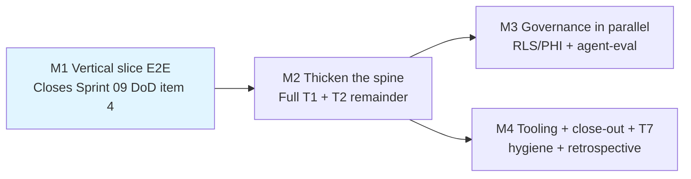

# Sprint 10 Completion Strategy — Vertical Slice E2E + T7 Hygiene

| Field | Value |
| ----- | ----- |
| **Version** | 1.0.0 |
| **Date** | 2026-07-08 |
| **Author** | Urs Rüegg |
| **Status** | Accepted |
| **Supersedes (scoped)** | [`2026-07-06-sprint-10-t1-eventstream-plan.md`](../plans/2026-07-06-sprint-10-t1-eventstream-plan.md) — the T1 execution plan only; the Sprint 10 charter [`docs/sprints/sprint-10-e2e-pipeline-and-dashboard-completion.md`](../../sprints/sprint-10-e2e-pipeline-and-dashboard-completion.md) and the kickoff design [`2026-07-06-sprint-10-kickoff-design.md`](2026-07-06-sprint-10-kickoff-design.md) remain in force. |

## Table of Contents

1. [Purpose](#1-purpose)
2. [Context — what changed since 2026-07-06](#2-context--what-changed-since-2026-07-06)
3. [Milestone breakdown (M1..M4)](#3-milestone-breakdown-m1m4)
4. [Cross-cutting guardrails](#4-cross-cutting-guardrails)
5. [T7 hygiene track (new)](#5-t7-hygiene-track-new)
6. [Charter mapping — S10.x → milestone grid](#6-charter-mapping--s10x--milestone-grid)
7. [Risk deltas + rollback](#7-risk-deltas--rollback)
8. [References](#8-references)

---

## 1. Purpose

Give the remaining Sprint 10 execution work an explicit **best-practice ordering** so that (a) the end-to-end demo goes green with the shortest reviewable slice, (b) the two governance workstreams (RLS/PHI, agent-eval) don't block the dashboard demo, and (c) the hygiene backlog surfaced during T1 execution lands inside Sprint 10 rather than leaking into Sprint 11.

This is a **strategy spec** — it re-sequences existing charter deliverables (S10.1..S10.12) into four milestones (M1..M4) and adds one hygiene track (T7). It does **not** change what the deliverables are; the charter §5 table remains the source of truth for scope.

## 2. Context — what changed since 2026-07-06

The Sprint 10 charter and the T1 plan were authored on 2026-07-06 assuming the Fabric **Azure Event Hubs source connector** path. Between 2026-07-06 and 2026-07-08 the following happened:

- **[ADR-0019](../../adr/0019-fabric-eventstream-custom-endpoint-entra-id.md) accepted** — pivot to Fabric Eventstream **Custom Endpoint + Entra ID**. Root cause: MCAPS tenant Modify policy auto-reverts `disableLocalAuth=true` on Event Hubs namespaces, and Fabric's Azure EH source connector only supports SAS today. Full analysis in the ADR.
- **S10.1 delivered under the new architecture** — Eventstream `es-capacity-events-sit` (`7b65dfa1-c523-412f-93b2-a78eaa2788fa`) provisioned; source `capacity-events-source` published; sim-capacity Container App emits envelopes with hospital `H_SZB` via MI-authed AMQP (verified in Data preview 2026-07-08 08:03Z with events of kind `forecast.published`, `bed.assigned`, `encounter.transition`, `encounter.admitted`).
- **Simulator image now IaC-managed** — [PR #129](https://github.com/urruegg/SwissHospitalCapacityPlatform/pull/129) baked `cri75lbu5sj4hza.azurecr.io/sim-capacity:sprint10-t1` + MI-based ACR pull into Bicep. Container App revision `--0000002` running.
- **Fabric SIT keep-alive live** — [PR #127](https://github.com/urruegg/SwissHospitalCapacityPlatform/pull/127) added `*/15 * * * *` cron; [PR #130](https://github.com/urruegg/SwissHospitalCapacityPlatform/pull/130) fixed the OIDC env-scope so it actually runs green.
- **Hygiene backlog surfaced (5 items)** — dead branches, `fabric-capacity-lifecycle.yml` has the same OIDC bug PR #130 fixed for keep-alive, missing `ci-build-sim-capacity.yml` workflow, vestigial Azure EH namespace decision (per ADR-0019 sunset), sunset issue [#126](https://github.com/urruegg/SwissHospitalCapacityPlatform/issues/126) for the keep-alive workflow itself. See §5 T7.

The T1 plan file (`2026-07-06-sprint-10-t1-eventstream-plan.md`) is now architecturally outdated but retained with a supersession annotation for audit trail.

## 3. Milestone breakdown (M1..M4)

Four milestones executed in strict dependency order M1 → M2 → (M3 ∥ M4). M3 (governance) and M4 (tooling + hygiene + close-out) may parallelise once M2 completes.

### M1 — Vertical slice E2E

**Goal:** Prove the whole spine (Custom Endpoint → bronze → silver → gold → fact tables → measures → Direct Lake → Page 1 visual) with the shortest reviewable slice. **Closes Sprint 09 v2 DoD item 4** (E2E pipeline).

**Sub-slices of charter deliverables (from S10.2, S10.3, S10.4, S10.8):**

| Charter ID | M1 sub-slice |
| ---------- | ------------- |
| **S10.2** (eventstream notebooks) | Import all 3 notebooks (`01_bronze_eventstream`, `02_silver_eventstream`, `03_gold_eventstream`) into workspace `ws-ihzhhpf-sit-data`. Notebooks emit all 4 fact tables as a byproduct — M1 scope is limited to the two facts targeted by the M1 measures below. |
| **S10.3** (4 fact tables) | Two fact tables validated end-to-end in M1: `fact_bed_assignment` and `fact_encounter`. The other two (`fact_bed_state`, `fact_forecast_output`) may land as notebook byproducts but are not measured until M2. |
| **S10.4** (8 Option D measures) | Two measures authored + round-tripped to TMDL: `Currently Assigned Beds` (on `fact_bed_assignment`) and `Active Encounters` (on `fact_encounter`). |
| **S10.8** (PBIP visuals) | Two visual tiles wired to those two measures on Page 1 (`page1-capacity` layout). |

**Rationale for `bed.assigned` + `encounter.admitted` event kinds**

Both event kinds are already flowing (verified in Fabric Data preview 2026-07-08 08:03Z), give complementary demo value (capacity utilisation + patient throughput), and route to two different fact tables — so the slice exercises the whole spine with meaningful load rather than a single narrow code path.

**Exit criteria (all must be true to close M1):**

- All 3 eventstream notebooks imported and visible via `GET /v1/workspaces/{ws}/notebooks`
- Both fact tables queryable via Direct Lake — `EVALUATE ROW("cnt", COUNTROWS(fact_bed_assignment))` and same for `fact_encounter` return positive integers
- Both measures visible in the semantic model TMDL round-trip; `export_semantic_model_tmdl.ps1` shows `Measures: 7` (5 existing + 2 new)
- Page 1 renders both KPI cards with live values (screenshot in evidence)
- Evidence report `docs/sprints/sprint-10/evidence/m1-vertical-slice.md` v1.0.0 committed
- Sprint 09 v2 DoD item 4 flipped from "CARRY-OVER" to "[x]" in [sprint-09 doc](../../sprints/sprint-09-master-data-simulation-and-capacity-dashboard.md)

**Non-goals (deferred to M2):**

- Six remaining measures (Option D catch-up)
- All remaining Page 1 + Page 2 visuals
- `fact_bed_state` and `fact_forecast_output` validation (they may land but are not measured)
- OR loader schema extension (S10.5)
- Anything RLS, PHI, agent-related, or CI-verifier

### M2 — Thicken the spine

**Goal:** Complete the T1 + T2 delivery scope. All 13 measures render on both dashboard pages.

**Charter deliverables covered in full:**

- **S10.3** — remaining 2 fact tables validated
- **S10.4** — remaining 6 Option D measures authored
- **S10.5** — OR loader schema extension + status vocabulary alignment; retires the Sprint 09 `Idle-Slot Minutes` proxy in favour of the spec-exact filter
- **S10.8** — all remaining Page 1 + Page 2 visual tiles

**Exit criteria:**

- `export_semantic_model_tmdl.ps1 -VerifyOnly` returns `Total: 14, Active: 12, Inactive: 2, Measures: 13, Roles: 4` (roles from M3; if M3 not yet complete, assertion runs with the current role count — deferred to M4 verifier extension for enforcement)
- All 13 spec §6.3 measures render without `BLANK`s except intentional forecast-window truncation
- OR loader emits all 5 new derived columns
- Evidence report `docs/sprints/sprint-10/evidence/m2-thickened-spine.md` v1.0.0 committed

### M3 — Governance in parallel

**Goal:** Land the two governance workstreams that Sprint 09 flagged as DoD carry-overs (items 6, 8). Runs in parallel with M4 once M2 is done — neither depends on the other.

**Charter deliverables covered in full:**

- **S10.6** — 4 RLS roles re-authored in Fabric web modeling + column-level `[phi]` annotations
- **S10.7** — synthetic PHI fixture design + injection into an isolated test lakehouse (NOT `lh_ihzhhpf_sit`); RLS verification per role. **Requires full spec per kickoff design §8** — spec must precede plan.
- **S10.9** — automated agent-eval harness extending `.github/workflows/eval-goldens.yml`. **Requires full spec per kickoff design §8** — spec must precede plan.
- **S10.10** — deploy 3 agent runtime hosts (BM-Copilot Foundry, Fabric Data Agent, CSA Foundry) to SIT

**Exit criteria:**

- 4 RLS roles return 0 rows on PHI-tagged columns against synthetic fixture; log in [`rls-phi-verification.md`](../../sprints/sprint-09/evidence/rls-phi-verification.md)
- 9 agent golden-task fixtures replay green via automated workflow (no manual runs)
- Sprint 09 v2 DoD items 6 + 8 flipped from "CARRY-OVER" to "[x]"

### M4 — Tooling + close-out + T7 hygiene

**Goal:** Land the verifier extension + CI merge gate, execute the T7 hygiene backlog inside the sprint, retrospective + evidence pack.

**Charter deliverables covered in full:**

- **S10.11** — `export_semantic_model_tmdl.ps1` verifier extension (measure count + role count)
- **S10.12** — `.github/workflows/verify-semantic-model.yml` CI merge gate

**T7 hygiene items** — see §5 below.

**T6 close-out:** Sprint 10 retrospective + evidence pack, Sprint 09 v2 sprint-doc DoD updates, sprint-close checklist walk-through.

**Exit criteria:**

- Sprint 10 charter §9 sprint-close checklist all green
- All 5 T7 hygiene items completed or explicitly deferred with a Sprint 11 tracking issue
- `docs/sprints/sprint-10/retrospective.md` v1.0.0 committed
- Sprint 10 PR merged to `main` with full PR output contract fields populated

## 4. Cross-cutting guardrails

Applies to every PR in M1..M4. Guardrails are lifted from Sprint 09 v2 learnings (retrospective §4 findings) and the kickoff design §3 pattern:

1. **One PR per slice, ≤5 files, <10 min review.** Slice size is chosen to fit inside a reviewable unit. Bigger slices split further (kickoff design §3 successfully split S10 kickoff into 3 PRs; same pattern applied here).
2. **Every TMDL / Fabric portal edit round-trips to git in the same PR.** Enforces `NFR-GOV-004` (round-trippability). Catches Fabric-side drops early (RLS role scaffold drop from Sprint 09 was the trigger for this rule; charter OPS-RISK-06). Verifier extension S10.11 mechanises the check.
3. **No PROD until SIT green end-to-end + AMA dry-run passed.** Matches [ADR-0013](../../adr/0013-temporary-us-region-demo-scope.md) demo scope. PROD replication uses the [checkpoint §3 replication checklist](../../sprints/sprint-09/checkpoint-2026-07-06-fabric-and-model.md#3-fabric-f2-prod-replication-checklist) in a subsequent sprint.

## 5. T7 hygiene track (new)

Add T7 to the charter §4 track structure between T5 and T6. Executed inside M4. Five deliverables:

| ID | Deliverable | Origin | Design/plan needed? |
| -- | ----------- | ------ | ------------------- |
| **H1** | Delete stale branch `sprint-10/t1-s10.1-eventstream-deploy` (has dangling commits `40cfc61` + `d35ce00` from mid-session workflow issue; superseded by PR #129) | This session | n/a — one `gh api DELETE` call, requires `approved-to-apply` |
| **H2** | Sunset Fabric SIT keep-alive workflow (`.github/workflows/fabric-sit-keepalive.yml`) at Sprint 10 close per runbook §Sprint 10 T1 keep-alive override — closes issue [#126](https://github.com/urruegg/SwissHospitalCapacityPlatform/issues/126) | Session runbook | Plan: brief |
| **H3** | Fix `.github/workflows/fabric-capacity-lifecycle.yml` OIDC — same env-scope + `secrets.*` vs `vars.*` bug PR #130 fixed for the keep-alive | Session finding | Plan: trivial (mirror PR #130) |
| **H4** | Add `.github/workflows/ci-build-sim-capacity.yml` that rebuilds+pushes the sim-capacity image on `apps/sim-capacity/**` changes | ADR-0019 follow-up | Plan: brief |
| **H5** | Vestigial Azure EH decision — delete `evh-ihzhhpf-sit-y26y` + hub + 4 consumer groups + agent MI role assignments, OR raise Sprint 11 tracking issue with the delete/repurpose decision documented | ADR-0019 sunset criteria | Plan: brief; **destruction requires `approved-to-apply`** |
| **H6** | **Downscale Fabric F16 SIT capacity → F2** (or suspend for weekends) at Sprint 10 close. F16 was raised 2026-07-08 to unblock M1-B notebook queueing; ~USD 1,730/month at 24×7 vs F2 ~USD 216/month. Consider `az fabric capacity update --sku {name:F2,tier:Fabric}` or scheduled downscale workflow | This session (F2→F16 upgrade) | Plan: trivial; **downscale is reversible but validate no jobs in-flight first** |

**Not in T7 (already resolved):**

- PRD FR-VIZ / NFR-GOV drift — resolved by [ADR-0018](../../adr/0018-add-fr-viz-and-nfr-gov-ids.md), PRD bumped to v1.5.0 in the Sprint 10 kickoff PR set.
- CLI-created duplicate AcrPull role assignment — deleted 2026-07-08, deterministic-GUID version pre-created (matches Bicep), verified idempotent on the PR #129 deploy.

## 6. Charter mapping — S10.x → milestone grid

| Charter ID | Track | M1 | M2 | M3 | M4 |
| ---------- | ----- | -- | -- | -- | -- |
| S10.1 Eventstream provisioning | T1 | ✅ done (ADR-0019 pivot) | | | |
| S10.2 Eventstream notebooks | T1 | slice (import + run) | | | |
| S10.3 4 fact tables | T1 | 2 of 4 validated | +2 remaining | | |
| S10.4 8 Option D measures | T2 | 2 of 8 authored | +6 remaining | | |
| S10.5 OR loader extension | T2 | | full | | |
| S10.6 RLS re-authoring | T3 | | | full | |
| S10.7 Synthetic PHI fixture | T3 | | | full (needs spec) | |
| S10.8 PBIP visuals | T3 | 2 tiles | +remaining | | |
| S10.9 Agent-eval harness | T4 | | | full (needs spec) | |
| S10.10 3 agent hosts deployed | T4 | | | full | |
| S10.11 Verifier extension | T5 | | | | full |
| S10.12 CI merge gate | T5 | | | | full |
| **H1..H5 T7 hygiene** | T7 (new) | | | | full |
| T6 close-out | T6 | | | | full |

## 7. Risk deltas + rollback

Additions to charter §7 risk register:

- **OPS-RISK-08** *(new)* — **M1 slippage cascades into M2/M3/M4.** M1 is on the critical path for the AMA demo. Mitigation: M3 spec authoring (S10.7 + S10.9) can happen in parallel with M1 execution because the specs don't depend on Fabric state. Author both specs during M1 to compress the critical path.
- **OPS-RISK-09** *(new)* — **Vestigial Azure EH deletion (H5) surprises a downstream consumer.** BM-Copilot and CSA agents were originally designed to subscribe to `evh-ihzhhpf-sit-y26y` consumer groups. Under ADR-0019 they now subscribe to Fabric-side Lakehouse Delta outputs. Mitigation: verify no runtime agent has a live connection to `evh-ihzhhpf-sit-y26y` before deletion; if any does, defer H5 to Sprint 11 hygiene sprint.

Rollback per milestone:

| Milestone | Rollback surface |
| --------- | ---------------- |
| M1 | Revert notebook imports (`DELETE /v1/workspaces/{ws}/notebooks/{id}`), delete new fact tables via Fabric Explorer, revert measure TMDL commits, revert PBIP visual JSON commits. Simulator keeps running (harmless). |
| M2 | Same shape as M1 but larger surface. Verifier assertion (`Measures: 13`) becomes the automated regression gate. |
| M3 | RLS: `DELETE /v1/workspaces/{ws}/semanticModels/{id}/roles/{role}` per role. Synthetic PHI fixture: drop the isolated test lakehouse in its entirety (single delete call, no PHI blast radius). Agent hosts: `az cognitiveservices account deployment delete` for Foundry-hosted; `DELETE /v1/workspaces/{ws}/dataAgents/{id}` for FDA. |
| M4 | Verifier CI workflow disable via `on:` block change; sunset workflow deletion via `git revert`. |
| T7 hygiene | H1..H4 all `git revert`-able. H5 (Azure EH deletion) is **not reversible** — data lost + connection strings invalidated. Requires explicit `approved-to-apply` and evidence attached to the deletion PR. |

## 8. References

- [Sprint 10 charter](../../sprints/sprint-10-e2e-pipeline-and-dashboard-completion.md) — deliverable scope source
- [Sprint 10 kickoff design](2026-07-06-sprint-10-kickoff-design.md) — kickoff plumbing (still current) + design-doc scoping matrix (§8)
- [Sprint 10 T1 plan](../plans/2026-07-06-sprint-10-t1-eventstream-plan.md) — historical, superseded by this spec (see supersession annotation at top of that file)
- [ADR-0013](../../adr/0013-temporary-us-region-demo-scope.md) — demo scope; drives M4 T7 sunset deadlines
- [ADR-0016](../../adr/0016-no-phi-in-mvp-demo-scope.md) — synthetic-only rule; drives M3 S10.7 fixture design
- [ADR-0018](../../adr/0018-add-fr-viz-and-nfr-gov-ids.md) — PRD FR-VIZ / NFR-GOV formalisation
- [ADR-0019](../../adr/0019-fabric-eventstream-custom-endpoint-entra-id.md) — Custom Endpoint pivot; drives §2 context + §5 T7 items
- [Sprint 09 retrospective §5](../../sprints/sprint-09/retrospective.md#5-follow-ups-sprint-10) — original 15-item Sprint 10 backlog
- [Sprint 09 v2 sprint doc](../../sprints/sprint-09-master-data-simulation-and-capacity-dashboard.md) — DoD carry-over annotations M1/M3 close
- [`docs/runbooks/fabric-capacity-lifecycle.md`](../../runbooks/fabric-capacity-lifecycle.md) v1.1.0 — Sprint 10 T1 keep-alive override + sunset trigger for H2
- Live-session PRs — [#127](https://github.com/urruegg/SwissHospitalCapacityPlatform/pull/127) (keep-alive), [#128](https://github.com/urruegg/SwissHospitalCapacityPlatform/pull/128) (ADR-0019 pivot), [#129](https://github.com/urruegg/SwissHospitalCapacityPlatform/pull/129) (image build baked in Bicep), [#130](https://github.com/urruegg/SwissHospitalCapacityPlatform/pull/130) (keep-alive OIDC fix)
