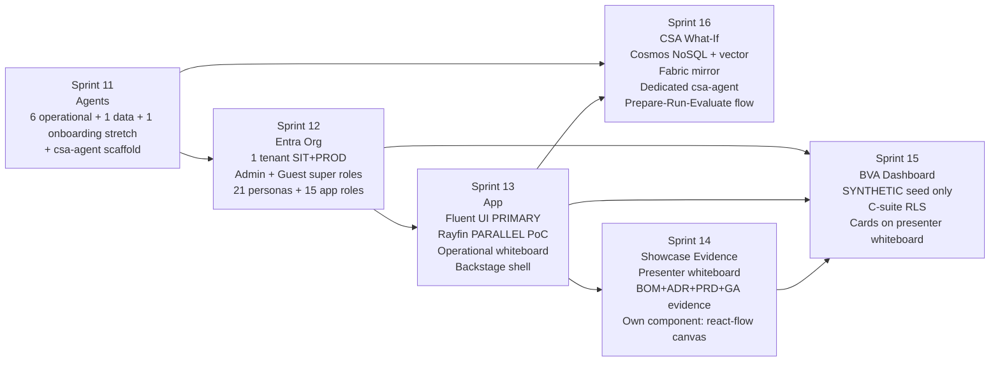
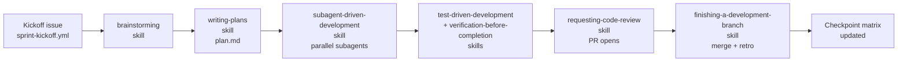

# Sprints 11–16 Roadmap — Design Spec

| Field | Value |
|-------|-------|
| **Version** | 1.3.0 |
| **Date** | 2026-07-09 |
| **Author** | Urs Rüeegg |
| **Status** | Draft for review |
| **Previous Version** | 1.2.0 (updated `agents-archive/<name>/` refs to `agents/<name>/` after the 2.0.0 folder restructure); **program-complete** — Sprint 16 (CSA) foundation authored, closing the S11–S16 program |

> **Purpose.** Master roadmap for the demo-showcase programme spanning Sprints 11–16. Anchors the per-sprint design specs, records the brainstorm decisions, and defines the Superpowers-first orchestration pattern used to delegate work to the GitHub Copilot coding agent.
>
> **Scope.** Design-level only. Does NOT contain implementation plans — each sprint produces its own `plan.md` via the `writing-plans` skill when it kicks off.
>
> **Runtime.** Per the ADR-0002 runtime decision recorded in [AGENTS.md](../../../AGENTS.md), work is executed by the GitHub Copilot coding agent using Superpowers execution and the MCP allow-list in [.github/copilot/mcp.json](../../../.github/copilot/mcp.json).

---

## Table of Contents

1. [Executive summary](#1-executive-summary)
2. [Meta-architecture — how the six sprints hang together](#2-meta-architecture--how-the-six-sprints-hang-together)
3. [Superpowers-first orchestration pattern](#3-superpowers-first-orchestration-pattern)
4. [GitHub delegation shape](#4-github-delegation-shape)
5. [Per-sprint index](#5-per-sprint-index)
6. [Sprint 11 agent roster (foundational)](#6-sprint-11-agent-roster-foundational)
7. [Brainstorm decisions log](#7-brainstorm-decisions-log)
8. [Deliverable manifest](#8-deliverable-manifest)
9. [Open questions and follow-ups](#9-open-questions-and-follow-ups)

---

## 1. Executive summary

Sprints 11–16 build the demo-showcase surface of the Swiss Hospital Capacity Platform on top of the data platform delivered in Sprints 07–10. The programme delivers six concrete outcomes:

- **S11 Agents** — 6 user-facing operational copilots + 1 data-quality agent + 1 stretch onboarding agent, with a `csa-agent` scaffold that fills out in Sprint 16.
- **S12 Organisation** — the two-super-role plus 21-persona demo organisation provisioned in Entra (`MngEnvMCAP164444`), with SIT and PROD sharing users (per your operating constraint).
- **S13 App** — the Fluent UI React app (primary track) with a parallel Rayfin PoC, delivering the two-workspace shell (Main + Backstage), one reference operational whiteboard, and Copilot Drawer wiring.
- **S14 Showcase Evidence** — the BOM + ADR + PRD + GA-evidence data product with a **presenter whiteboard** rendered inside the app's Backstage.
- **S15 BVA** — the C-suite Business Value Assessment dashboard built on **synthetic** FOCUS-shaped consumption data, rendered as cards on the presenter whiteboard.
- **S16 CSA** — the What-If Scenario system with Azure Cosmos DB for NoSQL (agent memory + catalog), Fabric Mirroring for analytical replica, and a dedicated `csa-agent` that walks users through Prepare → Run → Evaluate → Recommend.

Everything is orchestrated Superpowers-first with the GitHub Copilot coding agent as the runtime — no bespoke service, no Foundry-hosted platform agent.

---

## 2. Meta-architecture — how the six sprints hang together

- **Critical path:** S11 → S12 → S13. Agents ground the app; org grounds the RBAC; app hosts the surfaces.
- **Parallelisable after S13:** S14 (evidence whiteboard) and S15 (BVA cards) share the presenter-whiteboard component but not data — they can run in parallel.
- **S16 fans out from S11 + S13:** requires the `csa-agent` scaffold (S11) and the app shell to render the wizard (S13).

**Demo target concept.** A single end-to-end walk-through: sign in as one of the 21 SIT personas (S12) → land on the role's operational whiteboard (S13) → invoke a role agent (S11) → open Backstage → click through the presenter whiteboard (S14) → drill into a BVA card (S15) → open the CSA wizard to run a scenario (S16). One session, six sprints, one message.

---

## 3. Superpowers-first orchestration pattern

Every sprint 11–16 follows the identical cycle. Progress is tracked in [docs/sprints/superpowers-checkpoint-matrix.md](../../sprints/superpowers-checkpoint-matrix.md).

**What travels between sprints.** The `plan.md` from the previous sprint becomes the *input* to the next sprint's brainstorm (dependency handoff).

**What stays inside a sprint.** The design spec + plan + subagent work products + verification evidence.

**Delegation shape.** The coding agent picks up the kickoff issue (labelled `sprint-NN` + `superpowers-brainstorm`), reads the previous sprint's `plan.md` as input, then follows the cycle. Every `approved-to-apply` gate stays with the human per [AGENTS.md §4](../../../AGENTS.md#4-confirmation-rule-for-deploy--delete).

**Skill discovery.** Follow the [Skill discovery rule of engagement in AGENTS.md](../../../AGENTS.md#skill-discovery--rule-of-engagement-v1140-2026-07-08) whenever a sprint hits a domain gap. Do not install skills speculatively — every install goes through a user-reviewed PR.

---

## 4. GitHub delegation shape

New assets to add in the Sprint 11 kickoff PR (so they exist before Sprints 12–16 start):

| Asset | Path | Purpose |
| --- | --- | --- |
| Issue template — sprint kickoff | `.github/ISSUE_TEMPLATE/sprint-kickoff.yml` | One template, `sprint_number` field, populates labels |
| Issue template — agent build | `.github/ISSUE_TEMPLATE/agent-build.yml` | For Sprint 11 per-agent PRs |
| Issue template — CSA scenario | `.github/ISSUE_TEMPLATE/csa-scenario.yml` | For Sprint 16 scenario CRUD (round-trips to Cosmos) |
| Label taxonomy | (via `gh label create`) | `sprint-11`..`sprint-16`, `superpowers-brainstorm`, `superpowers-plan`, `superpowers-execute`, `approval-required` |
| MCP allow-list additions | `.github/copilot/mcp.json` | Add `cosmos-mcp` (S16), `fabric-mcp` (S14/S15/S16), keep read-only `entra-mcp` (S12 stretch) |
| Workflow — nightly BVA refresh | `.github/workflows/bva-sim-refresh.yml` | Sprint 15 — synthetic data refresh into OneLake |
| Workflow — evidence publish | `.github/workflows/evidence-publish.yml` | Sprint 14 — parses PRD/ADR/BOM to `data/evidence/*.json` on push |
| Workflow — CSA scenario sync | `.github/workflows/csa-scenario-sync.yml` | Sprint 16 — YAML scenarios round-trip to Cosmos |
| Workflow — Entra what-if | `.github/workflows/entra-whatif.yml` | Sprint 12 — Graph what-if on infra PRs |
| Workflow — app build | `.github/workflows/app-build.yml` | Sprint 13 — build + unit test both apps |
| Workflow — app E2E | `.github/workflows/app-e2e.yml` | Sprint 13 — Playwright smoke test |
| Workflow — golden-tasks eval | `.github/workflows/eval-goldens.yml` | Sprint 11 — replay agent fixtures |
| CODEOWNERS updates | `.github/CODEOWNERS` | Add per-scope owners for new paths |

**Gates that stay manual** (no auto-approve): any Cosmos DB provisioning (S16), any real Entra user creation (S12 apply step), any Fabric capacity resize, any PROD-labelled batch.

---

## 5. Per-sprint index

| Sprint | Design spec | Kickoff issue label | Anchor idea |
| --- | --- | --- | --- |
| **11 — Agents** | [2026-07-09-sprint-11-agents-design.md](2026-07-09-sprint-11-agents-design.md) | `sprint-11` | [docs/reviews/2026-06-09-ama-sd-review.md](../../reviews/2026-06-09-ama-sd-review.md) |
| **12 — Organisation** | [2026-07-09-sprint-12-org-design.md](2026-07-09-sprint-12-org-design.md) | `sprint-12` | [docs/superpowers/ideas/Swiss-Hospital-Capacity-UX-Design-and-Roles.md](../ideas/Swiss-Hospital-Capacity-UX-Design-and-Roles.md) |
| **13 — App** | [2026-07-09-sprint-13-app-design.md](2026-07-09-sprint-13-app-design.md) | `sprint-13` | Same as above |
| **14 — Showcase Evidence** | [2026-07-09-sprint-14-evidence-design.md](2026-07-09-sprint-14-evidence-design.md) | `sprint-14` | [docs/superpowers/ideas/SwissHospitalPlatformShowcaseEvidence.md](../ideas/SwissHospitalPlatformShowcaseEvidence.md) |
| **15 — BVA** | [2026-07-09-sprint-15-bva-design.md](2026-07-09-sprint-15-bva-design.md) | `sprint-15` | [docs/superpowers/ideas/Swiss-Hospital-Capacity-Live-Business-Value-Assessment-(BVA)-Dashboard.md](../ideas/Swiss-Hospital-Capacity-Live-Business-Value-Assessment-(BVA)-Dashboard.md) |
| **16 — CSA** | [2026-07-09-sprint-16-csa-design.md](2026-07-09-sprint-16-csa-design.md) | `sprint-16` | [docs/superpowers/ideas/CSA-WhatIf-Scenario-Research-and-Catalogue.md](../ideas/CSA-WhatIf-Scenario-Research-and-Catalogue.md) |

---

## 6. Sprint 11 agent roster (foundational)

Locked here in the roadmap because every downstream sprint depends on it. Full detail in the Sprint 11 spec.

| # | Agent | Bucket | MCP servers | Ceiling | Owner |
| --- | --- | --- | --- | --- | --- |
| 1 | `bmca-agent` (bed management copilot) | User-facing | `github-mcp`, `fabric-mcp` | `write` | @urruegg |
| 2 | `ooa-agent` (occupancy / 72-h forecast) | User-facing | `github-mcp`, `fabric-mcp` | `write` | @urruegg |
| 3 | `dca-agent` (discharge copilot) | User-facing | `github-mcp`, `fabric-mcp` | `write` | @urruegg |
| 4 | `orsa-agent` (OR steering) | User-facing | `github-mcp`, `fabric-mcp` | `write` | @urruegg |
| 5 | `sba-agent` (staffing balance) | User-facing | `github-mcp`, `fabric-mcp` | `write` | @urruegg |
| 6 | `csa-agent` (scaffold; body in S16) | User-facing | `github-mcp`, `fabric-mcp`, `cosmos-mcp` (S16) | `write` (S11), `deploy` (S16) | @urruegg |
| 7 | `data-quality-agent` | Data | `github-mcp`, `fabric-mcp` | `write` | @urruegg |
| 8 | `onboarding-agent` **(stretch)** | Onboarding | `github-mcp`, `entra-mcp` (read) | `write` | @urruegg |

All eight get a canonical prompt + `manifest.yaml` + golden-tasks under `agents/<name>/` (single source of truth after the 2.0.0 folder restructure). Table rows appended to [AGENTS.md §1](../../../AGENTS.md#1-registry).

---

## 7. Brainstorm decisions log

Decisions made during the 2026-07-09 brainstorm session with the user. Each decision is either an ADR candidate or a design-level lock recorded here.

| # | Decision | Rationale | Impact |
| --- | --- | --- | --- |
| D-1 | Deliverable shape = Option C (roadmap + six full design specs) | User selected "heaviest upfront but each sprint directly executable" | Seven docs written now; no per-sprint re-brainstorm needed |
| D-2 | Orchestration lens = Superpowers-first | User selected "double down on current Superpowers execution model" | Every sprint follows the [§3](#3-superpowers-first-orchestration-pattern) cycle |
| D-3 | Sprint 11 "User phasing" = user-facing operational copilots + onboarding stretch | User selected Option C ("Both") | 6 role copilots + 1 data-quality + 1 stretch onboarding |
| D-4 | Sprint 13 Rayfin = parallel PoC (Fluent primary) | User selected Option B | Two app codebases in Sprint 13; decision ADR at exit |
| D-5 | Whiteboards = two distinct components (operational vs presenter) | User selected Option A | Sprint 13 operational board; Sprint 14 presenter board (reused component pattern, distinct card catalog) |
| D-6 | Sprint 12 Entra = real SIT+PROD provisioning, users shared between environments | User's freeform correction to Option C | Env claim + hospital-context enforce scoping in-app, NOT by cloning identities |
| D-7 | Sprint 15 BVA data = synthetic seed only | User selected Option A | No FOCUS export dependency; synth-refresh workflow feeds medallion |
| D-8 | Sprint 16 CSA persistence = Cosmos DB for NoSQL + Fabric Mirroring | Microsoft best practice: [Cosmos for AI agent memory](https://learn.microsoft.com/azure/cosmos-db/ai-agents), [Fabric Mirroring for analytical replica](https://learn.microsoft.com/fabric/mirroring/azure-cosmos-db) | Vector search (DiskANN), change feed, HTAP; superior to SQL for agent knowledge |
| D-9 | Sprint 16 CSA guidance = dedicated `csa-agent` | User selected Option B (with hybrid persistence per D-8) | `csa-agent` owns Prepare → Run → Evaluate → Recommend wizard |
| D-10 | Two super roles = `HCC.SuperAdmin` + `HCC.GuestReadOnly` | User's brief | Provisioned in Sprint 12; used by demo operator and external stakeholders |
| D-11 | Agent runtime posture = application-hosted per [ADR-0008](../../adr/0008-agent-runtime-pattern-scope-and-selection.md); Foundry provides the model only. Redis + Cosmos wiring per [ADR-0007](../../adr/0007-mvp-agent-runtime-and-hitl-release-gates.md). | Follow-up correction after user question on 2026-07-09; roadmap v1.0.0 and Sprint 11/13/15/16 specs at 1.0.0 had mistakenly implied Foundry Agent Service as the runtime | Sprint 11 delivers prompt manifests + tool contracts + HITL declarations only; Sprint 13 builds the Container Apps agent-host that loads them |

---

## 8. Deliverable manifest

Seven files, versioned per [copilot-instructions.md §9](../../../.github/copilot-instructions.md).

| # | Path | Init version | Status |
| --- | --- | --- | --- |
| 1 | `docs/superpowers/specs/2026-07-09-sprints-11-16-roadmap-design.md` (this doc) | 1.0.0 | Draft for review |
| 2 | `docs/superpowers/specs/2026-07-09-sprint-11-agents-design.md` | 1.0.0 | Draft for review |
| 3 | `docs/superpowers/specs/2026-07-09-sprint-12-org-design.md` | 1.0.0 | Draft for review |
| 4 | `docs/superpowers/specs/2026-07-09-sprint-13-app-design.md` | 1.0.0 | Draft for review |
| 5 | `docs/superpowers/specs/2026-07-09-sprint-14-evidence-design.md` | 1.0.0 | Draft for review |
| 6 | `docs/superpowers/specs/2026-07-09-sprint-15-bva-design.md` | 1.0.0 | Draft for review |
| 7 | `docs/superpowers/specs/2026-07-09-sprint-16-csa-design.md` | 1.0.0 | Draft for review |

**Not written now** (deferred to per-sprint kickoff, per decision D-1):
- Per-sprint `plan.md` files (produced by the `writing-plans` skill *inside* each sprint kickoff).
- Actual agent prompt bodies under `agents/<name>/AGENT.md` (produced by Sprint 11 subagents).
- Bicep / IaC modules (produced by Sprint 12 + Sprint 16 subagents).
- App source under `apps/**` (produced by Sprint 13 subagents).
- Fabric notebooks / pipelines (produced by Sprint 14/15/16 subagents).

---

## 9. Open questions and follow-ups

Non-blocking, capture-for-later items surfaced during the brainstorm but deliberately deferred out of the roadmap.

| # | Question | Deferred to |
| --- | --- | --- |
| Q-1 | ADR for demo region (currently westus2 per ADR-0013) — do we sunset to Switzerland North during Sprints 11–16 or after? | Sprint 11 kickoff |
| Q-2 | Cross-canton or B2B invites for the Cantonal Viewer persona | Post-Sprint 12 |
| Q-3 | Automated GA-status verification (Azure Resource Graph → Fabric) | Sprint 14 follow-up |
| Q-4 | Real FOCUS export from Cost Management | Sprint 15 + 1 |
| Q-5 | Multi-user shared CSA runs | Sprint 16 + 1 |
| Q-6 | PIM for `HCC.SuperAdmin` | Hardening sprint |
| Q-7 | Rayfin licensing / GA posture | Sprint 13 decision ADR |

---

## Next actions

1. **User review** — please read this roadmap plus the six sibling per-sprint specs and either approve or flag edits.
2. **On approval** — the next step is to open the Sprint 11 kickoff issue (`sprint-kickoff.yml`) which triggers the `brainstorming` → `writing-plans` cycle for Sprint 11 specifically. This roadmap becomes the immutable input to that plan.
3. **Not now** — do NOT invoke the `writing-plans` skill until you have explicitly approved this brainstorm and given a Sprint 11 go-ahead.
