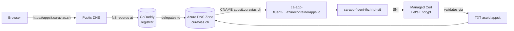

# Design spec — curavias.ch DNS strategy for Sprint 13.1

| Field | Value |
| ----- | ----- |
| **Version** | 1.1.0 |
| **Date** | 2026-07-14 |
| **Author** | Urs Rüeegg |
| **Status** | **Delivered (2026-07-14).** See [ADR-0030](../../adr/0030-curavias-dns-strategy.md) for the decision, [ADR-0031](../../adr/0031-tls-certificate-lifecycle-strategy.md) for the cert-lifecycle follow-up. |
| **Sprint** | 13.1 mini-sprint |
| **Previous Version** | 1.0.0 (initial approved design) |
| **Related** | [ADR-0030](../../adr/0030-curavias-dns-strategy.md), [ADR-0031](../../adr/0031-tls-certificate-lifecycle-strategy.md), [runbook](../../runbooks/curavias-dns-godaddy-delegation.md) |

> **Delivery evidence (2026-07-14):** `https://appsit.curavias.ch` serves HTTP 200 with a DigiCert-issued managed TLS cert. Delivery trail: PR #201 (Phase 1 zone + records), GoDaddy NS delegation confirmed at `.ch` TLD, PR #211 (Phase 2 cert flip — required an ad-hoc `az containerapp hostname add` step to break the cert/hostname chicken-and-egg), PR #212 (declarative two-phase Bicep so PROD needs no manual CLI step), PR #213 (ADR-0031 + KV opt-in scaffold for future PROD), PR #216 (Entra `spaRedirectUris`). Runbook updated to v1.1.0 with the correct sequence + DigiCert issuer note.

## 1. Problem

Post-Sprint-13.1 SIT deploy runs the Fluent app on an Azure-provided hostname
(`ca-app-fluent-ihzhhpf-sit.ashysky-8f51a689.westus2.azurecontainerapps.io`).
This hostname:

- Is ugly for demo screenshots and voice-over
- Changes when the CAE is recreated (see ADR-0029 Option A track)
- Forces MSAL redirect URIs to track the CAE's ephemeral FQDN

We own `curavias.ch` (fresh domain via GoDaddy). Use it for stable, branded
public hostnames.

## 2. Constraints

- **Fresh empty domain** — no existing records to preserve
- **Not for MCAPS tenant identity** — Entra custom-domain tie-in is forbidden
  by MCAPS policy AND risky w.r.t. tenant migration (ADR-0012)
- **Portable across tenant migrations** — domain ownership stays at GoDaddy;
  Azure resources are replaceable
- **Zero cert cost** — no GoDaddy cert product, no self-signed certs
- **PROD readiness gate** — SIT is scope for Sprint 13.1; PROD Bicep supported
  but deploy is deferred per the "focus on SIT" directive
- **MCAPS tenant + westus2 region** per ADR-0012 + ADR-0013

## 3. Success criteria

1. `https://appsit.curavias.ch` returns HTTP 200 with a valid, trusted TLS
   certificate from a browser without warnings
2. Certificate is auto-renewed by Azure without operator action
3. Domain records manageable via Bicep (declarative + reproducible)
4. Deploy sequence is safe — DNS zone can be created before NS delegation
   is live without failing the deploy
5. PROD Bicep already declares `app.curavias.ch` (dormant); no code churn
   needed to promote when PROD is ready
6. Reversible in <30 min if something goes wrong

## 4. Architecture

Data-plane flow: browser resolves via Google/Cloudflare/OS resolver →
delegated to Azure DNS → CNAME to ACA edge → ACA serves TLS via managed cert
issued by Let's Encrypt.

## 5. Components

| Component | Location | Responsibility |
| --- | --- | --- |
| DNS module | [`infra/modules/dns/curavias.bicep`](../../../infra/modules/dns/curavias.bicep) | Provisions the Azure DNS zone + CNAME/TXT records. Idempotent. |
| App-fluent module (modified) | [`infra/modules/apps/hcc-app-fluent/main.bicep`](../../../infra/modules/apps/hcc-app-fluent/main.bicep) | Accepts `customHostname` + `enableCustomDomainCert` params. Emits `customDomainVerificationId` + `appFluentFqdn` outputs. When cert flag is true, provisions Managed Certificate + binds CA. |
| Top-level template | [`infra/main.bicep`](../../../infra/main.bicep) | Adds `appFluentCustomHostname` + `appFluentEnableCustomDomainCert` params. Wires DNS module with hostname-derived record names + CA outputs. Emits `curaviasNameServers` output for the runbook. |
| SIT params | [`infra/environments/sit.bicepparam`](../../../infra/environments/sit.bicepparam) | `appFluentCustomHostname = 'appsit.curavias.ch'`, `appFluentEnableCustomDomainCert = false` (Phase 1). |
| PROD params | [`infra/environments/prod.bicepparam`](../../../infra/environments/prod.bicepparam) | `appFluentCustomHostname = 'app.curavias.ch'`, `appFluentEnableCustomDomainCert = false` (dormant). |
| Runbook | [`docs/runbooks/curavias-dns-godaddy-delegation.md`](../../runbooks/curavias-dns-godaddy-delegation.md) | Human ops steps: fetch NS records, set at GoDaddy, verify propagation, flip cert flag. |
| ADR | [`docs/adr/0030-curavias-dns-strategy.md`](../../adr/0030-curavias-dns-strategy.md) | Records the decision + rationale + follow-ups. |

## 6. Data flow (two-phase deploy)

**Phase 1 — DNS-only** (this PR merge + auto-deploy):

1. `cd-infra-deploy-sit` triggers on push to main
2. Bicep provisions the `curavias.ch` zone in `rg-ihzhhpf-sit`
3. Zone gets CNAME `appsit` → CA FQDN and TXT `asuid.appsit` → CA verification ID
4. Managed cert resource is NOT provisioned (`appFluentEnableCustomDomainCert = false`)
5. CA ingress custom domain binding is NOT provisioned (empty `customDomains[]`)
6. Deploy succeeds; the ACA-provided hostname continues serving

**Phase 2 — Certificate + binding** (post-runbook, follow-up PR):

1. Human sets GoDaddy NS records → Azure DNS name servers (from `curaviasNameServers`)
2. Wait for propagation (verify with `Resolve-DnsName ... -Type NS`)
3. Small PR flips `appFluentEnableCustomDomainCert = true` in `sit.bicepparam`
4. `cd-infra-deploy-sit` auto-triggers
5. Managed cert resource is provisioned — Azure validates via TXT record
6. Let's Encrypt issues cert (~15-30 min)
7. CA ingress binds `appsit.curavias.ch` with SNI to the new cert
8. Browser hits `https://appsit.curavias.ch` → HTTP 200 with valid cert

## 7. Error handling

| Failure | Detection | Recovery |
| --- | --- | --- |
| GoDaddy NS records wrong | Step 3 in the runbook — `nslookup` doesn't return Azure name servers | Fix NS values at GoDaddy; wait for propagation |
| Cert validation fails (Phase 2) | Managed Cert resource `provisioningState: Failed` | Verify TXT record matches CA `customDomainVerificationId`; re-run deploy or use `az containerapp env certificate create` |
| CAE recreated → CA FQDN changed → CNAME points at ghost | External smoke test (`Resolve-DnsName appsit.curavias.ch` returns NXDOMAIN or wrong host) | Redeploy — Bicep re-reads CA outputs and updates the CNAME record |
| Domain param empty | Bicep `if()` guards short-circuit the DNS module | Deploy succeeds without any DNS zone provisioning — safe default |
| Hostname param set on PROD but PROD not deployed | No behaviour — Bicep dormant | Enable PROD deploy separately when ready |

## 8. Testing

- **Unit / Bicep build:** `az bicep build --file infra/main.bicep` — 0 errors.
- **What-if against SIT:** `az deployment group what-if -g rg-ihzhhpf-sit --template-file infra/main.bicep --parameters infra/environments/sit.bicepparam`. Expected: `status: Succeeded`, `3 creates` (zone + CNAME + TXT), `0 deletes`, `25 modifies` (CA cosmetic drift), no `managedCertificates` resource in the plan.
- **Deploy verification:** `az network dns zone show ... curavias.ch` returns the zone; `az network dns record-set list` shows the CNAME + TXT.
- **Phase 2 verification** (post-cert-flip): `Invoke-WebRequest -Uri https://appsit.curavias.ch/` returns HTTP 200 with a trusted cert; `openssl s_client` shows Let's Encrypt as issuer.

## 9. Out of scope

- Agent-host public hostname (backend, no UX driver)
- Entra tenant custom-domain verification (`curavias.ch` as an Entra domain
  suffix for user UPNs — MCAPS-blocked + tenant-coupling risk)
- Private-endpoint DNS zones (Azure-owned zones for Cosmos, Storage, etc. —
  see ADR-0029 for the private-endpoint track)
- WAF / Front Door / CDN in front of the CA (deferred; Sprint 15+)
- Custom cert providers (paid or self-signed — explicitly rejected in ADR-0030)

## 10. Follow-ups (deferred by design)

1. **PROD-RG refactor** — move zone or use `existing` reference when PROD RG lands (ADR-0030 Follow-up 1)
2. **Entra MSAL redirect URIs** — update `spaRedirectUris` in `entra/parameters/sit.bicepparam` after Phase 2 confirms the hostname is live (ADR-0030 Follow-up 2)
3. **Agent-host hostname** — if a UX reason emerges (ADR-0030 Follow-up 3)
4. **PROD promotion** — flip PROD flags + approve PROD deploy after ADR-0030 Follow-up 1 (ADR-0030 Follow-up 4, tied to issue #179)
