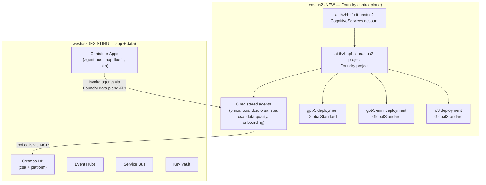

# Sprint 18 — Foundry Control Plane + Agent Registration in eastus2 — Design Spec

| Field | Value |
|-------|-------|
| **Version** | 1.0.0 |
| **Date** | 2026-07-17 |
| **Author** | Urs Rüeegg |
| **Status** | Draft for review |
| **Previous Version** | n/a (new — Sprint 18 kickoff) |
| **Anchor triggers** | SIT evidence analysis (2026-07-17): westus2 has zero OpenAI quota → agents cannot register; [ADR-0013](../../adr/0013-temporary-us-region-demo-scope.md) demo-scope pivot; eastus2 feasibility matrix (all 22 resource types confirmed GA) |
| **Runtime posture** | GitHub Copilot coding agent + Superpowers-first execution; no change to per-agent runtime posture (ADR-0008 unchanged) |

---

## Table of Contents

1. [Goal and desired end state](#1-goal-and-desired-end-state)
2. [Context and problem statement](#2-context-and-problem-statement)
3. [Scope](#3-scope)
4. [Architecture](#4-architecture)
5. [Task breakdown](#5-task-breakdown)
6. [Agent registration plan](#6-agent-registration-plan)
7. [Model deployment strategy](#7-model-deployment-strategy)
8. [End-to-end test plan](#8-end-to-end-test-plan)
9. [Side-effect posture and approval gates](#9-side-effect-posture-and-approval-gates)
10. [Dependencies](#10-dependencies)
11. [Risk register](#11-risk-register)
12. [Definition of done](#12-definition-of-done)
13. [References](#13-references)

---

## 1. Goal and desired end state

Establish the **Microsoft Foundry control plane** in `eastus2` — the only region in the MCAP tenant where OpenAI model quota exists AND Foundry Agent Service is GA-supported — deploy production-grade models (gpt-5, gpt-5-mini, o3), register all 8 platform agents, and verify end-to-end agent invocation against live Foundry endpoints.

**Desired end state:**

* `ai-ihzhhpf-sit-eastus2` AI Services account in `eastus2` with a Foundry project.
* GPT-5, GPT-5-mini, and o3 deployed as GA models (GlobalStandard SKU).
* All 8 agents registered in the Foundry project (bmca, ooa, dca, orsa, sba, csa, data-quality, onboarding).
* End-to-end agent invocation tested: user prompt → agent response → tool call → verified output.
* ADR documenting the eastus2 Foundry region decision.
* SIT evidence document updated with Foundry registration proof.

---

## 2. Context and problem statement

### The westus2 dead-end

The current SIT environment (`rg-ihzhhpf-sit`) is deployed in `westus2`. Evidence gathered 2026-07-17 shows:

| Metric | westus2 | eastus2 |
|--------|---------|---------|
| OpenAI models available | 0 | 122 |
| GA models | 0 | 88 |
| Total TPM quota | 5,000 (non-OpenAI only) | 5,800,000 |
| Foundry Agent Service | ❌ Not listed | ✅ GA supported |
| GPT-5 family | ❌ | ✅ GA (gpt-5, 5.1, 5.2, 5.5) |
| o3 reasoning | ❌ | ✅ GA |

**Consequence:** Agent registration requires at least one deployed OpenAI model AND the region must support the Foundry Agent Service data-plane API. Neither condition is met in `westus2`.

### Decision: eastus2 for Foundry control plane

The full SIT resource-type compatibility analysis (22 types, all ✅ GA in eastus2) confirms zero blocking gaps. Per [ADR-0013](../../adr/0013-temporary-us-region-demo-scope.md) this is a demo/proof-of-technology scope — no PHI, synthetic data only — so the US-region temporary posture is acceptable.

---

## 3. Scope

### In scope

| # | Item | Deliverable |
|---|------|-------------|
| T1 | ADR: eastus2 Foundry region decision | `docs/adr/0028-foundry-control-plane-eastus2.md` |
| T2 | Create AI Services account in eastus2 | `ai-ihzhhpf-sit-eastus2` in new or existing RG |
| T3 | Create Foundry project in eastus2 | `ai-ihzhhpf-sit-eastus2-project` |
| T4 | Deploy GPT-5 model (GlobalStandard) | Primary agent model |
| T5 | Deploy GPT-5-mini (GlobalStandard) | Cost-efficient model for data-quality and onboarding |
| T6 | Deploy o3 (GlobalStandard) | Reasoning model for csa-agent scenarios |
| T7 | Register 8 agents in Foundry project | All agents from AGENTS.md §1 with `fabric-mcp` or `cosmos-mcp` |
| T8 | RBAC: Managed Identity permissions | Agent-host identity → Cognitive Services User on new account |
| T9 | End-to-end agent invocation tests | Smoke test each agent via Foundry data-plane API |
| T10 | Update SIT evidence document | Append Foundry registration proof to `docs/sprints/sit-evidence-2026-07-17.md` |
| T11 | Update AGENTS.md | Add eastus2 endpoint references |

### Out of scope (deferred to Sprint 19)

* Migration of Container Apps, Cosmos DB, Event Hubs, Service Bus, VNet to eastus2
* PROD environment deployment
* Custom domain DNS cutover
* Fabric capacity migration

---

## 4. Architecture

**Cross-region communication:** The Container Apps agent-host in westus2 calls the Foundry data-plane endpoint in eastus2 over HTTPS. This is a temporary topology until Sprint 19 migrates the full stack to eastus2.

---

## 5. Task breakdown

| Task | Depends on | Side-effect ceiling | Estimated effort |
|------|------------|--------------------|-----------------|
| T1: Write ADR-0028 | — | `write` (repo) | 30 min |
| T2: Create AI Services account | T1 approved | `deploy` (Azure) | 15 min |
| T3: Create Foundry project | T2 | `deploy` (Azure) | 10 min |
| T4: Deploy gpt-5 | T3 | `deploy` (Azure) | 10 min |
| T5: Deploy gpt-5-mini | T3 | `deploy` (Azure) | 10 min |
| T6: Deploy o3 | T3 | `deploy` (Azure) | 10 min |
| T7: Register 8 agents | T4 | `deploy` (Foundry) | 60 min |
| T8: RBAC assignments | T2 | `deploy` (Azure) | 20 min |
| T9: E2E agent tests | T7, T8 | `read` | 90 min |
| T10: Update evidence doc | T9 | `write` (repo) | 30 min |
| T11: Update AGENTS.md | T9 | `write` (repo) | 20 min |

**Critical path:** T1 → T2 → T3 → T4 → T7 → T9 → T10

---

## 6. Agent registration plan

Each agent is registered as a **prompt agent** in the Foundry project with:
* **Model:** assigned per agent's complexity tier
* **Instructions:** from the agent's `AGENT.md` Identity + Scope + Tools sections
* **Tools:** mapped from the agent's MCP server declarations

| Agent | Model | Tools (Foundry-mapped) |
|-------|-------|------------------------|
| `bmca-agent` | gpt-5 | fabric-mcp (read/write) |
| `ooa-agent` | gpt-5-mini | fabric-mcp (read) |
| `dca-agent` | gpt-5 | fabric-mcp (read/write) |
| `orsa-agent` | gpt-5-mini | fabric-mcp (read) |
| `sba-agent` | gpt-5-mini | fabric-mcp (read) |
| `csa-agent` | o3 | fabric-mcp, cosmos-mcp (read/write) |
| `data-quality-agent` | gpt-5-mini | fabric-mcp (read) |
| `onboarding-agent` | gpt-5-mini | github-mcp (write), entra-mcp (read) |

---

## 7. Model deployment strategy

| Model | SKU | Capacity (TPM) | Rationale |
|-------|-----|----------------|-----------|
| gpt-5 | GlobalStandard | 50K | Primary agent model for complex reasoning |
| gpt-5-mini | GlobalStandard | 100K | Cost-efficient for high-volume / simple agents |
| o3 | GlobalStandard | 30K | Multi-step reasoning for CSA scenario planning |

All deployments use **GlobalStandard** (pay-per-use, no commitment) appropriate for SIT workloads.

---

## 8. End-to-end test plan

For each registered agent, execute:

1. **Health check:** `GET /agents/{agentId}` returns 200 with correct metadata
2. **Smoke prompt:** Send a simple domain-relevant prompt and verify coherent response
3. **Tool invocation:** For agents with tools, verify the agent requests the correct tool call shape
4. **Refusal test:** Send an out-of-scope prompt and verify the agent refuses per its refusal rules

**Pass criteria:** All 8 agents pass health check + smoke prompt. At least 4 agents (bmca, csa, dca, data-quality) pass tool invocation. All 8 pass refusal test.

---

## 9. Side-effect posture and approval gates

| Task | Ceiling | Gate |
|------|---------|------|
| T2–T3: Create Azure resources | `deploy` | `approved-to-apply` comment required |
| T4–T6: Model deployments | `deploy` | `approved-to-apply` comment required |
| T7: Agent registration | `deploy` | `approved-to-apply` comment required |
| T8: RBAC | `deploy` | `approved-to-apply` comment required |
| T9: Tests | `read` | No gate |
| T1, T10, T11: Docs | `write` | Normal PR review |

---

## 10. Dependencies

| Dependency | Status | Impact if not met |
|------------|--------|-------------------|
| MCAP tenant subscription quota in eastus2 | ✅ Verified (5.8M TPM) | Blocker |
| Foundry Agent Service GA in eastus2 | ✅ Confirmed (Microsoft Learn) | Blocker |
| Agent-host in westus2 can call eastus2 endpoints | ⚠️ Assumed (HTTPS, no VNet restriction) | Verify in T9 |
| Existing RBAC identity `id-ca-agent-host-ihzhhpf-sit` | ✅ Exists | Assign roles in T8 |
| ADR-0013 demo-scope allows US region | ✅ Per ADR text | — |

---

## 11. Risk register

| # | Risk | Likelihood | Impact | Mitigation |
|---|------|-----------|--------|------------|
| R1 | Agent registration API requires region-local MCP servers | Low | High | Test with one agent first (T7 phased); fall back to Responses API if full agent reg unavailable |
| R2 | Cross-region latency impacts agent-host response time | Medium | Low | Acceptable for demo scope; Sprint 19 collocates everything |
| R3 | TPM quota insufficient under load test | Low | Medium | Start with minimum capacity; scale on demand |
| R4 | Foundry project creation requires additional permissions | Low | Medium | User has Owner on subscription; escalate to tenant admin if needed |

---

## 12. Definition of done

* [ ] ADR-0028 merged documenting eastus2 Foundry decision
* [ ] AI Services account `ai-ihzhhpf-sit-eastus2` provisioned and accessible
* [ ] Foundry project created with SystemAssigned managed identity
* [ ] 3 models deployed (gpt-5, gpt-5-mini, o3) all in `Succeeded` state
* [ ] 8 agents registered in Foundry project with correct model assignments
* [ ] RBAC: agent-host identity has Cognitive Services User on eastus2 account
* [ ] E2E tests: 8/8 agents pass health + smoke; ≥4/8 pass tool invocation; 8/8 pass refusal
* [ ] `docs/sprints/sit-evidence-2026-07-17.md` updated with Foundry evidence
* [ ] `AGENTS.md` updated with eastus2 endpoint references
* [ ] All CI checks pass (markdown lint, link check)

---

## 13. References

* [SIT Evidence Analysis (2026-07-17)](../../sprints/sit-evidence-2026-07-17.md)
* [Sprints 11–16 Roadmap Design](2026-07-09-sprints-11-16-roadmap-design.md)
* [ADR-0013: Temporary US Region Demo Scope](../../adr/0013-temporary-us-region-demo-scope.md)
* [AGENTS.md §1 Registry](../../../AGENTS.md#1-registry)
* [Microsoft Learn: Foundry Agent Service regions](https://learn.microsoft.com/en-us/azure/ai-services/agents/overview)
* [eastus2 Feasibility Matrix (session checkpoint 003)](../../../.copilot/session-state/) — 22/22 resource types GA
