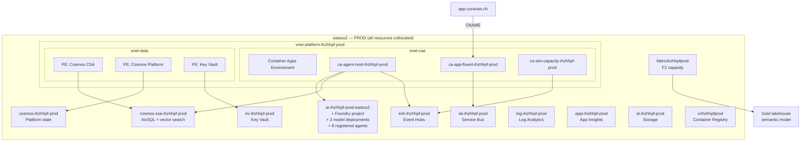

# Sprint 19 — Full PROD Deployment in eastus2 (Fresh from Scratch) — Design Spec

| Field | Value |
|-------|-------|
| **Version** | 1.6.0 |
| **Date** | 2026-07-19 |
| **Author** | Urs Rüeegg |
| **Status** | Accepted — in progress (P1–P7 foundation + AI + compute + data lane + Foundry agents + Fabric capacity + integration/DNS/Entra DEPLOYED & verified; P6.2 + P8 pending) |
| **Previous Version** | 1.5.0 (added §7e — the P6.1 Fabric F2 capacity deploy and the **eastus2 Fabric quota = 0** finding that forced PROD Fabric into **westus2**). 1.6.0 adds §7f — the P7 integration outcome: `app.curavias.ch` custom domain + managed cert bound to the PROD app (HTTP 200 live), PROD Entra SPA redirect URIs, and the Logic App skip (SIT one is Disabled). |
| **Anchor triggers** | Sprint 18 completion (Foundry control plane proven in eastus2); SIT feasibility matrix confirming 22/22 resource types GA in eastus2; ADR-0013 demo-scope pivot |
| **Runtime posture** | GitHub Copilot coding agent + Superpowers-first execution; Bicep-first IaC for all PROD resources |
| **Prerequisites** | Sprint 18 complete (Foundry agents proven E2E in eastus2); Fabric capacity stabilized; App Fluent builds green |

---

## Table of Contents

1. [Goal and desired end state](#1-goal-and-desired-end-state)
2. [Context and rationale](#2-context-and-rationale)
3. [Scope](#3-scope)
4. [Architecture — PROD target state](#4-architecture--prod-target-state)
5. [Resource inventory (PROD eastus2)](#5-resource-inventory-prod-eastus2)
6. [Task breakdown](#6-task-breakdown)
7. [Bicep module plan](#7-bicep-module-plan)
8. [DNS and custom domain strategy](#8-dns-and-custom-domain-strategy)
9. [Security and identity](#9-security-and-identity)
10. [Fabric capacity and workspace](#10-fabric-capacity-and-workspace)
11. [Side-effect posture and approval gates](#11-side-effect-posture-and-approval-gates)
12. [Dependencies](#12-dependencies)
13. [Risk register](#13-risk-register)
14. [Definition of done](#14-definition-of-done)
15. [References](#15-references)

---

## 1. Goal and desired end state

Deploy the **entire PROD environment from scratch in eastus2** — all resources collocated in a single region, eliminating cross-region latency, simplifying network topology, and unlocking full Foundry Agent Service capability.

**Desired end state:**

* `rg-ihzhhpf-prod-eastus2` resource group with all platform resources deployed via Bicep.
* Full stack: Container Apps (agent-host + app-fluent + sim), Cosmos DB (CSA + platform), Event Hubs, Service Bus, Key Vault, VNet + private endpoints, AI Services + Foundry project, Fabric capacity, Storage, Log Analytics, Application Insights, Logic Apps, Container Registry.
* All 8 agents registered and functional in PROD Foundry project.
* Custom domain `app.curavias.ch` (PROD) pointing to the new Container Apps.
* Fabric PROD workspace connected to eastus2 lakehouse.
* End-to-end demo flow operational: sign-in → app → agent invocation → data query → response.

---

## 2. Context and rationale

### Why fresh deployment (not migration)

| Factor | Migrate existing | Fresh deploy |
|--------|-----------------|--------------|
| Cosmos DB data | Requires export/import + PE rewire + vector re-index | Fresh schema + synthetic seed — cleaner |
| Container Apps | Can't move — must redeploy | Same outcome, simpler |
| Event Hubs / Service Bus | Message state not portable | Fresh — no persistent messages needed |
| Key Vault | Secrets can be recreated | Fresh — all secrets are synthetic/generated |
| Network topology | Complex PE migration | Clean VNet design from scratch |
| Blast radius | Risk breaking SIT during migration | Zero impact on existing SIT |
| Time | Higher — debugging migration issues | Lower — known Bicep patterns |

**Decision:** PROD deploys fresh. No data migration required (synthetic data regenerated). SIT remains in westus2 until proven stable in eastus2, then decommissioned in a future sprint.

### Why eastus2 specifically

* 122 OpenAI models (88 GA), 5.8M TPM quota — richest in the tenant
* Foundry Agent Service GA supported
* All 22 resource types confirmed GA (Sprint 18 feasibility analysis)
* DataZone + ProvisionedManaged SKUs available for future scale
* Same continent as current deployment (acceptable latency for EU-based users during demo scope)

---

## 3. Scope

### In scope

| # | Item | Deliverable |
|---|------|-------------|
| T1 | Bicep template: PROD eastus2 landing zone | `infra/prod-eastus2/main.bicep` + modules |
| T2 | VNet + subnets + NSGs | Network foundation |
| T3 | Key Vault (PROD) | Secrets store |
| T4 | Storage Account (PROD) | Platform storage |
| T5 | Log Analytics + App Insights | Observability stack |
| T6 | Container Registry | Shared image registry (geo-replicated from SIT or new) |
| T7 | Container Apps Environment + apps (3) | Agent-host + App Fluent + Sim Capacity |
| T8 | Cosmos DB (2 accounts: CSA + platform) | NoSQL + vector search + private endpoints |
| T9 | Event Hubs namespace | Event ingestion |
| T10 | Service Bus namespace | Message routing |
| T11 | AI Services + Foundry project | Control plane (eastus2-native) |
| T12 | Model deployments (gpt-5, gpt-5-mini, o3) | Agent backing models |
| T13 | Agent registration (8 agents) | Full roster in PROD |
| T14 | Managed Identities (7) | Workload identities |
| T15 | Private endpoints + Private DNS zones | Cosmos DB + Key Vault PE |
| T16 | Fabric capacity (F2) | PROD Fabric in eastus2 |
| T17 | DNS: `app.curavias.ch` → PROD Container Apps | Custom domain + managed TLS |
| T18 | Logic Apps workflow | Platform orchestration |
| T19 | Entra: PROD app registration bindings | RBAC for PROD identities |
| T20 | End-to-end PROD verification | Full demo flow proven |
| T21 | Bicep `what-if` + deployment evidence | IaC proof |
| T22 | PROD evidence document | `docs/sprints/prod-evidence-eastus2.md` |

### Out of scope

* SIT decommission (future sprint after PROD proven stable)
* PHI data onboarding (per ADR-0016, demo scope only)
* Multi-region DR (not required for demo scope)
* switzerlandnorth failover (post-demo scope consideration)

---

## 4. Architecture — PROD target state



---

## 5. Resource inventory (PROD eastus2)

| # | Resource Type | Name Pattern | SKU/Tier | Notes |
|---|------|------|------|-------|
| 1 | Resource Group | `rg-ihzhhpf-prod-eastus2` | — | New RG in eastus2 |
| 2 | VNet | `vnet-platform-ihzhhpf-prod` | — | 3 subnets: snet-cae, snet-data, snet-app |
| 3 | NSGs (×3) | `*-nsg-eastus2` | — | Per subnet |
| 4 | Key Vault | `kv-ihzhhpf-prod` | Standard | RBAC mode, purge protection |
| 5 | Storage | `stihzhhpfprod` | Standard_LRS | Platform storage |
| 6 | Log Analytics | `log-ihzhhpf-prod` | PerGB2018 | 30-day retention |
| 7 | App Insights | `appi-ihzhhpf-prod` | — | Connected to Log Analytics |
| 8 | Container Registry | `crihzhhpfprod` | Basic | Or geo-replicate SIT ACR |
| 9 | CAE | `cae-ihzhhpf-prod` | Consumption | VNet-integrated (snet-cae) |
| 10 | CA: agent-host | `ca-agent-host-ihzhhpf-prod` | — | 7 agents loaded |
| 11 | CA: app-fluent | `ca-app-fluent-ihzhhpf-prod` | — | Custom domain + TLS |
| 12 | CA: sim-capacity | `ca-sim-capacity-ihzhhpf-prod` | — | Simulator |
| 13 | Cosmos CSA | `cosmos-csa-ihzhhpf-prod` | Serverless | NoSQL + vector, PE, AAD-only |
| 14 | Cosmos Platform | `cosmos-ihzhhpf-prod` | Serverless | Platform state, PE, AAD-only |
| 15 | Event Hubs | `evh-ihzhhpf-prod` | Standard | 1 TU |
| 16 | Service Bus | `sb-ihzhhpf-prod` | Standard | — |
| 17 | AI Services | `ai-ihzhhpf-prod-eastus2` | S0 | Foundry-enabled |
| 18 | Foundry Project | `ai-ihzhhpf-prod-eastus2-project` | — | 8 agents + 3 models |
| 19 | Fabric Capacity | `fabricihzhhpfprod` | F2 | westus2 (eastus2 quota = 0 — see §7e) |
| 20 | Logic App | `logic-ihzhhpf-prod` | Consumption | Orchestration flows |
| 21 | Managed Identities (×7) | `id-*-ihzhhpf-prod` | — | Per workload |
| 22 | Private Endpoints (×3) | `pe-*-ihzhhpf-prod` | — | Cosmos CSA, Cosmos Platform, KV |
| 23 | Private DNS Zones | `privatelink.documents.azure.com` | Global | VNet link |
| 24 | DNS Zone | `curavias.ch` | Global | Already exists (shared) |
| 25 | Managed Certificate | `cert-app-curavias-ch` | — | On CAE |

---

## 6. Task breakdown

| Phase | Tasks | Depends on | Effort |
|-------|-------|------------|--------|
| **P1: IaC authoring** | T1 (Bicep modules) | Sprint 18 done | 4h |
| **P2: Foundation** | T2–T6 (VNet, KV, Storage, Log, ACR) | T1 reviewed | 1h |
| **P3: Compute** | T7 (CAE + 3 apps) | P2 | 2h |
| **P4: Data** | T8–T10 (Cosmos ×2, EVH, SB) + T15 (PEs) | P2 | 2h |
| **P5: AI/Foundry** | T11–T13 (AI + project + models + agents) | P2 | 2h |
| **P6: Fabric** | T16 (capacity + workspace) | P2 | 1h |
| **P7: Integration** | T17 (DNS), T18 (Logic), T19 (Entra) | P3, P4, P5 | 2h |
| **P8: Verification** | T20–T22 (E2E test, evidence) | P3–P7 | 3h |

**Total estimated effort:** ~17 hours (2–3 working days)

---

## 7. Bicep module plan

> **Revised 2026-07-19 (v1.1.0) — Option 1 (reuse) adopted.** The fresh
> `infra/prod-eastus2/modules/*` tree below is **superseded**. Rather than
> re-author 15 modules, PROD reuses the existing, SIT-proven orchestrator
> `infra/main.bicep` (550 lines, 20+ `enable<X>Module` gates, parameterised
> `location`) via a **new environment param file
> `infra/environments/prod-eastus2.bicepparam`** (`environmentName='prod'`,
> `location='eastus2'`). This is DRY, avoids module drift, and lets every
> PROD deploy benefit from SIT hardening. Module *selection* for PROD is
> leaner than SIT: the legacy App Service / ML-workspace topology
> (`experience-hosting`, `api-runtime`, `ai-ml-foundation`) is **excluded** —
> the PROD demo target is Container Apps + Foundry + Fabric + Cosmos only (see
> §5 inventory).
>
> **Prerequisite done 2026-07-19:** the abandoned westus2 `rg-ihzhhpf-prod`
> (19 resources: App Service, ML workspace, Cognitive Services, EventHub,
> ServiceBus, KV, ACR, VNet, …) was **decommissioned** (`approved-to-apply`
> by @urruegg) so PROD is region-isolated to eastus2. Cognitive Services was
> purged; the Key Vault `kv-ihzhhpf-prod-i62t` is purge-protected and
> auto-expires 2026-10-16 (non-blocking — the new deploy uses a distinct KV
> name).

### 7b. Verified deploy outcome — P1–P3 (2026-07-19)

Approved-to-apply @urruegg 2026-07-19T00:53 +02:00. Deployment
`sprint19-prod-eastus2-p1` Succeeded in 2m26s (2026-07-19T05:37Z) into
`rg-ihzhhpf-prod-eastus2`. **17 resources**, both Container Apps live on
PROD-local images.

The first attempt surfaced two limitations in the reused shared modules; both
are now documented constraints for future PROD/region work:

1. **Cross-RG ACR is unsupported.** `modules/agent-host/container-app.bicep`
   references the registry with `existing = { name: last(split(resourceId,'/')) }`
   — resolved **in the deployment resource group**, with no cross-RG scope. A
   cross-region pull from the SIT ACR therefore fails `ResourceNotFound`.
   **Decision:** stand up a **PROD-local ACR `crihzhhpfprod`** in the PROD RG and
   `az acr import` the images from the SIT ACR. This is also the more
   region-isolated end-state (reverses the interim "reuse SIT ACR" idea).
2. **Cosmos private endpoint depends on the CSA-Cosmos DNS zone.**
   `modules/agent-host/cosmos-pe.bicep` references
   `privatelink.documents.azure.com` as `existing`; that zone is created only by
   `modules/cosmos/csa.bicep`. With the CSA module out of scope, the PE fails
   `InvalidPrivateDnsZoneIds`. **Decision:** `enableNetworkModule=false` for the
   first slice → public CAEs + public Cosmos (synthetic data, no PHI per
   ADR-0013). VNet + private endpoint becomes a **hardening follow-up** (must
   also provision/own the privatelink zone independently of CSA-Cosmos).

**Verified live:** agent-host `/healthz` → `{"status":"ok"}`, `/agents` → 200;
app-fluent `/` → 200; Cosmos db `agenthost` has `conversations` / `audit` /
`approval-events`; KV `kv-ihzhhpf-prod-q4nk` (distinct name dodged the
purge-protected `-i62t`). Commits `6d31559` + `0913b02`.

**Still deferred:** Redis (eastus2 Balanced SKU unverified), P4 Event Hubs /
Service Bus, P5 Foundry-hosted agents, P6 Fabric F2 workspace + Data Agent, P7
DNS cutover `app.curavias.ch`, VNet/PE hardening.

### 7c. P4 data lane — deployed via the CI/CD workflow (2026-07-19)

The P4 data lane was deployed through the **`cd-infra-deploy-prod` GitHub
workflow** (not a local `az` command) to prove the CI/CD infra path
end-to-end: `policy-gate` → `environment: prod` OIDC → what-if → deploy.

**#252 Phase A — CSA Cosmos parity (prerequisite).** The CSA Cosmos account was
an out-of-band standalone deploy, invisible to `main.bicep` and CI what-if
([#252](https://github.com/urruegg/SwissHospitalCapacityPlatform/issues/252)).
Phase A wired it into the orchestrator behind an `enableCsaCosmosModule` gate (a
`csaCosmos` block calling `modules/cosmos/csa.bicep`), added an
`agentHostMiPrincipalId` output on the agent-host module for the data-contributor
role assignment, and pinned `publicNetworkAccess` in `csa.bicep`. Enabled in
`sit.bicepparam` (idempotent — SIT what-if **0 Create / 0 Delete**) and
`prod-eastus2.bicepparam` (which also enables EVH + SB). Commit `a0eeda1`.

**CI/CD finding — stale `prod` environment.** The GitHub `prod` environment
variables still targeted the decommissioned westus2 footprint
(`rg-ihzhhpf-prod` / `prod.bicepparam` / `westus2`); corrected to
`rg-ihzhhpf-prod-eastus2` / `prod-eastus2.bicepparam` / `eastus2`. Broader
stale vars (`SOLUTION_SHORT_NAME`, `PROD_SOURCE_SQL_*`, `PROD_FABRIC_*` →
frozen tenant `mngenvmcap228255`) are noted on #252 for a follow-up sweep.

**Outcome.** Workflow run `29679485559` — policy-gate PASSED, `Deploy PROD`
approved at the required-reviewer gate, green in 5m8s. PROD what-if **12 Create
/ 0 Delete**; verified live: `cosmos-csa-ihzhhpf-prod` (db `csa` + 4 containers
`scenarios` / `agent-memory` / `response-levers` / `simulation-runs`),
`evh-ihzhhpf-prod-q4nk` (hub `events` + consumer groups `cg-bm-copilot-agent` /
`cg-csa-agent` / `cg-fabric-eventstream`), `sb-ihzhhpf-prod-q4nk` (Active).

**MCAPSGov policy note.** Both `cosmos-csa-ihzhhpf-prod` and the platform
`cosmos-ihzhhpf-prod` show `publicNetworkAccess=Disabled` live despite the
template requesting `Enabled`. The subscription policy is a **Modify-effect**
that force-disables public Cosmos: deploys succeed, but the accounts are
unreachable without a private endpoint. Runtime reachability folds into the
**VNet + private-endpoint hardening** follow-up; P4 *provisioning* is complete.

### 7d. P5 Foundry agents — provisioned via the Sprint 18 API pattern (2026-07-19)

Approved-to-apply @urruegg 2026-07-19 10:47 +02:00. The Foundry control plane
(project + models + agents) is **not** Bicep-managed, so P5 followed the proven
Sprint 18 pattern (az CLI + Foundry data-plane API) against `ai-ihzhhpf-prod`.

**IaC parity gap — `allowProjectManagement`.** Project create failed until the
account had `properties.allowProjectManagement=true`;
`modules/ai-platform/main.bicep` does not set it (SIT had it out-of-band). Fixed
via a `PATCH` and logged on #252 — the module should set it declaratively so
future accounts are project-ready from Bicep.

**Verified end state:** project `ai-ihzhhpf-prod-project` (`Succeeded`); 3 model
deployments `gpt-5` / `gpt-5-mini` / `o3` (all `Succeeded`, GlobalStandard
50/100/30 TPM); `id-ca-agent-host-ihzhhpf-prod` granted **Cognitive Services
User**; **8 agents** registered via the v2 persistent-agents API
(`/agents`, api-version `2025-05-15-preview`, `definition.kind=prompt`),
replicated from the SIT v2 definitions with model assignments cross-checked OK.

**Invocation note:** the v2 `/agents` API needs a `definition` wrapper — not the
classic OpenAI Assistants (`asst_*`) `threads/runs` shape. Live-inference E2E
runs through the agent-host `azure-ai-projects` SDK and is verified in **P8/T9**,
not via the raw REST runs API.

### 7e. P6.1 Fabric capacity — westus2 (eastus2 quota = 0) (2026-07-19)

Approved-to-apply @urruegg 2026-07-19 11:29 +02:00. The eastus2 create failed:

> `BadRequest: The sum total of CapacityUnits of all Fabric capacities … must
> not exceed the regional quota … TotalCapacityUnits: 0, RegionalQuota: 0`

The `Microsoft.Fabric` usages API confirms the subscription has **0 CU** quota
in eastus2 and **512 CU** in westus2 (2 CU used by the SIT F2). Per the user
decision, PROD Fabric is placed in **westus2** — Fabric is a region-flexible
SaaS plane reachable cross-region over HTTPS from the eastus2 app/agents (same
cross-region tolerance as the Sprint 18 topology), acceptable under the
ADR-0013 synthetic demo scope. A clean all-eastus2 end-state would require an
eastus2 Fabric quota-increase request (deferred).

**Verified:** `fabricihzhhpfprod` — F2/Fabric, **westus2**, in
`rg-ihzhhpf-prod-eastus2`, admin `admin@mngenvmcap164444.onmicrosoft.com`,
created Active (`provisioningState=Succeeded`) then **suspended** → `state=Paused`
to save cost. §10 and the §5 resource inventory updated to westus2.

**P6.2 (deferred to a dedicated slice):** create workspace `ws-ihzhhpf-prod-data`,
attach to the capacity, Git-connect, deploy lakehouse + notebooks + semantic
model, and run the simulator for synthetic PROD data (Sprint 17 pattern).

### 7f. P7 integration — DNS custom domain + Entra redirect URIs (2026-07-19)

Approved-to-apply @urruegg 2026-07-19 (P7 batch). Delivers §8's DNS strategy row
for `app.curavias.ch` and the Entra binding.

**7.1 Custom domain + managed TLS.** `app.curavias.ch` had no DNS record yet
(only `appsit` was live for SIT), so pointing it at the PROD app was a fresh,
zero-regression binding. Created TXT `asuid.app` = the PROD app's
`customDomainVerificationId` and CNAME `app` → the eastus2 PROD CA fqdn in zone
`curavias.ch` (rg-ihzhhpf-sit), then `az containerapp hostname add` +
`hostname bind --validation-method CNAME` on `ca-app-fluent-ihzhhpf-prod`. The
managed certificate `mc-cae-app-fluent-app-curavias-ch-6166` reached
`provisioningState=Succeeded` and is bound `SniEnabled`.

**Verified:** `https://app.curavias.ch/` returns **HTTP 200** over the managed
certificate.

**7.2 Entra redirect URIs.** The platform uses a single SPA app registration
`ihzhhpf-app` (appId `52681a08-…`) across both environments. Added the two PROD
SPA redirect URIs — `https://app.curavias.ch` and the PROD CA fqdn — via Graph
PATCH; the SPA redirect set is now 6 URIs (SIT + PROD), verified read-back.

**7.3 Logic App — skipped.** The inventory row 20 (`logic-ihzhhpf-prod`) is not
provisioned: the only Logic App is `logic-ihzhhpf-sit` (westus2) and it is
**Disabled**, so there is no active workflow to mirror. Logged as a deferred
SIT/PROD parity item (SIT parity = disabled/unused), not a demo blocker.

### 7a. Original fresh-tree plan (superseded — kept for history)

```text
infra/prod-eastus2/
├── main.bicep                  # Orchestrator
├── main.bicepparam             # PROD parameters
├── modules/
│   ├── network.bicep           # VNet + subnets + NSGs
│   ├── keyvault.bicep          # Key Vault + RBAC
│   ├── storage.bicep           # Storage account
│   ├── monitoring.bicep        # Log Analytics + App Insights
│   ├── container-registry.bicep
│   ├── container-apps.bicep    # CAE + 3 apps
│   ├── cosmos-csa.bicep        # Cosmos CSA + vector + PE
│   ├── cosmos-platform.bicep   # Cosmos Platform + PE
│   ├── eventhubs.bicep         # Event Hubs namespace
│   ├── servicebus.bicep        # Service Bus namespace
│   ├── ai-services.bicep       # AI account + project
│   ├── fabric.bicep            # Fabric capacity
│   ├── logic-apps.bicep        # Logic Apps
│   ├── identities.bicep        # 7 managed identities
│   └── private-dns.bicep       # Private DNS zones + links
└── parameters/
    └── prod.parameters.json
```

All modules follow the conventions in `.github/copilot-instructions.md` §3 (Bicep):
* Parameterised environment suffix (`-prod`)
* Tags: `env=prod`, `owner=urruegg`, `costCenter=demo`, `workload=ihzhhpf`
* Diagnostic settings → Log Analytics for every resource

---

## 8. DNS and custom domain strategy

| Domain | Target | Current | After Sprint 19 |
|--------|--------|---------|-----------------|
| `app.curavias.ch` | PROD app | Points to westus2 CA (or not yet assigned) | CNAME → eastus2 CA FQDN |
| `appsit.curavias.ch` | SIT app | Points to westus2 CA | Unchanged (SIT stays in westus2) |
| `api.curavias.ch` | PROD API | Not assigned | CNAME → eastus2 agent-host CA |

Steps:
1. Deploy Container Apps in eastus2 → get FQDN
2. Add custom domain binding on CAE
3. Request managed certificate (Let's Encrypt via Azure)
4. Update DNS zone CNAME record
5. Verify TLS handshake

---

## 9. Security and identity

| Control | Implementation |
|---------|---------------|
| Network isolation | VNet + subnets + NSGs; Cosmos/KV via PE only |
| Identity | Managed Identities for all workloads; no connection strings |
| Auth | Entra ID (AAD-only on Cosmos; RBAC on Key Vault) |
| Secrets | Key Vault RBAC mode; no local auth on any resource |
| TLS | Managed certificates on Container Apps; TLS 1.2+ enforced |
| RBAC | Least privilege per identity per resource |
| Audit | Diagnostic settings → Log Analytics; GitHub audit log for agent actions |

---

## 10. Fabric capacity and workspace

* New `fabricihzhhpfprod` capacity (F2 SKU) in **westus2** — the subscription's
  Fabric regional quota in eastus2 is **0 CU**; westus2 has 512 CU (see §7e).
  Kept in the PROD RG `rg-ihzhhpf-prod-eastus2`; created Active then **Paused**
  to save cost (mirrors the SIT capacity posture).
* Create PROD workspace `ws-ihzhhpf-prod-data` attached to the capacity
* Deploy lakehouse, notebooks, semantic model from repo via Fabric Git integration (Sprint 17 pattern)
* No data migration — run simulator to regenerate synthetic PROD data

---

## 11. Side-effect posture and approval gates

| Phase | Ceiling | Gate |
|-------|---------|------|
| P1 (IaC authoring) | `write` (repo) | Normal PR review |
| P2–P6 (Azure deployment) | `deploy` | `approved-to-apply` per resource group |
| P7 (DNS cutover) | `deploy` | `approved-to-apply` + DNS propagation check |
| P8 (Verification) | `read` | No gate |

**Single approval gate for full PROD deployment:** Run `az deployment group what-if` → post output on PR → wait for `approved-to-apply` → execute `az deployment group create`.

---

## 12. Dependencies

| Dependency | Status | Impact if not met |
|------------|--------|-------------------|
| Sprint 18 complete (Foundry proven in eastus2) | ⏳ Sprint 18 in progress | Blocker — cannot proceed |
| Fabric capacity stable | ⚠️ Was paused, now resumed | May delay P6 |
| App Fluent builds green | ✅ Verified (Playwright 6/6) | — |
| Container images in ACR | ✅ Exist in SIT ACR | Push to PROD ACR or geo-replicate |
| DNS zone `curavias.ch` writable | ✅ In rg-ihzhhpf-sit (shared) | — |
| Subscription quota for eastus2 | ✅ Verified | — |
| Entra app registration (PROD bindings) | ⚠️ May need PROD redirect URIs | Low effort |

---

## 13. Risk register

| # | Risk | Likelihood | Impact | Mitigation |
|---|------|-----------|--------|------------|
| R1 | Bicep deployment fails on a module | Medium | Medium | Deploy module-by-module with `what-if` first |
| R2 | DNS propagation delay for custom domain | Low | Low | Pre-validate with dig; 24h buffer |
| R3 | Fabric Git integration not available in eastus2 | Low | Medium | Fall back to REST-based publish (existing pattern) |
| R4 | Container image incompatibility | Low | Low | Same images as SIT; already tested |
| R5 | PROD Cosmos private endpoint fails | Low | High | Follow exact SIT PE pattern (proven working) |
| R6 | Cost overrun from collocated PROD | Medium | Low | All Serverless/Consumption tier; monitor weekly |

---

## 14. Definition of done

* [ ] `infra/prod-eastus2/main.bicep` authored and passes `az bicep build`
* [ ] `az deployment group what-if` produces clean output with expected resources
* [ ] All 25 resources deployed in `rg-ihzhhpf-prod-eastus2` with `Succeeded` state
* [ ] Cosmos DB accounts: AAD-only, local auth disabled, PE connected, vector search enabled
* [ ] AI Services + Foundry project with 3 models deployed and 8 agents registered
* [ ] Container Apps: 3 apps running, agent-host health check green
* [ ] Custom domain `app.curavias.ch` resolves to PROD CA with valid TLS
* [ ] Fabric capacity F2 active in eastus2; PROD workspace created
* [ ] E2E demo flow: sign-in → app → agent → data → response (end-to-end green)
* [ ] PROD evidence document committed: `docs/sprints/prod-evidence-eastus2.md`
* [ ] All CI checks pass (markdown lint, link check, Bicep build)
* [ ] ADR (if needed) for PROD region strategy beyond ADR-0028
* [ ] SIT remains functional (no breaking changes to westus2)

---

## 15. References

* [Sprint 18 Design Spec](../specs/2026-07-17-sprint-18-foundry-eastus2-control-plane-design.md)
* [Sprints 11–16 Roadmap Design](../specs/2026-07-09-sprints-11-16-roadmap-design.md)
* [ADR-0013: Temporary US Region Demo Scope](../../adr/0013-temporary-us-region-demo-scope.md)
* [SIT Evidence (2026-07-17)](../../sprints/sit-evidence-2026-07-17.md)
* [Sprint 17: Fabric Git Integration Design](../specs/2026-07-10-sprint-17-fabric-git-cicd-and-lakehouse-schema-design.md)
* [AGENTS.md](../../../AGENTS.md)
* [.github/copilot-instructions.md](../../../.github/copilot-instructions.md)
