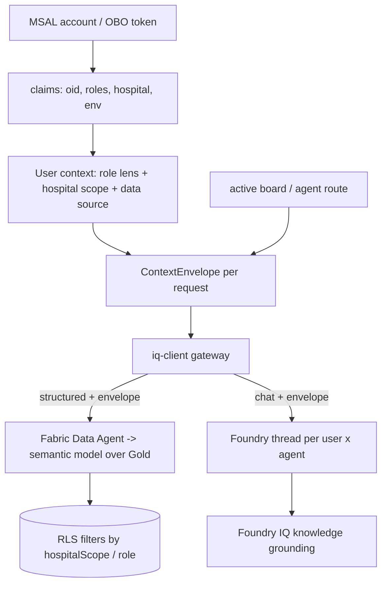

# Foundry IQ Context Architecture — dedicated sprint design

| Field | Value |
|-------|-------|
| **Version** | 1.0.0 |
| **Date** | 2026-07-26 |
| **Author** | Urs Rüegg (with Copilot) |
| **Status** | Draft (proposed dedicated sprint) |
| **Previous Version** | n/a (new document) |
| **Applies to** | `apps/hcc-app-fluent` context model + Foundry IQ / Fabric IQ integration |
| **Related** | [ADR-0032 Foundry control plane](../../adr/0032-foundry-control-plane-eastus2.md), [ADR-0033 Fabric Data Agent grounding](../../adr/0033-fabric-data-agent-as-foundry-grounding-tool.md), [ADR-0044 IQ data-access gateway](../../adr/0044-app-data-access-via-iq-layer.md), [Fabric to Foundry grounding contract](../../architecture/fabric-foundry-grounding-contract.md), [IQ data-access pattern](../../architecture/app-iq-data-access-pattern.md), [Copilot chat patterns](../plans/2026-07-26-sprint-27-copilot-chat-patterns-plan.md) |

> Brainstormed via the Superpowers `brainstorming` skill (2026-07-26) from the
> Sprint 27 end-to-end validation question: *"Best practice with Foundry IQ for
> per-user + per-agent + per-board context, consistently."* This spec defines a
> **dedicated follow-on sprint**. It is design-only; no code lands from this doc.

## 1. Problem

The app has three context tiers that must stay consistent, but today only some
are wired:

| Tier | What it is | Today |
|------|-----------|-------|
| **User context** | Identity → role lens + hospital scope + data-source pref | ✅ per-session providers (claims → Role/Hospital/DataSource) |
| **Agent context** | Per-board agent + its own conversation thread | ⚠️ agent + proactive reco are per-board, but the chat thread **bleeds across agents** (one `useAgentInvoker` instance) |
| **Grounding** | Fabric Data Agent (structured) + Foundry IQ (knowledge) | ✅ contract exists (ADR-0033); ⚠️ app does not pass user/board scope into the agent thread, and OBO/RLS is not enforced per user |

Two smaller gaps surfaced in the same validation:

- **Default board** is hard-coded to `bed-manager`, not the first patient-journey
  board the role can see (should be role-first-eligible).
- **Per-user data scope (RLS)** is not propagated to Fabric/Foundry — a signed-in
  user is not yet restricted to their hospital/role slice at the data layer.

## 2. Goal

Make the three tiers **consistent by construction**: every IQ read and agent
turn carries a single **context envelope** derived from the signed-in user; each
board-agent keeps its **own conversation thread**; and per-user data scope (RLS)
- grounding are enforced through the envelope — all **config-gated** so it lifts
from the westus2 demo (simulated) to live SIT without code edits.

## 3. Approaches

- **A. App-side context architecture, endpoint-ready (recommended).** Model the
  three tiers in the app: a `ContextEnvelope` derived from claims, per-(user×agent)
  conversation scoping, envelope propagation through the IQ gateway to the Fabric
  Data Agent + Foundry thread, and an OBO/RLS contract that is *simulated* locally
  and lifts to live when endpoints are configured. No infra provisioning; demo-safe
  (ADR-0013/0016). Matches ADR-0044 "config, not code".
- **B. Full live integration.** Provision Foundry threads + Fabric RLS + OBO
  end-to-end now. Highest fidelity but needs live endpoints, RLS setup, and user
  consent; PHI-adjacent and not demo-safe. Higher risk, blocks on SIT readiness.
- **C. Both, phased.** A now, B as a follow-on once SIT endpoints + RLS are ready.

**Recommendation: A**, with the live wiring (B) captured as an explicit SIT
follow-up. A delivers a correct, testable context model behind the existing
`provenance`/config contract and de-risks the live cutover.

## 4. Design (end-to-end)

### 4.1 Context tiers + data flow

### 4.2 Components + interfaces

- **`ContextEnvelope`** (new type): `{ userOid, heldRoles, activeRole, hospitalScope, dataSource, agent, windowHours }`. The single object every IQ read/agent turn carries. Built from the claims + active role lens + hospital + data-source contexts.
- **`useConversation(agent)`** (fixes Q2): a `ConversationStore` keyed by `agent` (and later by `userOid×agent`), so switching boards shows *that* agent's own thread. Replaces the single shared `useAgentInvoker` turn list. Clean reset on sign-out.
- **`iq-client` extension** (builds on ADR-0044): accept the `ContextEnvelope` and attach it to every call — Fabric Data Agent + Foundry thread — as scoped headers (`X-User-Oid`, `X-Hospital-Scope`, `X-Active-Role`). Simulated locally; real headers when endpoints configured.
- **`firstEligibleBoard(capabilities)`** (fixes Q1): returns the first board in patient-journey order (`occupancy → bed-manager → or-steering → staffing → discharge → crisis`) whose `nav` gate the role can see. `MainView` / `/main` default uses it instead of the hard-coded `bed-manager`.
- **Foundry thread model**: one thread per `(userOid × agent)`, seeded on first message with the envelope (hospital scope + active role + board). Foundry-managed thread id; the app maps `(user, agent) → threadId`.
- **RLS / OBO contract**: user-triggered calls use **OBO** (not the app identity); the Fabric semantic model enforces **RLS** by `hospitalScope`/`role`. Designed + simulated this sprint; validated live in SIT.

### 4.3 Governance + constraints

- **OBO** for user-triggered agent/data calls; app identity only for autonomous jobs.
- **RLS** enforces least data exposure per user; the envelope's `hospitalScope` is the filter key. Missing/invalid context → least-privilege fallback (Viewer / aggregated).
- **Provenance + citations** unchanged (ADR-0044): every result stays evidence-tagged; fail-loud `GroundingNotice` on degrade.
- **No PHI** (ADR-0016); westus2 demo scope (ADR-0013); region-agnostic config (ADR-0035).

### 4.4 Error handling

- Missing envelope → refuse the IQ call (guard test), fall back to least-privilege scope, surface the degrade.
- Thread creation failure → start a fresh thread; never cross-contaminate another agent's context.
- OBO/RLS unavailable (demo) → simulated scope + `simulated` provenance; no silent "live".

### 4.5 Testing

- **Unit:** envelope built correctly from claims + active role; `firstEligibleBoard` per role; per-(user×agent) conversation isolation (switching agents does not leak turns); iq-client attaches the envelope to every call.
- **Golden:** a signed-in single-site role sees only its hospital slice (simulated RLS); an aggregated role sees the cross-hospital view.
- **Guard:** IQ calls without a `ContextEnvelope` fail (extends the single-ingress guard).

## 5. Milestones

| # | Milestone | Deliverable |
|---|-----------|-------------|
| M0 | `ContextEnvelope` type + builder | type + `buildEnvelope(claims, lens, hospital, dataSource, agent)` + unit tests |
| M1 | Per-(user×agent) conversation scoping (Q2) | `useConversation(agent)` + `ConversationStore` + isolation tests |
| M2 | First-eligible default board (Q1) | `firstEligibleBoard()` wired into `MainView`/`/main`; e2e updated |
| M3 | Envelope propagation through `iq-client` | scoped headers on Fabric Data Agent + Foundry calls (simulated) + guard test |
| M4 | Foundry thread-per-(user×agent) model | `(user,agent)→threadId` map; thread seeded with envelope (config-gated) |
| M5 | OBO / RLS contract + simulated per-user scope | ADR + simulated hospital/role filtering + golden tests |
| M6 | Docs + closeout | ADR "App context envelope + per-agent threads"; PRD/traceability; PR |

## 6. Out of scope

- Live infra provisioning (Foundry threads, Fabric RLS) — SIT follow-up (Approach B).
- Real RLS validation against PHI — GA-gated (ADR-0014); demo stays synthetic.
- Work IQ external actions (Teams call / email draft / EPIC-KIS-SAP) — separate sprint
  (see [chat patterns A15](../plans/2026-07-26-sprint-27-copilot-chat-patterns-plan.md)).

## 7. Definition of done

- [ ] `ContextEnvelope` derived from the signed-in user, attached to every IQ read + agent turn.
- [ ] Each board-agent has its own conversation thread (no cross-agent bleed).
- [ ] `/main` opens the first patient-journey board the role can see.
- [ ] Per-user scope (RLS) contract defined + simulated; lifts to live via config.
- [ ] Guard, unit, and golden tests green; provenance + citations preserved; no PHI.
- [ ] ADR recorded; SIT live-wiring captured as the follow-up.
