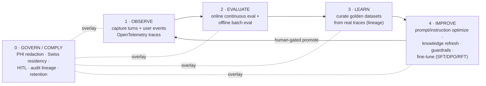
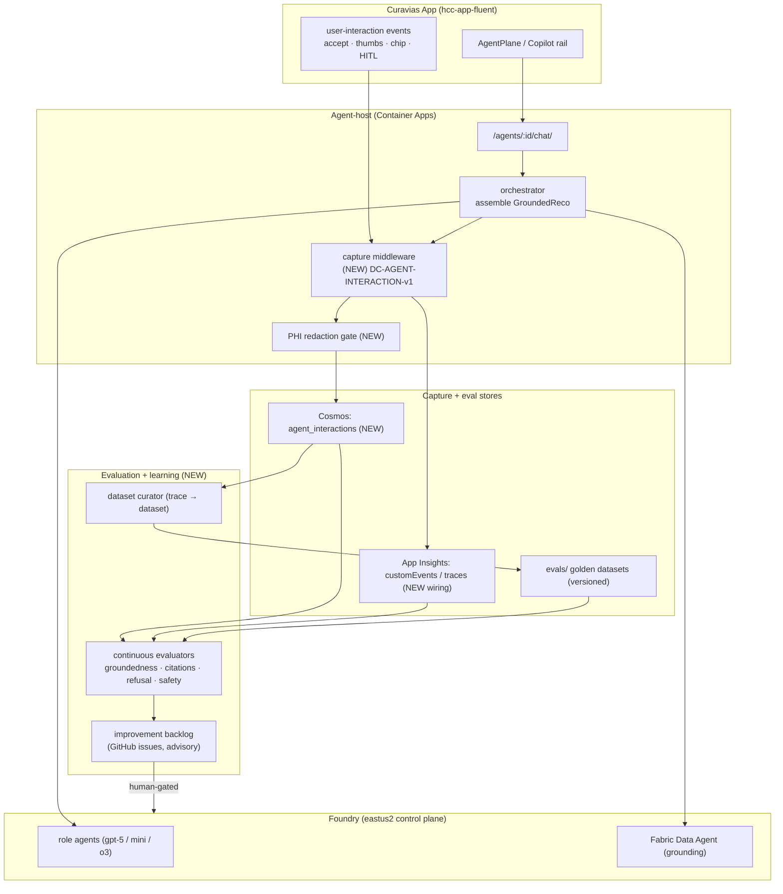

# Sprint 30 — Closed-Loop Learning Foundation (Design)

| Field | Value |
|-------|-------|
| **Version** | 1.0.0 |
| **Date** | 2026-07-27 |
| **Author** | Urs Rüegg (with Copilot) |
| **Status** | Draft |
| **Previous Version** | n/a (new document) |
| **Sprint** | 30 — Closed-Loop Learning Foundation |
| **Skill** | Authored via the Superpowers `brainstorming` skill |
| **Grounding** | Microsoft Foundry skill (observe / trace / eval-datasets / agent-optimizer / finetuning sub-skills); Microsoft Learn — Foundry Observability, Azure AI Evaluation SDK, Continuous Evaluation, Agent Optimizer, Model Fine-tuning |

> **Purpose**: Lay the foundation to **capture every agent interaction and user
> interaction** and establish a **closed-loop learning pattern** that continuously
> evaluates agent conversations and improves response quality — and, in parallel,
> **assesses the Microsoft Foundry Build + Operate capabilities** (Services, Tools,
> Knowledge, Guardrails, Memory, Data, Evaluations, Fine-tune; and Compliance) against
> Microsoft best practice. This is the instrumentation that the upcoming **hybrid
> testing** (mock data → live Copilot agents) will run on top of.
>
> **Autonomy note**: the sprint-scope question was delegated ("work autonomously").
> This design takes the recommended **walking-skeleton** decision — build a thin but
> complete turn of the loop this sprint, design the rest, and stage it — and records
> every scoping decision explicitly in §9 and §11 for later review.

---

## Table of contents

1. Problem and goal
2. Current state (what already exists)
3. The closed loop (Microsoft best-practice pattern)
4. Reference architecture
5. Foundry Build + Operate capability assessment
6. Interaction-capture contract (`DC-AGENT-INTERACTION-v1`)
7. Evaluation design (online + offline)
8. Learning and curation loop
9. Approaches considered and decision
10. Scope for THIS sprint (walking skeleton)
11. Staged roadmap (later sprints)
12. Compliance and governance
13. Risks and open questions
14. Proposed requirements and traceability
15. References

---

## 1. Problem and goal

The platform runs live agents (Foundry Agent Service in eastus2 for reasoning,
Fabric Data Agent for grounding, an application-hosted agent-host on Container
Apps) and every Copilot turn already flows through one gateway
(`invokeAgent` → `GroundedReply` / `GroundedReco`). But today those turns are
**ephemeral**: nothing durably captures what was asked, what was answered, whether
it was grounded, whether the user accepted it, or how good it was. There is a
Python golden-question eval harness for one agent (`evals/product-owner-agent/`)
and an aspirational metrics list in [`docs/AI.md` §Evaluation](../../AI.md), but
**no loop** connects real usage back into measurable quality and improvement.

**Goal.** Stand up the foundation of a continuous **Observe → Evaluate → Learn →
Improve** loop, with a **Govern/Comply** overlay, so that:

- every agent turn and every meaningful user interaction is **captured** as a
  governed, PHI-free record;
- captured conversations are **continuously evaluated** for quality and safety;
- real traces are **curated** into versioned golden datasets;
- low-quality / uncited / mis-refused interactions become an **advisory
  improvement backlog** that feeds prompts, knowledge, guardrails, and (later)
  fine-tuning — always human-gated;
- the Foundry **Build + Operate** capabilities are assessed against Microsoft best
  practice so we know what to strengthen next.

**Why now** — before hybrid testing. Hybrid testing points the Copilot at live
Foundry agents while boards still serve mock data. If we instrument the loop
*first*, hybrid testing immediately produces real, evaluable traces instead of
throwaway sessions.

---

## 2. Current state (what already exists)

| Building block | State | Where |
|----------------|-------|-------|
| Single agent gateway | Live | `apps/hcc-app-fluent/src/data/iq-client.ts` (`iqAgentChat`), `copilot-drawer/agent-manifest.ts` (`invokeAgent`) |
| Structured response contract | Live | `GroundedReply` (`answer` + `citations` + `refused` + `reco`) / `GroundedReco` |
| Per-(user×agent) conversation scope | Live (S29) | `copilot-drawer/useConversation.ts`, `conversation-store.ts` |
| Agent-host + orchestrator | Live | `apps/hcc-agent-host/src/{api,orchestrator,persistence,hitl}` |
| Durable store (Cosmos) | Live | `apps/hcc-agent-host/src/persistence/cosmos_client.py`; decision containers `proposed_actions` / `plans` (S26) |
| Decision vocabulary | Live (S26) | `DC-INSIGHT-v1` — SIGNAL/UNDERSTANDING/RECOMMENDATION/ACTION/COORDINATION + PROVENANCE |
| Offline eval harness (1 agent) | Partial | `evals/product-owner-agent/run_evals.py` (golden questions, uncited-claim check) |
| Evaluation metrics catalogue | Aspirational | `docs/AI.md` §Evaluation (SLO + quality/safety metrics, not implemented) |
| Observability (App Insights) | Specified, not wired for agent turns | `docs/AI.md` §Observability |
| HITL approval gate | Live | agent-host `hitl/`; `approved-to-apply` doctrine |
| Foundry IQ Knowledge Layer | Preview, domain #1 | PO agent (ADR-0043); Fabric Data Agent grounding (ADR-0034) |

**Gap summary** — capture, online evaluation, curation-from-traces, an improvement
backlog, and structured capability assessment do **not** exist yet. The loop is
open.

---

## 3. The closed loop (Microsoft best-practice pattern)

Microsoft's reference pattern for continuously improving agents is a five-stage
loop, mirrored by the Foundry skill sub-skills (`observe`, `trace`,
`eval-datasets`, `agent-optimizer`, `finetuning`):



- **Observe** — every turn emits a trace (retrieve → model → assemble spans) to
  App Insights and a durable interaction record to Cosmos; the app emits
  user-interaction events (accept / thumbs / chip-click / HITL decision).
- **Evaluate** — online continuous evaluation samples live traces and scores them;
  offline batch evaluation runs golden datasets on every prompt/model change.
- **Learn** — high-signal traces (failures, low scores, thumbs-down, mis-refusals)
  are curated into **versioned** evaluation datasets with full lineage.
- **Improve** — curated data drives prompt/instruction optimization, knowledge
  refresh, guardrail tuning, and (later) fine-tuning; every change is
  **human-approved** before promotion.
- **Govern** — a compliance overlay guarantees no PHI is captured, data stays in
  region, humans stay in the loop, and every change is auditable end-to-end.

---

## 4. Reference architecture



**Design-for-isolation.** Each new unit has one job and a narrow interface:

- **capture middleware** — turns an agent-host request/response (plus app user
  events) into one `DC-AGENT-INTERACTION-v1` record. Depends on: the response
  contract + the redaction gate. Testable with a fake request/response.
- **PHI redaction gate** — pure function `redact(record) → record`; deterministic,
  unit-tested; the single choke point before any persistence.
- **continuous evaluators** — pure scoring functions `score(record) →
  {metric: value}`; reuse the `evals/` harness; no I/O in the scorer itself.
- **dataset curator** — selects records by policy (failure / low-score /
  thumbs-down / sampled), attaches lineage, writes a versioned dataset. Depends on:
  Cosmos read + `evals/` write.
- **backlog emitter** — turns a curated finding into an advisory GitHub issue;
  never mutates prompts/knowledge/models itself.

**Service mapping (Microsoft best practice).** Capture middleware + redaction live
at the agent-host boundary (server-side, PHI-safe — never client-side prose
parsing). Tracing uses **OpenTelemetry → Application Insights `customEvents`**
(the Foundry `trace` sub-skill contract). Durable records use the **existing
Cosmos** account (`agent_interactions` container). Evaluation reuses the **Azure AI
Evaluation** pattern already seeded in `evals/`. Continuous evaluation and
optimization use **Foundry Observability / Agent Optimizer / Fine-tuning** where
GA-in-region; until then, the codeful evaluators in `evals/` are the portable
fallback.

---

## 5. Foundry Build + Operate capability assessment

The brief asked to evaluate the Foundry capabilities for **Build** (Services,
Tools, Knowledge, Guardrails, Memory, Data, Evaluations, Fine-tune) and **Operate**
(Compliance). This is the current-vs-target read that the loop drives forward.

| Capability | Current state | Role in the loop | Sprint 30 action |
|------------|---------------|------------------|------------------|
| **Services** (models + agents) | Live: Foundry Agent Service eastus2, gpt-5 / mini / o3, agent-host on ACA (ADR-0032) | The system under evaluation | Capture model + version + tokens + latency per turn |
| **Tools** | Live: Fabric Data Agent grounding, deterministic impact tool, `register_decision_tier` | Tool-call success / latency is an eval signal | Capture tool calls + outcomes in the record |
| **Knowledge** | Preview: Foundry IQ Knowledge Layer (PO agent domain #1, ADR-0043), Fabric IQ ontology | Uncited / low-confidence answers → knowledge-refresh backlog | Capture citations + `liveness`; flag uncited claims |
| **Guardrails** | Partial: advisory-only refusals + PHI 4-gate in prompts; content-safety not wired | Refusal-correctness + safety evaluators; regression tests | Add refusal-correctness + PHI-leak evaluators |
| **Memory** | Partial: per-(user×agent) conversation scope (S29), Cosmos threads | Memory scope captured; cross-agent-leak tests | Record `conversationKey` + envelope scope |
| **Data** | Live: Cosmos (`proposed_actions` / `plans`), Fabric medallion, OneLake | The capture + dataset substrate | Add `agent_interactions` container + `evals/` datasets |
| **Evaluations** | Partial: PO golden-question harness (offline, 1 agent) | The core of stage 2 | Extend to online continuous eval + all agents |
| **Fine-tune** | Gap: none | Improve stage from curated preference data (DPO / RFT) | **Designed, deferred** — needs curated data first |
| **Operate · Compliance** | Policy-level: ADR-0016 no-PHI, Swiss residency, HITL; evidence partial | Compliance evaluators + audit evidence from captures | Add PHI-leak + residency + HITL-honored checks |
| **Operate · Observability** | Gap: App Insights specified, not wired for agent turns | Trace substrate for Observe | Wire OTel → App Insights (M1) |

**Reading of the assessment.** Build is strong on Services / Tools / Data, partial
on Knowledge / Guardrails / Memory / Evaluations, and a genuine gap on Fine-tune.
Operate is policy-defined but under-instrumented (Observability + Compliance
evidence). The walking skeleton (§10) targets the highest-leverage gaps —
Observability, Evaluations, and Compliance evidence — because everything else in
the loop depends on them.

---

## 6. Interaction-capture contract (`DC-AGENT-INTERACTION-v1`)

One versioned record per agent turn, following the platform's `DC-*` data-contract
convention ([`docs/DATA.md`](../../DATA.md)). PHI-free by construction.

```json
{
  "contractId": "DC-AGENT-INTERACTION-v1",
  "interactionId": "AIX-<ulid>",
  "conversationKey": "<userOid>:<agent>",
  "agent": "ooa-agent",
  "ts": "2026-07-27T09:12:03Z",
  "env": "sit",
  "region": "eastus2",
  "scope": { "roleLens": "…", "hospitalScope": "…", "dataSource": "simulated" },
  "request": { "promptHash": "sha256:…", "promptRedacted": "…", "lang": "de" },
  "response": {
    "answerRedacted": "…",
    "citations": ["gold.…", "hcp:…"],
    "refused": false,
    "reco": { "…GroundedReco (redacted)…": true }
  },
  "model": { "name": "gpt-5", "deployment": "…", "promptTokens": 0, "completionTokens": 0 },
  "tools": [ { "name": "fabric-data-agent", "ok": true, "ms": 0 } ],
  "timing": { "retrieveMs": 0, "modelMs": 0, "assembleMs": 0, "totalMs": 0 },
  "provenance": "live",
  "userEvents": [ { "type": "thumbs", "value": "up", "ts": "…" } ],
  "eval": { "scored": false }
}
```

Rules:

- **Redaction gate first.** `promptRedacted` / `answerRedacted` pass through the
  deterministic redactor (token-like strings, and — for GA — any free-text PHI
  risk) before persistence. Raw prompts are never stored; `promptHash` enables
  dedup / regression matching without retaining content.
- **`userEvents`** are appended in place (thumbs, chip-click, insight-select, HITL
  approve / reject), giving the "user-interaction learning" signal the brief asks
  for.
- **`eval`** is filled asynchronously by the evaluators (stage 2), keeping capture
  on the hot path cheap.
- Model-agnostic: the record is identical whether the agent-host serves the
  deterministic mock or a live Foundry model — so it is valid *before and during*
  hybrid testing.

---

## 7. Evaluation design (online + offline)

Two complementary modes, both reusing one evaluator library so a metric is defined
once.

- **Online (continuous).** A scheduled Container Apps job samples recent
  `agent_interactions` (rate-limited, e.g. 10–20 %) and scores them. This is the
  Foundry "continuous evaluation / monitoring" pattern; where the GA Foundry
  continuous-eval surface is available in-region it is preferred, with the codeful
  evaluators as the portable fallback.
- **Offline (batch).** On every prompt / knowledge / model change, run the full
  golden dataset (§8) through the same evaluators as a **regression gate** in CI —
  extending today's `evals/` harness from one agent to the six runtime agents.

Seed evaluator set (all deterministic or LLM-as-judge with a fixed judge prompt):

| Evaluator | Signal | Seed source |
|-----------|--------|-------------|
| Citation coverage | % of substantive claims with a `[citation]` | `has_uncited_claim` in `evals/product-owner-agent/run_evals.py` |
| Groundedness | answer supported by cited grounding | Azure AI Evaluation groundedness pattern |
| Refusal correctness | refused iff it should (PHI / clinical / out-of-lane) | refusal rules in each `AGENT.md` |
| PHI-leak | zero PHI-shaped tokens in the answer | ADR-0016 four-gate |
| Actionability | reco carries a lever + deterministic impact | `DC-INSIGHT-v1` RECOMMENDATION beat |
| Advisory-voice | no "entscheidet / diagnostiziert" framing | product-marketing voice rules |

Scores land back on the interaction record (`eval.scored = true`) and roll up to a
per-agent quality dashboard (App Insights workbook / Fabric report).

---

## 8. Learning and curation loop

- **Curator (trace → dataset).** A policy selects high-signal interactions —
  evaluation failures, low scores, thumbs-down, mis-refusals, plus a random
  sample — and writes them, **with reviewer sign-off**, into versioned datasets
  under `evals/<agent>/datasets/vN/`. Every dataset row keeps lineage back to its
  `interactionId` (Foundry `eval-datasets` pattern: trace → dataset → eval →
  change).
- **Improvement backlog (advisory).** Curated findings become **GitHub issues**
  (advisory only) tagged by agent + failing metric — the same "documentation /
  quality feedback loop" the PO-agent proposal describes, generalised to all
  agents. The loop **never** mutates a prompt, knowledge source, guardrail, or
  model autonomously.
- **Improve (staged).** With a curated preference/quality dataset in hand, the
  Improve stage runs (later sprints): `prompt_optimize` / Agent Optimizer for
  instructions, knowledge refresh for uncited gaps, guardrail tuning for
  mis-refusals, and fine-tuning (DPO from thumbs pairs, RFT with graders) for
  systematic quality lift. Each promotion is gated by the offline regression suite
  **and** a human `approved-to-apply`.

---

## 9. Approaches considered and decision

- **A — Observability foundation only.** Capture + tracing, defer evaluation.
  *Pro:* smallest, unblocks everything. *Con:* no quality signal this sprint; the
  loop stays open a sprint longer.
- **B — Walking skeleton (chosen).** One thin but complete turn of the loop for a
  single lead agent: capture → continuous + offline eval → curate → advisory
  backlog; full architecture + capability assessment designed; Improve/fine-tune
  staged. *Pro:* proves the whole pattern, hybrid testing runs on an instrumented
  loop, low risk. *Con:* only one agent end-to-end this sprint.
- **C — Full loop across all six agents now.** *Pro:* maximal coverage. *Con:*
  spans too many subsystems at once; high risk of a shallow, unverified result.
- **D — Design/assessment only.** *Pro:* cheapest. *Con:* leaves the loop open;
  no instrumentation before hybrid testing.

**Decision — B (walking skeleton), lead agent = `ooa-agent`.** Rationale: OOA is
the journey entry board, already exercised against the live Foundry-hosted agent
and the live Fabric Data Agent, so it yields the richest real traces during hybrid
testing. The capture contract, redaction gate, evaluator library, and curator are
built agent-agnostic, so extending to the other five agents in Sprint 31 is
configuration, not redesign.

---

## 10. Scope for THIS sprint (walking skeleton)

| # | Milestone | Deliverable | Capability advanced |
|---|-----------|-------------|---------------------|
| M0 | Capture contract | `DC-AGENT-INTERACTION-v1` schema + JSON Schema + validator + redaction-gate unit tests | Data, Compliance |
| M1 | Observe wiring | OTel spans (retrieve → model → assemble) → App Insights `customEvents`; capture middleware writes `agent_interactions` (Cosmos) for `ooa-agent` | Observability |
| M2 | User-event capture | App emits `userEvents` (thumbs / chip / insight-select / HITL) → agent-host append endpoint | Memory, Data |
| M3 | Evaluator library + offline gate | Extend `evals/` with the §7 evaluators; wire an offline regression job for `ooa-agent` golden dataset | Evaluations, Guardrails |
| M4 | Online continuous eval | Scheduled ACA job samples + scores recent interactions; scores roll up to a per-agent quality view | Evaluations, Compliance |
| M5 | Curator + advisory backlog | Trace → versioned dataset (lineage) + GitHub-issue backlog emitter (advisory) | Learn, Knowledge |
| M6 | ADR + docs | New ADR (capture contract + retention + online-eval approach); update `docs/AI.md` §Evaluation, `docs/DATA.md` (new contract + container), `docs/COMPLIANCE.md` | Governance |

**Explicitly out of scope this sprint** (designed, staged to §11): the Improve
stage (prompt-optimizer / Agent Optimizer runs, knowledge-refresh automation,
fine-tuning), extension beyond `ooa-agent`, and any autonomous change promotion.

---

## 11. Staged roadmap (later sprints)

- **Sprint 31 — Breadth.** Roll the capture + evaluators + curator across the other
  five runtime agents (bmca / dca / orsa / sba / csa) + the PO agent; per-agent
  quality dashboards.
- **Sprint 32 — Improve (prompts + knowledge).** Wire `prompt_optimize` / Agent
  Optimizer and knowledge-refresh from the curated backlog; offline regression
  gate + `approved-to-apply` promotion.
- **Sprint 33 — Improve (fine-tune).** DPO from thumbs pairs / RFT with graders on
  the curated datasets; checkpoint selection; evaluation-gated deployment.
- **Sprint 34 — Operate hardening.** Swiss-region capture store for GA, retention
  automation, Purview lineage, compliance-evidence workbook.

---

## 12. Compliance and governance

- **No PHI (ADR-0016).** The redaction gate is the single persistence choke point;
  raw prompts are hashed, not stored; a PHI-leak evaluator is a hard gate. Demo
  scope is synthetic-only (ADR-0013 westus2/eastus2 demo; Swiss GA target).
- **Residency.** The `agent_interactions` store follows the platform region — demo
  in the demo region, GA in Switzerland North — never cross-region without an
  approved runbook (`docs/AI.md` residency rules).
- **Human-in-the-loop.** The loop is **advisory-only**: it emits backlog issues and
  dataset candidates; no prompt / knowledge / guardrail / model change is promoted
  without the offline regression suite passing **and** a human `approved-to-apply`
  (AGENTS.md §4). No bot self-approval.
- **Auditability.** Every improvement traces back interaction → dataset → eval →
  change, satisfying the "AI and decision trace" governance domain
  ([`docs/DATA.md`](../../DATA.md)).
- **ADR.** A new ADR ratifies the capture contract, retention class, and the
  online-eval sampling approach before M4 ships.

---

## 13. Risks and open questions

- **Capture cost / hot-path latency.** Mitigation: capture is fire-and-forget off
  the response path; evaluation is async and sampled.
- **LLM-as-judge reliability.** Mitigation: fix the judge prompt + version it;
  prefer deterministic evaluators where possible; keep humans on the curation gate.
- **Preview-surface availability in-region.** Foundry continuous-eval / Agent
  Optimizer / fine-tune GA-in-Switzerland is not guaranteed; the codeful `evals/`
  fallback keeps the loop portable (consistent with ADR-0006 / ADR-0042).
- **Open — sampling rate** for online eval (cost vs coverage): proposed 10–20 %,
  to confirm in the ADR.
- **Open — dataset retention window** and reviewer ownership of the curation gate.
- **Open — quality-dashboard surface**: App Insights workbook vs a Fabric report
  (or both).

---

## 14. Proposed requirements and traceability

New IDs proposed for ratification in `docs/PRD.md` §7 when the sprint is accepted
(not added in this brainstorm):

| Proposed ID | Requirement |
|-------------|-------------|
| `FR-LEARN-001` | Capture every agent turn + user interaction as a `DC-AGENT-INTERACTION-v1` record |
| `FR-LEARN-002` | Continuously evaluate captured interactions (citation coverage, groundedness, refusal correctness, actionability, safety) |
| `FR-LEARN-003` | Curate versioned golden datasets from real traces with full lineage |
| `FR-LEARN-004` | Surface an advisory improvement backlog from low-scoring / uncited / mis-refused interactions |
| `FR-LEARN-005` | (staged) Optimize prompts / knowledge / guardrails and fine-tune from curated data, human-gated |
| `NFR-LEARN-001` | No PHI in captured interactions (redaction gate; ADR-0016) |
| `NFR-LEARN-002` | Interaction store honours Swiss residency + a defined retention class |
| `NFR-LEARN-003` | No prompt / knowledge / model change promoted without offline regression pass + `approved-to-apply` |
| `NFR-LEARN-004` | Full lineage: interaction → dataset → eval → change |

Advances existing intent in `docs/AI.md` §Evaluation and the `NFR-GOV-*` audit
family.

---

## 15. References

- [`docs/AI.md`](../../AI.md) — §Evaluation, §Observability, §Model and Prompt Governance
- [`docs/DATA.md`](../../DATA.md) — data contracts, `DC-*` convention, AI/decision-trace domain
- [`docs/COMPLIANCE.md`](../../COMPLIANCE.md) — Swiss DSG controls
- [ADR-0007](../../adr/0007-mvp-agent-runtime-and-hitl-release-gates.md), [ADR-0008](../../adr/0008-agent-runtime-pattern-scope-and-selection.md) — agent runtime pattern + HITL release gates
- [ADR-0013](../../adr/0013-temporary-us-region-demo-scope.md), [ADR-0016](../../adr/0016-no-phi-in-mvp-demo-scope.md) — demo region + no-PHI
- [ADR-0032](../../adr/0032-foundry-control-plane-eastus2.md), [ADR-0034](../../adr/0034-fabric-iq-demo-scope-artefacts.md) — Foundry control plane + Fabric IQ
- [ADR-0040](../../adr/0040-prescriptive-decision-ontology-and-runtime-store.md), [ADR-0043](../../adr/0043-product-owner-agent-foundry-iq-domain.md) — decision ontology + Foundry IQ domain
- `evals/product-owner-agent/run_evals.py` — seed offline eval harness
- `apps/hcc-agent-host/src/{orchestrator,persistence,hitl}` — capture + HITL integration points
- Microsoft Foundry skill — `observe` / `trace` / `eval-datasets` / `agent-optimizer` / `finetuning` sub-skills
- Microsoft Learn — Foundry Observability, Azure AI Evaluation SDK, Continuous Evaluation, Agent Optimizer, Model Fine-tuning (SFT / DPO / RFT)
