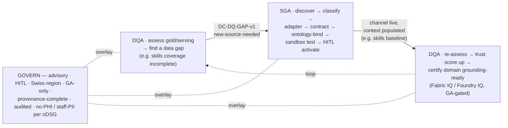

# Sprint 31–32 — Signal Agent (SGA) + Data Quality Agent (DQA) closed loop (Design)

| Field | Value |
|-------|-------|
| **Version** | 1.0.0 |
| **Date** | 2026-07-27 |
| **Author** | Urs Rüegg (with Copilot) |
| **Status** | Draft |
| **Previous Version** | n/a (new document) |
| **Sprints** | 31 — Data Quality Agent (DQA) · 32 — Signal Agent (SGA) |
| **Skill** | Authored via the Superpowers `brainstorming` skill |
| **Source** | COO showcase review [`docs/reviews/2026-07-24-ama-coo-review.md`](../../reviews/2026-07-24-ama-coo-review.md) + discovered-ideas proposal [`Sprint-Signal-and-DataQuality-Agents.md`](../../reviews/2026-07-24-ama-coo-review/Sprint-Signal-and-DataQuality-Agents.md) |

> **Purpose**: Design the two discovered ideas from the COO review as a **two-sprint,
> self-healing golden-source loop** — a **Data Quality Agent (DQA)** that proactively
> finds and quantifies data gaps + scores trust, and a **Signal Agent (SGA)** that
> onboards the missing channels. Both are advisory + HITL + GA-only. This retires the
> COO's #1 finding — *data quality is the single point of failure*.
>
> **Decision (user-approved)**: two sprints, **DQA first** (Approach B), because it
> ships the most-cited pain first and makes SGA **demand-driven** (DQA's gap register
> tells SGA which channels are worth onboarding). Topology: **DQA expands the existing
> `data-quality-agent`; SGA is a new `signal-agent`** (sibling to the runtime
> `signal-triage-agent`).

---

## Table of contents

1. Problem and goal
2. Current state (what already exists)
3. The closed loop
4. Topology decision
5. Two-sprint decomposition
6. Sprint 31 — Data Quality Agent (DQA)
7. Sprint 32 — Signal Agent (SGA)
8. The seam contract (`DC-DQ-GAP-v1` → SGA)
9. Contracts and ontology additions
10. Compliance and governance
11. Scope per sprint (milestones)
12. Risks and open questions
13. Proposed requirements and traceability
14. References

---

## 1. Problem and goal

The COO review's central finding is that **data quality — not the technology — is the
single point of failure**: incomplete or low-trust data means reports are not accepted
and the golden-source decision layer that grounds Fabric IQ / Foundry IQ cannot be
trusted. Two discovered ideas answer it, and together they close a loop:

- **DQA** proactively assesses the gold/serving layer, finds missing/weak data,
  quantifies each gap's impact, scores per-domain **trust**, and routes remediation to
  the accountable owner.
- **SGA** owns the full **channel-intake lifecycle** — discover → classify → adapter →
  contract → ontology-bind → sandbox-test → HITL-activate → monitor — for internal and
  external signal channels, with a flagship: onboarding official **certification
  registers** to auto-populate the **skills baseline** for staff assignment.

**Goal.** Stand up the first slice of both agents as advisory / HITL / GA-only, proving
one worked example each and the seam between them: DQA finds a gap → (if a new source is
needed) SGA onboards the channel → DQA re-scores trust and certifies grounding-readiness.

---

## 2. Current state (what already exists)

| Building block | State | Gap the new work fills |
|----------------|-------|------------------------|
| `signal-triage-agent` (S21) | Live — *runtime* triage: dedup `DC-EXT-SIGNAL-v1` hazards, arbitrate, evaluate `TriggerRule`, hand off to `csa-agent` | It consumes already-onboarded hazard signals; nothing **discovers, classifies, onboards, tests, or lifecycles** channels |
| `data-quality-agent` (S11) | Live — *ingestion-time gates*: Bronze/Silver/Gold PHI/FK/schema checks + the `DC-EXT-SIGNAL-v1` gate | Gates verify what arrives; nothing **proactively** finds missing data, quantifies impact, scores trust, or routes remediation |
| `compute_expected_impact` (S26) | Live — `data-platform/decision/impact/compute_expected_impact.py`, deterministic + unit-tested | The pattern DQA's trust-score + gap-impact modules follow |
| `DC-*` contract family | Live — `data/synthetic/schema/dc-*-v1.schema.json` (incl. `dc-skill-event-v1`, `dc-skill-evidence-v1`) | The convention new contracts follow; existing skill contracts SGA's flagship builds on |
| Two-layer ontology + crosswalk CI (`NFR-ONT-001`) | Live — `docs/ontology/` | SGA extends it with Credential/Competency; DQA checks concept-completeness |

**Gap summary** — proactive data-quality assessment, trust scoring, gap→owner
remediation, channel discovery/onboarding/lifecycle, and the certification→skills
enrichment do **not** exist yet.

---

## 3. The closed loop



DQA states *what* is missing and *why it matters*; SGA supplies the *how* (the channel).
The result is a golden-source layer whose trust is **measured, not assumed**.

---

## 4. Topology decision

- **DQA = expand the existing `data-quality-agent`.** Same lane (data), same personas
  (Data Engineer / Ontology Steward), same runtime (application-hosted, ADR-0008). Add
  proactive assessment, trust scoring, gap→owner remediation, and grounding-readiness
  certification as new capabilities alongside the existing gates. Do **not** fork a
  second data-quality agent.
- **SGA = a new `signal-agent`.** Its responsibility (channel-intake lifecycle) is
  genuinely different from the `signal-triage-agent`'s (runtime hazard triage). SGA
  *onboards* channels; the triage agent *consumes* the runtime signals from them. New
  agent pack, sibling to `signal-triage-agent`.

---

## 5. Two-sprint decomposition

| Sprint | Agent | Why this order |
|--------|-------|----------------|
| **31 (first)** | **DQA** | Ships the COO's #1 pain (data quality = SPOF) first; DQA's gap register **defines demand** for SGA (which channels are worth onboarding); freezes the `DC-DQ-GAP-v1` seam SGA builds against |
| **32 (second)** | **SGA** | Consumes the frozen seam; onboards the highest-value gap (certification → skills) demand-driven, not speculative |

Both run trunk-based per ADR-0038 (one issue → one branch → one squash PR). Sprint 32 is
**sequenced after** Sprint 31's seam merges. Trackers: #451 (DQA), #452 (SGA).

---

## 6. Sprint 31 — Data Quality Agent (DQA)

**Design-for-isolation units** (each one job, narrow interface, testable):

- **Trust-score module** — pure `trust_score(domain_metrics) → {score, dimensions}`;
  deterministic, versioned, explainable; mirrors `compute_expected_impact.py`. No I/O.
- **Gap-impact module** — pure `assess_gaps(domain) → GapFinding[]`; each finding carries
  impacted KPI/agent, recommended fill source, effort, and a `newSourceNeeded` flag.
- **Agent pack** (`data-quality-agent` expanded) — orchestrates: read gold/serving
  metadata + stats (read-only via `fabric-mcp`), call the two modules, publish the trust
  score, open owner-routed remediation, certify grounding-readiness, emit the seam.
- **Contracts** — `DC-DQ-TRUSTSCORE-v1`, `DC-DQ-GAP-v1`.

**Trust-score model** (`FR-DQA-003`): `TrustScore(domain) = f(completeness, timeliness,
validity, uniqueness, consistency, lineage_integrity, provenance, ontology_mapping)`,
weighted per decision class, versioned, published as a governance artefact. Thresholds
per decision class are ADR-ratified.

**Boundaries** — read-only (never edits source data); advisory + HITL (the owner acts);
degraded-mode advice rather than silent low-trust serving (`FR-DQA-006`);
grounding-readiness certification is **GA-gated** (Fabric IQ first; Foundry IQ behind the
same gate, ADR-0006/0042).

---

## 7. Sprint 32 — Signal Agent (SGA)

**Journey**: Discover → Evaluate → Classify → Propose → Assign adapter → Onboard → Test →
Approve → Activate → Monitor.

**Design-for-isolation units**:

- **Gap-register generator** — scans design (PRD/DATA/`DC-*`/ontology) + runtime telemetry
  → ranked Signal Gap Register (`FR-SIG-001`).
- **Classifier** — domain family, signal type (native-alert / derive-threshold /
  batch-reference), trust tier (A/B/C), data class (PHI / staff-PII / non-PHI)
  (`FR-SIG-003`).
- **Adapter selector** — picks the connector pattern from the catalogue (CAP/OASIS, FDSN,
  STAC/OGC, DATEX II, CKAN/opendata.swiss, FHIR registry, webhook/Event-Grid, REST pull,
  file drop) (`FR-SIG-004`).
- **Credential→competency resolver** — maps a credential to competency codes and enriches
  `StaffingPool.skill_tags` by **pseudonymised work-ID** (`FR-SIG-008`); reuses the
  existing `dc-skill-*` plumbing.
- **Channel test harness** — sandbox scorecard: schema conformance, sample fetch,
  provenance, dedup/noise, latency (`FR-SIG-007`).
- **New agent pack** (`agents/signal-agent/`) — orchestrates the lifecycle; HITL activate;
  channel registry + monitoring; provenance.

**Flagship worked example** — nurse & physician certification register → `DC-REF-CERTIFICATION-v1`
→ ontology `Credential/Competency` → sandbox test → HITL data-owner approval → skills
baseline auto-populated (pseudonymised work-ID), improving skills-based assignment (feeds
SBA `FR-STAFF-*`). Runs on a **curated sample feed** first (registry availability is an
open question, §12).

---

## 8. The seam contract (`DC-DQ-GAP-v1` → SGA)

The single integration point between the two sprints — **frozen in Sprint 31** so Sprint
32 builds against a stable interface:

```json
{
  "contractId": "DC-DQ-GAP-v1",
  "gapId": "GAP-<ulid>",
  "domain": "staffing.skills",
  "detected": "2026-07-27T09:00:00Z",
  "dimension": "completeness",
  "impactedKpi": ["skills-based-assignment", "forecast-accuracy"],
  "impactedAgents": ["sba-agent"],
  "impactScore": 0.42,
  "recommendedSource": { "kind": "certification-register", "example": "NAREG / FMH" },
  "newSourceNeeded": true,
  "owner": "data-owner:staffing",
  "effort": "M",
  "status": "open"
}
```

SGA's intake is triggered by a `DC-DQ-GAP-v1` record with `newSourceNeeded: true`; it
never onboards a channel that no gap demanded. DQA closes the loop by re-scoring the
domain once SGA activates the channel.

---

## 9. Contracts and ontology additions

- **`DC-DQ-TRUSTSCORE-v1`** *(new, S31)* — per-domain trust score + dimension breakdown +
  as-of + model version.
- **`DC-DQ-GAP-v1`** *(new, S31)* — the gap + impact + owner + recommended source + status
  (the seam, §8).
- **`DC-REF-CERTIFICATION-v1`** *(new, S32)* — credential ↔ competency crosswalk (issuer,
  credential type, competency codes, validity, verification status); **staff-PII**,
  pseudonymised work-ID.
- **Ontology (S32)** — `Certification`, `Qualification`, `Credential` (IAO information
  content entities), `Competency`/`SkillTag` (quality), `IssuingAuthority` (organisation
  with an authority role): *HealthWorker `holds` Credential; Credential `certifies`
  Competency; Competency `qualifies_for` CapacityUnit/Task.* Reference↔operational
  crosswalk + CI conformance per `NFR-ONT-001`.

All follow the `data/synthetic/schema/dc-*-v1.schema.json` convention + the standard
governance tag set (`_classification / _residency / _legal_basis / _retention /
_provenance / _pseudonymisation`).

---

## 10. Compliance and governance

- **Advisory + HITL** — both agents propose; humans approve. DQA never edits source data;
  SGA never activates a channel or ontology change without data-owner + compliance
  approval. Inherits the `approved-to-apply` doctrine (AGENTS.md §4).
- **Staff-PII (nDSG), not PHI-free** — certification/skills data is staff-identifiable
  personal data (not patient PHI, but regulated). Pseudonymised work-IDs, Swiss-region,
  credential↔identity linkage only at the endpoint. No PHI enters via any channel
  (ADR-0016). A DPO sign-off is part of the SGA HITL gate.
- **Zero-Trust ingest** — external input is untrusted: workload identity, no static
  secrets, validate/sanitise every payload at the boundary; web-search results (deferred)
  are candidate-identification only, never an authoritative feed.
- **GA-only + GA-gate** — new connectors GA on the critical path; Fabric IQ / Foundry IQ
  grounding-readiness respects the GA gate (ADR-0006/0042; Fabric IQ first).
- **ADRs** — Sprint 31: trust-score model + thresholds. Sprint 32: signal-channel
  lifecycle governance (extends the external-trigger governance ADR).
- **Provenance + audit** — 100% of channels/signals and every assessment/gap/remediation
  carry complete provenance and are logged as evidence artefacts.

---

## 11. Scope per sprint (milestones)

### Sprint 31 — DQA

| # | Milestone | Deliverable |
|---|-----------|-------------|
| D0 | Contracts | `dc-dq-trustscore-v1` + `dc-dq-gap-v1` JSON Schema + validator tests |
| D1 | Trust-score module | Deterministic, versioned `trust_score()` + unit tests (`data-platform/quality/`) |
| D2 | Gap-impact module | `assess_gaps()` + impact + `newSourceNeeded` flag + unit tests |
| D3 | Agent pack | Expand `data-quality-agent` AGENT.md + manifest: proactive assess, trust score, gap→owner, grounding-readiness cert, seam (advisory/HITL, read-only) |
| D4 | Golden tasks | Trust-score happy path, gap→owner, below-threshold degraded gate, PHI refusal |
| D5 | ADR + PRD + docs | Trust-score ADR; `FR-DQA-*`/`NFR-DQA-*` + §7 matrix; register contracts in `docs/DATA.md` |

**DoD**: trust score for ≥1 gold domain (deterministic, unit-tested); one gap → named
owner → closed on a sample (re-assessment delta); below-threshold domain withheld/degraded;
`DC-DQ-GAP-v1` seam frozen; no PHI.

### Sprint 32 — SGA (after Sprint 31 seam merges)

| # | Milestone | Deliverable |
|---|-----------|-------------|
| S0 | Contract | `dc-ref-certification-v1` JSON Schema (staff-PII) + validator tests |
| S1 | Agent pack | New `agents/signal-agent/` (AGENT.md + manifest + golden-tasks) — lifecycle, adapter catalogue, HITL, provenance, refusals |
| S2 | Gap register | Design + runtime scan → ranked Signal Gap Register + tests |
| S3 | Credential→competency | Resolver + skills-baseline enrichment (pseudonymised work-ID) + tests |
| S4 | Ontology | Credential/Competency/Qualification/IssuingAuthority + crosswalk + CI conformance |
| S5 | Channel test | Sandbox Channel Readiness Scorecard on a curated sample feed + tests |
| S6 | ADR + PRD + docs | Signal-channel-lifecycle ADR; `FR-SIG-*`/`NFR-SIG-*` + §7 matrix; register contract; `AGENTS.md` registry row |

**Out of scope (later)**: live web-search discovery at scale (`FR-SIG-002`); secondary
internal channels (`FR-SIG-013`); Foundry IQ certification if Swiss-GA unconfirmed.

---

## 12. Risks and open questions

- **Certification-registry availability (A2).** FMH / NAREG / SRK / cantonal registers may
  not expose machine-readable per-professional status under a usable licence. Mitigation:
  Sprint 32 runs on a **curated sample feed** via the same contract; the adapter stays
  generic; a manual-attested import is the fallback.
- **Web-search discovery (A3).** Deferred; when added, results are untrusted (candidate
  identification only) behind HITL + sandbox gates.
- **Staff-PII mishandling (A4).** Explicit staff-PII class; pseudonymised work-ID;
  Swiss-region; endpoint-only linkage; DPO in the HITL gate.
- **Trust-score gaming / false "trusted".** Reproducible, explainable, ADR-ratified
  thresholds; no self-certification without owner remediation.
- **Foundry IQ Swiss-GA (A1).** Fabric IQ first; Foundry IQ behind the GA gate.
- **Open — impact ground-truth.** Quantifying a gap's real forecast effect needs a
  backtest harness — converges with the Sprint 30 evaluation harness (`evals/`); confirm
  reuse.
- **Open — trust-score weights + thresholds** per decision class: ADR-ratified; who signs.
- **Open — data-governance RACI completeness**: is every gold domain owned?

---

## 13. Proposed requirements and traceability

Ratified in `docs/PRD.md` §7 when each sprint is accepted (the source proposal defines the
full `FR-SIG-*` / `NFR-SIG-*` / `FR-DQA-*` / `NFR-DQA-*` catalogue). MVP-slice headline IDs:

| Sprint | Proposed IDs (headline) |
|--------|-------------------------|
| 31 (DQA) | `FR-DQA-001` assess · `FR-DQA-002` gap+impact · `FR-DQA-003` trust score · `FR-DQA-004/005` owner remediation · `FR-DQA-006` degraded-mode · `FR-DQA-012` grounding-readiness · `FR-DQA-010` HITL/audit · `NFR-DQA-001` reproducible · `NFR-DQA-002` read-only Zero-Trust |
| 32 (SGA) | `FR-SIG-001` gap discovery · `FR-SIG-003` classify · `FR-SIG-004` adapter · `FR-SIG-005` contract · `FR-SIG-006` ontology · `FR-SIG-007` sandbox test · `FR-SIG-008` certification→skills · `FR-SIG-009/010/011` lifecycle/HITL/provenance · `NFR-SIG-001` Zero-Trust ingest · `NFR-SIG-002` staff-PII |

Converges with the Sprint 30 closed-loop-learning loop: the DQA trust score is an input
signal to agent evaluation; the two loops are governed as one pattern.

---

## 14. References

- [`docs/reviews/2026-07-24-ama-coo-review.md`](../../reviews/2026-07-24-ama-coo-review.md) — COO review §9 alignment
- [`Sprint-Signal-and-DataQuality-Agents.md`](../../reviews/2026-07-24-ama-coo-review/Sprint-Signal-and-DataQuality-Agents.md) — the full FR/NFR proposal
- [`agents/data-quality-agent/AGENT.md`](../../../agents/data-quality-agent/AGENT.md), [`agents/signal-triage-agent/AGENT.md`](../../../agents/signal-triage-agent/AGENT.md) — existing agents
- `data-platform/decision/impact/compute_expected_impact.py` — deterministic-module pattern
- `data/synthetic/schema/dc-*-v1.schema.json` — contract convention (incl. `dc-skill-*`)
- [`docs/superpowers/specs/2026-07-27-sprint-30-closed-loop-learning-foundation-design.md`](2026-07-27-sprint-30-closed-loop-learning-foundation-design.md) — sibling agent-quality loop
- [ADR-0008](../../adr/0008-agent-runtime-pattern-scope-and-selection.md) runtime · [ADR-0016](../../adr/0016-no-phi-in-mvp-demo-scope.md) no-PHI · [ADR-0006](../../adr/0006-preview-features-non-production-rule.md)/[ADR-0042](../../adr/0042-prod-switzerland-north-ga-target-standing-preview-exception.md) GA-gate · [ADR-0038](../../adr/0038-trunk-based-parallel-sprint-workflow.md) workflow
