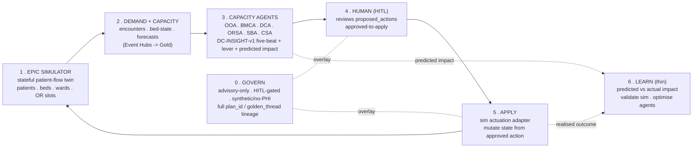
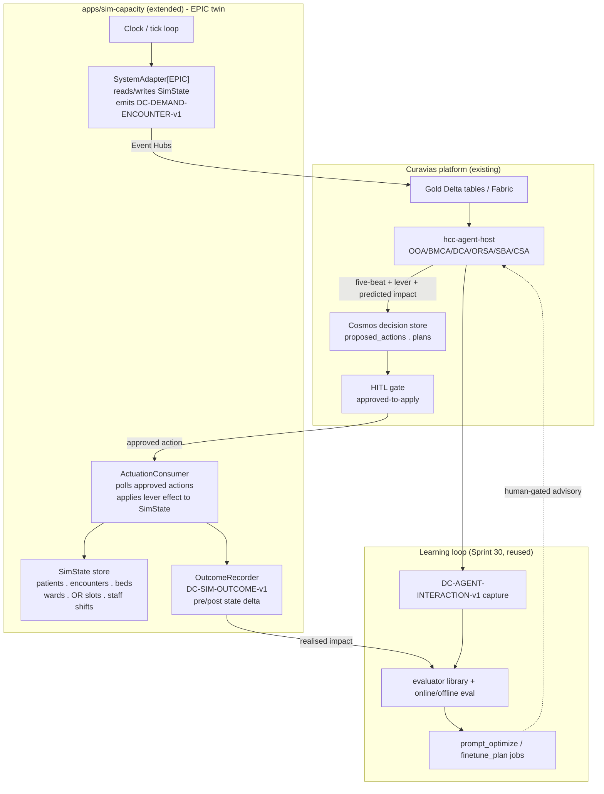
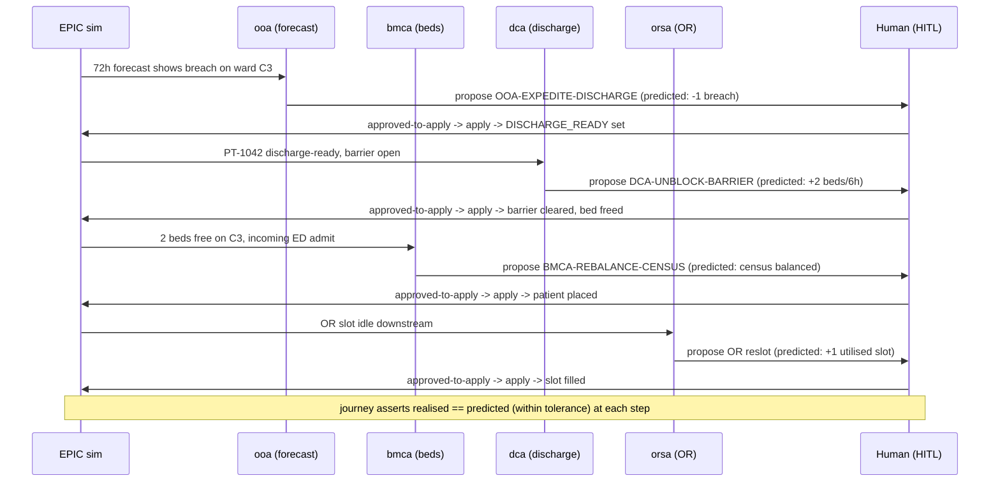

# Sprint 38 — EPIC Closed-Loop Simulation Engine (Design)

| Field | Value |
|-------|-------|
| **Version** | 1.0.0 |
| **Date** | 2026-07-31 |
| **Author** | Urs Rueegg (with Copilot) |
| **Status** | Draft |
| **Previous Version** | n/a (new document) |
| **Sprint** | 38 — EPIC Closed-Loop Simulation Engine |
| **Skill** | Authored via the Superpowers `brainstorming` skill |
| **Grounding** | `apps/sim-capacity` (open-loop demand producer); decision ontology + runtime store ([ADR-0040](../../adr/0040-prescriptive-decision-ontology-and-runtime-store.md)); closed-loop learning ([ADR-0055](../../adr/0055-closed-loop-learning-capture-and-eval.md), Sprint 30); HITL release gates ([ADR-0007](../../adr/0007-mvp-agent-runtime-and-hitl-release-gates.md)); no-PHI demo scope ([ADR-0016](../../adr/0016-no-phi-in-mvp-demo-scope.md), [ADR-0013](../../adr/0013-temporary-us-region-demo-scope.md)); `NFR-AI-001` advisory-only |

> **Purpose**: Close the operational loop. Today the platform *pulls* demand from a
> would-be system of record (EPIC) and *pushes* agent recommendations to a dead end.
> This sprint stands up an **EPIC system-of-record simulator** that is **stateful**
> and **bi-directional**: it feeds patient-flow demand into Curavias, receives the
> **HITL-approved** agent actions back, **applies** them to its own patient-flow
> state, and advances time — so an approved discharge frees a bed, an approved
> transfer moves a patient, and the *next* tick reflects the decision. The proof is
> an **end-to-end patient journey** driven through every capacity agent with a human
> approval at each step, plus a **thin automated finetuning slice** that compares the
> agent's predicted impact against the simulator's realised outcome to validate the
> simulator and optimise the agents.
>
> **Autonomy note**: the four scoping forks (MVP boundary, build approach, feedback
> mechanism, E2E/HITL surface) were delegated ("work autonomously"). The recorded
> decisions are: operational loop + E2E harness with a thin Sprint-30-reusing
> finetuning slice; **extend** `apps/sim-capacity`; **reuse** the decision-tier
> `proposed_actions` (Cosmos) apply path; **automated CI harness (scripted HITL) plus
> a demo-able interactive run**. Every decision is recorded in section 9 and section 10.
>
> **Hard constraint (`NFR-AI-001`)**: this is **not** autonomous actuation. The
> simulator only ever applies an action that a human has approved via
> `approved-to-apply`. Nothing patient-affecting moves without a human in the loop.
> The whole system is synthetic, no-PHI, demo-region scope.

---

## Table of contents

1. Problem and goal
2. Current state (what already exists)
3. The closed operational loop (target pattern)
4. Reference architecture
5. The EPIC system-of-record simulator (stateful engine)
6. Closed-loop actuation contract and apply path
7. End-to-end patient-journey harness (HITL per agent)
8. Automated finetuning slice (validate simulator, optimise agents)
9. Approaches considered and decision
10. Scope for THIS sprint (MVP milestones)
11. Staged roadmap (later sprints)
12. Compliance and governance
13. Risks and open questions
14. Proposed requirements and traceability
15. References

---

## 1. Problem and goal

Curavias plans hospital capacity end-to-end from demand that originates in a clinical
**system of record** — in Swiss practice, most often **EPIC** (the COO and Ops-Lead
reviews both name EPIC as the realistic integration target with usable interfaces).
We do not, and will not, connect a real EPIC to the demo: it is out of scope and
would require PHI. So today `apps/sim-capacity` stands in for that system of record —
but only **one way**. It *generates* demand and capacity data (encounters, bed
states, forecasts, discharge scores) and emits it to Event Hubs. The capacity agents
(OOA, BMCA, DCA, ORSA, SBA, CSA) consume the resulting Gold data, reason over it, and
emit `DC-INSIGHT-v1` five-beat insights whose `action` beat is a **HITL-gated
`proposed_actions` record** in Cosmos.

**And then the loop stops.** Nothing consumes the approved action. An approved
discharge never frees the bed inside the simulator; the next simulated tick is
computed as if the decision never happened. The agents advise into a void, and we
cannot demonstrate — or measure — whether their advice, once acted on, actually
improves patient flow.

**Goal.** Close the operational loop so that the simulator is a genuine
**system-of-record twin**:

- the simulator holds durable **patient-flow state** (patients, encounters, beds,
  wards, OR slots) and advances it on a clock;
- it feeds that state into Curavias as demand and capacity data (as today);
- it **consumes HITL-approved agent actions** and **applies** them to its state —
  a discharge frees a bed, a transfer moves a patient, an OR reslot changes the
  schedule, a staffing rebalance changes a ward's effective capacity;
- the applied action **changes the trajectory**: the next tick, the next forecast,
  and the next agent read all reflect the decision;
- an **end-to-end patient journey** proves the loop through every agent with a human
  approving each step;
- a **thin finetuning slice** closes the *learning* loop on top of the *operational*
  one: it compares each agent's deterministic **predicted impact**
  (`compute_expected_impact`) against the simulator's **realised outcome** and turns
  the gap into a validation signal for the simulator and an optimisation signal for
  the agents (reusing the Sprint 30 capture / eval / optimise machinery).

**Why now.** The UX polish (Sprint 35-37) landed a demo-ready Start and Backstage
experience, but the "loop" it visualises is still animated narrative, not a running
system. Closing the operational loop turns the story into a **demonstrable,
testable, improvable** system — and gives the learning loop (Sprint 30) real
predicted-vs-actual outcomes to learn from instead of throwaway sessions.

**MVP boundary (delegated decision).** Only **EPIC** is simulated. SuccessFactors,
Polypoint, LMS, and other systems are explicitly **out of scope** this sprint (they
have a home in the existing signal-provider plugin architecture and `FR-SKILL-*` /
`FR-EXT-*` families, and can be added later behind the same `SystemAdapter` seam this
sprint introduces).

---

## 2. Current state (what already exists)

We build on a large amount of existing machinery. The sprint's job is to **wire and
extend**, not reinvent.

| Building block | State | Where |
|----------------|-------|-------|
| Open-loop demand producer | Live | `apps/sim-capacity/src/producer_sim.py` (+ `generators/`, `clock/`, `contracts/`, `emitters/`, `profiles/`, `calibration/`) |
| Hospital presets / profiles / samplers | Live | `apps/sim-capacity/src/profiles/`, `calibration/` |
| Demand + capacity data contracts | Live | `DC-DEMAND-ENCOUNTER-v1` (FHIR Encounter), bed-state, `DC-MATCH-RECOMMENDATION-v1`, discharge scores |
| Capacity agents (OOA/BMCA/DCA/ORSA/SBA/CSA) | Live | `apps/hcc-agent-host/`; `agents/*-agent/` prompt packs |
| Five-beat insight contract | Live (S26) | `DC-INSIGHT-v1` — signal / understanding / recommendation / action / coordination + provenance |
| Decision ontology + levers | Live (S26, ADR-0040) | `data-platform/decision/levers/*.yaml` (e.g. `DCA-UNBLOCK-BARRIER`, `BMCA-REBALANCE-CENSUS`, `OOA-EXPEDITE-DISCHARGE`) |
| Deterministic impact function | Live | `compute_expected_impact(lever_id, params, gold)` — never LLM-guessed |
| Proposed-action runtime store | Live (S26) | Cosmos `proposed_actions` / `plans`; `{status: proposed, hitl: required, cosmos_id}`, shared `Plan {plan_id, golden_thread}` |
| HITL approval gate | Live | agent-host `hitl/`; `approved-to-apply` doctrine ([ADR-0007](../../adr/0007-mvp-agent-runtime-and-hitl-release-gates.md)) |
| Decision-tier live-apply runbook | Live (S26) | `docs/runbooks/decision-tier-live-apply.md` |
| Closed-loop **learning** foundation | Live (S30, ADR-0055) | `DC-AGENT-INTERACTION-v1` capture; evaluator library + offline gate; online eval (15% sample); curator + advisory backlog |
| Finetuning / optimisation jobs | Live (S30) | `evals/{curate_job,online_eval_job,prompt_optimize_job,finetune_plan_job,knowledge_refresh_job}.py`, `evals/lib/` |

**Gap summary.** Two things are missing, and they are exactly this sprint:

1. **The simulator is stateless with respect to actions.** It has a clock and
   generators, but no persistent patient-flow state that an approved action can
   mutate. There is no consumer that reads `proposed_actions` after approval and
   writes the effect back into the sim.
2. **There is no predicted-vs-actual outcome signal.** Agents predict impact
   (`compute_expected_impact`); the simulator never reports what actually happened,
   so the learning loop has nothing operational to score.

Everything else — the producer, the agents, the levers, the HITL gate, the capture
and eval jobs — already exists and is reused.

---

## 3. The closed operational loop (target pattern)

The target is a **human-driven control loop**. The simulator is the plant; the agents
are advisors; the human is the controller who approves each corrective action.



- **Simulate** — the EPIC twin holds durable state and advances it on a tick.
- **Feed** — each tick emits demand and capacity data (reusing the existing
  producer and contracts).
- **Advise** — agents read Gold, emit five-beat insights; the `action` beat becomes
  a `proposed_actions` record with a **lever** and a **predicted impact**.
- **Approve** — a human approves the action (`approved-to-apply`). No approval, no
  apply. This is the `NFR-AI-001` boundary.
- **Apply** — the sim actuation adapter consumes the approved action and mutates the
  twin's state via the lever's declared effect (discharge -> bed free, transfer ->
  patient moves, reslot -> schedule changes).
- **Close** — the next tick's demand, forecasts, and agent reads reflect the applied
  action. The loop is closed.
- **Learn (thin)** — the apply step records the **realised** state delta; the
  learning loop compares it to the agent's **predicted** impact and feeds the gap
  into calibration (simulator) and optimisation (agents).

The key design insight: **the simulator is the ground truth the agents are graded
against.** The agent said "expediting these three discharges frees 2 beds in 6h";
the simulator, after the human approves and the adapter applies, reports what
*actually* happened. That single predicted-vs-actual comparison is what makes the
loop both **provable** (E2E test) and **improvable** (finetuning) with no PHI and no
autonomous action.

---

## 4. Reference architecture



**Component responsibilities (new or extended this sprint):**

- **SimState store** *(new)* — durable, versioned patient-flow state for the twin.
  A patient-flow entity graph keyed by `plan_id` / `golden_thread` so a single
  patient's journey is queryable end-to-end. Local file/SQLite for CI; Cosmos
  container for SIT (reusing the existing `cosmos-mcp` seam).
- **SystemAdapter[EPIC]** *(new interface, one implementation)* — the seam that
  abstracts "a system of record." It reads SimState to produce demand/capacity data
  and exposes the write operations the actuation consumer needs. Only the EPIC
  implementation ships this sprint; the interface is what makes SuccessFactors et al.
  additive later.
- **ActuationConsumer** *(new)* — polls Cosmos `proposed_actions` for records that
  crossed `approved-to-apply`, resolves the lever, applies its declared effect to
  SimState, and records the outcome. Idempotent (each action applied once, keyed by
  `cosmos_id`), refuses any action not human-approved.
- **OutcomeRecorder** *(new)* — snapshots the relevant SimState slice before and
  after apply, emits `DC-SIM-OUTCOME-v1` (realised delta), and links it to the
  `proposed_actions.cosmos_id` and the agent's predicted impact.
- **Clock / tick loop** *(extended)* — the existing clock now advances SimState (not
  just regenerates from presets), so applied actions persist across ticks.

Everything in the Curavias and Learning boxes is reused as-is. The new surface area
is deliberately confined to `apps/sim-capacity` plus one new data contract and a
handful of lever "effect" declarations.

---

## 5. The EPIC system-of-record simulator (stateful engine)

The engine turns `apps/sim-capacity` from a **generator** into a **twin**.

### 5.1 State model

A minimal but sufficient patient-flow entity graph (synthetic, no-PHI — synthetic IDs
only, e.g. `PT-1042`, `BED-C3-14`):

```text
Patient(patient_id, synthetic_demographics, acuity, specialty, journey_stage)
Encounter(encounter_id, patient_id, class=ED|IP|OR, status, admit_ts, expected_los)
Bed(bed_id, ward_id, state=available|occupied|blocked|planned, patient_id?)
Ward(ward_id, specialty, staffed_capacity, effective_capacity)
ORSlot(slot_id, room_id, scheduled_case?, status)
StaffShift(shift_id, ward_id, role, headcount, window)
DischargeBarrier(barrier_id, patient_id, type, status=open|cleared)
```

`journey_stage` is the E2E backbone: `ARRIVAL -> TRIAGE -> ADMIT -> INPATIENT ->
DISCHARGE_READY -> DISCHARGED` (with `OR_SCHEDULED` / `TRANSFER` side-paths). The
harness (section 7) walks one patient through these stages.

### 5.2 Tick semantics

Each tick the engine:

1. advances time-driven transitions (arrivals sampled from profiles as today; LOS
   countdown; barrier ageing);
2. applies any **approved** actions queued since the last tick (section 6);
3. recomputes derived capacity (occupancy, projected pressure) from the mutated
   state;
4. emits demand/capacity data through the existing contracts and emitters.

Determinism is preserved by a **seeded** RNG (the sim already seeds samplers). The
same seed + the same approved-action sequence yields the same trajectory — essential
for a CI-runnable E2E test.

### 5.3 What the twin exposes to Curavias

No change to the *shape* of what Curavias consumes: the twin still emits
`DC-DEMAND-ENCOUNTER-v1`, bed-state, forecast inputs, and discharge scores. The only
difference is that these are now **derived from persistent, action-mutated state**
rather than regenerated from presets each tick. This keeps the entire downstream
(Gold, agents, boards) unchanged.

---

## 6. Closed-loop actuation contract and apply path

This is the heart of the sprint: turning an approved recommendation into a state
change, deterministically and only with human approval.

### 6.1 Reuse the decision-tier path (decided)

We reuse the existing `proposed_actions` (Cosmos) records rather than invent a new
agent->sim contract. The agent already writes `{lever_id, params, predicted_impact,
status: proposed, hitl: required, cosmos_id, plan_id, golden_thread}`. The human
already approves via `approved-to-apply`. The **only new consumer** is the sim-side
`ActuationConsumer`, which watches for the `approved-to-apply` transition and acts.

This keeps a single system of record for decisions (Cosmos), preserves the existing
HITL gate untouched, and means the simulator learns nothing the human did not approve.

### 6.2 Lever effect declarations

Each decision lever gains an **effect** block describing, deterministically, how the
approved action mutates SimState. This mirrors the existing `compute_expected_impact`
(which predicts the *metric* impact) with the *state* mutation:

```yaml
# data-platform/decision/levers/dca-unblock-barrier.yaml (excerpt, new effect block)
lever_id: DCA-UNBLOCK-BARRIER
# ... existing predicted-impact definition ...
effect:
  applies_to: DischargeBarrier
  mutation: set_status
  from: open
  to: cleared
  cascade:
    - when: patient_all_barriers_cleared
      set: Patient.journey_stage = DISCHARGE_READY
```

The `ActuationConsumer` reads the lever's `effect`, validates the target exists in
SimState, applies the mutation transactionally, and refuses (with a logged reason) if
the state has drifted such that the effect is no longer valid (for example the bed was
already freed by another approved action) — in which case the action is marked
`superseded`, never silently dropped.

### 6.3 The new outcome contract `DC-SIM-OUTCOME-v1`

```json
{
  "contract": "DC-SIM-OUTCOME-v1",
  "cosmos_id": "pa_7f31...",
  "plan_id": "plan_4c2a...",
  "golden_thread": "gt_pt1042...",
  "lever_id": "DCA-UNBLOCK-BARRIER",
  "applied_ts": "2026-07-31T09:14:00Z",
  "predicted_impact": { "metric": "beds_freed", "value": 2, "window_h": 6 },
  "realised_impact":  { "metric": "beds_freed", "value": 2, "window_h": 6 },
  "state_delta": { "beds_freed": ["BED-C3-14", "BED-C3-19"], "patients_discharged": ["PT-1042", "PT-1039"] },
  "divergence": 0.0,
  "provenance": "simulated"
}
```

`divergence` (predicted vs realised, normalised) is the single number the learning
slice consumes. It is PHI-free by construction (synthetic IDs only) and carries the
`golden_thread` so a whole patient journey's outcomes are queryable together.

### 6.4 Idempotency, safety, and refusal

- **Idempotent**: keyed by `cosmos_id`; an action is applied at most once.
- **Human-gated**: the consumer refuses any record not in `approved-to-apply`, and
  refuses approvals whose approver is a bot/the agent itself (reusing the existing
  approver check).
- **No autonomous chaining**: applying one action never auto-approves another; each
  action in a plan needs its own approval.
- **Advisory boundary preserved**: this is a *simulator*. `provenance: simulated` is
  stamped on every outcome; nothing here is or implies clinical actuation.

---

## 7. End-to-end patient-journey harness (HITL per agent)

The proof of the closed loop is a **scripted patient journey** that walks one
synthetic patient through the whole agent roster, with a human approval at each step,
and asserts that each approval changed the trajectory.

### 7.1 The canonical journey (happy path)



### 7.2 Harness design (decided: automated CI + demo-able interactive)

- **Automated CI harness** *(primary deliverable)* — a deterministic
  `tests/e2e/closed_loop_journey` runner: fixed seed, scripted approvals (the human
  step is a scripted `approved-to-apply` call), asserts at each step that (a) a
  `proposed_actions` record with the expected lever appeared, (b) applying it changed
  SimState as the lever effect declares, and (c) the `DC-SIM-OUTCOME-v1` divergence is
  within tolerance. Runs headless in CI; no cloud dependency (local SimState + mock
  agent-host, consistent with the no-PHI synthetic posture).
- **Demo-able interactive run** *(secondary)* — the same journey runnable against the
  live-ish stack where the human clicks "approve" in the app's HITL surface, for the
  narrative demo. Shares the journey definition with the CI harness so the two never
  drift.

### 7.3 Test cases

The sprint ships at least: one **happy-path** journey (all approvals granted, loop
converges), and these **failure-mode** cases: (a) **approval withheld** — the human
declines; assert the trajectory does *not* change and the breach persists; (b)
**state drift** — a second action targets already-freed capacity; assert `superseded`,
not silent apply; (c) **divergence** — a deliberately mis-calibrated lever effect;
assert the outcome records non-zero `divergence` and it surfaces to the learning slice.

---

## 8. Automated finetuning slice (validate simulator, optimise agents)

The finetuning ask is satisfied by a **thin slice that reuses Sprint 30**, not a new
optimisation stack. The operational loop now produces exactly the fuel Sprint 30 was
missing: real predicted-vs-actual outcomes.

### 8.1 Two things "automated finetuning" validates

1. **Is the simulator working?** — a **calibration gate**: over a batch of
   journeys, the *distribution* of `DC-SIM-OUTCOME-v1` must be internally consistent
   (an approved discharge always frees exactly the beds its lever effect declares;
   occupancy accounting balances; no state leaks). This is the "the simulator is
   working" check, run as a deterministic batch assertion — not model training.
2. **Are the agents optimised?** — an **agent optimisation signal**: aggregate
   `divergence` per lever/agent becomes an entry in the existing Sprint 30 advisory
   backlog. High divergence -> the agent's recommendation (which lever, which params)
   is mis-tuned -> feed the existing `prompt_optimize_job` / `finetune_plan_job` with
   the divergent traces. Always human-gated (`approved-to-apply`), advisory-only.

### 8.2 Wiring (reuse)

- `DC-SIM-OUTCOME-v1` records are captured alongside the existing
  `DC-AGENT-INTERACTION-v1` records (same capture choke point, same R3 retention).
- The **evaluator library** gains one new evaluator: `outcome_divergence` (predicted
  vs realised). It scores the operational loop the way existing evaluators score
  conversations — same online/offline harness, no new pipeline.
- `curate_job` selects high-divergence journeys into a versioned dataset;
  `prompt_optimize_job` proposes agent-instruction changes; `finetune_plan_job`
  drafts an SFT/DPO plan **for human review only**. Nothing promotes automatically.

### 8.3 Explicitly NOT in this slice

Live model fine-tuning execution, multi-agent joint optimisation, and reward-model
training are **out of scope** — they are the natural Sprint 39+ continuation once the
operational loop produces a corpus. This sprint proves the *plumbing* (outcome ->
evaluator -> backlog -> plan) end-to-end on synthetic data.

---

## 9. Approaches considered and decision

### 9.1 How the simulator becomes stateful

| Approach | Summary | Verdict |
|----------|---------|---------|
| **A. Extend `apps/sim-capacity`** | Add a SimState store, actuation consumer, and outcome recorder inside the existing package; keep generators/clock/contracts/emitters | **Chosen** — reuses the producer, contracts, calibration, and profiles; smallest new surface; the `SystemAdapter` interface still gives clean extensibility |
| B. New standalone simulation-engine service | A fresh service owns state; `sim-capacity` stays the pure open-loop producer | Rejected for MVP — duplicates generators/contracts, adds infra and a second deploy target, no benefit at demo scale |
| C. Model state inside the agent-host | Put patient-flow state next to the agents | Rejected — conflates "system of record" with "advisor," muddies the `NFR-AI-001` boundary, and pollutes the agent store with plant state |

### 9.2 How approved actions reach the simulator

| Approach | Summary | Verdict |
|----------|---------|---------|
| **A. Reuse decision-tier `proposed_actions` (Cosmos) + new sim consumer** | Agent proposes -> human `approved-to-apply` -> sim's `ActuationConsumer` applies | **Chosen** — single decision system of record, HITL gate untouched, minimal new contract |
| B. New event/queue contract agent->sim | Purpose-built `DC-SIM-ACTUATION-v1` on Event Hubs | Rejected for MVP — a second decision channel to keep consistent with Cosmos; revisit only if throughput demands it |
| C. Direct agent->sim API call | Agent calls the sim to apply | Rejected — bypasses the HITL gate; violates `NFR-AI-001` |

### 9.3 E2E harness / HITL surface

| Approach | Summary | Verdict |
|----------|---------|---------|
| **A. Automated CI harness (scripted HITL) + demo-able interactive run** | Deterministic CI runner is the gate; interactive run shares the journey definition | **Chosen** — provable in CI *and* demonstrable; single source of the journey |
| B. Automated CI only | No interactive path this sprint | Rejected — loses the demo value that motivated the ask |
| C. Interactive only | Human clicks approve, no CI gate | Rejected — no regression protection; the loop could silently break |

### 9.4 Finetuning depth

| Approach | Summary | Verdict |
|----------|---------|---------|
| **A. Thin slice reusing Sprint 30 (outcome evaluator + advisory backlog + plan draft)** | Add one evaluator, feed existing jobs | **Chosen** — proves the learning plumbing on real outcomes without a new stack |
| B. Full automated finetuning this sprint | Execute SFT/DPO, joint optimisation | Rejected — too large; belongs in Sprint 39+ on the corpus this sprint produces |
| C. No finetuning | Operational loop only | Rejected — the user explicitly asked for a finetuning approach to validate sim + optimise agents |

---

## 10. Scope for THIS sprint (MVP milestones)

MVP = a **single hospital, EPIC-only, synthetic, no-PHI** closed operational loop with
one proven end-to-end journey and the thin learning slice.

| Milestone | Deliverable | Definition of done |
|-----------|-------------|--------------------|
| **M0** | `SystemAdapter` seam + `SimState` store | Interface defined; EPIC implementation reads/writes state; local (SQLite/file) for CI, Cosmos for SIT; unit tests green |
| **M1** | Stateful tick loop | Clock advances SimState across ticks; applied actions persist; determinism test (same seed + same actions -> same trajectory) green |
| **M2** | Lever effect declarations + `ActuationConsumer` | Effect blocks for the levers the journey needs (OOA-EXPEDITE-DISCHARGE, DCA-UNBLOCK-BARRIER, BMCA-REBALANCE-CENSUS, one OR reslot); consumer applies only `approved-to-apply` records; idempotent + refusal tests green |
| **M3** | `DC-SIM-OUTCOME-v1` + OutcomeRecorder | Schema + validator; pre/post delta recorded; predicted-vs-realised `divergence` computed; PHI-free assertion green |
| **M4** | E2E closed-loop journey harness | Deterministic CI runner: happy path + 3 failure modes (approval withheld / state drift / divergence); demo-able interactive run shares the journey definition |
| **M5** | Thin learning slice | `outcome_divergence` evaluator wired into the Sprint 30 evaluator library; high-divergence journeys curated; `prompt_optimize`/`finetune_plan` draft produced for human review; calibration gate (sim internal consistency) green |

**Out of scope this sprint** (recorded so it is explicit): SuccessFactors / Polypoint /
LMS simulators; multi-hospital concurrent loops; live model fine-tuning execution;
autonomous action of any kind; PHI or real EPIC connectivity.

---

## 11. Staged roadmap (later sprints)

- **Sprint 39 — Learning depth.** Execute the finetune plans this sprint only drafts
  (SFT/DPO on the divergence corpus), multi-agent joint optimisation, reward shaping
  from realised outcomes.
- **Sprint 40 — More systems of record.** Add `SystemAdapter` implementations behind
  the seam (SuccessFactors for staffing, an LMS for skills) — reusing the
  `FR-SKILL-*` / `FR-EXT-*` simulator-plugin posture, each flagged live-vs-simulated.
- **Sprint 41 — Multi-hospital + crisis loops.** Concurrent twins per hospital; CSA
  scenario runs that fork the twin, apply a plan, and compare trajectories.
- **GA gate.** Any move from `simulated` outcomes toward real EPIC integration is
  PHI-bearing and blocked behind the Switzerland-region GA + DPA path
  ([ADR-0013](../../adr/0013-temporary-us-region-demo-scope.md),
  [ADR-0016](../../adr/0016-no-phi-in-mvp-demo-scope.md)); it is not implied by this
  sprint.

---

## 12. Compliance and governance

- **`NFR-AI-001` boundary (central).** The loop is closed by a **human**, not by the
  system. The `ActuationConsumer` applies only records that a human moved to
  `approved-to-apply`; it refuses bot/self approvals; applying one action never
  approves another. This is a *simulator*, stamped `provenance: simulated` on every
  outcome — it is neither clinical actuation nor a medical device.
- **No PHI (ADR-0016).** SimState uses synthetic IDs and synthetic demographics only.
  `DC-SIM-OUTCOME-v1` is PHI-free by construction; the existing redaction choke point
  and R3 retention (ADR-0055) apply to captured outcomes.
- **Demo region (ADR-0013).** SIT SimState (if hosted) lives in the demo region;
  Swiss residency is the GA target, unchanged by this sprint.
- **Lineage.** Every action, outcome, and journey carries `plan_id` /
  `golden_thread` / `cosmos_id`, so the full chain proposed -> approved -> applied ->
  realised -> curated -> optimisation-draft is auditable — extending the Sprint 30
  interaction->dataset->eval->change lineage (COMPLIANCE `CH-C11`).
- **HITL gate reuse (ADR-0007).** No new approval mechanism; the existing
  `approved-to-apply` doctrine and approver checks are the only gate.

---

## 13. Risks and open questions

| # | Risk / question | Mitigation / proposed resolution |
|---|-----------------|----------------------------------|
| R1 | SimState complexity creeps toward a full HIS | Cap the entity graph at section 5.1; only model what the four journey levers touch this sprint |
| R2 | Lever `effect` blocks drift from `compute_expected_impact` | Author them together per lever; the divergence evaluator surfaces any inconsistency automatically |
| R3 | Non-determinism breaks the CI harness | Seed everything; the M1 determinism test is a hard gate; no wall-clock, no unseeded RNG |
| R4 | Reusing Cosmos `proposed_actions` couples sim to the decision store | Keep the coupling read-only from the sim side (poll + apply); the sim never writes decision records, only outcomes |
| R5 | "Finetuning" over-scoped | Thin slice (section 8) proves plumbing only; execution deferred to Sprint 39 (recorded in section 10/11) |
| Q1 | Should SIT host SimState in Cosmos now, or stay local until Sprint 39? | Proposed: local for CI this sprint; Cosmos container behind the `cosmos-mcp` seam is M0-optional, decided at planning |
| Q2 | Does the interactive demo run reuse the app HITL surface or a thin CLI? | Proposed: reuse the app HITL surface if ready; otherwise a CLI approver sharing the journey definition — decided in writing-plans |
| Q3 | New ADR needed? | Yes — **ADR-0058** ratifies `DC-SIM-OUTCOME-v1`, the lever `effect` schema, and the sim-as-ground-truth pattern (0057 was already taken by the OBO-seam ADR; see section 14) |

---

## 14. Proposed requirements and traceability

New requirement families (activating the reserved `FR-SIM-*` namespace referenced by
`FR-ONT-005`) and a closed-loop-proof family. Final IDs confirmed when `docs/PRD.md`
is updated in the implementation PR.

| Proposed ID | Requirement |
|-------------|-------------|
| `FR-SIM-001` | The platform shall provide an **EPIC system-of-record simulator** holding durable, synthetic, no-PHI patient-flow state (patients, encounters, beds, wards, OR slots, staff shifts, discharge barriers). |
| `FR-SIM-002` | The simulator shall advance state on a **seeded, deterministic clock**, such that the same seed and the same approved-action sequence yield the same trajectory. |
| `FR-SIM-003` | The simulator shall feed demand and capacity data to Curavias via the existing `DC-DEMAND-ENCOUNTER-v1` and capacity contracts, derived from persistent state. |
| `FR-SIM-004` | The simulator shall **apply HITL-approved agent actions** to its state via declared lever **effect** blocks, mutating patient-flow state (discharge frees a bed, transfer moves a patient, reslot changes the OR schedule). |
| `FR-SIM-005` | The simulator shall emit a **`DC-SIM-OUTCOME-v1`** record per applied action capturing the pre/post state delta and the predicted-vs-realised **divergence**, PHI-free and linked by `plan_id` / `golden_thread` / `cosmos_id`. |
| `FR-SIM-006` | The simulator shall expose a **`SystemAdapter`** seam so additional systems of record (SuccessFactors, LMS) are additive without re-architecture (only EPIC ships this sprint). |
| `FR-CLP-001` | The platform shall provide a **deterministic, CI-runnable end-to-end patient-journey harness** that drives one synthetic patient through the capacity agents with a scripted HITL approval per step and asserts trajectory change. |
| `FR-CLP-002` | The harness shall cover the **happy path plus failure modes** (approval withheld, state drift/superseded, deliberate divergence), and shall share its journey definition with a **demo-able interactive run**. |
| `FR-CLP-003` | The platform shall feed `DC-SIM-OUTCOME-v1` **divergence** into the existing Sprint 30 evaluator library and advisory backlog as an agent-optimisation signal, and run a **calibration gate** asserting simulator internal consistency — all human-gated, advisory-only. |
| `NFR-SIM-001` | Simulator state and outcomes shall be **synthetic and PHI-free** by construction; `provenance: simulated` is stamped on every outcome. |
| `NFR-SIM-002` | The actuation consumer shall apply an action **only** when a human has moved it to `approved-to-apply`; it shall refuse bot/self approvals and shall be **idempotent** per `cosmos_id`; no applied action shall auto-approve another. |
| `NFR-SIM-003` | The closed loop shall preserve full **proposed -> approved -> applied -> realised -> curated** lineage, extending the Sprint 30 (`CH-C11`) lineage guarantee. |

**Traceability to existing anchors:** extends `FR-ONT-005` (process-ontology overlay
for `FR-SIM-*`); reuses `DC-INSIGHT-v1` (`FR-FC-007`), the decision ontology
([ADR-0040](../../adr/0040-prescriptive-decision-ontology-and-runtime-store.md)), the
HITL gate ([ADR-0007](../../adr/0007-mvp-agent-runtime-and-hitl-release-gates.md),
`NFR-AI-001`), and the closed-loop-learning families `FR-LEARN-*` / `NFR-LEARN-*`
([ADR-0055](../../adr/0055-closed-loop-learning-capture-and-eval.md)); governed by
`NFR-AI-001`, ADR-0016, ADR-0013. **ADR-0058** ratifies
`DC-SIM-OUTCOME-v1`, the lever `effect` schema, and the sim-as-ground-truth pattern
(renumbered from the originally-proposed 0057, which was already taken).

---

## 15. References

- `apps/sim-capacity/src/producer_sim.py` and package (open-loop producer being extended)
- [ADR-0040 — prescriptive decision ontology and runtime store](../../adr/0040-prescriptive-decision-ontology-and-runtime-store.md)
- [ADR-0055 — closed-loop learning: capture contract, retention, online-eval](../../adr/0055-closed-loop-learning-capture-and-eval.md)
- [Sprint 30 — Closed-Loop Learning Foundation (design)](2026-07-27-sprint-30-closed-loop-learning-foundation-design.md)
- [ADR-0007 — MVP agent runtime and HITL release gates](../../adr/0007-mvp-agent-runtime-and-hitl-release-gates.md)
- [ADR-0016 — no PHI in MVP demo scope](../../adr/0016-no-phi-in-mvp-demo-scope.md)
- [ADR-0013 — temporary US-region demo scope](../../adr/0013-temporary-us-region-demo-scope.md)
- `docs/runbooks/decision-tier-live-apply.md` (existing approved-action apply runbook)
- `docs/PRD.md` — `FR-ONT-005` (reserved `FR-SIM-*`), `FR-FC-007`, `NFR-AI-001`, `FR-LEARN-*` / `NFR-LEARN-*`
- `docs/COMPLIANCE.md` `CH-C11` (closed-loop learning governance)
- `evals/` — `curate_job.py`, `online_eval_job.py`, `prompt_optimize_job.py`, `finetune_plan_job.py`, `lib/` (reused learning jobs)
