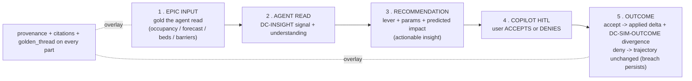
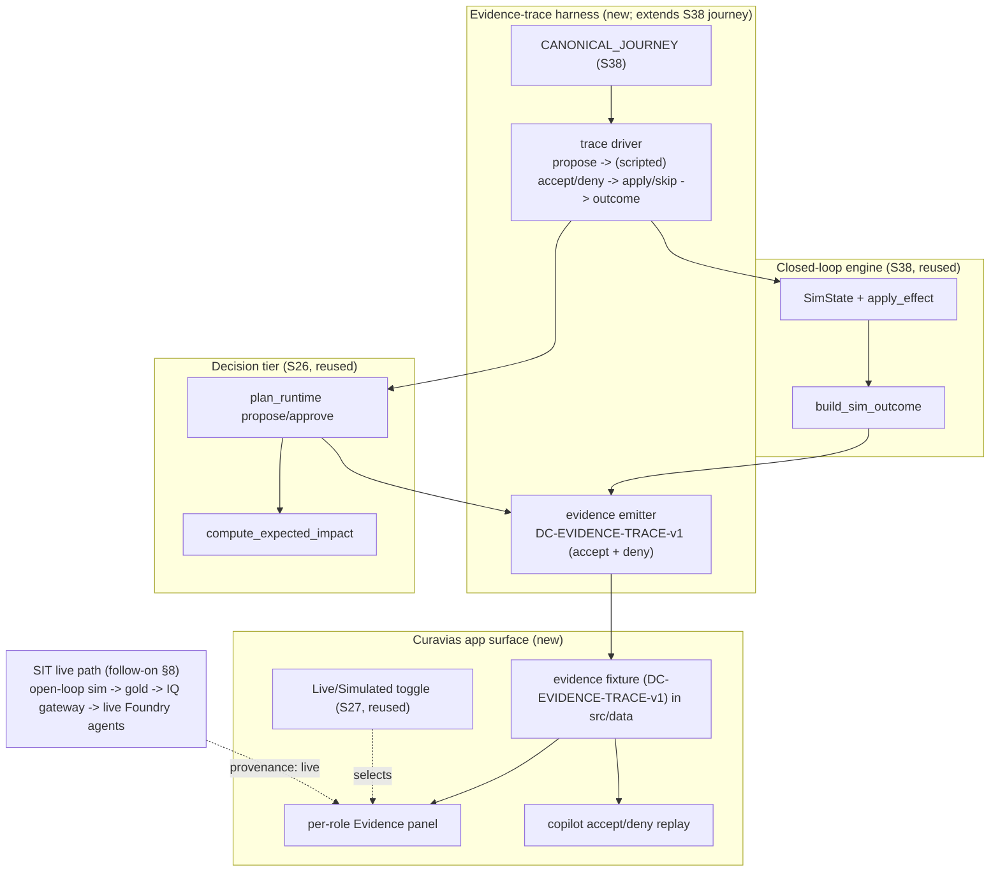

# Sprint 39 — EPIC Closed-Loop SIT Evidence (End-to-End per-role proof) — Design

| Field | Value |
|-------|-------|
| **Version** | 1.0.0 |
| **Date** | 2026-08-01 |
| **Author** | Urs Rueegg (with Copilot) |
| **Status** | Draft |
| **Previous Version** | n/a (new document) |
| **Sprint** | 39 — EPIC Closed-Loop SIT Evidence (E2E per-role proof) |
| **Skill** | Authored via the Superpowers `brainstorming` skill |
| **Grounding** | Sprint 38 closed-loop engine ([design](2026-07-31-sprint-38-epic-closed-loop-simulation-engine-design.md), [ADR-0058](../../adr/0058-sim-outcome-and-effect-schema.md)); decision ontology ([ADR-0040](../../adr/0040-prescriptive-decision-ontology-and-runtime-store.md)); HITL gates ([ADR-0007](../../adr/0007-mvp-agent-runtime-and-hitl-release-gates.md), `NFR-AI-001`); single IQ gateway ([ADR-0044 (IQ layer)](../../adr/0044-app-data-access-via-iq-layer.md)); app context envelope + Live/Simulated toggle (Sprint 27/29); no-PHI demo ([ADR-0016](../../adr/0016-no-phi-in-mvp-demo-scope.md)), demo region ([ADR-0013](../../adr/0013-temporary-us-region-demo-scope.md)); **read-only SIT inventory 2026-08-01 (see §2)** |

> **Purpose**: Prove the platform's value end-to-end. For **each capacity role**
> (OOA / BMCA / DCA / ORSA / SBA / CSA), show the *evidence* of the full closed
> loop for one synthetic patient: the **EPIC simulator** data the agent read, the
> agent's **recommendation / actionable insight**, the **copilot chat** with the
> user **accepting or denying** that recommendation, and the **outcome** the
> decision produced (an accepted discharge frees a bed; a denied one leaves the
> breach). The deliverable is a **reproducible, per-role E2E evidence trace**
> surfaced in the Curavias app, plus the SIT run that backs it.
>
> **Autonomy note**: the four scoping forks were delegated ("work autonomously").
> Recorded decisions: (1) build a **deterministic evidence-trace harness + per-role
> app surface** as the MVP, with a **SIT-live-backed** path as a follow-on; (2) do a
> **read-only SIT inventory first** (done, §2); (3) surface evidence as a **dedicated
> per-role "closed-loop evidence / demo mode"**; (4) **visual companion = walk the
> running app** (deferred to review time; surfaces described from code in §7).
>
> **Hard constraint (`NFR-AI-001`)**: the accept/deny is a **human** decision; the
> evidence proves the loop is human-gated. Everything is synthetic, no-PHI,
> `provenance: simulated` (or `live` for SIT-gold reads), demo-region scope.

---

## Table of contents

1. Problem and goal
2. Current state (repo + read-only SIT inventory)
3. What "evidence" means here (the per-role E2E chain)
4. The evidence-trace contract (`DC-EVIDENCE-TRACE-v1`)
5. Reference architecture
6. The evidence-trace harness (extends the Sprint 38 journey)
7. App surfacing (per-role evidence panel + copilot accept/deny replay)
8. SIT-live-backed path (follow-on)
9. Approaches considered and decision
10. Scope for THIS sprint (MVP milestones)
11. Staged roadmap
12. Compliance and governance
13. Risks and open questions
14. Proposed requirements and traceability
15. References

---

## 1. Problem and goal

Sprint 38 built the closed operational loop (stateful EPIC twin → agent
recommendation → HITL approve → apply back to the twin → `DC-SIM-OUTCOME-v1`), and
proved it with a deterministic CI journey test. But that proof lives in pytest
output. **A reviewer cannot yet see, per role, the actual end-to-end data** — what
the EPIC simulator fed each agent, the recommendation it produced, the user
accepting or denying it in the copilot, and the resulting change. The customer ask
is exactly that visibility: *prove the evidence in each main part for each role,
based on the EPIC simulator and the recommendation → actionable insight → copilot
accept/deny*.

**Goal.** Deliver a **per-role, end-to-end evidence trace** for one synthetic
patient's journey through all capacity agents, and **surface it in the Curavias
app** so each role's board shows its stage of the proof:

- the **EPIC-simulator input** the agent grounded on (occupancy, forecast, beds,
  barriers — the gold the sim produced);
- the agent's **read** and its **recommendation / actionable insight** (the
  `DC-INSIGHT-v1` five-beat + lever + deterministic predicted impact);
- the **copilot chat** presenting the recommendation with an **accept / deny**
  control, and the **human decision** recorded;
- the **outcome**: on accept, the applied state delta + `DC-SIM-OUTCOME-v1`
  divergence (bed freed); on deny, the unchanged trajectory (breach persists);
- full **provenance + citations** at every stage, and the `golden_thread` linking
  the whole journey.

**Why now.** The engine and the SIT data plane already exist (§2). What is missing
is the *evidence surface* that turns "the tests pass" into "here is the proof, per
role, that a human-approved recommendation moved the patient flow."

**Scope decision (delegated).** MVP = a **deterministic evidence-trace harness**
(built on the Sprint 38 journey) that emits a per-role evidence pack, plus an app
**evidence surface** that renders it and replays the copilot accept/deny. A
**SIT-live-backed** variant (read + recommendation stages driven by the live SIT
open-loop sim + live Foundry agents) is a follow-on (§8), and the **full live
closed loop in SIT** (deploying the Sprint 38 engine + wiring actuation back into a
running job) is explicitly later (§11).

---

## 2. Current state (repo + read-only SIT inventory)

### 2.1 Read-only SIT inventory (2026-08-01)

Confirmed live against subscription `66a9953a-df37-4c51-856c-9971b9bf3e03`
(tenant MCAP164444), resource group `rg-ihzhhpf-sit`:

| Container App | Image | Running | Meaning |
|---------------|-------|---------|---------|
| `ca-sim-capacity-ihzhhpf-sit` | `…/sim-capacity:sprint10-t1` | Running | **Open-loop** producer (Sprint 10) — emits demand to Fabric Eventstream; **not** the Sprint 38 closed-loop engine |
| `ca-app-fluent-ihzhhpf-sit` | `…/hcc-app-fluent:a7fb478` | Running | The Curavias app |
| `ca-agent-host-ihzhhpf-sit` | `…/hcc-agent-host:62cc2ae` | Running | Orchestrator + HITL + Cosmos decision store |
| `ca-signal-runner-ihzhhpf-sit` | `azure-cli` | Running | Signal provider-runner |
| `ca-po-ihzhhpf-sit` | `dotnet/samples` | Running | PO-agent runtime (placeholder image) |

**Key implication:** SIT can produce the **read + recommendation** stages *live
today* (open-loop sim → Fabric gold → app Live toggle → live Foundry agents). The
**apply → outcome** (closed-loop) stages exist only in the Sprint 38 repo/tests —
the running SIT sim is `sprint10-t1` (pre-closed-loop). Full live actuation
therefore requires publishing + deploying a new closed-loop sim image (a §11 item),
which is why the MVP proves apply/outcome **deterministically** in the harness.

### 2.2 Repo building blocks (reused)

| Block | State | Where |
|-------|-------|-------|
| Closed-loop engine (twin, tick, effect, actuation, outcome, journey) | Live (S38) | `apps/sim-capacity/src/closedloop/*` |
| Canonical journey definition | Live (S38) | `closedloop/journey.py` (`CANONICAL_JOURNEY`) |
| `DC-SIM-OUTCOME-v1` | Live (S38) | `data/synthetic/schema/dc-sim-outcome-v1.schema.json` |
| Decision-tier propose→approve (HITL) | Live (S26) | `data-platform/decision/coordination/plan_runtime.py` |
| `DC-INSIGHT-v1` five-beat + levers | Live (S26) | `data-platform/decision/levers/*.yaml`, `impact/compute_expected_impact.py` |
| Single IQ gateway (golden-data ingress) | Live (ADR-0044 IQ layer) | `apps/hcc-app-fluent/src/data/iq-client.ts` |
| Live/Simulated toggle + golden-source client | Live (S27) | `apps/hcc-app-fluent/src/data/{data-source,roleboard/golden-source-client}.ts` |
| Copilot grounded recommendations (per agent) + HITL CTA | Live (mock) | `apps/hcc-app-fluent/src/copilot-drawer/agent-manifest.ts` (`requiresApproval: true`, `provenance: 'simulated'`) |
| Governance evidence surface (decisions + BOM) | Live (S14/S36) | `apps/hcc-app-fluent/src/data/evidence/evidence-demo.json` (Backstage) |
| Outcome-divergence evaluator + calibration gate + backlog | Live (S38 M5) | `evals/lib/sim_outcome_eval.py` |

**Gap:** there is no **runtime, per-role E2E evidence trace** that ties sim-input →
read → recommendation → copilot accept/deny → outcome together, and no app surface
that renders it. The governance `evidence-demo.json` is *decision* evidence, not
*operational-loop* evidence.

---

## 3. What "evidence" means here (the per-role E2E chain)

For one synthetic patient (e.g. `PT-1042`) moving through the journey, each agent
role contributes one **evidence step** with five provable parts:



The **evidence** is: for each role, all five parts are captured, cited, PHI-free,
and linked by a single `golden_thread`, and the **accept vs deny branch visibly
changes part 5**. Proving both branches is the proof of the `NFR-AI-001` human
gate: the system only moves the patient flow when a human says so.

The canonical journey (from Sprint 38 §7.1) supplies the role sequence:
**OOA** (forecast breach) → **DCA** (unblock discharge) → **BMCA** (rebalance
census) → **ORSA** (defer elective), with **SBA** (staffing) and **CSA** (crisis
scenario) as the additional role surfaces.

---

## 4. The evidence-trace contract (`DC-EVIDENCE-TRACE-v1`)

One PHI-free record per patient journey; an ordered array of per-role steps. It is
the harness output and the app's render input.

```json
{
  "contract": "DC-EVIDENCE-TRACE-v1",
  "golden_thread": "gt-pt1042",
  "patient": { "synthetic_id": "PT-1042", "specialty": "internal-medicine", "provenance": "simulated" },
  "branch": "accept",
  "generated_ts": "1970-01-01T00:00:00Z",
  "steps": [
    {
      "role": "dca",
      "agent": "dca-agent",
      "journey_stage": "DISCHARGE_READY",
      "epic_input":  { "wardId": "C3", "occupiedBeds": 27, "bedCapacity": 30, "openBarriers": 2, "citations": ["gold.fact_occupancy_forecast", "gold.bed_assignment"], "provenance": "simulated" },
      "agent_read":  { "signal": "2 discharge-ready patients blocked by transport barriers on C3", "understanding": "clearing barriers frees beds within 6h" },
      "recommendation": { "lever_id": "DCA-UNBLOCK-BARRIER", "params": { "barrier_type": "transport", "n": 2 }, "predicted_impact": { "metric": "beds", "value": 2 }, "insight_text": "Resolve 2 transport barriers to free 2 beds on C3" },
      "copilot": { "agentLabel": "Discharge Copilot", "primaryCta": "Freigabe anfordern", "requiresApproval": true, "decision": "accept", "approver": "ops-lead", "decision_ts": "1970-01-01T00:10:00Z" },
      "action":  { "cosmos_id": "plan-ep1-action-0", "status": "applied" },
      "outcome": { "contract": "DC-SIM-OUTCOME-v1", "realised_impact": { "metric": "beds_freed", "value": 2 }, "state_delta": { "beds_freed": ["BED-C3-14", "BED-C3-19"] }, "divergence": 0.0, "provenance": "simulated" }
    }
  ]
}
```

Rules:

- **PHI-free by construction** (synthetic ids only); reuses the Sprint 30 redaction
  choke point posture. Validated by `data/synthetic/schema/dc-evidence-trace-v1.schema.json`.
- A **deny** branch record is identical in shape but `copilot.decision = "deny"`,
  `action.status = "denied"`, and `outcome` records **no state change** (the breach
  the recommendation targeted persists), so the app can render both side by side.
- Every step carries `citations` + `provenance`; a step with `provenance: "live"`
  means the `epic_input`/`agent_read`/`recommendation` came from the SIT live path
  (§8); `simulated` means the deterministic harness.

---

## 5. Reference architecture



The harness is the single source of the trace; the app renders it. The Live toggle
chooses between the deterministic fixture (`simulated`) and the SIT-live-backed
read+recommendation (`live`, §8). Apply/outcome stay harness-sourced until the
closed-loop engine is deployed to SIT.

---

## 6. The evidence-trace harness (extends the Sprint 38 journey)

A new deterministic driver that reuses the Sprint 38 pieces and emits the trace.

- **Location**: `apps/sim-capacity/src/closedloop/evidence.py` + a runnable
  `evals/`-style job or CLI (`python -m closedloop.evidence --branch accept|deny`).
- **Reuse**: `CANONICAL_JOURNEY`, the real `coordination.plan_runtime`
  (`propose_action` → `approve_action`), `compute_expected_impact`,
  `ActuationConsumer`, `build_sim_outcome` — exactly as the Sprint 38 E2E test
  wires them.
- **New**: for each journey step, capture the five evidence parts into a
  `DC-EVIDENCE-TRACE-v1` step; produce **two** traces — `accept` (approve every
  step → applied → outcomes) and `deny` (withhold approval → no apply → breach
  persists). Deterministic (fixed seed, `now=` sentinel), CI-runnable, PHI-free.
- **Test** (`apps/sim-capacity/tests/test_evidence.py`): the accept trace's
  outcomes match the applied state delta; the deny trace shows zero state change;
  both validate against the schema and carry `golden_thread` on every step; a
  PHI-free assertion.

The harness writes the two traces as JSON fixtures the app consumes (§7), and the
same records feed the Sprint 38 M5 `outcome_divergence` evaluator so the evidence
is also *scored* (calibration gate).

---

## 7. App surfacing (per-role evidence panel + copilot accept/deny replay)

The app already has the role boards, the copilot drawer with HITL CTAs, and the
Live/Simulated toggle. This sprint adds a **Closed-Loop Evidence** surface that
renders the trace per role, without disturbing the operational planes.

- **Data**: the two `DC-EVIDENCE-TRACE-v1` fixtures land under
  `apps/hcc-app-fluent/src/data/evidence/` and load through the existing single IQ
  gateway pattern (`iq-client.ts`), so `simulated` serves the fixture and `live`
  (follow-on) reads SIT gold for the read+recommendation parts.
- **Per-role Evidence panel** *(new component)*: for the active role board
  (occupancy=OOA, beds=BMCA, discharge=DCA, OR=ORSA, staffing=SBA, crisis=CSA), a
  panel renders that role's evidence step as a **five-part vertical proof**: EPIC
  input (cited) → agent read → recommendation (lever + predicted impact) → copilot
  decision → outcome. The `golden_thread` is shown so a reviewer can follow one
  patient across roles.
- **Copilot accept/deny replay** *(extends `copilot-drawer`)*: the drawer replays
  the recommendation for the active role with **both** an "accept" and a "deny"
  affordance (or a branch toggle). Accept shows the applied outcome (bed freed,
  divergence 0); deny shows the unchanged trajectory (breach persists) — the
  visible `NFR-AI-001` proof. Reuses the existing `requiresApproval` CTA and
  `GroundedReco` shape; the decision is sourced from the trace, not live-fired
  (no real actuation from the app in the MVP).
- **Journey walk**: a lightweight control steps the reviewer OOA → DCA → BMCA →
  ORSA (the canonical order), highlighting each role's evidence in turn — the
  "one patient through every agent" narrative.
- **Provenance + toggle**: every panel carries the `provenance` badge (`simulated`
  fixture vs `live` SIT gold) already used across the app; the Sprint 27 toggle
  selects the source.

Accessibility + brand-token conformance and the visual layout are owned by the
`ux-design-agent` (Playwright visual + a11y verification), per the app Scope Guard.
The live app walk (visual companion) is captured at review time.

---

## 8. SIT-live-backed path (follow-on within this sprint if time allows)

Because the open-loop SIT sim + live Foundry agents already run (§2.1), the
**read + recommendation** stages can be backed by real SIT data without deploying
the closed-loop engine:

1. The running `sim-capacity:sprint10-t1` producer emits demand → Fabric gold.
2. The app **Live** toggle reads that gold via the IQ gateway → the role board's
   `epic_input` becomes `provenance: live`.
3. The copilot invokes the **live Foundry agent** (hybrid) → the `agent_read` +
   `recommendation` become `provenance: live`.
4. The **apply + outcome** stay harness-sourced (`simulated`) and clearly badged,
   until the closed-loop engine is deployed to SIT (§11).

This yields a **hybrid evidence trace** (live read/reco + simulated apply/outcome),
honestly badged per part — the most fidelity achievable without the §11 deploy.
Any SIT read is read-only; no `deploy`/`delete` action is taken in this sprint.

---

## 9. Approaches considered and decision

### 9.1 How to produce the evidence

| Approach | Summary | Verdict |
|----------|---------|---------|
| **A. Deterministic evidence-trace harness + app surface** | Extend the S38 journey to emit `DC-EVIDENCE-TRACE-v1` (accept + deny); render per role in the app | **Chosen (MVP)** — reproducible, no-PHI, proves the whole loop incl. apply/outcome; no SIT deploy needed |
| B. SIT-live-backed for every part | Deploy the closed-loop engine to SIT, drive the full loop live, scrape evidence | Rejected for MVP — requires a new sim image + actuation wiring + live in-app HITL (large; §11). Partial live (read/reco) folded in as §8 |
| C. Screens + narration only | Hand-author screenshots of the flow | Rejected — not reproducible, not real data, no proof value |

### 9.2 Where the evidence surfaces

| Approach | Summary | Verdict |
|----------|---------|---------|
| **A. Dedicated per-role "closed-loop evidence" surface** | Each role board gets an Evidence panel + copilot replay | **Chosen** — per-role proof is exactly the ask; keeps operational planes clean |
| B. Extend the Backstage governance Evidence tab | Add a runtime trace section | Rejected as primary — that tab is decision/BOM evidence; mixing muddies both (may cross-link) |
| C. Inline expander on each operational plane | Evidence lives on the live plane | Deferred — good for a later "always-on" mode; heavier and risks cluttering ops |

### 9.3 Fidelity of the SIT proof

| Approach | Summary | Verdict |
|----------|---------|---------|
| **A. Read-only SIT inventory now + hybrid live read/reco (§8)** | Prove the read/reco live; apply/outcome deterministic | **Chosen** — honest, low-risk, high value today |
| B. Full live closed loop in SIT | Deploy engine + wire actuation | Deferred to §11 (own sprint) |

---

## 10. Scope for THIS sprint (MVP milestones)

| Milestone | Deliverable | Definition of done |
|-----------|-------------|--------------------|
| **M0** | `DC-EVIDENCE-TRACE-v1` schema | JSON Schema + validator; PHI-free assertion; accept + deny shapes |
| **M1** | Evidence-trace harness | `closedloop/evidence.py` emits accept + deny traces reusing the real decision tier + S38 engine; deterministic; `test_evidence.py` green (accept outcomes == applied delta; deny == no change) |
| **M2** | App evidence data + gateway wiring | The two traces load through `iq-client` (simulated source); provenance badging intact |
| **M3** | Per-role Evidence panel | Renders the five-part proof for OOA/BMCA/DCA/ORSA (+ SBA/CSA surfaces); `golden_thread` visible; unit tests |
| **M4** | Copilot accept/deny replay | Drawer replays both branches per role (accept → outcome, deny → breach persists); reuses `requiresApproval` CTA; e2e (Playwright) covers a role's accept and deny |
| **M5** | Evidence scored + governance | Traces fed to the S38 `outcome_divergence` evaluator + calibration gate; `DC-EVIDENCE-TRACE-v1` registered in `docs/DATA.md`; ADR for the contract |
| **M6** *(stretch)* | SIT-live-backed read/reco (§8) | App Live toggle shows `provenance: live` for `epic_input`/`recommendation` from SIT gold + live Foundry agent; apply/outcome badged `simulated` |

**Out of scope this sprint** (recorded): publishing/deploying the closed-loop sim
image to SIT; wiring live actuation back into a running SIT job; live in-app
firing of real `proposed_actions` from the copilot; PHI or real EPIC connectivity.

---

## 11. Staged roadmap (later)

- **Sprint 40 — Closed-loop engine in SIT.** Build + publish the `sim-capacity`
  image carrying the Sprint 38 `closedloop/*`; deploy to `ca-sim-capacity`; wire the
  `ActuationConsumer` to poll Cosmos `proposed_actions` (approved) and write outcomes.
  Then the §8 apply/outcome parts become `provenance: live` too.
- **Sprint 41 — Live in-app HITL.** The copilot fires a real `proposed_actions`
  record on accept (still `approved-to-apply` gated), closing the loop from the app.
- **Multi-agent enrichment** (from Sprint 38 follow-on): per-role effect mutations
  so BMCA/ORSA/SBA outcomes are as rich as DCA's.

---

## 12. Compliance and governance

- **`NFR-AI-001` (central).** The evidence's whole point is the human gate: the
  accept **and** deny branches are both first-class, and deny visibly leaves the
  breach. The MVP app does **not** fire real actuation (no autonomous or even
  app-initiated live apply); decisions are replayed from the trace.
- **No PHI (ADR-0016).** `DC-EVIDENCE-TRACE-v1` is synthetic ids only, PHI-free by
  construction; the redaction posture and R3 retention (ADR-0055) apply.
- **Provenance honesty.** Every evidence part is badged `simulated` or `live`; a
  hybrid trace never renders a `simulated` apply as `live`. Reuses the app's
  existing provenance/citation contract (`NFR-CTX-002`).
- **Read-only SIT.** The §2 inventory and the §8 hybrid path are read-only; no
  `deploy`/`delete` this sprint (those are §11, `approved-to-apply` gated).
- **Lineage.** `golden_thread` / `cosmos_id` / `plan_id` link every step, extending
  the Sprint 38 proposed→approved→applied→realised lineage into the evidence surface.

---

## 13. Risks and open questions

| # | Risk / question | Mitigation / proposed resolution |
|---|-----------------|----------------------------------|
| R1 | Evidence panel clutters the operational role boards | Dedicated evidence surface / demo mode, not the live plane (§9.2 A) |
| R2 | "Live" fidelity overclaimed | Per-part provenance badges; hybrid trace badges apply/outcome as `simulated` until §11 |
| R3 | Copilot replay mistaken for live actuation | MVP explicitly does not fire real actions; a visible "replay / evidence" mode label |
| R4 | Multi-agent outcome richness (BMCA/ORSA/SBA effects) | DCA is the proven walking skeleton; other roles show read+reco+decision now, full outcome after the S38 multi-agent enrichment |
| Q1 | Do we surface both accept and deny simultaneously (side by side) or via a branch toggle? | Proposed: a branch toggle per role, with a "compare" view — decided in writing-plans / with `ux-design-agent` |
| Q2 | Is M6 (SIT-live read/reco) in this sprint or the next? | Proposed: stretch this sprint; promote to Sprint 40 if the live Foundry hybrid needs config work |
| Q3 | New ADR? | Yes — proposed **ADR-0059** to ratify `DC-EVIDENCE-TRACE-v1` and the evidence-surface / provenance-badging pattern |

---

## 14. Proposed requirements and traceability

| Proposed ID | Requirement |
|-------------|-------------|
| `FR-EVD-001` | The platform shall produce a **`DC-EVIDENCE-TRACE-v1`** record per synthetic patient journey, capturing per role the EPIC-simulator input, agent read, recommendation, copilot accept/deny decision, and outcome, linked by `golden_thread`, PHI-free. |
| `FR-EVD-002` | The evidence harness shall emit **both an accept and a deny branch**, where deny records no state change (the targeted breach persists), proving the `NFR-AI-001` human gate. |
| `FR-EVD-003` | The Curavias app shall surface the evidence trace **per role** (OOA/BMCA/DCA/ORSA/SBA/CSA) as a five-part proof, with `golden_thread` visible and per-part provenance/citations. |
| `FR-EVD-004` | The copilot shall **replay the recommendation with accept and deny affordances** per role, rendering the accepted outcome and the denied (unchanged) trajectory; the MVP shall not fire real actuation from the app. |
| `FR-EVD-005` | The evidence surface shall honour the **Live/Simulated toggle**: `simulated` renders the deterministic fixture; `live` renders SIT-gold-backed read + recommendation (§8), each part badged by provenance. |
| `NFR-EVD-001` | Evidence traces shall be **deterministic and PHI-free**; every part carries `provenance` (`simulated`/`live`) and citations; a `simulated` part is never rendered as `live`. |
| `NFR-EVD-002` | The evidence surface shall take **no `deploy`/`delete`** action and shall not fire real `proposed_actions`; SIT interaction in this sprint is read-only. |

**Traceability:** extends Sprint 38 `FR-SIM-*` / `FR-CLP-*` and `DC-SIM-OUTCOME-v1`
([ADR-0058](../../adr/0058-sim-outcome-and-effect-schema.md)); reuses `DC-INSIGHT-v1`
(`FR-FC-007`), the decision ontology (ADR-0040), the HITL gate (ADR-0007,
`NFR-AI-001`), the single IQ gateway ([ADR-0044](../../adr/0044-app-data-access-via-iq-layer.md)), the Live/Simulated toggle +
`NFR-CTX-002`; governed by ADR-0016 / ADR-0013. Proposed **ADR-0059** ratifies
`DC-EVIDENCE-TRACE-v1` + the evidence-surface pattern.

---

## 15. References

- [Sprint 38 — EPIC Closed-Loop Simulation Engine (design)](2026-07-31-sprint-38-epic-closed-loop-simulation-engine-design.md) + [ADR-0058](../../adr/0058-sim-outcome-and-effect-schema.md)
- [Sprint 38 operational-loop implementation plan](../plans/2026-07-31-sprint-38-epic-closed-loop-simulation-engine.md)
- `apps/sim-capacity/src/closedloop/*` (twin, journey, effect, actuation, outcome); `evals/lib/sim_outcome_eval.py` (M5)
- `data-platform/decision/coordination/plan_runtime.py`, `impact/compute_expected_impact.py`, `levers/*.yaml`
- `apps/hcc-app-fluent/src/data/{iq-client,data-source}.ts`, `roleboard/golden-source-client.ts`, `copilot-drawer/agent-manifest.ts`, `data/evidence/evidence-demo.json`
- [ADR-0007](../../adr/0007-mvp-agent-runtime-and-hitl-release-gates.md), [ADR-0016](../../adr/0016-no-phi-in-mvp-demo-scope.md), [ADR-0013](../../adr/0013-temporary-us-region-demo-scope.md), [ADR-0044 (app data access via IQ layer)](../../adr/0044-app-data-access-via-iq-layer.md)
- Read-only SIT inventory 2026-08-01 (subscription `66a9953a-…`, `rg-ihzhhpf-sit`)
- `docs/PRD.md` — `FR-SIM-*` / `FR-CLP-*` / `NFR-SIM-*` (Sprint 38), `NFR-CTX-002`, `FR-FC-007`
