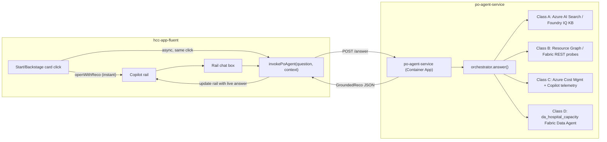

# Sprint 41 — Product Owner Agent End-to-End Grounding (Start + Backstage) — Design

> Produced via the Superpowers `brainstorming` skill. The user asked to auto-approve
> brainstorming questions and address the full end-to-end scope, and is reviewing
> this spec asynchronously (not interactively) — assumptions are called out
> explicitly in `9. Assumptions and open items` rather than left as open questions.

## 1. Context / problem statement

Clicking a Start or Backstage narrative card opens the Copilot rail and shows
context text immediately. That text is **not a real answer** — it is a
hand-authored string baked into the frontend at build time. No retrieval, no
LLM call, no citation checking happens when a card is clicked. Typing a
follow-up in the rail's chat box *can* call a live agent, but only for the six
capacity copilots (`bmca`/`ooa`/`dca`/`orsa`/`sba`/`csa`) — never for the
`product-owner-agent` that `agent-context-map.ts` assigns to every `/start` and
`/backstage` route.

### 1.1 Current-state audit (what's real vs. stubbed)

| Layer | Status | Evidence |
| ----- | ------ | -------- |
| Context-click reco (Start/Backstage) | **100% static.** `reco()` / `startReco()` build a hardcoded `GroundedReco` (`provenance: 'simulated'`) and call `rail.openWithReco(...)` only. No network call. | [`BackstageNarrativeSections.tsx`](../../../apps/hcc-app-fluent/src/workspaces/backstage/tabs/story/narrative/BackstageNarrativeSections.tsx), [`start-rail.ts`](../../../apps/hcc-app-fluent/src/workspaces/start/frontier/start-rail.ts) |
| Chat-box send (typed follow-up) | **Wired, but has no PO route.** `useConversation` → `invokeAgent(agent, prompt)` → `iqAgentChat` against one shared `AGENT_HOST_URL`. `agent-host` only dispatches `bmca/ooa/dca/orsa/sba/csa` (+ `data-quality`, `onboarding`) via Foundry Agent Service. | [`agent-manifest.ts`](../../../apps/hcc-app-fluent/src/copilot-drawer/agent-manifest.ts), [`apps/hcc-agent-host/src/orchestrator/dispatch.py`](../../../apps/hcc-agent-host/src/orchestrator/dispatch.py) (no `product-owner-agent` case) |
| PO orchestrator (route→ground→synthesise→cite) | **Real, unit/eval-tested — but not a service.** `orchestrator.py`/`authz.py`/`audit.py` implement the full grounded-answer contract (citation gate, partner-tier authz, DE/EN, audit log). No HTTP entrypoint exists in the module (no `app.py`/FastAPI/Flask). | [`data-platform/scripts/po-agent/runtime/`](../../../data-platform/scripts/po-agent/runtime/) |
| Class A (governed corpus) | **Real logic, unconfirmed production cadence.** `chunk_tag.py`/`phi_gate.py`/`publish.py`/`snapshot.py` convert tagged docs → `GroundedChunk`, PHI-gated, "interviews first." `publish.py`'s own docstring says "in production the result is POSTed to the Foundry IQ knowledge source" — infra module `po-agent-corpus-landing-${env}` is deployed (`infra/main.bicep:598`), but whether it runs on a real schedule against a real Azure AI Search index in SIT/PROD is unconfirmed (WS-0 audit item). | [`data-platform/scripts/po-agent/corpus/`](../../../data-platform/scripts/po-agent/corpus/) |
| Class B (live-proof probes) | **Real probe logic, injected clients only.** Resource-Graph/Fabric-REST/Foundry-list probes exist; tests inject fakes; no confirmed production client wiring (subscription creds, MI). | [`data-platform/scripts/po-agent/liveproof/probes.py`](../../../data-platform/scripts/po-agent/liveproof/probes.py) |
| Class C (BVA/cost) | **Real logic, closest to production data.** `azure_cost.py`/`copilot_cost.py`/`reconcile_bva.py` reconcile against `docs/BVA.md` — the SAME measured-cost model this session already re-grounded the app's BVA figures on. | [`data-platform/scripts/po-agent/cost/`](../../../data-platform/scripts/po-agent/cost/) |
| Class D (ontology via Fabric Data Agent) | **Closest to already-working.** Wraps `da_hospital_capacity` (`b2e53c23-…`), the SAME Fabric Data Agent already live for `ooa-agent` per ADR-0034 evidence. `agent-host`'s own `dispatch.py` already calls `self.data_agent.ask(user_prompt)` for that agent — a directly reusable pattern. | [`data-platform/scripts/po-agent/ontology/data_agent.py`](../../../data-platform/scripts/po-agent/ontology/data_agent.py), [`docs/architecture/fabric-iq-ready-evidence.md`](../../architecture/fabric-iq-ready-evidence.md) |
| Infra (runtime container) | **Placeholder image.** `enablePoAgentRuntimeModule = true`, but `poAgentContainerImage = 'mcr.microsoft.com/dotnet/samples:aspnetapp'` — literally the ASP.NET sample app. Comment confirms: "placeholder until the PO Agent CI workflow publishes a real one." | [`infra/environments/sit.bicepparam:159-160`](../../../infra/environments/sit.bicepparam) |
| Eval harness | **Synthesis-only, not end-to-end.** `evals/product-owner-agent/run_evals.py` + `golden_questions.yaml` feed **synthetic pre-supplied chunks** straight to `orchestrator.answer()` and gate on citation coverage ≥95% + zero-hallucination (CFO/CISO/CLO) + refusal correctness. It never exercises real retrieval. | [`evals/product-owner-agent/`](../../../evals/product-owner-agent/) |
| Continuous-eval precedent | **Reusable pattern exists for other agents.** Sprint 30 built `evals/online_eval_job.py` + `evals/lib/{harness,evaluators,online}.py` as a continuous-evaluation pipeline for the capacity copilots' decision-sim outcomes. Not yet extended to PO agent's Q&A grounding. | [`evals/lib/`](../../../evals/lib/) |

**Bottom line:** this was a deliberately scoped gap, not an oversight — Sprint
28's WS-RT plan explicitly limited itself to "orchestrator + eval harness" and
left live wiring, containerization, and frontend routing for later. This
sprint is that "later."

## 2. Goals

1. A user who clicks a Start/Backstage card, or types a follow-up in the rail,
   gets an answer **actually retrieved** from real Class A–D sources — not
   canned copy — with real citations, in DE or EN.
2. Every answer is proven **automatically and systematically** — not just
   "it looked right in a demo" — via an extended eval harness that exercises
   real retrieval, plus Foundry-native evaluation tooling for regression
   tracking.
3. Every gap found in the audit table above is either closed or explicitly
   ticketed with an owner and a "why not now" in this sprint's close-out.

## 3. Non-goals

- Re-architecting the six capacity copilots (`bmca`/`ooa`/`dca`/`orsa`/`sba`/`csa`)
  or their existing `agent-host` Foundry Agent Service wiring — that path
  already works and is out of scope.
- Building new Class A/B/C/D *business logic* beyond what already exists in
  `data-platform/scripts/po-agent/**` — this sprint wires and proves what's
  there, and only extends it where the WS-0 audit finds a genuine gap.
- Any write/mutate capability for the PO agent — it stays advisory-only,
  `write` ceiling (drafts + PR creation), never `deploy`/`delete`, per
  `agents/product-owner-agent/AGENT.md` and `AGENTS.md` §5.

## 4. Architecture decision

### 4.1 Options considered

| # | Option | Verdict |
| - | ------ | ------- |
| 1 | Fold PO agent into the existing `agent-host` dispatcher as a 9th case | **Rejected.** `agent-host`'s dispatch model is "one Foundry Agent Service assistant per role." PO's multi-class routing + authz + audit + citation-gate logic doesn't fit that shape without blurring `agent-host`'s single responsibility, and would contradict ADR-0043's explicit decision that the PO Agent sits on its **own** Foundry IQ Knowledge-Layer domain (meant to later serve other roles too, e.g. Compliance/Data/Operations). |
| 2 | Stand up the PO agent as its **own** lightweight HTTP service wrapping the existing `orchestrator.answer()`, deployed onto the already-provisioned (but placeholder-imaged) `poAgentContainerImage` runtime module | **Recommended.** Reuses the infra that's already deployed (search/KB/corpus-landing/runtime modules all exist per `sit.bicepparam`), reuses 100% of the already-built + eval-tested orchestrator logic, and matches ADR-0043's intended shape. Needs: a thin API wrapper, real Class A–D client wiring, a CI image-publish pipeline, and one small frontend routing change. |
| 3 | Register PO directly as a Foundry Agent Service assistant and reimplement citation/authz/refusal logic as agent instructions/tools | **Rejected.** Throws away the already-built, already-eval-tested Python orchestrator and its explicit zero-hallucination/partner-tier gates; reimplementing that fidelity as prompt instructions is strictly worse and unverifiable the same way. |

**Decision: Option 2.**

### 4.2 Target shape

### 4.3 UX flow decision — progressive enhancement, not replacement

The Main-board pattern (`InsightRouter.routeInsight`) already does this: call
`openWithReco` for an **instant** local reco, then separately call
`invokeInsight(agent, context)` for the live agent turn. Start/Backstage
should follow the **same** pattern rather than inventing a new one:

1. Click → `rail.openWithReco(insight, staticReco)` fires immediately (no
   latency regression; the rail opens and shows something right away).
2. In the same handler, fire `invokePoAgent(question, context)` against the
   new service.
3. When the real answer resolves, update the rail's active reco in place
   (new `rail.updateActiveReco(reco)` method) so citations/read text become
   the **real**, grounded ones — with a small "grounded live" vs. "based on
   product docs" provenance badge already supported by `GroundedReco.provenance`.
4. On failure/timeout, the static reco remains visible with its existing
   `provenance: 'simulated'` badge — fail loud in logs, never silently wrong
   in the UI (same doctrine as `iq-client.ts`'s `degraded` flag).
5. The chat box's `send()` always calls the real service for
   `product-owner-agent` (no more silent mock reply once the service exists).

## 5. Workstreams

| WS | Name | Branch | Depends on |
| -- | ---- | ------ | ----------- |
| WS-0 | Audit + contracts freeze | `sprint-41/ws-0-audit` | none — runs first |
| WS-SVC | PO agent HTTP service | `sprint-41/ws-svc-service` | WS-0 |
| WS-RET | Real Class A–D client wiring | `sprint-41/ws-ret-clients` | WS-0 |
| WS-INF | Containerize + deploy (SIT) | `sprint-41/ws-inf-deploy` | WS-SVC, WS-RET |
| WS-FE | Frontend routing (click + chat) | `sprint-41/ws-fe-routing` | WS-INF (for live verification; can code against a local stub in parallel) |
| WS-EVAL | Live/systematic eval extension | `sprint-41/ws-eval-live` | WS-INF |

### WS-0 — Audit + contracts freeze

Answers the "what's real vs. stub" open items in §1.1 with certainty before
anyone writes wiring code against a wrong assumption:

- Confirm whether `po-agent-corpus-landing` Container App Job has ever run
  against a real Azure AI Search index in SIT (check job run history /
  Log Analytics), or whether Class A retrieval needs a first real ingest run.
- Confirm what MI/role assignments `poAgentContainerImage`'s Container App
  already has (Cost Management Reader, Resource Graph Reader, Fabric read,
  Search query key or MI-based access) — these were provisioned by the
  search/KB/corpus modules per `sit.bicepparam`; confirm they're sufficient
  or file the gap.
- Freeze the HTTP contract (`POST /answer {question, caller, language}` →
  `GroundedReco`) reusing the existing `GroundedChunk`/`GroundedReco` shapes —
  no new wire format invented.

### WS-SVC — PO agent HTTP service

- Add a thin API entrypoint (FastAPI, matching the Python-first shape of the
  rest of `po-agent/**`) at `data-platform/scripts/po-agent/runtime/app.py`
  exposing `POST /answer` and `GET /healthz`, calling the existing
  `orchestrator.answer()` unchanged.
- Map `orchestrator`'s output (chunks + synthesised text + refusal state)
  into the frontend's frozen `GroundedReco` shape (`contextChip`, `read`,
  `citations`, `provenance: 'live'`, `refused`).
- Unit tests for the new mapping layer only — `orchestrator.py` itself is
  already tested and must not be touched beyond what WS-RET requires.

### WS-RET — Real Class A–D client wiring

- Class A: wire `publish.py`'s "POST to Foundry IQ knowledge source" against
  the real Azure AI Search index (or confirm/point at the one WS-0 finds).
- Class B: implement the real (non-fake) Resource Graph / Fabric REST /
  Foundry Agent list clients behind `probes.py`'s injected `clients=` seam —
  read-only, Workload Identity Federation, matching `docs/SECURITY.md`.
- Class C: wire `azure_cost.py`/`copilot_cost.py` to the real Cost Management
  and Copilot telemetry sources already proven this session for `docs/BVA.md`
  v2.0.0 (same data, same trust boundary).
- Class D: wire `data_agent.py`'s injected client to the same
  `da_hospital_capacity` Fabric Data Agent connection `agent-host`'s
  `dispatch.py` already uses for `ooa-agent` — reuse that connection code,
  don't reinvent it.
- Every class keeps its existing "degrade to transparent partial, never
  silent fabrication" contract; this workstream wires real data sources
  behind the existing seams, it does not change the seams.

### WS-INF — Containerize + deploy (SIT)

- New `po-agent-runtime-build.yml` workflow (mirrors `agent-host-build.yml`)
  building/pushing a real image to ACR.
- Bump `infra/environments/sit.bicepparam`'s `poAgentContainerImage` off the
  placeholder, following the same `approved-to-apply` gate every other
  infra bump in this repo uses (AGENTS.md §4) — plan-first, human approval
  comment, then apply.
- Wire diagnostics → Log Analytics (currently `poAgentLogAnalyticsWorkspaceId = ''`).

### WS-FE — Frontend routing (click + chat)

- Add `PO_AGENT_URL` to `RuntimeEnv` (`runtime-config.ts`) + container
  entrypoint injection, mirroring the existing `AGENT_HOST_URL` pattern.
- `agent-manifest.ts`: `invokeAgent('product-owner-agent', …)` routes to the
  new URL instead of the shared agent-host, falling back to the existing
  deterministic mock when unconfigured (dev/CI) — unchanged fallback
  doctrine, new live branch only.
- `rail-context.tsx`: add `updateActiveReco(reco)` for the progressive-
  enhancement flow in §4.3.
- `BackstageNarrativeSections.tsx` / `start-rail.ts`: after
  `rail.openWithReco(insight, staticReco)`, fire `invokePoAgent(...)` and
  call `updateActiveReco` on resolution — mirrors `InsightRouter.routeInsight`
  exactly.
- `AgentPlane.tsx`'s existing `send()`/`useConversation` path needs no
  structural change — it already calls `invokeAgent`, which now has
  somewhere real to go for `product-owner-agent`.

### WS-EVAL — Live/systematic eval extension

- Extend `evals/product-owner-agent/run_evals.py` with a `--live` mode that
  calls the real `WS-SVC` service instead of feeding synthetic chunks,
  reusing the same `golden_questions.yaml` corpus and the same citation-
  coverage / zero-hallucination / refusal-correctness gates — same bar,
  real backend.
- Add a CI job (`po-agent-live-eval.yml`, manually triggered / scheduled,
  never a push-time gate since it needs live Azure/Fabric creds) that runs
  `--live` against SIT and posts a summary.
- Register the golden-question set with the Foundry evaluation tooling
  (`mcp_azure_mcp_ser_foundry` / the Microsoft Foundry evaluation MCP —
  `evaluation_dataset_create` → `evaluation_suite_create` → `evaluation_suite_run`)
  so regressions are tracked over time the same way Sprint 30's continuous-
  eval pipeline (`evals/lib/online.py`) tracks the capacity copilots —
  extend that pattern rather than building a parallel one.
- Add a relevancy/groundedness check per answer (does the retrieved chunk
  set actually answer the question, not just "is every claim cited") —
  this is the "correct answers" bar the user asked for, distinct from the
  existing citation-coverage gate which only checks *citation presence*,
  not *citation relevance*.

## 6. Verification gates (mandatory, all workstreams)

- `pytest data-platform/scripts/po-agent/ -v` and `pytest evals/ -v` green.
- `evals/product-owner-agent/run_evals.py --live` (once WS-INF ships) meets
  the same ≥95% citation-coverage / zero-hallucination / refusal-correctness
  bar as the existing synthetic-mode run, **plus** the new relevancy check.
- `tsc --noEmit`, `vitest` (rail/agent-manifest/BackstageNarrativeSections/
  start-rail suites), mojibake 0, axe wcag2aa 0 on `/start` + `/backstage`.
- `az deployment group what-if` clean on the `sit.bicepparam` image bump,
  `approved-to-apply` comment before any real apply (AGENTS.md §4).
- Manual smoke: click a Start card and a Backstage card in SIT, confirm the
  reco updates from `simulated` to `live` provenance with real citations
  within a few seconds; type an off-script follow-up question and confirm a
  real, cited answer (or a transparent partial) comes back.

## 7. Risks / open items / assumptions made explicit

- **Assumption:** Class A's corpus-landing job has deployed infra but an
  unconfirmed real run history — WS-0 must confirm before WS-RET starts on
  Class A specifically; if the index is empty, WS-RET's first task is a
  one-time real ingest, not just "point at the existing index."
- **Assumption:** `da_hospital_capacity` Fabric Data Agent connection details
  used by `agent-host` for `ooa-agent` are reusable read-only for PO's Class D
  — needs a quick confirm that the same data agent permits a second caller
  identity without a quota/throttle surprise.
- **Risk:** Azure AI Search / Foundry IQ agentic-retrieval features are
  **Preview** in the target region (ADR-0043 §Decision) — this sprint proves
  the wiring works, not that it's GA-supportable; PROD promotion needs its
  own `approved-to-apply` gate and stays out of this sprint's scope unless
  explicitly asked.
- **Sprint numbering:** named "Sprint 41" as the next sequential number after
  the in-flight Sprint 40 (`start-frontier-fidelity`, branch-only, unrelated
  topic). Renumber if this collides with other in-flight sprint numbering.
- **Not resolved by this spec, left to WS-0:** exact SLA/latency budget for
  the "live" call in the progressive-enhancement flow (§4.3) — if Class A/B/C/D
  retrieval is slow, the UX may need a visible loading affordance rather than
  a silent swap; WS-0's audit should produce a real latency number before
  WS-FE commits to a specific loading treatment.

## 8. Traceability

- `docs/PRD.md` `FR-POA-*` / `NFR-POA-*` families (already registered per
  Sprint 28) — this sprint advances them from "orchestrator proven on
  fixtures" to "orchestrator proven end-to-end on real data," it does not
  introduce new FR/NFR IDs.
- `AGENTS.md` `product-owner-agent` row — side-effect ceiling stays `write`
  (advisory + drafts only); no change to its MCP allow-list entries.
- ADR-0043 (Foundry IQ Knowledge-Layer domain #1) — this sprint is the
  concrete realisation of that ADR's decision, not a revision of it.
