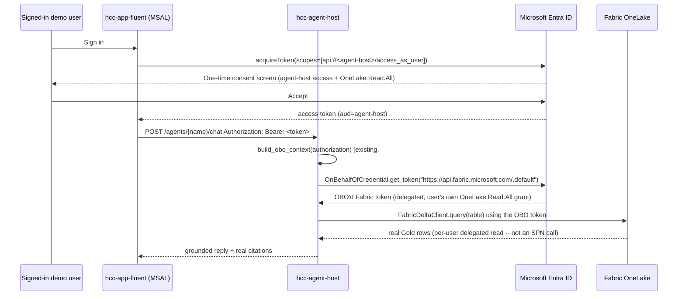

# Self-Service OBO for Real Fabric Grounding (No Fabric Admin Required) — Design

> Produced via the Superpowers `brainstorming` skill, following the WS-5 live
> verification (issue #567) that found WS-2's real Fabric grounding blocked on
> a tenant Developer setting no one in this tenant can currently toggle
> (confirmed: only a sealed break-glass account holds Global Administrator).
> User asked directly: "brainstorm how we can solve it without having Fabric
> Admin access... this is the main purpose of the showcase." User was
> unavailable for the normal one-question-at-a-time dialogue, so this design
> is built from direct, empirical investigation of this tenant's actual Entra
> policies (documented below) rather than assumption. **Not yet implemented —
> requires `approved-to-apply` before any Entra resource is created.**

## 1. Context

The Curavias showcase's entire premise is proving Microsoft's Fabric IQ +
Foundry IQ layer grounds real hospital-capacity questions in real Gold-table
data. WS-1 (real Foundry chat model) is proven live. WS-2 (real Fabric Gold
table reads via `FabricDeltaClient`, using the agent-host's managed identity)
is code-complete, deployed, and honestly degrading — but returns zero real
rows because OneLake's data-plane blocks **service principal** callers unless
a tenant-level Fabric Developer setting ("Service principals can call Fabric
public APIs") is enabled. This is off by default and requires a Fabric
Administrator, Power BI Administrator, or Global Administrator to change.

### 1.1 Why the "wait for an admin" path doesn't work here

Checked this tenant's actual admin capability directly (2026-08-09):

- The routine `admin@mngenvmcap164444...` account is **Global Reader only**
  (confirmed via Microsoft Graph: 403 on the Fabric admin tenant-settings API,
  403 on PIM eligibility).
- **No one holds Fabric Administrator or Power BI Administrator** in this
  tenant (`GET /directoryRoles` lists no activated instance of either role).
- The only **Global Administrator** is a sealed break-glass account
  (`ms-breakglass@...`), not meant for routine use.
- Also checked whether a *different* Fabric surface (the Lakehouse SQL
  Analytics Endpoint) might sidestep the restriction — confirmed via
  Microsoft Learn documentation that it requires the **identical** tenant
  setting ("Service principals can use Fabric APIs"). No SPN-based path
  around this restriction exists; it is a single, deliberate, tenant-wide gate
  covering every Fabric public-API surface for service-principal callers.

### 1.2 The path that *is* open: delegated (OBO) auth

Earlier this sprint (WS-2/WS-5 investigation), reading the exact same OneLake
Gold table with a **delegated user token** (not the managed identity)
succeeded — 173 real rows from `gold.bed_assignment`. The restriction is
specific to service-principal callers; delegated user auth is unaffected.

The codebase already has a fully-designed On-Behalf-Of (OBO) seam for exactly
this scenario — `#424 M5`, [ADR-0057](../../adr/0057-obo-seam-completion-defer-live-provisioning.md)
— built and unit-tested, but deliberately left **unprovisioned** because,
at the time (2026-07-28), standing it up looked like it required:

1. A new Entra app registration with delegated Fabric permissions (assumed to
   need admin consent).
2. Admin-consented delegated Fabric permissions.
3. Landing `#510` (dynamic-RLS TMDL) for the board-data RLS path.

**New finding (2026-08-09): (1) and (2) do not require a Fabric Administrator,
Power BI Administrator, or Global Administrator in this tenant.** Verified
directly via Microsoft Graph:

| Check | Result | Meaning |
| ----- | ------ | ------- |
| `GET /policies/authorizationPolicy` → `defaultUserRolePermissions.allowedToCreateApps` | `true` | Any signed-in user can register a new Entra application — no admin role needed. |
| `permissionGrantPoliciesAssigned` | includes `microsoft-user-default-allow-consent-apps` | Tenant-wide user self-consent is **enabled** (not locked to admin-only). |
| `GET /servicePrincipals?$filter=displayName eq 'Power BI Service'` → `oauth2PermissionScopes` | `OneLake.Read.All`, `Item.Read.All`, `DataAgent.Execute.All`, `Workspace.Read.All`, etc. are all `type: "User"` | These are self-consentable delegated permissions by Microsoft's own classification — only `Tenant.Read.All`/`Tenant.ReadWrite.All` (tenant-wide admin scanning APIs, which we don't need) are `type: "Admin"`. |

Combining these: a **regular signed-in user** (any Curavias demo user, no
special role) can, the first time they sign in after this is wired up, see a
single standard consent screen ("This app would like to: access agent-host on
your behalf; read all content in Microsoft Fabric on your behalf") and click
**Accept** — no Fabric Administrator, Power BI Administrator, or Global
Administrator involved at any point. This is Microsoft's own documented
"static permissions, combined consent" pattern for OBO middle-tier APIs, not
a workaround — it is how OBO is designed to be provisioned by app owners in
tenants with default consent policy.

## 2. Goals

- Get **real, per-user-delegated Fabric Gold table reads** flowing into the
  chat-grounding path (the 5 agents currently reading `FabricAdapter`:
  bmca, dca, ooa, orsa, sba), proving the IQ-layer showcase's core claim end
  to end, without any Fabric/Power BI/Global Administrator action.
- Do this using only resources any signed-in user in this tenant can already
  create/consent (confirmed above) — self-service, reversible (the app
  registration can be deleted if this doesn't pan out).
- Reuse the OBO seam that already exists and is tested (`auth/obo_context.py`,
  `auth/token_validator.py`) — extend it to the one path it doesn't cover yet
  (chat grounding), don't rebuild it.

## 3. Non-goals

- Board-data RLS (`/golden/{resource}`, WS-3) — already re-scoped to its own
  follow-up per the WS-3 investigation; also needs `#510` (a deployed
  semantic-model change), which is out of scope here.
- `THREAD_PROVIDER=foundry` (per-user Foundry threads, `#424 M3`'s OBO flip) —
  not needed for grounding; left native.
- Changing the tenant's "service principals can call Fabric public APIs"
  setting — explicitly the thing we are avoiding depending on.

## 4. Approaches considered

### Approach A (recommended) — Wire OBO into the chat-grounding path

Register a confidential-client app for `hcc-agent-host`, expose an
`access_as_user` scope, add `OneLake.Read.All` as a required delegated
permission (Power BI Service resource, `type: User`). The SPA
(`ihzhhpf-app`) requests that scope at sign-in; the combined consent screen
covers both hops. The agent-host exchanges the forwarded bearer token via the
already-built `acquire_obo_token()` for a Fabric-scoped token, and a
**per-request** `FabricDeltaClient` (built with that token instead of the
managed identity) answers the grounding query — mirroring the existing
`rls_provider_for(obo_token)` pattern already used for board-data RLS.

**Trade-offs:** touches auth architecture (new app registration + a client
secret in Key Vault — a normal, self-created secret, not a tenant-wide grant);
every demo user does one one-time consent click; needs a Redis grounding-cache
key fix (see §6) to avoid leaking one user's grounded rows into another's
reply. All of this is code + config within this agent's normal scope, fully
reversible, and matches the exact "Path A" ADR-0057 already anticipated as
the eventual follow-up — this design supplies the missing piece: proof it
doesn't need a tenant admin.

### Approach B — Pre-fetch with one delegated identity, cache server-side

Use one person's delegated token (refreshed via a stored refresh token or
periodic re-auth) to pre-fetch Gold table snapshots into a shared cache/blob
that the agent-host reads without per-request OBO.

**Rejected:** reintroduces a long-lived-credential problem this platform's
security posture explicitly avoids (`copilot-instructions.md` §4: "no
long-lived client secrets... never for the platform itself" — a stored
refresh token is exactly that). It is also not genuinely per-user
(everyone sees one shared identity's RLS view), which undercuts the honesty
contract this whole epic (WS-1–WS-5) has been built around. Less credible as
a showcase of the *user-delegated* IQ pattern specifically.

### Approach C — Keep waiting for a tenant admin (Path 1 from WS-5)

Escalate through whatever channel provisioned this MCAP sandbox tenant to get
the Developer setting flipped or a real Fabric Admin role granted.

**Rejected as the primary path** (kept as a fallback, not deleted): explicitly
the dependency this brainstorm was asked to route around; no committed
timeline; blocks the showcase indefinitely on something outside our control.

## 5. Architecture (Approach A)

### 5.1 New pieces (not yet built)

| Piece | File(s) | Change |
| ----- | ------- | ------ |
| Per-request Fabric client from an OBO token | `apps/hcc-agent-host/src/tools/fabric_delta_client.py` | Add a factory that builds a `FabricDeltaClient` with a fixed `token_provider` returning the OBO token, instead of `DefaultAzureCredential`. |
| Orchestrator accepts a per-request grounding override | `apps/hcc-agent-host/src/orchestrator/dispatch.py` | `Orchestrator.dispatch(...)` gains an optional `fabric_override` param (a `FabricAdapter`, or `None`); `_grounding()` uses it when present, else `self.fabric` (mirrors `rls_provider_for`). |
| Chat endpoint builds the OBO context and passes it through | `apps/hcc-agent-host/src/api/app.py` | `/agents/{name}/chat` reads `authorization` header (already a `Header` param elsewhere in this file), calls `build_obo_context`, and — when present — builds a per-request `FabricAdapter`/`FabricDeltaClient` and passes it to `orchestrator.dispatch(..., fabric_override=...)`. |
| Grounding cache keyed per-user | `apps/hcc-agent-host/src/cache/redis_client.py` | `cache_grounding`/`get_grounding` key becomes `f"{user_oid}:{table}"` when an OBO context is present (falls back to today's `table`-only key when OBO is off, byte-parity preserved). **Without this, one user's grounded rows could leak into another user's reply once grounding is per-user** — found during this brainstorm, not yet a live bug (grounding is currently uniform/simulated), but would become one the moment OBO is enabled. |
| Frontend forwards the token | `apps/hcc-app-fluent/src/copilot-drawer/agent-manifest.ts` (or wherever `invokeAgent`/`fetch` builds the chat request) | Attach `Authorization: Bearer <token>` when `VITE_AGENT_HOST_SCOPE` is configured (ADR-0057 already anticipated this exact env var name). |
| MSAL requests the new scope | `apps/hcc-app-fluent/src/auth/msal-provider.ts` / `auth-session.tsx` | Add `VITE_AGENT_HOST_SCOPE` to the acquired-token scopes list, config-gated (absent = unchanged OIDC-only behavior). |

### 5.2 New Entra resources (self-service, no admin — the core finding)

1. App registration `hcc-agent-host` (confidential client), created by any
   signed-in user (`allowedToCreateApps: true`).
2. "Expose an API" → scope `access_as_user` on that app.
3. "API permissions" → add **delegated** `OneLake.Read.All` (resource: Power
   BI Service, `9d64a6a4-...` — the same first-party resource used above).
   `type: User` → no admin consent grant needed; the combined consent screen
   at first sign-in satisfies it.
4. A client secret (or certificate) on the new app registration, stored in
   the existing Key Vault used by `infra/` — a normal app secret the
   registration's own creator can generate, not a tenant-wide grant.
5. SPA (`ihzhhpf-app`) — add `api://<agent-host-app-id>/access_as_user` to
   its "API permissions" so MSAL can request it.

### 5.3 Config (Bicep — already has the placeholders from ADR-0057)

`agentHostOboEnabled = true`, plus new params for `OBO_TENANT_ID`,
`OBO_CLIENT_ID`, `OBO_CLIENT_SECRET` (Key Vault reference),
`OBO_JWKS_URL`/`OBO_AUDIENCE`/`OBO_ISSUER` (already read by
`auth/obo_context.py`, just never populated), and `VITE_AGENT_HOST_SCOPE` on
the SPA's Container App.

## 6. Risks / open items

- **Grounding cache leakage across users** (§5.1) — must ship the per-user
  cache-key fix in the same PR that enables OBO for grounding, not after.
- **Combined-consent UX** — the first sign-in after this ships will show a
  new consent screen every demo user must accept once. Should be called out
  in demo-run notes so it isn't mistaken for an error.
- **Client secret rotation** — a normal Key Vault secret; add to whatever
  rotation cadence other agent-host secrets already follow (check
  `docs/SECURITY.md` for the existing pattern before implementing).
- **Consent policy could change** — this design depends on this tenant's
  *current* `microsoft-user-default-allow-consent-apps` policy staying
  enabled. If a future tenant hardening effort disables user consent, this
  path would need re-evaluation (falls back to needing an admin at that
  point, same as today).
- **Still governed by AGENTS.md's IAM-grant rule** — creating the app
  registration + delegated permission is a new IAM surface. Per this repo's
  own governance (`AGENTS.md` §4, "Any new IAM grant... requires its own
  `approved-to-apply` comment"), this design does not create any Entra
  resource until that comment is given, even though no Fabric Admin is
  required technically.

## 7. Sequencing

1. Backend: per-request Fabric client + Orchestrator override + cache-key fix
   (testable entirely with dependency-injected fakes, no live Entra needed —
   same discipline as the existing OBO unit tests).
2. Entra: create the app registration, expose the scope, add the delegated
   permission (self-service, `approved-to-apply` gate per §6).
3. Bicep: wire the new env vars + Key Vault secret reference; flip
   `agentHostOboEnabled = true` in `sit.bicepparam`.
4. Frontend: request the new scope, forward the bearer token (config-gated
   by `VITE_AGENT_HOST_SCOPE`, so absent = unchanged today's behavior).
5. Live verification: sign in as a fresh demo user, confirm the one-time
   consent screen, ask a grounded question, confirm real citations (extends
   `tests/e2e-live/all-boards-iq.spec.ts` with an OBO-aware assertion).
6. Update the Sprint 43 design doc + issue #567 with the live evidence.

## 8. Traceability

Realises the deferred "Path A" follow-up explicitly named in
[ADR-0057](../../adr/0057-obo-seam-completion-defer-live-provisioning.md)'s
own Consequences section, scoped down to the chat-grounding path only (board
data / `#510` remains a separate follow-up). Related: issue #567 (Sprint 43
WS-2/WS-5), `#424` M5.
