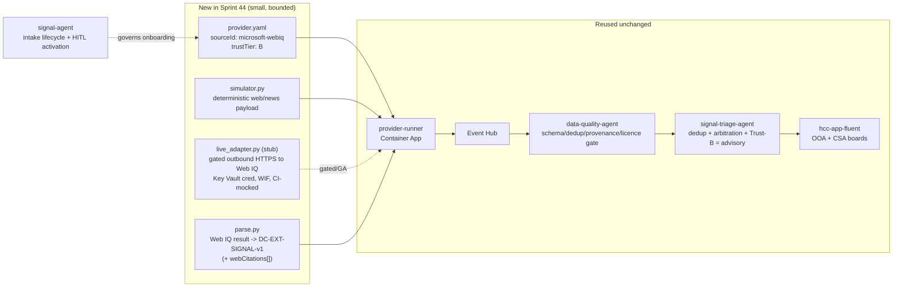

# Sprint 44 — Microsoft Web IQ as a Governed External Signal Channel — Design

| Field | Value |
|-------|-------|
| **Version** | 1.1.0 |
| **Date** | 2026-08-12 |
| **Author** | GitHub Copilot (Superpowers brainstorming; user delegated design authority — async review) |
| **Status** | Approved (implemented) |
| **Previous Version** | 1.0.0 (initial design); this bump resolves §13 Q1 (hazardTypes scoped to hospital-service-relevant set) + Q2 (corroboration kept) and records that the sprint was implemented |

> Produced with the Superpowers `brainstorming` skill. The user was unavailable
> for live clarifying questions and delegated: *"work autonomously and make good
> decisions."* Every design decision below is therefore made autonomously but
> anchored to an existing ADR/contract; the spec is committed for the user's
> asynchronous review before any implementation (the brainstorming HARD GATE —
> no code is written until this design is approved).

---

## 1. Problem & goal

Curavias ingests **external signals** today from four Trust-A Swiss public
authority hazard feeds (MeteoSwiss, SED-ETH, BAG/FOPH, Alertswiss/BABS),
normalised to the `DC-EXT-SIGNAL-v1` contract and surfaced on the Occupancy
(OOA) and Crisis (CSA) boards. Every existing source is an authoritative Swiss
government feed.

**Goal:** integrate **[Microsoft Web IQ](https://webiq.microsoft.ai/)** — a
Microsoft AI-native web-grounding API suite (fresh web pages, news, images,
video) — as **one additional signal channel** that:

1. ingests relevant, hospital-capacity-material web/news signals,
2. uses that data to inform recommendations (advisory, human-gated), and
3. shows the signal on the Curavias app signal screen as one more channel.

Web IQ is fundamentally different from the existing feeds: it is a **commercial,
non-authority, web-grounding service in limited/preview access**, returning
free-form web content rather than a structured CAP-Suisse hazard envelope. That
difference drives every decision below.

## 2. Decisions (made autonomously; each anchored to an existing ADR/contract)

| # | Decision | Anchor / reason |
|---|----------|-----------------|
| D1 | **Use case: a standalone web/news early-warning channel.** Web IQ scans for hospital-material emerging events (outbreaks, mass-casualty, public-health advisories) *before* they appear in official Swiss feeds, surfaced as an advisory "watch" signal. | Best matches the user's literal ask ("one additional signal channel"); follows the provider-plugin pattern 1:1; YAGNI (rejected a broader "channel + enrichment" scope). |
| D2 | **Trust tier B.** Web IQ signals are advisory, human-curated, and **never** auto-evaluate trigger rules, auto-arm a lever, or auto-trigger a CSA handoff. | Forced by [ADR-0036](../../adr/0036-external-trigger-governance.md): only Trust-A auto-evaluates; Trust-B/C are human-curated only. |
| D3 | **Simulator-first with a live-adapter stub.** `defaultMode: simulated`, `fallbackMode: simulated`; the live Web IQ binding is credential- + GA-gated and **always mocked in CI**. | Web IQ is limited-access/preview (no live entitlement assumed); demo scope is synthetic and PHI-free ([ADR-0016](../../adr/0016-no-phi-in-mvp-demo-scope.md)); mirrors every existing provider and `NFR-EXT-PLG-001`. |
| D4 | **Reuse the whole existing pipeline; add no new agent and no MCP-allow-list entry.** A new provider plugin flows through `provider-runner` → Event Hub → `data-quality-agent` gate → `signal-triage-agent` triage → app. Onboarding is governed by `signal-agent`'s lifecycle. | Follows existing patterns; Web IQ's live binding is just another gated outbound HTTPS endpoint from `provider-runner`, not an MCP server. |
| D5 | **Recommendation use = advisory only:** (a) a **watch card** with grounded web citations; (b) a **HITL "promote-to-watch"** action that routes an advisory entry into the CSA scenario queue; (c) a **display-only corroboration badge** when a Web IQ signal's hazardType+region overlaps an *active Trust-A* signal (raises displayed awareness; does **not** change the gated lever or the forecast overlay). | ADR-0036 advisory-only + HITL preservation; the forecast-uplift overlay (`FR-EXT-010..014`) stays Trust-A-only. |
| D6 | **App surface:** extend the existing shared `BoardSignal` model + the `ExternalSignal` union (add source `Microsoft Web IQ`, `trustClass: 'Trust-B'`, reuse the existing `filtered` flag = "renders but does not arm a lever"), plus a **web-evidence citation affordance**. Shown on the OOA Signals panel and the CSA crisis board. | Follows the locked Sprint 20/27 visual pattern; `ExternalSignal.filtered` already means exactly this. |
| D7 | **New [ADR-0060](../../adr/0060-webiq-external-signal-channel.md).** Records introducing a **non-authority, preview-gated, commercial web-grounding source class** and the **narrow, sandboxed lift** of the `signal-agent` "live web-search discovery deferred" boundary ([ADR-0054](../../adr/0054-signal-channel-lifecycle.md)) — permitted only under Trust-B + sandbox scorecard + HITL activation + advisory-only constraints. | New architecturally-significant decision; a new *class* of source and a GA/credential gate (parallel to [ADR-0014](../../adr/0014-fabric-iq-ontology-target-backbone-ga-gated.md)). |

## 3. Architecture — reuse, don't reinvent



**New code** is confined to one provider directory
(`data-platform/scripts/external-signals/providers/microsoft_webiq/`) plus the
app-model extension. **Everything downstream is reused unchanged** — that is the
whole point of the plugin architecture (`FR-EXT-015`).

## 4. Components

### 4.1 New — provider plugin `microsoft_webiq/`

- **`provider.yaml`** — manifest, schema-validated by `_schema/provider.schema.json` (fail-closed, `NFR-EXT-PLG-002`):

  ```yaml
  sourceId: microsoft-webiq
  authority: Microsoft Web IQ
  trustTier: B
  channelKind: external
  hazardTypes: [epidemic, outbreak, public-health, mass-casualty, heat, flood]
  defaultMode: simulated
  fallbackMode: simulated
  cadenceSeconds: 900
  endpoint: https://api.webiq.microsoft.ai   # live binding, GA/credential-gated
  licence: microsoft-web-iq-preview-terms
  providerVersion: microsoft-webiq-1.0.0
  scenarioMap:
    epidemic: {template: F5, lageTier: 2}
    outbreak: {template: F5, lageTier: 2}
    mass-casualty: {template: F3, lageTier: 3}
  ```

- **`simulator.py`** — deterministic synthetic Web IQ response (a small set of hospital-material "news" items with titles, snippets, URIs, publishedAt), seeded, for CI + demo. No network.
- **`parse.py`** — maps a Web IQ result set to `DC-EXT-SIGNAL-v1` records via `normalize.build_record(...)`, `trust_tier="B"`, `status="Actual"` only when a curated confidence threshold is met (else quarantined per ADR-0036), packing the web passages into the new optional `webCitations[]` field (§5). Every record is treated as **untrusted candidate input** (`NFR-SIG-001`, `signal-agent` REFUSE: untrusted-discovery).
- **`live_adapter.py` (stub)** — the real outbound Web IQ call, disabled unless `WEBIQ_LIVE_ENABLED=true` **and** a Key Vault-backed credential resolves; always mocked in CI (`NFR-EXT-PLG-001`). Ships as a stub with a clear "GA/credential-gated" guard so no real call is possible in demo scope.

### 4.2 Extended — data contract `DC-EXT-SIGNAL-v1` → **v1.1.0** (additive, backward-compatible)

Add one **optional** field to the record for grounded web evidence:

```jsonc
"webCitations": [            // optional; present only for web-grounding sources
  {"title": "string", "uri": "string", "publishedAt": "ISO-8601", "snippet": "string"}
]
```

MINOR bump (additive/optional — no existing consumer breaks; Trust-A records
simply omit it). Schema file `data/synthetic/schema/dc-ext-signal-v1.schema.json`
and `docs/DATA.md` updated together.

### 4.3 Extended — app model (`hcc-app-fluent`)

- `ExternalSignal.source` union += `'Microsoft Web IQ'`; `trustClass` union += `'Trust-B'`.
- Reuse `filtered?: true` (already defined: "renders but does NOT arm a lever").
- Add optional `webCitations?: {title; uri; publishedAt; snippet}[]` for the evidence affordance.
- A **Trust-B badge** visually distinct from the Trust-A badge (muted/secondary tone), and a **"promote to watch"** action on the card (HITL) that appends an advisory entry to the CSA scenario queue.
- New demo fixtures on the OOA `channels`/`boardSignals` and CSA `signals` payloads.

## 5. Data flow

1. `provider-runner` runs the `microsoft_webiq` plugin (simulator in CI/demo; gated live adapter otherwise) on its cadence.
2. Raw Web IQ result → `parse.py` → `DC-EXT-SIGNAL-v1` records (Trust-B, `webCitations[]`, provenance: licence + rawHash + connectorVersion + ingestedAt).
3. Published to Event Hub → `data-quality-agent` validates schema, dedup, provenance completeness, licence presence, `provider.yaml` schema-validity (existing Sprint 21 gate).
4. `signal-triage-agent` dedups + arbitrates. **Because trustTier=B, the trigger-rule gate returns `trust-tier-not-a` → the signal renders as advisory but arms no lever and fires no CSA handoff** (existing `trigger_rules.evaluate` behaviour — a guard test locks this).
5. App renders the Web IQ card on OOA + CSA with the Trust-B badge, web citations, and a HITL promote-to-watch action.
6. On human promote → an advisory entry enters the CSA scenario queue (still `approved-to-apply`-gated for any CSA Run).

## 6. Recommendation contribution ("use the data for recommendation")

Trust-B cannot drive the automated forecast overlay or arm a lever. Its value is
**decision-support**:

- **Earliest-warning watch card** with grounded, clickable web citations → situational awareness ahead of official feeds.
- **HITL promote-to-watch** → a human elevates a Web IQ signal into the CSA scenario queue as an advisory scenario candidate.
- **Corroboration badge (display-only)** → when a Web IQ signal's hazardType+region overlaps an *active Trust-A* signal, the Trust-A card shows a "corroborated by web signal" chip, increasing reviewer confidence **without** changing the gated recommendation or the forecast-uplift number.

## 7. Governance, security & compliance

- **ADR-0036 compliance:** Trust-B, advisory-only, HITL-preserving, quarantine of non-`Actual` records. Locked by a `signal-triage-agent` golden task (§10).
- **ADR-0016 (no PHI):** the **outbound Web IQ query must never contain PHI** — queries are constrained to hazard/public-health/capacity topics and canton/region terms; a query-builder guard rejects any PHI-shaped term. Returned web content is public, non-PHI, and treated as untrusted.
- **Prompt-injection / untrusted content (`NFR-SIG-001`):** web content is untrusted at every boundary; `parse.py` extracts only typed fields (title/uri/publishedAt/snippet/hazardType/region), never executes or forwards free text into a tool/query, and never treats a web result as authoritative (`signal-agent` REFUSE: untrusted-discovery).
- **Credentials:** live binding uses Workload Identity Federation + Key Vault reference (no inline secret), consistent with `provider-runner`; disabled by default.
- **signal-agent lifecycle (`FR-SIG-009`, ADR-0054):** onboarding runs discover → classify (Trust-B, non-PHI, external) → adapter (REST/web-grounding pattern) → contract (v1.1.0) → ontology-bind (`ExternalSignal`/`HazardType`) → **sandbox Channel Readiness Scorecard** → **HITL activation** (data-owner + compliance/DPO `approved-to-apply`) → monitor. No autonomous activation.
- **ADR-0060 (new):** governs the source-class introduction + the narrow, sandboxed lift of the ADR-0054 "web discovery deferred" boundary.

## 8. Error handling & degradation

- Live adapter unreachable / not entitled → automatic `fallbackMode: simulated` (existing `active_binding`/`fell_back_from` provenance fields record the fallback).
- Schema-invalid manifest → excluded from the runtime catalogue, fails CI (`NFR-EXT-PLG-002`, fail-closed).
- Web IQ returns a below-threshold / ambiguous result → record emitted as quarantined (`status != Actual`) → renders greyed, arms nothing.
- Contract-invalid record → quarantined by `data-quality-agent` (existing behaviour).

## 9. FR/NFR traceability

**Reused:** `FR-EXT-015` (manifest-driven plugin), `FR-EXT-017` (simulator binding), `FR-EXT-019` (live/simulated trust badge), `FR-EXT-020` (Container App host), `FR-EXT-GOV-001` (trust-tier + HITL policy), `NFR-EXT-PLG-001/002`, `NFR-EXT-GOV-001/002`, `FR-SIG-003/004/007/009/010/011`, `NFR-SIG-001`.

**New (added to `docs/PRD.md` §7 in the same PR):**

| ID | Requirement |
|----|-------------|
| `FR-EXT-021` | Ingest Microsoft Web IQ web/news grounding as a Trust-B external signal channel via a manifest-driven provider plugin emitting `DC-EXT-SIGNAL-v1`. |
| `FR-EXT-022` | Carry grounded web citations (`webCitations[]`) on Web IQ signals and surface them as clickable evidence on the OOA/CSA boards. |
| `FR-EXT-023` | Provide a HITL "promote-to-watch" action for Web IQ signals; Trust-B signals never auto-arm a lever, auto-trigger CSA, or enter the forecast overlay. |
| `NFR-EXT-WEBIQ-001` | Outbound Web IQ queries contain no PHI; returned content is untrusted and re-validated at every boundary (ADR-0016, `NFR-SIG-001`). |
| `NFR-EXT-WEBIQ-002` | The live Web IQ binding is GA- and credential-gated and always mocked in CI; demo/SIT run simulator-only. |

## 10. Testing strategy (TDD, fixture-first)

1. **Provider manifest** — schema-validation test: valid manifest passes, a deliberately-broken one fails-closed (`NFR-EXT-PLG-002`).
2. **`simulator.py`** — determinism test (same seed → same payload).
3. **`parse.py`** — unit tests: correct `DC-EXT-SIGNAL-v1` shape, `trustTier="B"`, `webCitations[]` populated, non-`Actual` quarantine path, PHI-in-query guard rejects PHI-shaped terms.
4. **Contract** — schema round-trip test for v1.1.0 incl. the optional `webCitations`; a Trust-A record without it still validates (backward-compat).
5. **Guard test (critical):** `trigger_rules.evaluate` on a Trust-B Web IQ event returns `trust-tier-not-a` (never fires); `forecast_uplift` applies **zero** uplift for Trust-B.
6. **`signal-triage-agent` golden task** — happy path (Web IQ signal → advisory watch, no lever, no CSA handoff) + failure mode (attempt to auto-arm a Trust-B signal is refused). `requirement: FR-EXT-023`.
7. **App** — fixture + render tests for the Web IQ card, Trust-B badge, `filtered` (no lever), web-citation affordance, and promote-to-watch action.
8. **CI** — no outbound network (`NFR-EXT-PLG-001`); live adapter fully mocked.

## 11. Milestones (end-to-end sprint)

- **M0 — Governance:** ADR-0060 + `DC-EXT-SIGNAL-v1` v1.1.0 (schema + `docs/DATA.md`) + new FR/NFR IDs in `docs/PRD.md` §7. *(no runtime code)*
- **M1 — Provider plugin:** `microsoft_webiq/` manifest + simulator + parse (TDD) + live-adapter stub. Green unit + manifest-schema tests.
- **M2 — Pipeline wiring:** register the plugin in the `provider-runner` catalogue; data-quality gate + triage guard tests green (Trust-B never fires).
- **M3 — App surface:** extend `ExternalSignal`/`BoardSignal`, add fixtures + Web IQ card + Trust-B badge + web-citation affordance + promote-to-watch; component tests green; local visual verify.
- **M4 — Recommendation glue:** corroboration badge (display-only) + promote-to-watch → CSA scenario-queue advisory entry; tests green.
- **M5 — signal-agent intake evidence:** channel-readiness scorecard run on the curated simulator feed; HITL-activation request artefact (advisory; no live activation in demo).
- **M6 — Verify + document:** full test suite green, markdownlint + link-check, PRD traceability consistent, sprint doc under `docs/sprints/`, evidence captured. Live binding remains gated/off.

## 12. Out of scope

- Real/live Web IQ API calls in CI, SIT, or the demo (GA/credential-gated; `NFR-EXT-WEBIQ-002`).
- Trust-A promotion of Web IQ (it is structurally Trust-B).
- Forecast-overlay/lever-arming from Web IQ (advisory only).
- Enrichment of Trust-A signals beyond a display-only corroboration badge (rejected broader Option B/C scope, YAGNI).
- Any new agent or MCP-allow-list change.

## 13. Risks & resolved questions

- **R1 — No live entitlement.** Web IQ is preview/waitlist; we build simulator-first and stub the live path. If/when an entitlement lands, only `live_adapter.py` + credential wiring change. *(Accepted; matches every existing provider.)*
- **R2 — Web-content trust.** Mitigated by Trust-B classification, typed-field-only extraction, and the untrusted-at-every-boundary rule.
- **Q1 — RESOLVED: hazardTypes scoped to hospital-service-relevant events only.** Web IQ ingests the emerging-event classes that materially drive hospital service demand and where a web/news signal adds earliest-warning value, each mapped to the CSA `ScenarioTemplate` its matching Trust-A authority feed already uses (so Web IQ corroborates rather than contradicts):

  | hazardType | Hospital service / specialty stressed | CSA template (Trust-A analog) |
  |------------|---------------------------------------|-------------------------------|
  | `epidemic` | ED, pulmonology, paediatrics, ICU — infectious/respiratory surge | `F6` (BAG/FOPH Sentinella) |
  | `heat` | geriatrics, cardiology, ED — heat illness, dehydration | `F8` (MeteoSwiss heat) |
  | `mass-casualty` | ED, trauma, surgery, ICU — acute trauma surge | `F3` (traffic/incident family) |
  | `air-quality` | pulmonology, ED — COPD/asthma exacerbation | `F8` (NABEL air quality) |

  Dropped from the initial broad set: `outbreak` (folded into `epidemic`), `public-health` (too generic to drive a specific service), `flood` (MeteoSwiss/BAFU Trust-A already own it; no distinctive Web IQ early-warning value for hospital services).
- **Q2 — RESOLVED: the display-only corroboration badge is kept.** A Web IQ (Trust-B) signal that shares hazardType + canton with an active Trust-A signal shows a "corroborated" chip on the Trust-A row, raising reviewer confidence without changing any lever, forecast number, or recommendation.

## 14. Approval note

Implemented under the user's standing delegation ("work autonomously, make good
decisions"). The design + plan were committed for asynchronous review first; on
the user's "proceed", the 11-task plan plus the follow-up completion items (A–D)
were executed with TDD and committed. Q1/Q2 above are resolved per the user's
instruction to scope hazards to hospital services and keep the corroboration
badge.
